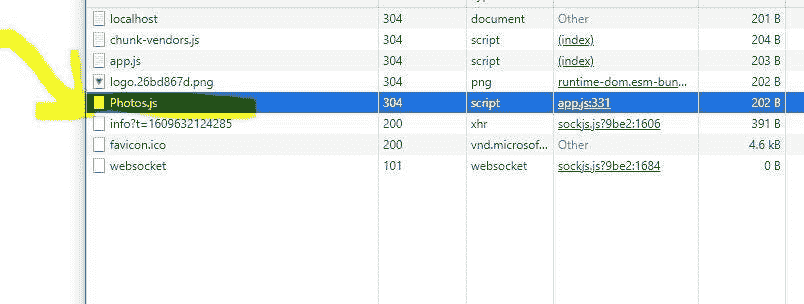
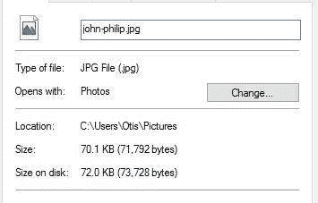
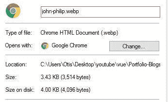

# Vue.js 应用中的扩展性能

> 原文：<https://javascript.plainenglish.io/scaling-performance-in-vue-js-applications-a868c8746cef?source=collection_archive---------2----------------------->

## Vue.js 应用中的扩展性能和优化。


Photo by [Luke Peters](https://unsplash.com/@lukepeters?utm_source=medium&utm_medium=referral) on [Unsplash](https://unsplash.com?utm_source=medium&utm_medium=referral)

vue 应用程序的性能优化在应用程序体系结构中起着重要的作用。

更高性能的应用程序将确保提高用户保留率、改善用户体验和更高的转化率。

根据谷歌的研究，如果加载时间超过 3 秒，53%的移动用户会离开网站？除此之外，超过一半的测试页面超过 2MB。

您的应用性能直接影响其搜索排名和转化率。另一方面，Pinterest 将他们的初始等待时间缩短了 40%，这导致搜索引擎流量和注册量增加了 15%。沃尔玛也有类似的结果，每减少一秒钟的装载时间，他们的转化率就增加 2%。

另一方面，必应的研究表明，2 秒钟的延迟导致每个访问者的收入损失 4.3%，点击量减少 3.75%。

更高的性能将确保您的公司或业务增加其用户保留率，这意味着销售或利润的增加。

**我们如何在 VueJS 应用程序中实现性能？**

在本文中，我们将看到我们可以实现的各种方法来提高 VueJS 应用程序的性能和优化。

**异步组件加载/惰性加载**

组件的异步加载是惰性加载应用程序部分(块)的过程。它确保了组件只在需要的时候被加载。

根据 vueshool.io 的说法，Lazy loading 可以确保捆绑包被拆分，并且只提供需要的部分，这样用户就不会浪费时间下载和解析不使用的代码。

**部件同步/静态加载**

组件的静态加载是用默认的 import 语句加载组件。，我们使用如下所示的本机导入语法。

加载了静态 import 语句的组件将被添加到现有的应用程序捆绑包中。如果不使用代码拆分，那么应用程序核心将变得更大，从而影响应用程序的整体性能。

下面的代码片段将动态加载照片组件。

```
// static loading of the photo componentimport Photos from “@/components/photos”;
```

为了动态加载组件，我们必须从默认的静态组件导入更改为动态组件导入。

**构件动态加载**

为了动态加载一个组件，我们声明了一个常量并附加了一个 arrow 函数，后跟默认的静态 import 语句。

我们也可以添加一个网络包魔术评论。注释将告诉 webpack 为我们的块分配我们提供的名称，否则 webpack 将自动生成一个名称。

参见下面的示例。

```
// dynamic import of the photos componentconst Photos = () =>import(/* webpackChunkName: “Photos” */ “@/components/photos”);
```

如果我们转到我们的开发工具并打开网络标签，我们可以看到我们的块已经被分配了我们在 webpack 的块名注释中提供的名称。

见下文



Webpack 的神奇评论

有了 vue3，我们可以使用暂记定义组件来延迟加载组件。

悬念使得在加载过程中显示回退内容变得容易。暂停边界还有助于控制视图部分何时准备好进行渲染。

要使用 defineAsyncComponent，我们首先必须从 vue 导入它，以便在我们的应用程序中使用。

```
// dynamic import of the photos component with suspense<template><HelloWorld msg=”Welcome to Your Vue.js App” /></template><script>*import* { defineAsyncComponent } *from* “vue”;const HelloWorld = defineAsyncComponent(() =>import(“./components/HelloWorld.vue”));*export* *default* {name: “App”,components: {HelloWorld,},};</script>
```

关于 vue 3 中组件异步加载的更多信息

[](https://medium.com/javascript-in-plain-english/asynchronous-component-loading-in-vue-3-f8cd0860da23) [## Vue 3 中的异步组件加载

### 使用 defineAsyncComponent 在 Vue 3 中异步加载

medium.com](https://medium.com/javascript-in-plain-english/asynchronous-component-loading-in-vue-3-f8cd0860da23) 

**惰性装载路线**

当使用完全构建在 VueJS 之上的 Nuxtjs 时，它会开箱即用地对每个路由进行代码拆分。

要延迟加载路径，只需使用与我们延迟加载组件相同的方式。

**WebP 图像和图像压缩**

优化应用程序时，图像压缩非常重要。与较大的图像文件相比，较亮的图像执行速度更快。除此之外，更小的图像也会导致更少的加载时间。

通过压缩图像，我们使我们的网站变得更轻，从而提供更短的加载时间。

**什么是 WebP？**

一种新的网络图像格式。

WebP 是一种现代图像格式，为网络上的图像提供卓越的无损和有损压缩。使用 WebP，网站管理员和 web 开发人员可以创建更小、更丰富的图像，使 web 速度更快。

根据 [dev Mozilla](https://developers.google.com/speed/webp) 的说法，WebP 无损图像的大小比 png 小 26%。在同等的 SSIM 质量指数下，WebP 有损图像比可比较的 JPEG 图像小 25–34%。

无损 WebP 支持透明性(也称为 alpha 通道),成本仅为 22%的额外字节。对于可接受有损 RGB 压缩的情况，有损 WebP 也支持透明，通常提供比 PNG 小 3 倍的文件大小。

从 14 版本开始，Chrome、Firefox、Edge 和 Safari 都支持 WebP。

让我们将 JPG 图像转换为 WebP，并注意大小和性能的差异。WebP 图像在保持图像质量的同时具有最小的尺寸。

**转换前**

Jpg 图像文件(70.1kb)



未优化的 jpg 文件

原始 jpg 图像(转换前)

**转换后**

WebP 图像文件(3.43kb)



最终图像(转换后)

我希望你能看到这个巨大的碎片变成了一个更小的图像文件。

从 70.1kb 到 3.43kb 的羽毛大小。更轻的图像文件不是吗？

我还找到了这个网站，它帮助我将图片转换成网络视频

**代码拆分**

代码拆分是将应用程序拆分成延迟加载的程序块的过程。

根据 dev Mozilla 的说法，代码分割是将代码分割成不同的包或组件，然后按需或并行加载。

随着应用程序变得越来越复杂或被维护，CSS 和 JavaScripts 文件或包的字节数也会增加，尤其是当包含的第三方库的数量和大小增加时。

为了避免下载巨大文件的需求，可以将脚本分割成多个较小的文件。然后，页面加载时所需的功能可以立即下载，在页面或应用程序交互后，额外的脚本可以延迟加载，从而提高性能。虽然代码总量是相同的(甚至可能多几个字节)，但初始加载期间所需的代码量可以减少。

代码分割是 Webpack 和 Browserify 等捆绑包支持的一个特性，它们可以创建多个可以在运行时动态加载的捆绑包。

我们如何使用 webpack 进行代码拆分

```
*// Build Configuration (https://go.nuxtjs.dev/config-build)*build: {configureWebpack: {optimization: {runtimeChunk: ‘single’,splitChunks: {chunks: ‘all’,maxInitialRequests: Infinity,minSize: 0,cacheGroups: {vendor: {test: /[\\/]node_modules[\\/]/,name(module) {const packageName = module.context.match(/[\\/]node_modules[\\/](.*?)([\\/]|*$*)/)[1];*return* `npm.${packageName.replace(‘@’, ‘’)}`;},},},},},},analyze: true,}
```

**使用 purge 提取未使用的 CSS**

当你构建你的应用程序时，你可能会决定使用一个 CSS 框架，比如 TailwindCSS，Bootstrap，MaterializeCSS，Foundation 等等。但是您将只使用一小部分框架样式，并且会包含许多未使用的 CSS 样式。

根据[的说法，PurgeCSS](https://purgecss.com/) 是一个移除无用 CSS 的工具。它可以是你开发工作流程的一部分。

这就是 PurgeCSS 发挥作用的地方。PurgeCSS 分析我们的应用程序内容、样式和您的 CSS 文件。然后，它将文件中使用的选择器与内容文件中的选择器进行匹配。它从你的 CSS 中移除未使用的选择器，产生更小的 CSS 文件

**资源**

*   [Vue.js 官方文档](https://vuejs.org/)
*   [清除 CSS 文档。](https://purgecss.com/)
*   [开发上颌文档。](https://developer.mozilla.org)

**结论**

简单回顾一下，我们已经看到了一些实现 VueJS 应用程序性能和优化的最佳实践。

在 VueJS 应用程序中扩展性能和优化的一些方法有:

*   组件的异步加载
*   异步装载路线
*   图像压缩或使用 WebP 图像
*   未使用的 CSS 样式的树抖动(当使用 CSS 框架时)

感谢您通读这篇文章。如果你觉得这篇文章有帮助，请不要犹豫，分享出来。

## **更多阅读:**

[](/javascript-algorithm-and-data-structure-challenge-fizz-buzz-5ef81800cb99) [## JavaScript 算法和数据结构挑战——Fizz Buzz

### JavaScript 中的 Fizz Buzz challenge 黑客团队的一个编程挑战的解决方案。

javascript.plainenglish.io](/javascript-algorithm-and-data-structure-challenge-fizz-buzz-5ef81800cb99) [](/8-javascript-array-methods-you-should-know-81947c9e46de) [## 你应该知道的 8 种 JavaScript 数组方法

### JavaScript 中的数组方法你需要用例子来了解。

javascript.plainenglish.io](/8-javascript-array-methods-you-should-know-81947c9e46de)