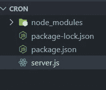
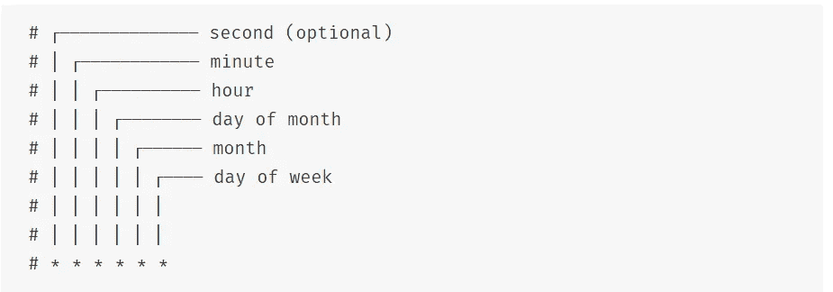
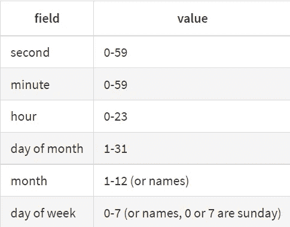

# 在 Node.js 中计划重复性任务

> 原文：<https://javascript.plainenglish.io/schedule-repetitive-tasks-in-node-js-3bef27515ce5?source=collection_archive---------4----------------------->


Photo by [Agê Barros](https://unsplash.com/@agebarros?utm_source=medium&utm_medium=referral) on [Unsplash](https://unsplash.com?utm_source=medium&utm_medium=referral)

***注:*** *这篇博客将通过例子向你概述如何使用 NPM 的 node-cron 库调度任务。如果你想了解更多，我会在下面提供一个链接。*

作为一名开发人员，在很多情况下，您希望每天运行一些对应用程序很重要但本质上是重复的任务。您当然不能避免这些任务，因为您的应用程序依赖于它们。不管是黎明还是午夜，你都必须运行它们。

但是有一种方法可以让你自动化那些重复的任务。通过编写几行代码，您可以将自己从那些无聊的重复任务中解放出来，并完全专注于应用程序的开发。

这些任务可以是诸如每日数据库备份、发送电子邮件、下载文件等。在这篇博客中，我们将学习如何用 Node.js 自动完成这类任务。

Cron 是自动化任务编程中使用的术语。你可以在这里阅读更多关于**Cron**的内容。

我们将使用名为 **node-cron** 的 NPM 模块来实现我们的目标。我将简要介绍这个模块。如果你愿意，你可以在这里了解更多。

# **设置工作目录**

在您的计算机上创建一个空文件夹，并在您首选的文本编辑器中打开该文件夹。为此，我将使用 VS 代码。你可以在这里从[下载 VS 代码。](https://code.visualstudio.com/Download)

在文本编辑器中打开文件夹后，如果在 Windows 上，按`Ctrl + J`键；如果在 macOS 上，按`Cmd + J`键，在 Visual Studio 中打开内置终端。VS 代码中内置的终端将被导航到我们正在工作的当前目录。

如果你正在使用一些其他的文本编辑器，打开你机器的终端并导航到我们正在工作的目录。

打开终端后，让我们在其中运行一些命令:

1.  初始化目录。这个命令将给出我们的 *package.json* 文件。

```
npm init -y
```

2.安装*节点-cron* 库。该命令将安装 *node-cron* 文件，并将创建一个 *node_modules* 文件夹和一个 *package-lock.json* 文件。

```
npm i node-cron
```

3.使用以下命令创建一个 *server.js 文件*:

```
touch server.js
```

运行以上命令后，您的目录应该看起来像下图所示:



image by author

# 写一些代码

现在，我们已经初始化了存储库并安装了我们需要的库。我们不会创建任何类型的“GET”或“post”请求，但会为这个 POST 将所有内容打印到终端。

现在，在文本编辑器中打开 *server.js* 文件，并需要 *node-cron* 模块。使用以下代码导入 *node-cron* 模块:

```
const cron = require("node-cron");
```

在请求“cron”库之后，我们将在每一秒钟之后向终端输出“Hello world”。在文本编辑器中编写以下代码:

```
cron.schedule('* * * * * *', () => {
    console.log('Hello World');
});
```

`cron.schedule(a, b)`是我们用来安排任务的方法。它需要两个参数。“a”&“b”只是占位符。“a”是一个字符串，而“b”是一个回调函数。

我们上面写的代码将每秒向终端输出“Hello World”。“*”号代表时间单位。下图将使“*”代表什么单位变得更加清晰。



image by [npmjs.com](https://www.npmjs.com/package/node-cron)

至少需要 5 个星号符号，用空格分隔，以使回调函数工作。虽然我们也可以用一个数字来代替星号符号，但是我们还是想安排一个任务。但稍后会详细介绍。

如果有 5 个星号，回调函数将每分钟运行一次。有了 6 个星号，回调函数就会每秒运行一次，我们刚才写的代码就是这种情况。

我们可以用数字代替星号，这样我们就可以完全控制何时运行任务。这些是允许代替星号符号的一些值。



image by [npmjs.com](https://www.npmjs.com/package/node-cron)

让我给你一个例子来说明我们如何使用数字来代替星号。看看下面的代码。

```
const cron = require('node-cron');
cron.schedule('25 * * * * *', () => {
     console.log('Hello World');
});
```

我们用数字 25 代替了代表秒的第一个星号。现在，“Hello World”只会在每分钟的第 25 秒印上。那么，现在你已经明白了。您可以用数字替换这些星号，只有当实际时间与字符串匹配时，回调才会运行。您可以使用它在每天的特定时间运行任务，每隔一天或每周运行一次任务，等等。它让您可以完全控制何时安排任务。

看看另一个例子。假设我想在每天晚上 11 点备份我的数据库。我可以简单地编写下面的代码，它将在每晚 11 点运行，并备份我的数据库。

```
cron.schedule('0 0 23 * * *', () => {
     // backup the database
});
```

您还可以为特定的时间单位添加逗号分隔的数字。逗号分隔的值有助于为特定时间单位添加多个值。看看下面给出的例子。回拨功能将在每天的第 25 分钟和第 50 分钟的 12 点和 6 点运行。

```
cron.schedule('0 25,50 12,18 * * *', () => {
     // This code will run on the 25th and the 50th minute
     // at 12 PM noon and in the evening at 6 PM every day
});
```

您还可以添加一系列值来运行回调函数。看看下面的代码，你会对输入数值范围有一个清晰的了解。

```
cron.schedule('1-10 * * * * *', () => {
     console.log('Hello World');
});
```

上面的代码将在每分钟的前 10 秒内将`Hello World`打印到终端。回调将只运行前 10 秒，因为我们已经明确定义了一个范围`1-10`。你也可以将类似的情况应用于其他时间单位。

现在，我想你已经知道如何在特定的时间安排任务了。但是如果您想在指定的时间间隔后运行一个任务呢？。比如说，你想每隔 2 分钟运行一次任务，还是每隔 3 小时运行一次？。这个图书馆也提供了一个解决方案。看看下面给出的代码。

```
cron.schedule('*/2 * * * * *', () => {
     console.log('Hello World');
});
```

这段代码将把`Hello World`输出到终端，不是每秒，而是每隔一秒。`*/2`告诉回调函数每隔 2 秒运行一次。我们可以用`1-59`之间的任何其他数字替换`2`这个数字。**类似的事情也适用于其他时间单位。但是请确保输入特定时间单位的正确数字。使用上表作为参考，了解可以为特定时间单位输入什么值。**

现在，我已经介绍了两种场景 **I)在指定的时间**运行任务，以及 **II)在指定的时间间隔后运行任务。**

在我结束这篇博客之前，我只想指出 JavaScript 的原生库`setInterval`和我们正在使用的库`node-cron`之间的区别。众所周知，`setInterval`是函数接受两个参数，第一个是我们想要运行的函数，第二个是函数再次运行的时间。第二个参数接受毫秒数。

假设您想在每周的星期一运行任务。用`setInterval`你必须首先计算从现在到星期一的毫秒数。然后，您将清除当前间隔，然后再次计算从一个星期一到下一个星期一的毫秒数。

使用`node-cron`,你可以完全控制如何运行这个只有 3 行代码的函数。如果你想了解更多关于`node-cron`的信息，你可以点击查看[模块的包装页面。](https://www.npmjs.com/package/node-cron)

# 结论

由于有可用的包，用 Node.js 调度任务相当容易。它非常方便，因为它节省了我们的时间，并允许我们作为开发人员专注于手头的实际任务。我已经向您介绍了`node-cron`库，阅读了更多关于它的内容，并且使用了这个库。你可能会找到完全符合你需要的东西。

*我是 Node.js 的开发人员，如果你在 Node.js 中有一些工作要做，请随时在 Fiverr 上联系我。在这里看我的 Fiverr 简介:*[【https://www.fiverr.com/share/1W8WA9】](https://www.fiverr.com/share/1W8WA9)

*更多内容请看*[***plain English . io***](http://plainenglish.io/)