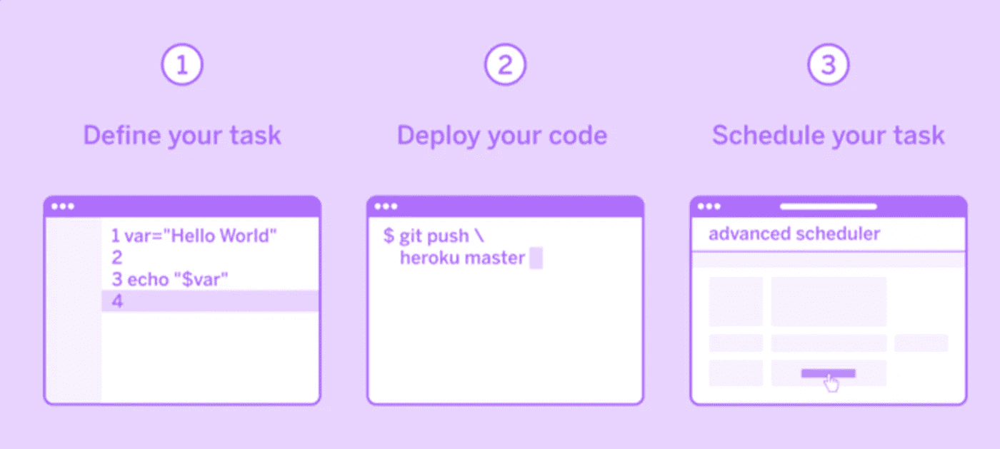
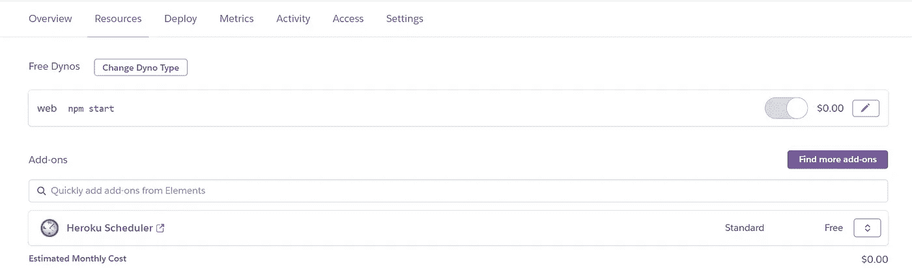
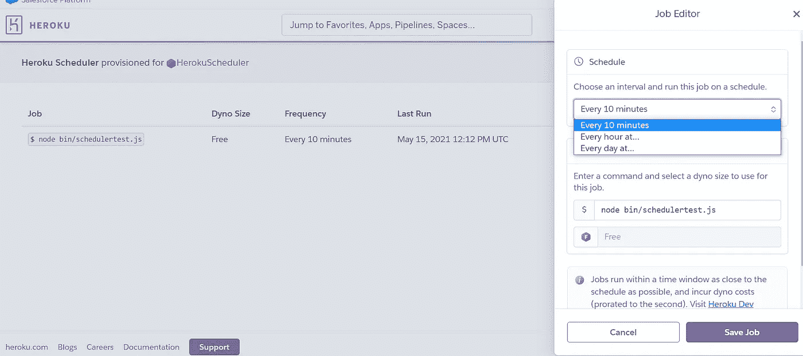

# 在 Heroku 上计划任务

> 原文：<https://javascript.plainenglish.io/scheduling-tasks-on-heroku-ebfa63c124dd?source=collection_archive---------9----------------------->

使用 Heroku 调度程序在 Heroku 上免费运行 Cron 任务



# 涉及的步骤

1.  使用 *node-cron* 在本地运行 Cron 任务
2.  在本地*检查要执行的任务*
3.  在 *Heroku 服务器*上部署变更
4.  通过 ***Heroku 调度器*** 在 Heroku 上调度任务

> Cronjobs 可以通过 npm 包—[node—cron](https://www.npmjs.com/package/cron)在本地运行。但是在 Heroku 中，由 node_cron 调度的作业不会在您的空闲 dynos 休眠时运行，也就是说，如果 cron 的执行被安排在您的服务器离线的时候，那么它就不会工作。为此，我们使用*[**Heroku scheduler**](https://devcenter.heroku.com/articles/scheduler)*来执行 Cron 任务(我们可以使用自由计划为每 **10 分钟**或 **1 小时**或 **1 天**安排一个任务)。这里我以每 10 分钟运行一个 API 为例。**

# ****使用 node-cron 在本地运行 Cron 任务****

**Node-Cron 是一个非常简单而强大的 npm 包，通过它我们可以轻松地调度从几秒到几天或几个月不等的不同时间段的任务。要从本地开始，请遵循以下步骤→**

1.  **在终端中安装 cron**
2.  **在您的 JavaScript 文件中使用以下代码—**

```
****var CronJob = require('cron').CronJob;****var job = new CronJob('* * * * * *', function() {****console.log('You will see this message every second');
// ENTER YOUR TASK HERE****}, null, true, 'America/Los_Angeles');****job.start();****
```

**3.星号表示两次执行之间的时间段。您可以使用 [crontab](https://crontab.cronhub.io/) 计算周期**

# **在本地检查要执行的任务**

***调用 corn 函数内部的 API 来重复执行它。可以使用各种方法调用 API，在这里检查所有这些。在示例中，我使用 Axios 来调用 API。***

# ***在 Heroku 服务器上部署更改***

***一旦确认 node-cron 和任务执行工作正常，我们就必须对 Heroku 调度程序进行必要的修改。*如果在任务中执行任何 API，它必须被托管，并且不能在本地主机上。这是因为 Heroku 调度程序创建了一个单独的服务器并在那里执行文件。****

1.  ***在根目录下创建一个“bin”文件夹。***
2.  ***将 JavaScript 文件添加到“bin”文件夹中(例如→ *bin/Schedulertest.js* )。***
3.  ***这个 javascript 文件的内容将定期执行。因此，将任务代码添加到这个文件中，而不添加 node-cron(例如任何 API 调用)。***
4.  ***向 Heroku 服务器添加、提交和推送更改。***

# ***通过 ***Heroku 调度器*** 在 Heroku 上调度任务***

***现在，我们已经成功地设置了环境和代码，以便在 Node.js 中使用 Heroku scheduler。***

***从终端([指令](https://devcenter.heroku.com/articles/scheduler#installing-the-add-on))或通过**网站→应用程序→资源→插件**安装 Heroku-Scheduler 插件***

******

***Heroku dashboard to add “Heroku Scheduler”***

***打开调度程序并添加作业及其频率。***

******

***就是这样。是的，你没看错，**任务调度设置完成**。保存作业并享受 Heroku 调度程序的功能。***

***可以通过 Heroku add-on -> [*一次性动态指标*](https://elements.heroku.com/addons/one-off-metrics) 确认工作。或者，我们可以在文件中安慰一些要定期执行的东西。使用“Heroku logs--tail”在网站或终端上打开 Heroku 的日志，以确保其正常工作。***

*****这里是我的基本代码和设置库**。如果需要，一定要提出问题，如果对你有帮助，就开始吧。***

***[](https://github.com/Srezzx/Herokuscheduler) [## Srezzx/Herokuscheduler

### 描述 Heroku 调度程序基本工作的存储库

github.com](https://github.com/Srezzx/Herokuscheduler) 

*感谢阅读，希望有所帮助！:)*

*更多内容请看*[*plain English . io*](http://plainenglish.io/)***