# 使用木偶师抓取图像

> 原文：<https://javascript.plainenglish.io/scraping-for-images-using-puppeteer-9a3700bd5a2d?source=collection_archive---------2----------------------->

## 自动化枯燥的东西

事实上，当我偶然发现木偶师时，我正在寻找一种方法来自动化我必须在几个网页上做的无聊的事情。是的…不，我不是在说那个操纵娃娃的家伙，但是是的，一个浏览器自动化的软件！

# 但是木偶师到底是什么？

根据文档，Puppeteer 是一个节点库，它提供了一个高级 API 来控制 Chrome 或 DevTools 协议上的 Chrome。让我用简单的术语来解释一下。

Puppeteer 是 Node.js 中的一个库或模块，它使你能够*在网络上执行某些动作*，比如打开页面、浏览网站、评估 javascript 等等，自动*。它使用 Node.js 和 Chrome 来创造奇迹。*

> **然而，最近有一个版本的木偶师可以让你用火狐代替 Chrome。**

*浏览器(Chrome)和 Node.js 之间的关系实际上编码在它们的徽标中，如下所示:*

*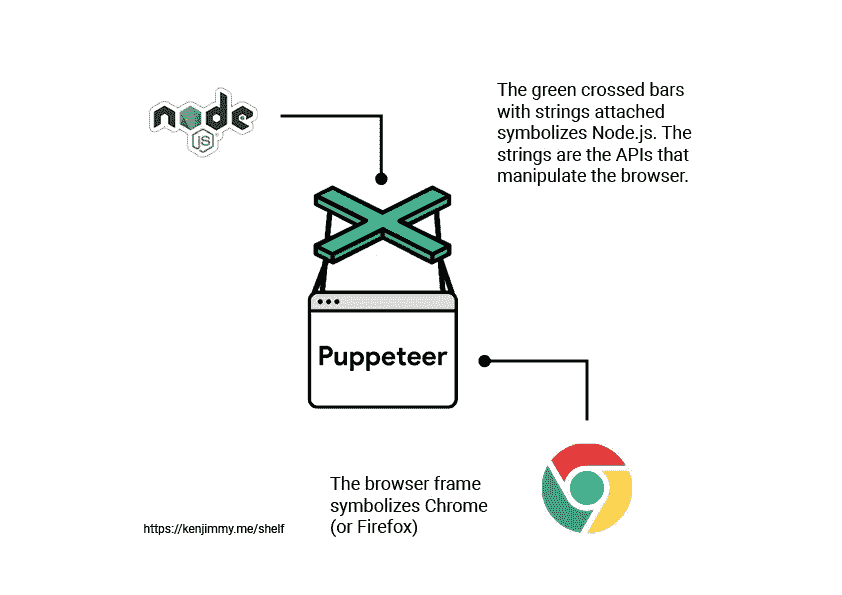*

*我喜欢木偶师的一点是你可以轻而易举地抓取网页。事实上，在这篇文章中，我将向您展示如何使用 Puppeteer 从一个漫画网站获取图像 src URL 值。很酷，对吧？😎*

*关于木偶师有太多要说的了。如果您有兴趣了解更多信息，可以访问他们的官方文档网站👉🏽[此处](https://pptr.dev/)。*

*介绍够了。现在让我们开始收集一些数据！*

# *目标*

*你如何在网站上获得图片的源“src”值？简单—将鼠标指针放在图像上，右键单击，选择“inspect”…打开开发工具，这就是您的:*

*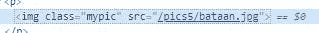*

*一张照片没什么大不了的，对吧？但是如果你重复同样的步骤，比如说一百张图片，会怎么样呢？这很容易变成一场噩梦。相信我，我知道。*

*这就是我们要用木偶师写一个脚本的地方，它会立刻自动为我们完成这个无聊的任务，节省我们大量的时间和压力。*

*我们将从一个我经常去看漫画书的网站上获取数据。(对了，我爱看漫画书。这是童年的事情…别担心😉)*

# *网站*

*你要做的第一件事是*知道你想从什么网站刮，并了解网站的元素是如何构成的*。前者应该不成问题。在我们的例子中，它是一个漫画网站，我们试图收集一些图片价值。现在，我们如何知道图像是如何构成的？让我来指导你:*

*前往[漫画网站](https://comicpunch.net/)。您将在主页上看到以下界面:*

*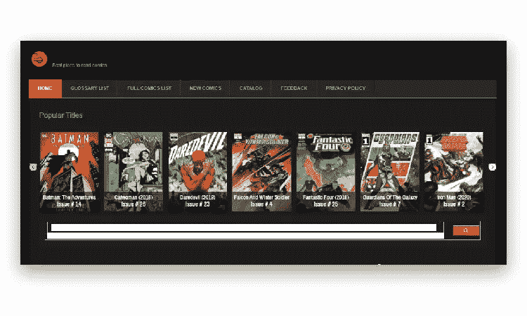*

*这些是我们想要的图像吗？对你来说也许是。但我们正在寻找任何漫画标题的任何问题的一组图像。所以我们必须导航到另一个页面。*

*假设我们的目标是《蝙蝠侠:冒险继续(2020)》这个标题。我们必须从主页上的“热门标题”部分点击那个标题。*

> **如果您在阅读本文时，在网站主页的“热门书目”部分找不到该书名，请在网站上搜索该书名或使用您选择的另一书名，您将能够很好地理解。模式保持不变。**

*现在，我们进入了概览页面。在这一页上，我们有该漫画的所有可用问题的列表，在我们的情况下是“蝙蝠侠:冒险继续(2020)”。*

*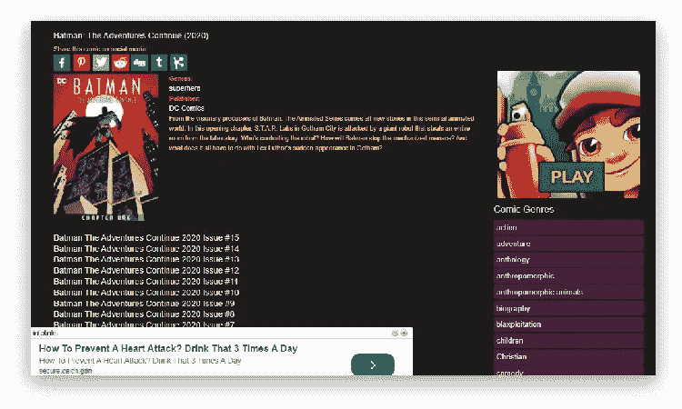*

*请记住，我们的目标是获得漫画标题*发行*的图像(或页面)。*

*要进入“书籍页面”页面，我们必须选择一期。所以，让我们选择“蝙蝠侠:冒险继续 2020 年第一期”。*

*现在我们在这里！😎*

*你会很快注意到在这个网站上浏览书籍页面的常见模式。*

*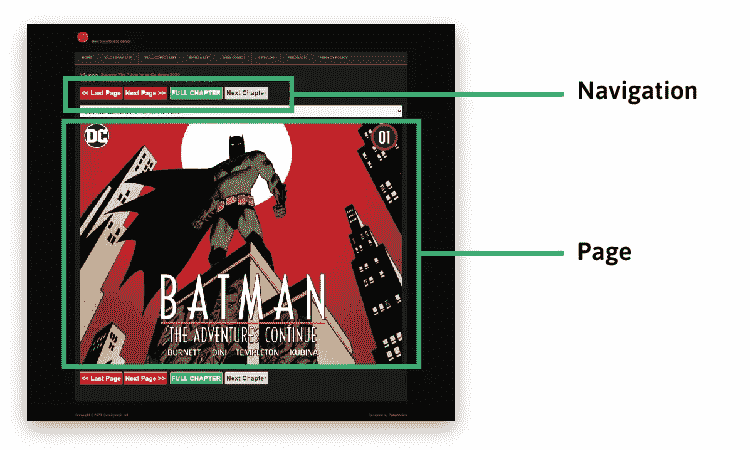*

*我想你一直在观察我们是如何转到这一页的？我们将指导木偶师走同样的路线。我们还会告诉木偶师如何找到我们想要的图像。*

*现在，让我们深入木偶师！*

# *机器人*

*好的，首先，确保你已经安装了节点和 NPM——木偶师非常依赖它们。点击了解如何下载 Node.js 安装程序和 NPM [。](https://phoenixnap.com/kb/install-node-js-npm-on-windows)*

*接下来要做的是初始化一个新的 node.js 项目。为此，创建一个新文件夹，并命名为您喜欢的任何名称。在我的情况下，我会把它命名为木偶师教程。打开你的终端和`cd`到你新创建的目录。*

*Pssst:可以在 Github 上找到[这篇文章的代码。](https://github.com/Glitzyken/Puppeteer-Tutorial)*

*现在运行:*

```
*npm init*
```

*运行该命令时，会提示您填写新项目的一些基本信息。就这样做吧，跳过那些你真的不需要的(我让你来决定)。最后，您应该会看到类似这样的结果:*

*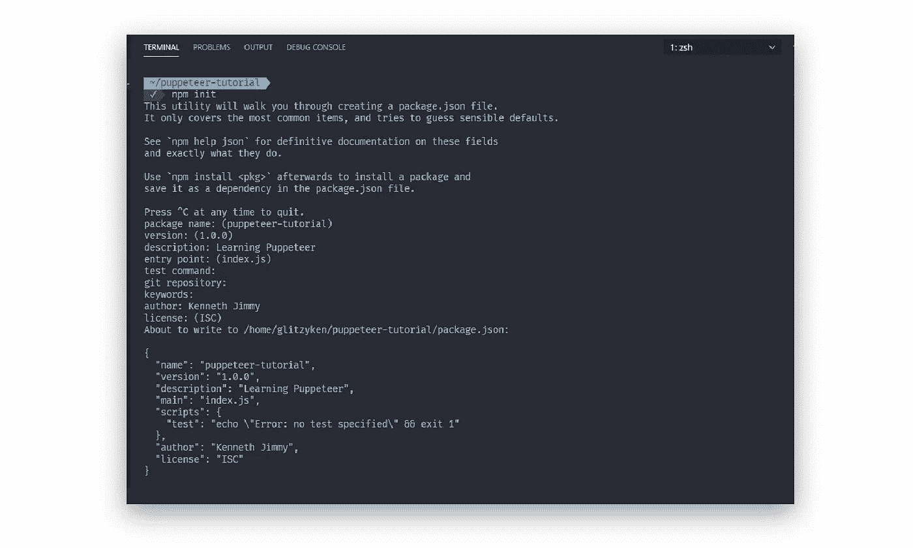*

*这仅仅意味着您的项目已经用 package.json 文件进行了初始化，该文件包含了您之前传递给它的所有信息。*

*现在是你安装木偶师的时候了。但是在安装 Puppeteer 之前，您应该用您的代码编辑器(最好是 VS Code)打开您的项目，并在与您的 package.json 文件相同的路径级别上创建一个 **index.js** 文件。*

*然后运行:*

```
*npm install puppeteer*
```

*这将从 NPM 图书馆安装木偶师。您还会注意到，它下载了一个最新版本的 Chromium(～170 MB Mac、282MB Linux、280MB Win)，该版本保证能与 API 一起工作。*

*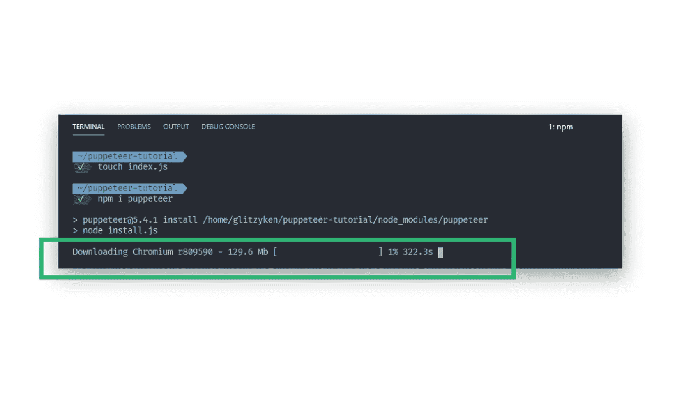*

*最后你应该有一个 3 个文件的列表，分别是 **index.js** 、 **package-lock.json** 和 **package.json** ，以及一个 **node_modules** 文件夹。当您打开 package.json 文件时，您应该看到一个新创建的类似于对象的`dependencies`,里面有一对`"puppeteer": "<lastest version>"`。*

*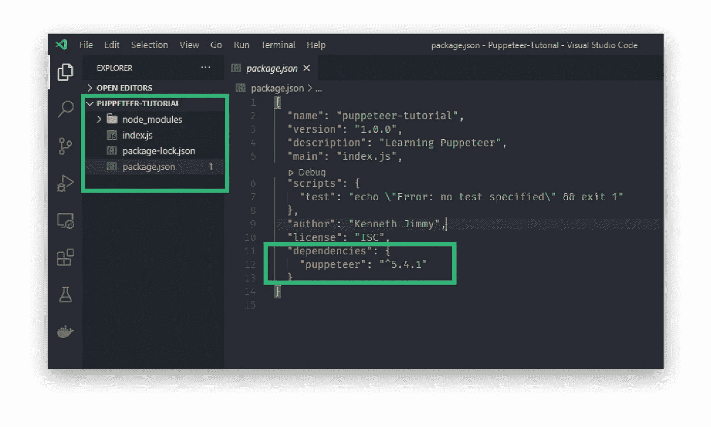*

*现在搓搓你们的手掌，因为我们将要第一次测试木偶师！这难道不令人兴奋吗？😃*

*为了运行测试，我们将使用文档中的典型示例。*

*创建一个新的 **test.js** 文件，并将以下代码粘贴到其中:*

```
*const puppeteer = require("puppeteer");

(async () => {
  const browser = await puppeteer.launch();
  const page = await browser.newPage();
  await page.goto("https://kenjimmy.me");
  await page.screenshot({ path: "example.png" });

  await browser.close();
})();*
```

*现在，通过按 ctrl (cmd) +`，在 VS 代码中打开集成终端。然后，运行:*

```
*node test.js*
```

*`node`是一个可执行的命令，因为您的机器上已经安装了 Node.js。因此，`node test.js`在 Node.js 运行时执行 test.js 文件中的 JavaScript 代码(在本例中尤其是 Puppeteer 代码)。*

*我不会解释 test.js 文件中每一行代码的作用，因为我只想测试是否正确安装了 Puppeteer。我们将把对实际脚本的解释留到后面。*

*运行该命令时，您应该会看到一个图像文件，其中包含我的网站主页的截图，大小为 800×600px。*

*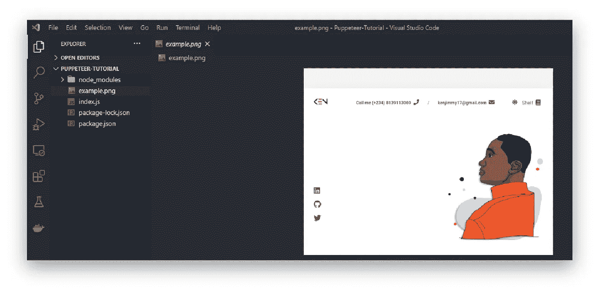*

*现在我们可以走了。*

# *使用木偶师抓取图像 src*

*在您的 **index.js** 文件中，我们需要`fs`(文件系统)模块。这将允许你把从漫画网站获取的数据写入一个文件。*

```
*const fs = require("fs");*
```

*因为您要将一些数据写入文件，所以要求您已经创建了该文件。因此，继续创建一个 **data.json** 文件。*

*除了文件系统，我们肯定需要导入或需要木偶师。下面的代码就可以做到这一点:*

```
*const puppeteer = require("puppeteer");*
```

*在 JavaScript 中，有一个被称为立即调用函数表达式(IIFE)的概念。简而言之，生命是一个 JavaScript 函数，一旦被定义，它就会运行。我们要用生活来包装我们的剧本，这是编写木偶剧本的常见方式。*

*这就是我们如何书写生活:*

```
*(async () => {
 // your code goes here...
})();*
```

*注意，我们的匿名函数前面是关键字`async`。这是从 ES8 开始引入 JavaScript 的一种特殊语法，以更舒适的方式处理承诺。它正在等待一个`await`声明，我们将在一瞬间提供一些。*

*现在，在我们的 IFFE 中，让我们写一个`try...catch`语句。这将有助于我们正确处理错误。*

```
*(async () => {
  try {
    // ...
  } catch (error) {
    console.log(error);
  }
})();*
```

*我们在`catch`块中所做的就是将`error`记录到控制台，如果它捕捉到任何。*

*现在，让我们在`try`块中编写脚本。*

*首先，我们以无头模式启动 Chromium。这仅仅意味着当 Chromium 浏览器操作网站时，你不会看到它在运行。然后，打开我们想要操作的网页:*

```
*// ...

// Initialize Puppeteer
const browser = await puppeteer.launch();
const page = await browser.newPage();

// Specify comic issue page url
await page.goto(
      "https://comicpunch.net/readme/index.php?title=batman-the-adventures-continue-2020&chapter=1"
);
console.log("page has been loaded!");

// ...*
```

*我们在`page.goto()`中传递的 URL 是从哪里得到的？*

*还记得漫画扉页吗？我们只需复制其中一个问题链接:*

*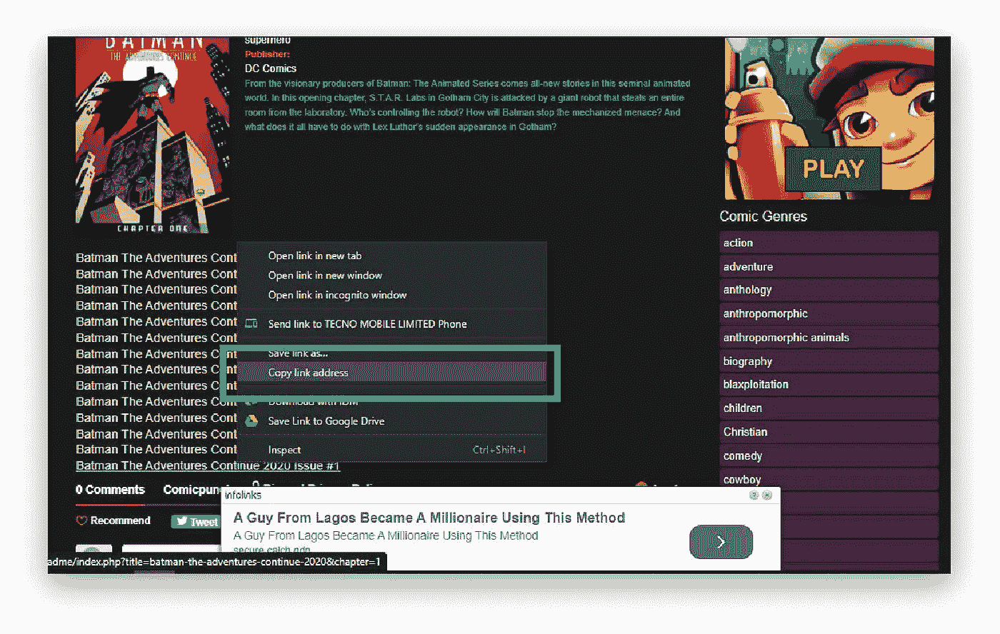*

*我们刚刚告诉木偶师要做的是通过使用`.launch()`方法启动 Chromium 浏览器，并通过使用`.newPage()`和`.goto()`方法转到我们指定的 URL。*

*它下一步应该做什么？它应该点击页面上的“全章”按钮:*

*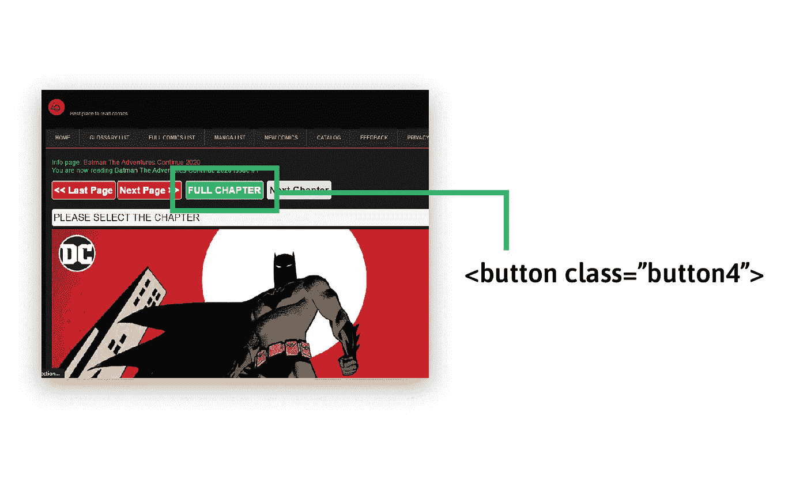*

*点击“整章”按钮将在页面上呈现我们需要的所有图像。这正是我们想要的。*

*我们需要一种方法让木偶师知道“全章”按钮在哪里并点击它。因此，我们需要使用`.click()`。此方法需要一个选择器。*

*我们可以通过在浏览器上检查来获得任何元素的选择器。在这种情况下，我们将针对“button.button4”，其中“. button4”是赋予“Full Chapter”按钮的类名。*

```
*// ...

// While page is waiting for 1s, click on the 'Full Chapter' button and do the rest
await page.waitFor(1000);
await page.click("button.button4");
console.log("'Full Chapter' button has been clicked!");

// ...*
```

*哦天啊！`.click()`前有一行。是的，我们必须使用`.waitFor()`并在 1000 毫秒内通过，因为我们需要多一点时间让剩余的代码按预期工作。如果你想用它做实验，就把这条线去掉，看看会发生什么。😁*

> **对了，。waitFor()已被弃用，并将在未来的版本中删除。**

*现在，让我们告诉 Puppeteer 评估或计算主要任务，即将从 DOM 返回的图像的 [nodelist](https://developer.mozilla.org/en-US/docs/Web/API/NodeList) 转换为一个数组，然后映射每个项目并获取 src 属性值，并将其存储在 src 变量中，该变量因此返回为 issueSrcs 变量的值。*

*`.evaluate()`接受要在页面上下文中评估的函数。所以这就是我们写主要代码的地方，来获取所有带有“.comicpic”类别:*

```
*// ...

const issueSrcs = await page.evaluate(() => {
      const srcs = Array.from(
        document.querySelectorAll(".comicpic")
      ).map((image) => image.getAttribute("src"));
      return srcs;
});
console.log("Page has been evaluated!");

// ...*
```

*现在，我们将所有数据存储在“issueSrcs”变量中。但是我们还没有完成。我们需要将数据持久化到 data.json 文件中，对吗？这就是我们使用`fs.writeFileSync()`方法的地方:*

```
*// ...

// Persist data into data.json file
fs.writeFileSync("./data.json", JSON.stringify(issueSrcs));
console.log("File is created!");

// ...*
```

*最后，我们使用`.close()`方法结束木偶。不然呢？良好的...😆*

```
*// ...

// End Puppeteer
await browser.close();

// ...*
```

*最后，您的检修代码应该如下所示:*

```
*const fs = require("fs");
const puppeteer = require("puppeteer");

(async () => {
  try {
    // Initialize Puppeteer
    const browser = await puppeteer.launch();
    const page = await browser.newPage();

    // Specify comic issue page url
    await page.goto(
      "https://comicpunch.net/readme/index.php?title=batman-the-adventures-continue-2020&chapter=1"
    );
    console.log("page has been loaded!");

    // While page is waiting for 1s, click on the 'Full Chapter' button and do the rest
    await page.waitFor(1000);
    await page.click("button.button4");
    console.log("'Full Chapter' button has been clicked!");

    // Evaluate/Compute the main task:
    // Here, we convert the Nodelist of images returned from the DOM into an array, then map each item and get the src attribute value, and store it in 'src' variable, which is therefore returned to be the value of 'issueSrcs' variable.
    const issueSrcs = await page.evaluate(() => {
      const srcs = Array.from(
        document.querySelectorAll(".comicpic")
      ).map((image) => image.getAttribute("src"));
      return srcs;
    });
    console.log("Page has been evaluated!");

    // Persist data into data.json file
    fs.writeFileSync("./data.json", JSON.stringify(issueSrcs));
    console.log("File is created!");

    // End Puppeteer
    await browser.close();
  } catch (error) {
    console.log(error);
  }
})();*
```

*酷！我们准备试验我们的剧本。我很好奇。你呢？😃*

*现在，在您的终端中，运行:*

```
*node index.js*
```

*还有…耶！我们做到了！！是的，我们成功获取了所有类别为'的漫画图像 URL。并将它们以 JSON 格式存储在我们的 **data.json** 文件中。干得好。干得好！你刚刚把智商提高了 10。(显然，那是个玩笑)*

*当您打开您的 **data.json** 文件时，您应该会看到类似这样的内容:*

*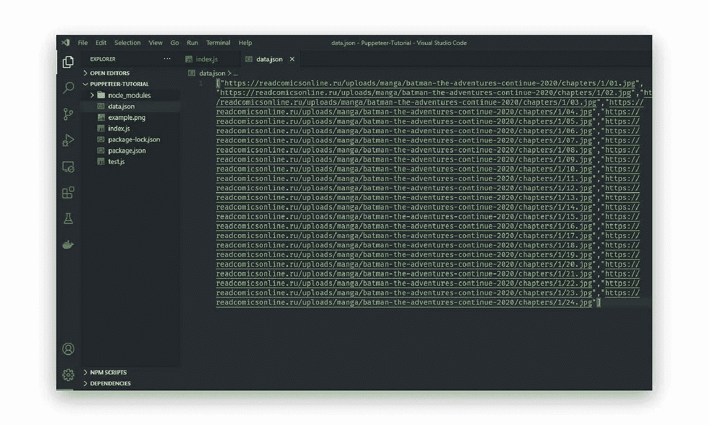*

# *结论*

*对于 web 自动化甚至 web 测试来说，Puppeteer 是一个非常棒的工具。大多数你可以在浏览器中手动完成的事情都可以使用木偶师来完成！*

*在本文中，我们已经通过从网页中抓取一些图像 src 值进行了试验，但是这里还有几个您可以自己尝试的例子:*

*   *抓取 SPA(单页应用程序)并生成预呈现内容(即“SSR”(服务器端呈现))。*
*   *自动化表单提交、UI 测试、键盘输入等。*
*   *创建一个最新的自动化测试环境。使用最新的 JavaScript 和浏览器功能，在最新版本的 Chrome 中直接运行测试。*
*   *捕获站点的时间线跟踪，以帮助诊断性能问题。*
*   *测试 Chrome 扩展。*

*充分利用这个神奇的工具！(为什么不呢😎)*

**最初发布于*[*https://kenjimmy . me*](https://kenjimmy.me/shelf/web-scraping-using-puppeteer)*。**