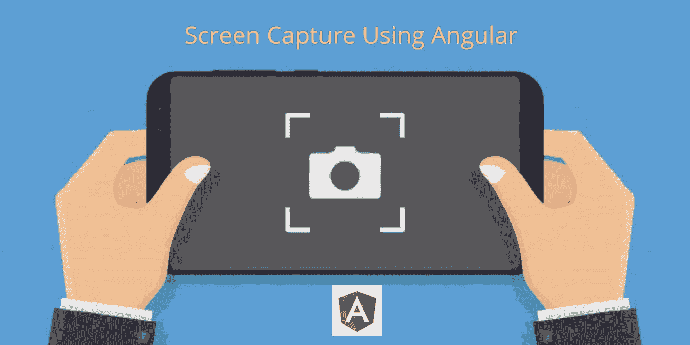

# 使用角度 Ngx 捕捉对页面进行屏幕捕捉

> 原文：<https://javascript.plainenglish.io/screen-capture-a-page-using-angular-ngx-capture-2eda79c93bf?source=collection_archive---------2----------------------->

## Angular 的屏幕截图库。定义一个区域，它将捕获并返回一个包含 base64 PNG 的字符串。



在本教程中，我们将学习如何使用**角**拍摄网页的**截图**。我们可以编写自己的 JavaScript 代码来捕捉屏幕。然而，这是一个耗时的过程。我们有一个预定义的库来完成这个任务。那是 **ngx 俘获**库。我的一个客户需要将一个 web 应用程序页面作为一个图像(截图)发送给多人。我尝试使用普通的 JavaScript。它没有成功。我在做这项工作时遇到了许多错误。我找到了 ngx 的捕获物。这节省了我的时间。我想和你们分享这个。对需要帮助的人来说，这可能很有帮助。

所以这个过程非常简单明了。

1.  将 HTML 标记定义为根元素。
2.  使用 ngx 捕获库将所有元素捕获为根元素中的图像。

就这样。没有其他额外的工作。它输出 base64 png 图像。如果需要，您可以将它保存在服务器上。

让我们通过一个逐步的例子来看看如何做到这一点。

## **创建角度投影**

使用终端上的以下命令创建一个角度项目。

```
ng new demo-project
```

## **安装 NGX-CAPTURE 库**

现在使用下面的命令在项目中安装 NGX-CAPTURE 库。

```
npm i ngx-capture
```

## **导入应用模块**

无论何时安装库，都必须将其导入 app.module.ts 文件。因此首先将 **NgxCaptureModule** 导入到 **app.module.ts** 文件中。

然后将 NgxCaptureModule 包含到 app.module.ts 文件的导入部分。

## **抓图**

现在创建一个 div 标签，并将 id 添加到**home.component.html**文件中的标签中。

1.  **画面**是上面代码中的 id。
2.  用于将页面捕获为图像的单击事件。

现在，我们可以使用 NgxCaptureService 将页面捕获为图像。因此将 **NgxCaptureService** 导入到 **home.component.ts** 文件中。

使用构造函数创建 NgxCaptureService 的引用变量。

创建根元素的视图子引用变量。

然后调用 **getImage()** 函数，将元素捕获为图像。

就这样。它输出 base64 png 图像。现在我的目标是将图像保存在服务器上。

## **将 Base64 转换为图像**

使用下面的代码将 base64 输出转换为图像。

## **通过 HTTP 上传到服务器**

这里，我将 base64 字符串转换为图像，并使用 HTTP 将图像传递给服务器。

## 捕获图像的 PHP 代码

这段代码捕获图像并保存在服务器上。

**完整的 home.component.ts 文件编码**

那都是男生。希望你喜欢这个教程。敬请关注更多文章。

如果你有任何疑问，请评论它。

感谢您阅读这篇文章。

## **结论**

在本教程中，您学习了如何使用 Angular 捕捉屏幕。许多浏览器都提供了屏幕捕捉功能。然而，在应用程序内部进行集成是一项单调乏味的任务。在这里，我给出了如何将 base64 字符串转换为图像以及如何使用 PHP 上传图像的代码。这是从拍摄图像到上传到服务器的完整实现。

**图书馆链接:**

```
[https://www.npmjs.com/package/ngx-capture](https://www.npmjs.com/package/ngx-capture)
```