# 使用 React Hook 进行无缝搜索

> 原文：<https://javascript.plainenglish.io/seamless-search-using-react-hook-539550664a9d?source=collection_archive---------5----------------------->


Photo by [XPS](https://unsplash.com/@xps?utm_source=medium&utm_medium=referral) on [Unsplash](https://unsplash.com?utm_source=medium&utm_medium=referral)

如今，你几乎看不到一个应用程序(移动/web)不会创建一个部分，让用户可以从一个大的项目集合中搜索一个项目。在大多数情况下，我看到开发人员试图在他们的应用程序中实现这一点，但最终只得到一个值，而不是所有包含搜索的项目。一个典型的例子是使用 [***香草 JavaScript***](https://medium.com/nerd-for-tech/seamless-search-with-vanilla-javascript-e447c440ef59) ***实现的。***

在本文中，我将使用 **React Hook 实现同样的行为。**我将使用 Visual Studio 代码作为我的代码编辑器。

***先决条件***

*   安装 Node.js 和 npm
*   JavaScript 知识
*   React 的基础

沿着 [***链接***](https://developer.mozilla.org/en-US/docs/Learn/Tools_and_testing/Client-side_JavaScript_frameworks/React_getting_started)*创建一个 react 项目，命名为 **seamless_search_react***

*让我们进入 src 文件夹，在终端中创建一些文件夹和文件，如下所示:*

```
*cd srcmkdir Component Util View context reducercd Componenttouch CustomUser.js SearchBar.js Users.jscd View touch Home.jscd Util touch userCollection.js cd context touch SearchContext.jscd reducertouch actionjs reducer.js*
```

*在 userCollection.js 中，让我们使用下面的 [***链接***](https://jsonplaceholder.typicode.com/users) 来获取将用于本文的虚拟用户数据。复制并粘贴到上面提到的文件中。*

*今后，我将使用 react **useContext** 和 **useReducer** 进行状态管理。在 SearchContext 组件中，让我们创建一个上下文，如下所示:*

*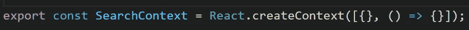*

*create a context*

*在上面的代码片段中，我将新的上下文分配给 SearchContext 变量，并将其导出以供其他组件使用。我将它的默认值设置为一个数组——它也接受一个对象。在数组内部，它保存两个属性，一个是空对象，一个是函数。*

*让我们创建一个 provider 函数来处理状态和 reducer，如下所示:*

*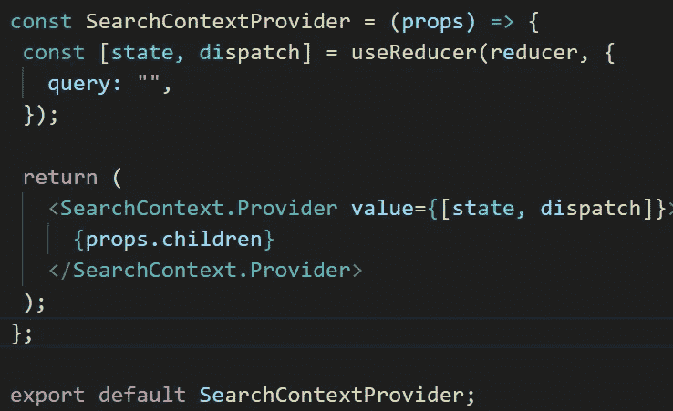*

*provider function*

*你可以把这个功能比作一个为孩子提供食物的母亲。它使状态和功能对它包装的所有嵌套组件可用。*

*我使用了 **useReducer** 钩子函数作为我的 ***状态*** ，就像 useState 钩子一样。它需要多达三个参数，但在本文中将只使用两个。第一个是:*

*   *减压器功能，以及*
*   *状态*

*reducer 函数是从之前创建的 reducer 文件中导入的，而状态是在 reducer 函数之后初始化的。目前，我只有一个保存查询属性(字符串)的对象。*

*最后，我返回 SearchContext 的 provider 属性，并将状态和调度函数传递给它的值 props 以供其他孩子访问。*

*让我们进入 reducer 文件，并在其中添加以下内容:*

*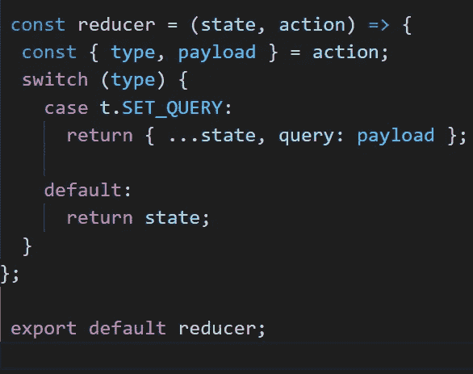*

*reducer function*

*在上面的代码片段中，如果您还记得的话，我将 reducer 函数传递给了 useReducer 钩子函数；它向 reducer 函数传递两个参数:*

*   *状态和，*
*   *行为*

***状态**是减速器的当前数据，**动作**是保存有**类型**和**有效载荷**属性**的调度函数。*****类型*** 被传递给交换机以监视需要更新的状态，并且 ***有效载荷*** 保存将更新状态的数据。*

*变量 **t** 有一个导入，它将保存所有的 ***动作*** 类型。*

*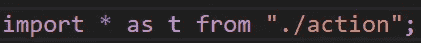*

*importing action type as t*

*让我们进入我之前创建的操作文件，并在其中添加以下内容:*

**

*action types*

*现在我已经为无缝搜索设置好了状态管理，我将把上面定义的提供者组件导入到 app 组件中，并将父组件(Home)嵌套到其中，如下所示:*

*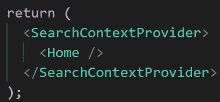*

*context provider*

*在上面的代码片段中，我用上下文提供者函数包装了 Home 组件，以使我的所有上下文状态对包装的组件可用。*

*接下来，我现在可以从包装的组件中的任何地方访问全局状态。*

*让我们进入用户组件，导入 usercollection 数据，并将其呈现在页面上，如下所示:*

*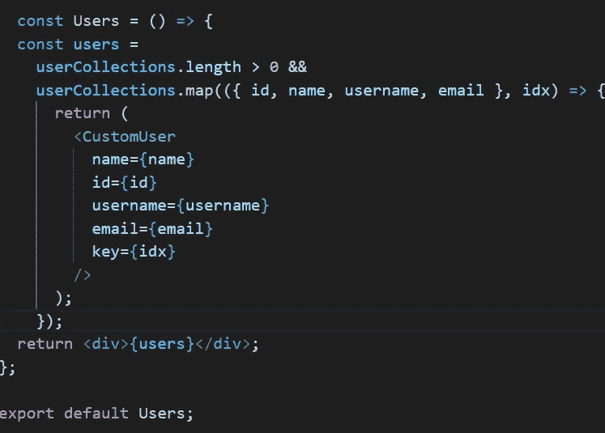*

*render users*

*用户是从我之前创建的 util 文件中导入的，我检查了 usercollection 是否不是空数组，因此，我遍历了它并析构了我想要呈现给浏览器的属性；这些属性作为道具传递给 customUser。*

*让我们进入 customUser 组件，将单个用户数据呈现到一个元素中，如下所示:*

*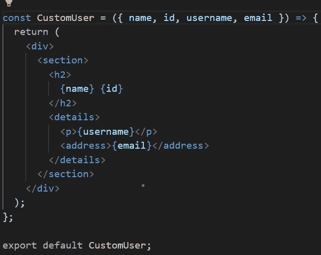*

*custom user*

*下面就用下面的[***demo***](https://res.cloudinary.com/hobbyluv07/video/upload/v1640245996/React_App_-_Google_Chrome_2021-12-23_09-47-43_a36vsv.mp4)***来看看目前为止的进展吧。****

*正如您在上面的演示中看到的，用户数据已经成功地呈现在浏览器中。*

*让我们进入 SearchBar 组件，创建一个表单字段来处理搜索查询，如下所示:*

*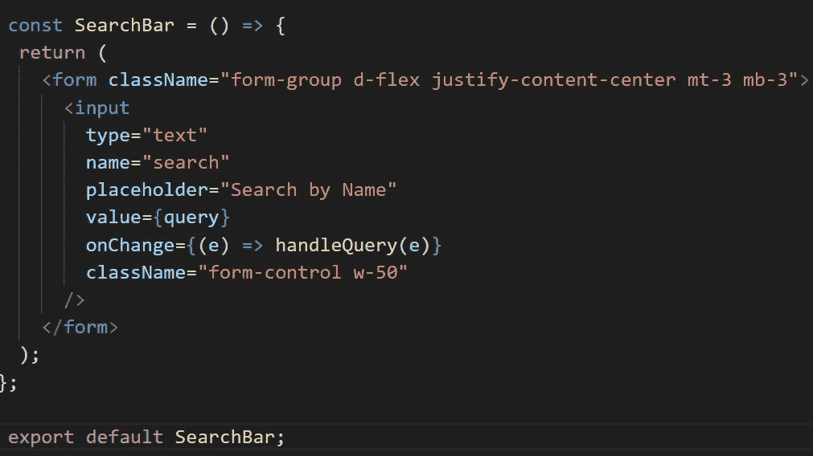*

*search bar component*

*在上面的代码片段中，表单元素中呈现了一个输入字段，handleQuery 函数——稍后将添加，是一个 onChange 函数，当输入字段发生变化时，它会更新状态。让我们定义 handleQuery 函数，如下所示:*

*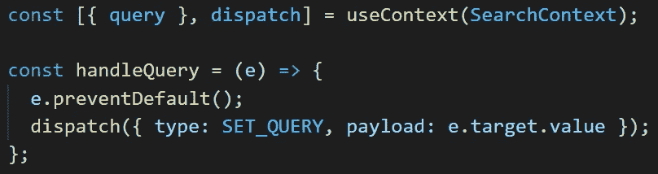*

*在上面的代码片段中，我使用了 useContext 钩子来访问上下文，并析构了状态和一个设置状态的函数。在 handleQuery 函数中，我阻止了表单的默认行为——返回 void，并依次将当前输入值设置为全局状态。*

*现在我已经创建了 SearchBar 组件，让我们进入 util 文件并添加一个函数，该函数将处理我搜索的项目的过滤，如下所示:*

*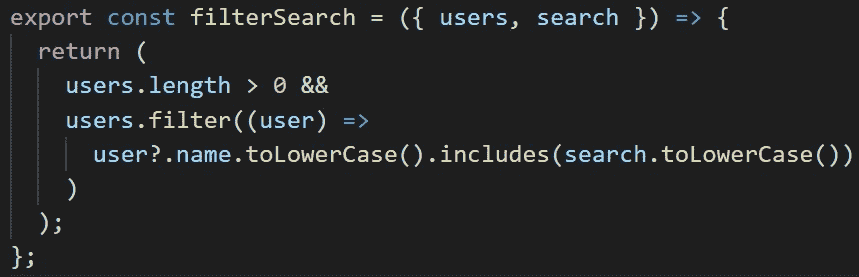*

*search middleware*

*在上面的代码片段中，我遍历了用户并返回了与搜索值(小写)匹配的用户名(小写)。*

*让我们进入用户组件，并对其稍作调整，如下所示:*

*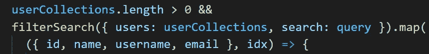*

*在上面的代码片段中，请记住 filtersearch 函数是从 util 文件中导出的，我没有直接遍历 usercollection 数据，而是遍历 filterSearch 函数的返回数据。userCollections 和 ***查询*** 作为参数传递给 filterSearch 函数，以便进行充分的检查。*

*现在我们都实现了这些，让我们看看我们在下面的[***Demo***](https://res.cloudinary.com/hobbyluv07/video/upload/v1640253402/seamless_video_fqkgbu.mp4)***中构建了什么。*** 源代码可用 [***此处***](https://github.com/chibuike07/seamless_search_reactjs) **。***

*最后，我们已经到了本文的结尾，我希望您能够在 react 应用程序中集成一个无缝的搜索过程。*

*如果这篇文章对你有帮助，别忘了点击拍手图标，分享这篇文章，关注我的 [***中的***](https://princewillchime43.medium.com/) 和[***Linkedin***](https://www.linkedin.com/in/chime-princewill-3a2b1b192/)以查看更多我的文章。*

*请放弃任何建议。如果你有一个基于 JavaScript/React 生态系统的主题，请随时联系我，我很乐意就此进行写作。谢了。*

**更多内容看* [*说白了。报名参加我们的*](http://plainenglish.io/) [*免费每周简讯*](http://newsletter.plainenglish.io/) *。在我们的* [*社区*](https://discord.gg/GtDtUAvyhW) *获得独家写作机会和建议。**