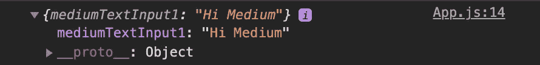
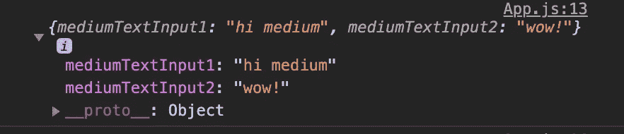

# 使用 React 钩子无缝地使用输入

> 原文：<https://javascript.plainenglish.io/seamlessly-use-inputs-with-react-hooks-2c233a136aac?source=collection_archive---------10----------------------->

## 如何用 React 钩子无缝获取值和更新状态？

Photo by [Martin Shreder](https://unsplash.com/@martinshreder?utm_source=medium&utm_medium=referral) on [Unsplash](https://unsplash.com?utm_source=medium&utm_medium=referral)

## *内容*

*   介绍
*   受控与非受控输入
*   事件和事件。目标
*   React 挂钩使用回调
*   扩展语法
*   解决办法

# 介绍

使用 React 时，很多时候您需要从输入中获取数据。有时当表单相当大时，会变得有点复杂和令人沮丧。让我向您详细介绍一下这个过程。我们将从解释不同类型的输入以及我们如何从它们那里获得数据开始，然后以我们如何使用 React 给它带来一些魔力结束。

# 受控与非受控

重要的是，我们要理解受控与不受控的区别。对我来说，当提到这一点时，一开始总是很困惑。希望我能帮助澄清这一点。如果你已经明白了，那就直接跳过去。

## 受控:

受控组件(输入)由**控制**，因为组件表单数据仅在反应状态下由**控制**。通过使用 React 钩子、useState 或 useContext 来管理它的值和变化，React 已经完成了对它的**控制**。

我想你明白了😅

## 不受控制:

不受控制的组件(input)是不受控制的，因为它使用标准的 HTML 输入，而 React 不控制，相反，DOM 会处理输入的值和变化。通常情况下，这将使用 Ref。

在我看来，当你使用 React 时，他们没有必要使用一个不受控制的组件，除非你不得不这样做。所以我将分享一个受控的例子。

# 事件和事件。目标

> **什么事？**

## 事件:

当用户与 HTML(JSX)交互时，它是通过事件来处理的。在我们的例子中，我们的用户事件正在与我们的文本输入交互。事件的其他示例包括(当页面加载时，单击按钮，选择，等等)。

## 事件。目标:

**事件**的目标属性是对事件发送到的对象的直接引用。通过使用 event.target，我们可以访问关于对象的大量信息。几个不同的属性示例包括**值、名称、onspellcheck、onsize。属性的列表是巨大的，并且可能性是无限的。**

> 我们为什么要使用它？

我们需要获得输入的值，因为 event.target 允许我们访问 value 属性，所以我们可以用它来存储输入的值。

# React 挂钩使用回调

> **什么事？**

在 React 中，useCallback 挂钩取代了类组件中 shouldComponentUpdate 的需要。

reactions hook use callback 接受一个依赖数组，就像它的姐妹 React hook useEffect 一样。这意味着只有当其中一个依赖关系发生变化时，它才会运行。

> 我们为什么要使用它？

通过使用 dependencies 数组，并且仅在任何值发生变化时才使用函数 render/run，我们可以防止和避免组件的任何不必要的呈现。

尽管如果你只使用一个输入，使用 useCallback 可能有点过分。但是这很容易实现，所以我们正在做。

# 扩展语法

> **什么事？**

spread 语法是最近在 ES6 中添加到 JavaScript 中的一个相当新的内容。扩展运算符是三个点…可用于许多不同的用途，例如，它可以:

*   添加两个单独的对象，并将它们合并成一个新对象
*   将数字相加
*   推送数组中的元素
*   复制数组或对象
*   它可以提供带有数组(或任何其他可迭代的数组)的函数调用，其中应该有 0 个或多个参数。

> 我们为什么要使用它？

因为它可以用来复制一个对象，所以我们要使用它，这样我们就可以向同一个状态对象添加任意多的输入，并捕获它们的所有值。

# 解决办法

你成功了！这是代码，让我给你演示一下。

1.  我们正在导入钩子 useState 和 useCallback。
2.  创建了一个 useState 值，调度从一个空对象开始。
3.  使用了重构事件的回调函数来获取值。
4.  在 useCallback 函数中，我们使用了 useState 调度`setValueData`,使用一个 spread 操作符来保持之前的状态`...valueData`,并使用键`event.target.name`来更新它。这与我们输入的 name 属性相匹配，并为该键分配输入的值。
5.  在我们的依赖数组中添加了`valueData, setValueData`来优化 useCallback。
6.  用 useCallback 函数作为一个`onChange`处理程序返回我们的输入，给输入一个名字`mediumTextInput1`，给我们的`value`属性一个状态对象和输入的名字，如果不存在，默认将是一个空字符串。

如果我们 console.log(valueData ),这就是我们当前的状态。

更棒的是，如果我们添加另一个输入，我们可以使用相同的函数，只需更改输入名称就可以更新状态对象！

它使得这个功能和用例是动态的和可重用的。

这就是我们现在的状态！如此简单！😅

React 是强大的；我希望这个例子能帮助你在未来的表单构建中保持简单。

感谢您阅读这篇关于使用 React 钩子无缝使用输入的指南。

在这里找到我的其他文章[https://medium.com/@steven_creates](https://medium.com/@steven_creates)