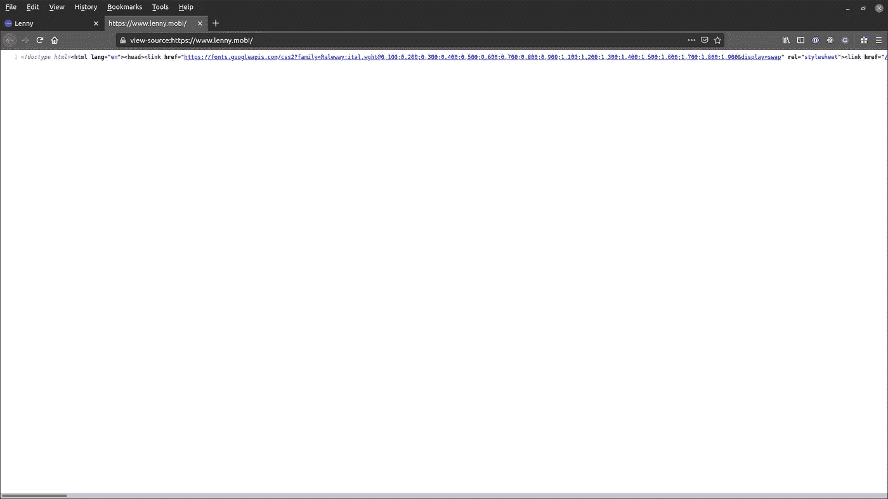
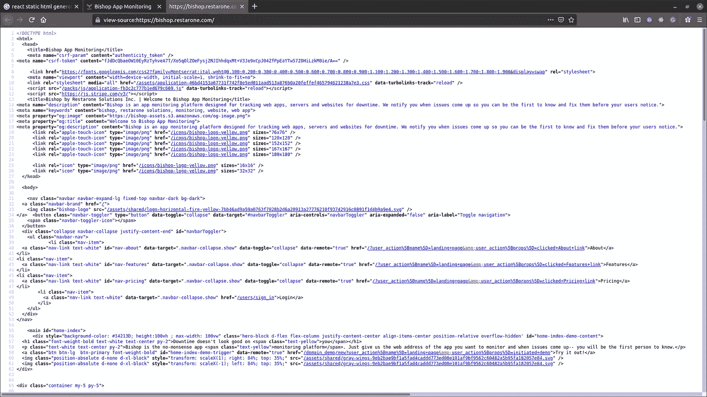

# 面向 Web 开发人员的搜索引擎和社交媒体优化

> 原文：<https://javascript.plainenglish.io/search-engine-and-social-media-optimization-for-web-developers-9d0343cd89e8?source=collection_archive---------12----------------------->

## 一份清单，以建立您的网页排名，并确保您的网站达到其观众


Image composition by author (social media icon grid by: [https://pngtree.com/so/social-media-clipart](https://pngtree.com/so/social-media-clipart))

经过几天甚至几个月的计划和开发，您的 web 应用程序终于可以部署了。这里有一个清单，可以优化你的 web 应用程序，使其在社交媒体和搜索引擎上获得最大的可见性，以确保你的工作得到应有的关注。

为了演示如何实现这些优化，我将使用一个 Rails 应用程序作为工作示例。

## 服务器与客户端渲染

首先，弄清楚你的应用程序的公共页面是服务器还是客户端呈现的。要进行检查，请右键单击网页并选择“查看网页源代码”。如果你看到像这样的一行，下面的一行是处理客户端渲染的应用程序。客户端呈现的应用程序向浏览器发送 Javascript，其中包含呈现页面内容的逻辑和指令。



this is a snippet from a React application built with create-react-app (image by author)

如果是这种情况，[你将需要为 SEO](https://www.creativebloq.com/features/10-best-static-site-generators) 生成静态 HTML 否则你的网站内容将无法被爬虫有效地解析和索引。这是因为搜索引擎爬虫并不擅长从 Javascript 代码中呈现 HTML。

现在，如果您的页面源看起来像这样——使用成熟的 HTML:



image by author

你没事了。搜索引擎爬虫可以很容易地抓取你的网站内容，收集它的全部内容。

## 测试您当前的实现

在做任何改变之前，先了解一下你的网站在搜索引擎和社交媒体分享方面的优化程度。为此，我倾向于使用各种工具，以下是其中一些:

1.  https://freetools.seobility.net/en/seocheck
2.  【https://cards-dev.twitter.com/validator 
3.  [https://socialsharepreview.com](https://socialsharepreview.com/)
4.  [https://www.linkedin.com/post-inspector](https://www.linkedin.com/post-inspector/)

获得更改反馈的最快方法(在将它们部署到生产环境之前)是使用类似于 [ngrok](https://ngrok.com/) 的东西建立一个从域到本地主机的隧道。通过这种方式，您可以提供 ngrok 链接到上面的每个工具，并在编写代码时获得即时反馈。

## 创建带有 og/meta 标签的社交媒体预览

社交媒体预览是用图片甚至视频抓住用户注意力的最简单的方法之一。对于图像，我使用 [Figma](https://www.figma.com) ，创建大小为 1200 px 630 px 的 PNG。

在 Rails 中，你可以使用类似于[元标签](https://github.com/kpumuk/meta-tags)的 gem 来设置 OpenGraph (og)和定制格式(Twitter、脸书等)的元标签。在这里，我们为使用 Open Graph 协议的平台设置与页面标题、描述和关键字以及社交媒体预览图像相关的元标签，并为 Twitter 设置自定义元标签。

In a production application, images would be served over a CDN like S3/Cloudfront and the text would be served from a locales file after detecting the language of the requester.

## 为各种平台生成不同大小的图标


The favicon is the tiny little image next to your browser tab. It is sometimes referred to as the Apple Touch Icon when you save a web page to your home-screen on your iPhone. Image by [Richy Great](https://unsplash.com/@richygreat)

因为有很多传统的/不推荐的图标尺寸，所以创建多种尺寸的图标是一件痛苦的事情。我倾向于创建 1 个对称的 favicon，并以它期望的大小提供给客户端，让它自己调整大小。

在下面的代码片段中，我列出了从 32x32 到 196x196 的 favicon 大小，并将它们呈现在一个列表中，以便客户端可以选择最佳匹配，缩放它(如果需要)并显示给用户。

I render this in a partial in the application layout so it will show on every page

## 本地化/国际化

请确保在 HTML 中设置语言，并对文本等网站内容使用本地化字符串。这使得爬虫知道你的站点是用什么默认语言写的，以及它支持什么语言。

在 Rails 中，我们使用`I18n`助手在 application.html.erb 中动态设置语言，如下所示:

```
<html lang="<%= I18n.locale %>">
```

要设置`I18n`,将以下内容添加到您的应用程序中

```
config.i18n.load_path += Dir[Rails.root.join('config', 'locales', '**', '*.{rb,yml}')]config.i18n.default_locale = :enconfig.i18n.available_locales = [:en]config.i18n.fallbacks = [:en]
```

这将默认语言设置为英语，并允许 Rails 从 config/locales/*下的任何文件中递归加载翻译。

## 生成 XML 站点地图

XML 站点地图明确地向爬虫描述了在你的网站上有哪些路径(以及一些元数据)可供探索。您可以定义给定页面/资源上某些内容的更改频率，并在生成新的站点地图后通过 ping 爬虫来鼓励爬虫抓取您站点的内容。

如果你不想自己编写这个脚本，你可以使用类似于[https://www.xml-sitemaps.com](https://www.xml-sitemaps.com)的服务来生成一个网站地图，并将其加载到你网站的`/public`文件夹中。

在 Rails 中，这个过程很简单，可以在服务器上用 cron 作业自动处理。设置 [sitemap_generator](https://github.com/kjvarga/sitemap_generator) gem 非常简单，它需要`config/sitemap.rb`下的一个文件，如下所示:

You can use your Rails route aliases to define the paths in your website that you want to be included in the XML sitemap

在上面的代码片段中，我为我的网站定义了主机名，并使用内置的 Rails 路径助手列出了可用的路径。

只需运行`rake sitemap:refresh`就可以在服务器上调用该脚本

```
don@don-server:~/Documents/personal-projects/restarone$ bundle exec rake sitemap:refresh
In '/home/don/Documents/personal-projects/restarone/public/':
+ sitemap.xml.gz                                           5 links /  372 Bytes
Sitemap stats: 5 links / 1 sitemaps / 0m00sPinging with URL '[https://www.restarone.com/sitemap.xml.gz'](http://www.restarone.com/sitemap.xml.gz'):
  Successful ping of Google
  Successful ping of Bing
```

从输出中我们可以看到，它生成了一个压缩文件，位于应用程序的`/public`文件夹下，并 pinged Google 和 Bing，让它们知道有一个网站地图可供它们查看！

## 确保 alt 属性出现在资产上(图像、视频、动画、图标)

当搜索引擎爬虫访问您的站点时，它们只处理文本，因此您需要确保资产(例如图像)具有解释资产背后的上下文的 alt 属性。

所以你有它。希望这能帮助你让你的网站/网络应用成为焦点！如果我错过了什么——你知道该怎么做；)

如果你更愿意以视频格式跟进，我会为你提供:

[沙希科](https://www.linkedin.com/in/shashike-jayatunge/)是一名来自多伦多的软件工程师，也是 [Restarone Inc](https://www.restarone.com) 的创始人。当他不开发软件时，他在 Medium 和 YouTube 上创作内容，帮助人们过渡到技术领域。