# 如何在 React 应用程序中使用 Algolia 进行即时搜索

> 原文：<https://javascript.plainenglish.io/searching-powered-by-algolia-in-react-905f86286188?source=collection_archive---------8----------------------->

## React 中由 Algolia 支持的搜索

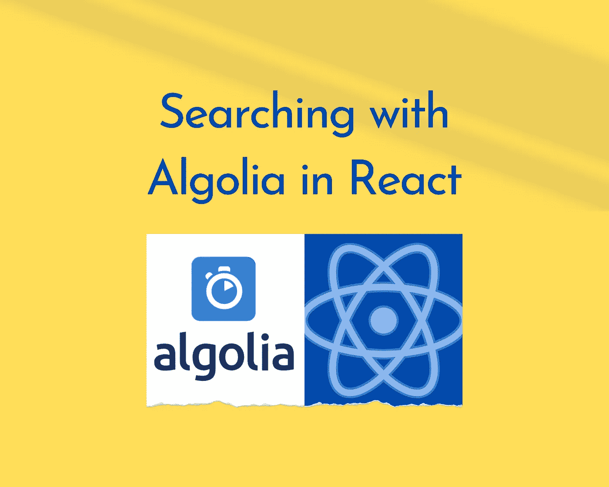

Image Designed Using Canva

大家好，

今天，我们将学习一个搜索引擎工具— **Algolia** 。我在我的一些网络应用程序中使用过 Algolia，我非常喜欢它。他们有一个免费的计划，所以你可以用它来做一些业余项目，只是为了好玩。正如他们所说，Algolia“*使开发者能够利用 API 构建下一代应用，在数毫秒内交付相关内容”。*是的，使用 Algolia 搜索时速度相当快。你可以在他们的网站上找到更多关于文档[的细节。](https://www.algolia.com/doc/)

现在，让我们开始吧！

在使用 Algolia 之前，你需要先注册。注册并登录后，您可以开始创建新的应用程序。我正在使用他们的免费计划，您也可以通过点击如下所示的**免费计划**选项卡来这样做:

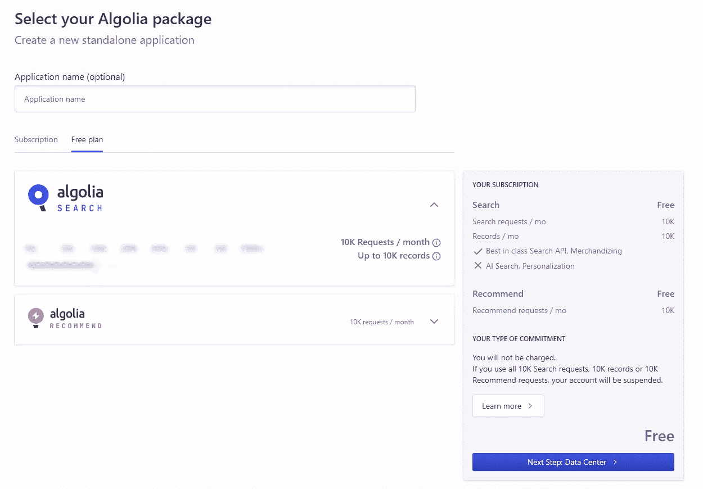

接下来，按照他们关于后续步骤的所有说明来完成新应用程序的创建。进入当前应用仪表板后，点击**索引**菜单创建新的索引。在下面的框中命名您的索引:

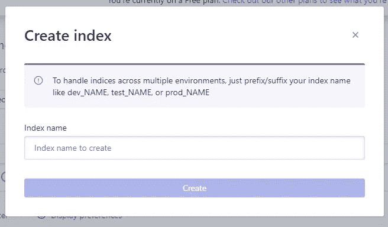

然后，它将显示在您可以在应用程序中实现 UI 之前需要完成的任务列表。

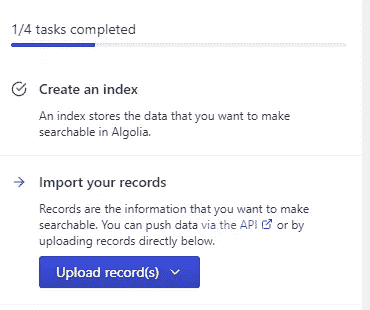

对于上传记录，他们有 3 个选项，如下所示:

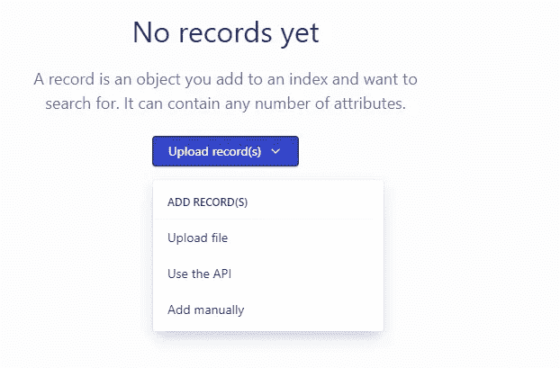

在本教程中，我上传了一个 JSON 文件，该文件是从 RSS 提要数据下载的，我在之前的教程“[如何在您的网站](/how-to-embed-medium-rss-feed-and-youtube-rss-feed-in-your-websites-d8c37f923d77)中嵌入媒体和 YouTube RSS 提要”中使用过。

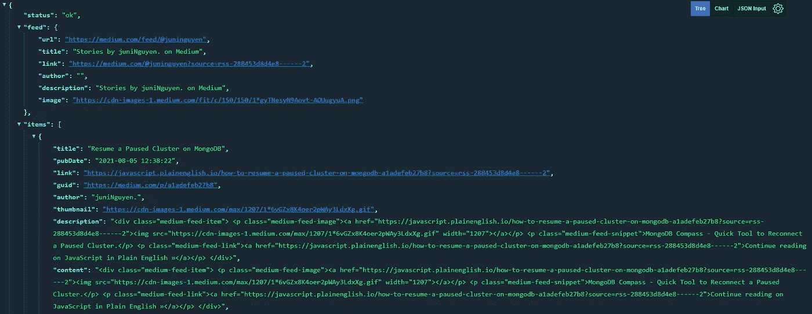

如果你愿意，你也可以这样做。然后您可以编辑您的 JSON 记录，使其格式如下:

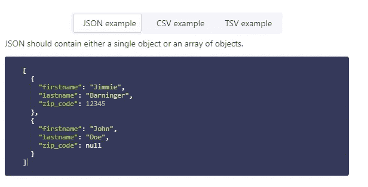

点击**编辑**按钮后，可以开始编辑并保存。现在你有你的指数记录如下。

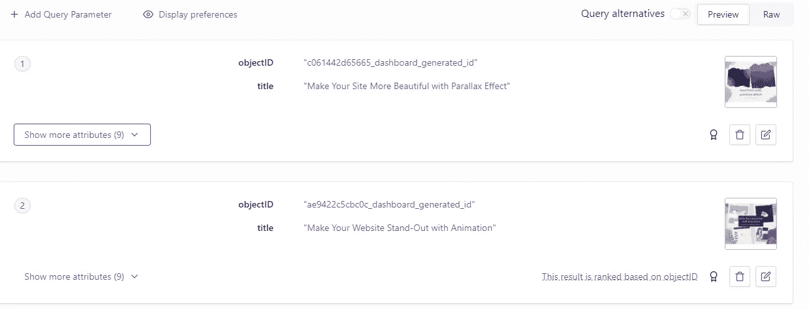

接下来，继续任务列表中的其他步骤，如下所示:

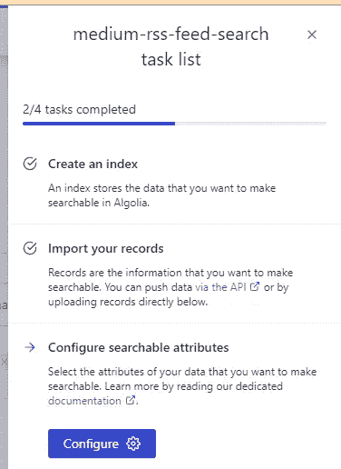

然后，点击**配置**按钮，开始添加一些重要特性的属性，如**可搜索属性**、**刻面**和**高亮显示**，如下:

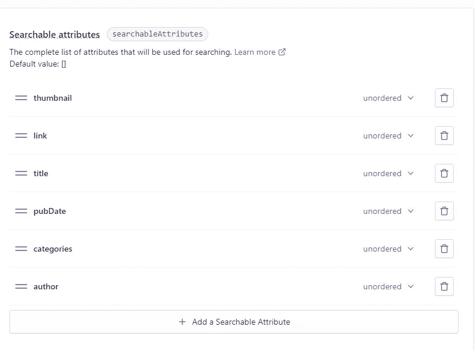

接下来，你可以像这样完成这个列表的最后一个任务:

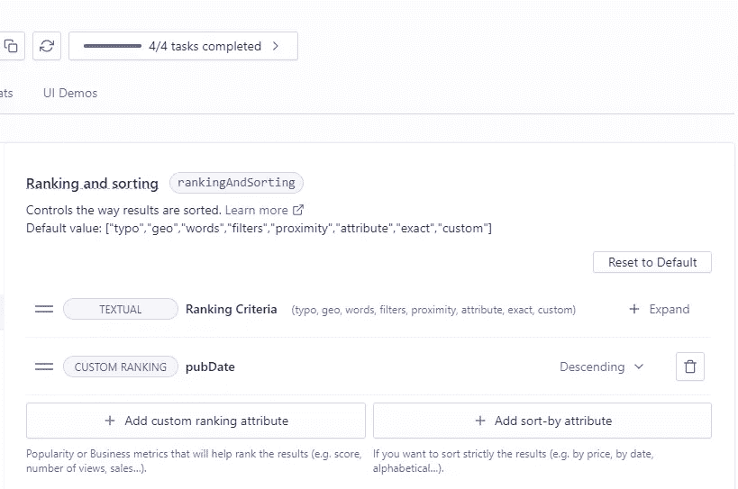

现在，我们可以打开我们的编码编辑器(我在本教程中使用代码沙箱)并开始编码:

首先，在 react 应用程序中安装依赖项“ *algoliasearch* 和“*React-instant search-DOM*”。

在你的 **App.js** 文件中，编码如下:

```
import "./styles.css";import logo from "./assets/algolia-logo.svg";import algoliasearch from "algoliasearch/lite";import {InstantSearch,Hits,SearchBox,Highlight,ClearRefinements,RefinementList,Configure} from "react-instantsearch-dom";import PropTypes from "prop-types";import React from "react";import { parseDate } from "./util";const searchClient = algoliasearch(**"YOUR APPLICATION ID"**,"**YOUR SEARCH-ONLY API KEY**");const App = () => {return (<div><h2>React InstantSearch Demo</h2><div className="container"><InstantSearchindexName=**"YOUR INDEX NAME"**searchClient={searchClient}><div className="left-panel"><ClearRefinements /><h4>Catagories</h4><RefinementList attribute="categories" showMore={true} /><Configure hitsPerPage={20} /><h4>Published Date</h4><RefinementList attribute="pubDate" showMore={true} /><Configure hitsPerPage={20} /></div><div className="right-panel"><div className="search-box"><ahref="https://www.algolia.com/"target="_blank"aria-label="Search by Algolia"rel="noopener noreferrer"></a><SearchBox /></div><Hits hitComponent={Hit} /></div></InstantSearch></div></div>);};function Hit(props) {return (<div><imgclassName="thumbnail"src={props.hit.thumbnail}alt={props.hit.thumbnail}/><div className="title"><Highlight attribute="title" hit={props.hit} /></div><div className="date">{parseDate(props.hit.pubDate)}</div><div><aclassName="link"target="_blank"rel="noreferrer"href={props.hit.link}>Read more here{" "}</a></div></div>);}Hit.propTypes = {hit: PropTypes.object.isRequired};export default App;
```

请注意，您的对象 **searchClient** 有两个属性:您的**应用程序 ID** 和您的**仅搜索 API 密钥**，您可以通过单击如下所示的 API 密钥选项卡菜单获得(不显示您的管理 API 密钥):

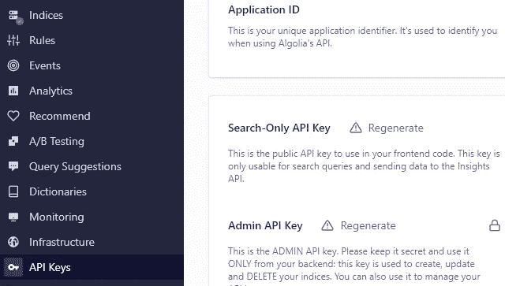

并为<instantsearch>组件使用您的索引名:</instantsearch>

```
<InstantSearchindexName=**"YOUR INDEX NAME"**searchClient={searchClient}>
```

最后，请注意函数 *Hit(props)* 包含了 *< Highlight/ >* 组件，用于在搜索查询与这些条目匹配时高亮显示命中的条目。确保您添加了正确的*属性*名称。此外，您可以向项目列表中添加尽可能多的可用属性。在这种情况下，我只需要显示文章的*缩略图*、*标题*、*发布日期*和*链接*，如下图[演示](https://v2cl0.csb.app/):

今天的教程到此为止。希望你觉得有用，如果你需要进一步的帮助，请不要犹豫，来找我。感谢您的阅读，祝您有美好的一天！

*更多内容请看*[***plain English . io***](http://plainenglish.io)