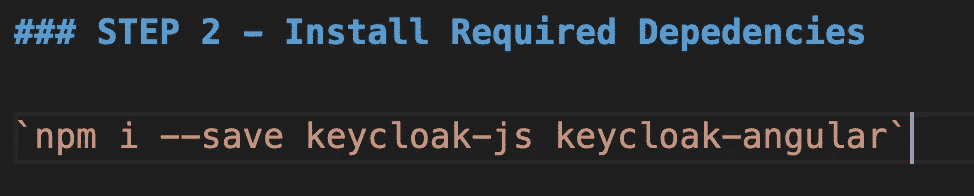

# 用 Keycloak 保护一个有角度的单页应用程序

> 原文：<https://javascript.plainenglish.io/secure-an-angular-single-page-application-with-keycloak-cdbe5026881e?source=collection_archive---------0----------------------->


Keycloak Integration in Web(Angular) Application — Module Design

## **简介**

当您想要开发一个企业应用程序或者您有许多客户端(web-js、移动平台)并且想要动态地创建和管理它们时，Keycloak 非常有用。

此外，当您与第三方系统(谷歌、脸书、推特等)进行大量集成时，key loak 非常有用，因为 key loak 有现成的系统。或者如果/当您需要与某个 SAML 或 LDAP 提供程序集成时。

如果您需要一些身份和用户管理平台，并且您有复杂的用户访问流程，您可以使用 Keycloak。

最后，如果您需要单点登录功能，您也可以考虑使用 Keycloak。一旦登录到 Keycloak，用户就不必再次登录来访问不同的应用程序。

## **钥匙卡服务器安装**

安装 Keycloak 就像下载并解压一样简单。你可以在 Linux 或 Windows 上安装服务器。服务器下载 ZIP 文件包含运行 Keycloak 服务器的脚本和二进制文件，更多详细信息请查看[入门指南](https://www.keycloak.org/docs/latest/getting_started/index.html)。

1.  [Kubernetes 上的 key floak](https://www.keycloak.org/getting-started/getting-started-kube)
2.  [码头工人须知](https://www.keycloak.org/getting-started/getting-started-docker)


[https://www.keycloak.org/downloads](https://www.keycloak.org/downloads)

## 角度应用中的集成键帽

**第 1 步** — **创建新的角度项目**

您可以使用 Angular CLI 创建一个新项目，或者克隆我为了理解集成而创建的现有[ng-key floak](https://github.com/santoshshinde2012/ng-keycloak.git)存储库。

[](https://github.com/santoshshinde2012/ng-keycloak) [## santoshshinde 2012/ng-key floak

### 该项目是使用 Angular CLI 版本 11.2.8 生成的。为开发服务器运行 ng 服务。导航到…

github.com](https://github.com/santoshshinde2012/ng-keycloak) 

```
ng new ng-keycloak **OR**git clone https://github.com/santoshshinde2012/ng-keycloak.git
```


Create a new Angular Application

**第 2 步** — **安装所需的依赖项**

**客户端适配器**:key loak 客户端适配器是一些库，它们使得使用 key loak 保护应用程序和服务变得非常容易。我们称它们为适配器而不是库，因为它们提供了与底层平台和框架的紧密集成。这使得我们的适配器易于使用，并且它们需要的样板代码比库通常需要的要少。

Keycloak 附带一个客户端 JavaScript 库，可以用来保护 HTML5/JavaScript 应用程序的安全。JavaScript 适配器内置了对 Cordova 应用程序的支持。

```
npm install --save keycloak-angular keycloak-js
```



**Install the required dependency**

**步骤 3 —创建基于环境的键盘锁配置**

我们将在`environments` 文件夹中创建`keycloak.config.ts` 文件，以便从环境中获取配置。


**Create Environment based keycloak configuration**

**第四步——创建授权模块来处理钥匙锁相关的东西**

```
ng generate module auth
```


**Create Auth Module to Handle Keycloak Related Stuff**

**第五步——键盘锁初始化**

在 Auth，module 中创建文件`keycloak-initializer.ts` 来处理 Keycloak 的初始化。


**keycloak Initialization**

**步骤 6 —在认证模块中创建认证服务，处理认证事务**

Auth Service 将处理与 keycloak 服务方法的身份验证和实现相关的所有操作。

```
ng generate service auth/service/Auth
```


**Keycloak Auth Service**

**第 7 步—创建授权保护**

Angular 的 route guards 是可以告诉路由器是否应该允许导航到所请求的路由的接口。他们通过寻找一个`true`或`false`从一个实现给定 guard 接口的类返回的值来做出这个决定。

我们必须在扩展了`KeycloakAuthGuard`的`AuthModule`中创建`AuthGuard`。提供了一个通用的`AuthGuard`、`KeycloakAuthGuard`来帮助您保护应用程序中的认证路由。该防护为您提供了查看用户是否登录的信息以及属于该用户的角色列表。在您的实现中，您只需要实现所需的逻辑来保护您的路由。


Keycloak Auth Guard

**步骤 8—导入 KeycloakAngularModule 并在 AuthModule 中注册提供者 KeyloackService**

为了确保 Keycloak 在你的应用程序启动时被初始化，你必须添加一个`APP_INITIALIZER`提供者到你的`AppModule`中。这个提供者将调用下面显示的工厂函数`initializer`,它将设置 Keycloak 服务，以便可以在您的应用程序中使用它。


**Import KeycloakAngularModule and Register Provider KeyloackService in AuthModule**

**步骤 9 —在主应用模块**中导入授权模块


**Import AuthModule in main AppModule**

**步骤 10 —路由模块配置**

我们将创建一个具有自己路由模块的三模块。

1.  着陆舱
2.  管理模块
3.  用户模块


Keycloak Integration in Web(Angular) Application — Module Design

1.  创建着陆模块

```
ng generate module landing
```

2.用一些基本路线创建一个着陆路线模块

```
ng generate module landing/landing-routing --flat --module=landing
```

3.创建着陆架组件

```
ng generate component landing/home
```

请按照上述三个步骤创建另一个模块，如用户和管理员。

我们必须对您想要限制访问的路由使用 AuthGuard，在数据属性中为每个路由分配所需的角色，角色参数作为数组。


**Routing Module Configuration**

**步骤 11 —运行应用程序**

```
npm start / ng serve
```

**参考文献**

Easily secure your Front and back applications with KeyCloak

Introduction to OAuth 2.0 and OpenID Connect

*更多内容尽在*[***plain English . io***](http://plainenglish.io/)