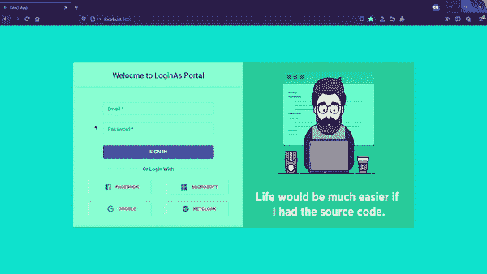
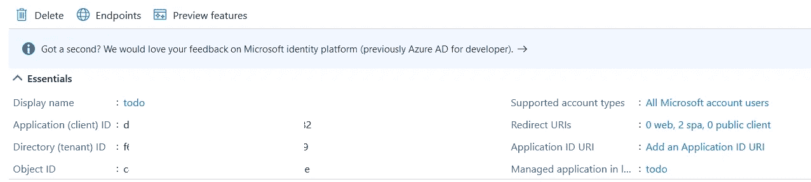

# 使用 Azure 端点和授权代码流保护 React SPA

> 原文：<https://javascript.plainenglish.io/secure-react-spa-using-azure-endpoints-with-authorization-code-flow-847f47f972d?source=collection_archive---------4----------------------->


基于浏览器的认证一直是优化的范围。对运行在浏览器中的公共客户端保密是一种安全威胁，它不能保密，也不能正确地向认证服务器认证。为了处理这样的问题，Oauth 2.0 提出了这个概念，叫做 **P** 屋顶 **K** ey 代表**C**ode**E**xchange(**PKCE**)。

# **1。简介**

**根据布洛克·艾伦的** [**帖子**](https://brockallen.com/2019/01/03/the-state-of-the-implicit-flow-in-oauth2/) **，**

*PKCE 使用的缓解措施是在每次客户端需要连接到授权端点时创建一个新的动态秘密。然后，动态秘密将在令牌端点上使用，令牌服务器将帮助保证只有合法的客户端可以使用该代码来获得相应的访问令牌。*

## 从微软文档中，

***“如今许多浏览器都在屏蔽第三方 cookies——对与浏览器栏中显示的域名不同的域名请求的 cookies。这打破了隐式流程，需要新的身份验证模式来成功登录用户。在 Microsoft identity platform 中，当第三方 cookies 被阻止时，我们通过 PKCE 和刷新令牌使用授权流来保持用户登录。”***

# **2。工作演示**



Fig 1.0: Microsoft Authentication Code flow with PKCE for React SPA

# 3.Azure 端 App 注册

在 Azure portal 上，您可以获取设置环境所需的所有细节，



要获得正确的应用程序注册指南，您可以关注微软的这篇文章，

[](https://docs.microsoft.com/en-us/azure/active-directory/develop/quickstart-register-app) [## 快速入门:在 Microsoft 身份平台中注册应用程序

### 在此快速入门中，您将在 Azure 门户中注册一个应用程序，以便 Microsoft 身份平台可以提供…

docs.microsoft.com](https://docs.microsoft.com/en-us/azure/active-directory/develop/quickstart-register-app) 

确保在 [SPA](https://docs.microsoft.com/en-us/azure/active-directory/develop/scenario-spa-app-registration#redirect-uri-msaljs-20-with-auth-code-flow) 下正确注册您的重定向 URI，以便为 CORS 启用它。

# 4.源代码及其配置

我有一个代码样本为这个工作演示准备好了，如上图所示。克隆存储库并安装节点模块

```
git clone [https://github.com/surya5954/LoginAs.git](https://github.com/surya5954/LoginAs.git)
cd LoginAs
npm install
```

打开。env 文件，并更新下面提到的字段，

```
REACT_APP_AZURE_ID=<Client ID from Azure App registration portal>
REACT_APP_AZURE_TENANT_ID=<Tenant ID from same portal>
```

现在回到我们的应用程序，让我们开始理解这个魔术背后的逻辑，

## PKCE 相关配置，

**CODE_VERIFIER :** 根据 [PKCE RFC](https://tools.ietf.org/html/rfc7636#section-4.1) ，这需要是最小 43 位长的 URL 安全随机字符串，使用无保留字符[A-Z]/[A-Z]/[0–9]/"-" "/ "_" / "~".

**CODE_CHALLENGE_METHOD :** 根据 [PKEC RFC](https://tools.ietf.org/html/rfc7636#section-4.2) 这应该是‘sha 256’，如果客户端能够使用它，否则这也可以是‘plain’。

**CODE_CHALLENGE :** 在“sha256”的情况下，它应该是代码验证器的 Base64 URL 编码的 SHA-256 哈希。

在 **<回购路径>/loginas/src/config/pckeconfigs . js 中，**

```
import crypto from 'crypto';// Some random 64 bit long string
export const CODE_VERIFIER = 'AdleUo9ZVcn0J7HkXOdzeqN6pWrW36K3JgVRwMW8BBQazEPV3kFnHyWIZi2jt9gA';export const CODE_CHALLENGE_METHOD = 'S256';
const base64URLEncode = (str) => {
    return str.toString('base64')
        .replace(/\+/g, '-')
        .replace(/\//g, '_')
        .replace(/=/g, '');
}
const getCodeChallange = (verifier) => {
    return base64URLEncode(crypto.createHash('sha256')
            .update(verifier).digest());
}
export const CODE_CHALLENGE = getCodeChallange(CODE_VERIFIER);
```

这段代码生成了我们正在讨论的动态秘密，并帮助您的客户端应用程序成为 Microsoft 身份验证服务器眼中的合法客户端，以获取 access_token。

## 授权端点配置，

现在，我们来看看如何用 PKCE 构建您的授权端点调用以获得响应代码，

在 **<回购路径>/loginas/src/container/AuthEndpointSetup/azure . js 中，**

```
const Azure = () => {
    return queryString.stringifyUrl({
        url: `[https://login.microsoftonline.com/${AZURE_TENANT_ID}/oauth2/v2.0/authorize`](https://login.microsoftonline.com/${AZURE_TENANT_ID}/oauth2/v2.0/authorize`),
        query: {
            client_id: AZURE_ID,
            redirect_uri: REDIRECT_URI,
            response_type: 'code',
            response_mode: 'query',
            scope: [
                'openid',
                'offline_access',
                'email',
                'profile',
                'user.read',
            ].join(" "),
            state: JSON.stringify({ provider: 'Microsoft' }),
            code_challenge: CODE_CHALLENGE,
            code_challenge_method: CODE_CHALLENGE_METHOD
        }
    });
}
```

## 从 URL 获取代码，

接下来，我们需要从 URL 获取代码细节来构造对令牌端点的调用，

在 **<回购路径>/loginas/src/container/Layout/Layout . js**中，

```
componentDidMount() {
        const [code_param] = /((\?|\&)code\=)[^\&]+/.exec(this.props.location.search) || [];
        const [state_param] = /((\?|\&)state\=)[^\&]+/.exec(this.props.location.search) || [];
        if (code_param != null) 
            let code = decodeURIComponent(code_param.replace(/(\?|\&)?code\=/, ''));
            let state = decodeURIComponent(state_param.replace(/(\?|\&)?state\=/, ''));
            const provider = JSON.parse(state).provider;
            console.log(provider + "===> " + code);
            this.setState({ enableProgressBar: true })
            const token = window.localStorage.getItem('token');
            console.log(token);
            if (token == null) {
                this.getAccessTokenFromCode(provider, code);
            } else {
                this.props.history.push('/welcome/user');
            } }
}
```

## 令牌端点配置，

既然我们已经从 URL 获得了代码，现在需要构造令牌端点 URL，这是一个 post 调用，

在 **<回购路径>/loginas/src/container/TokenEndpointSetup/azuretoken . js 中，**

```
const AzureToken = async (code) => {
    console.log("Getting token for Azure provider ===>");
    let params = {
        client_id: AZURE_ID,
        code: code,
        grant_type: ['authorization_code'],
        redirect_uri: REDIRECT_URI,
        code_verifier: CODE_VERIFIER,
        state: JSON.stringify({ provider: 'Microsoft' }),
    }const post_data = queryString.stringify(params);
    let parsedUrl = URL.parse(`[https://login.microsoftonline.com/${AZURE_TENANT_ID}/oauth2/v2.0/token`](https://login.microsoftonline.com/${AZURE_TENANT_ID}/oauth2/v2.0/token`), true);let realHeaders = {};
    realHeaders['Host'] = parsedUrl.host;
    realHeaders["Content-Length"] = post_data.length;
    realHeaders["Content-Type"] = 'application/x-www-form-urlencoded';const options = {
        host: parsedUrl.hostname,
        port: parsedUrl.port,
        path: parsedUrl.pathname,
        method: "POST",
        headers: realHeaders
    };const payload = Object.assign({
        body: post_data
    }, options);let response = await fetch(`[https://login.microsoftonline.com/${AZURE_TENANT_ID}/oauth2/v2.0/token`](https://login.microsoftonline.com/${AZURE_TENANT_ID}/oauth2/v2.0/token`), payload)let token_object = await response.json();return token_object.access_token;}
```

现在，在这个 post 调用中，我们将那个 64 位长的随机字符串作为***code _ verifier***连同我们从 URL 获取的代码一起传递。

一旦你有了 access_token，你也会像，


Yay !! I have got the token

## 获取用户详细信息，

现在你需要做的就是像老板一样坐下来询问用户的详细信息，下面是我用来获取用户姓名和电子邮件详细信息的代码片段。虽然本例中的 access_token 是一个 JWT 令牌，因此您也可以从该令牌中获得一些关于用户的有限细节，但是我已经调用了一个 Microsoft Graph Api 来获得一些用户细节，

在 **<回购路径>/loginas/src/container/user details/azureuser . js 中，**

```
const AzureUser = async (token) => {
    let userProvider;
    const res = await fetch(`[https://graph.microsoft.com/v1.0/me`](https://graph.microsoft.com/v1.0/me`), {
        method: 'get',
        headers: {
            Authorization: `Bearer ${token}`,
        }
    })
    const me = await res.json();
if (me.id) {
        userProvider = {
            name: me.displayName,
            email: me.mail,
        }
    }
    return userProvider;
}
```

## 结论

这就是直接从浏览器使用 Microsoft endpoint 进行成功身份验证所需的全部内容，不涉及后端。我希望这对您有所帮助。感谢您的阅读。

黑客快乐！