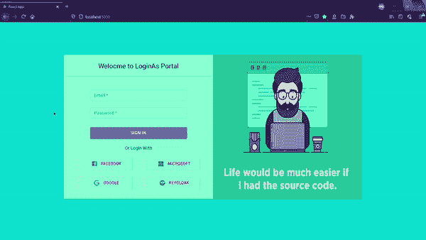
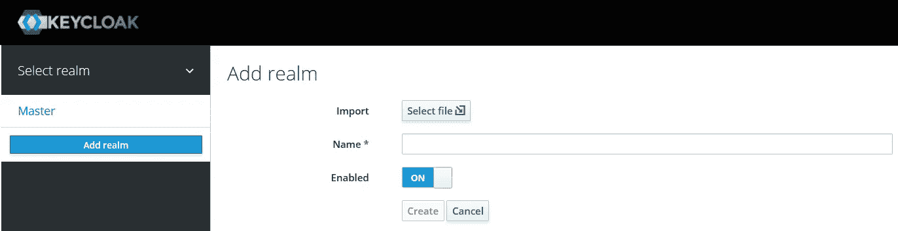
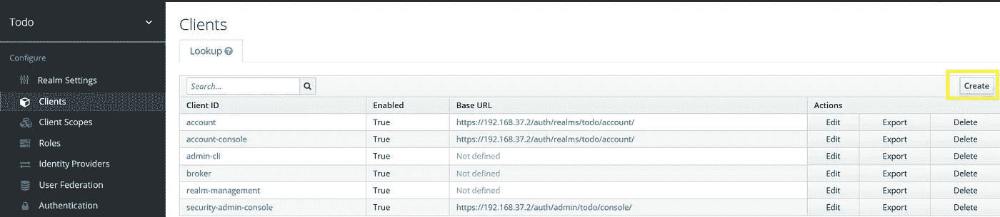
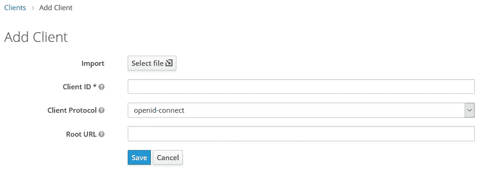
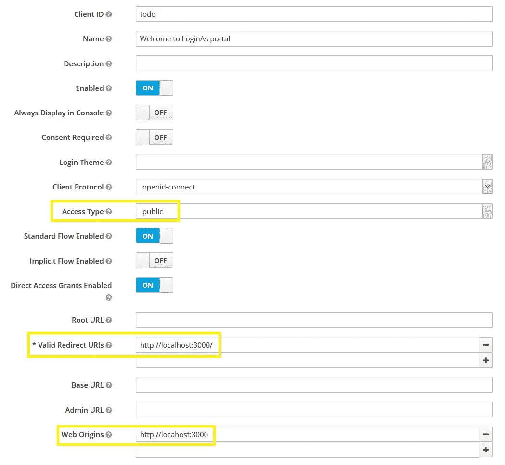
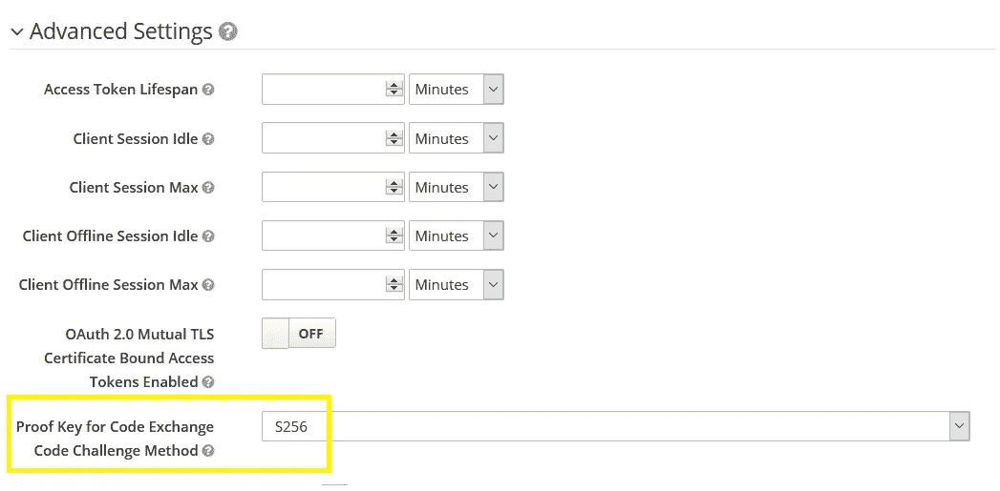

# 使用带有 OpenID Connect 的 Keycloak 保护 React SPA

> 原文：<https://javascript.plainenglish.io/secure-react-spa-using-keycloak-with-openid-connect-a25e2ad51743?source=collection_archive---------1----------------------->

根据我之前的帖子 **"** [**Secure React SPA 使用 Azure 端点和授权代码流**](https://js.plainenglish.io/secure-react-spa-using-azure-endpoints-with-authorization-code-flow-847f47f972d) **"** ，我意识到用您的应用程序配置多个提供者需要大量的编码和配置，特别是当您想要坚持所有提供者的授权代码流时。虽然 Azure，谷歌在某种程度上支持跨来源请求，但另一方面脸书严格地不支持它。(因此，我们需要创建一个代理服务器来修改 CORS 策略，以便接受您的请求)。


# 1.介绍

感谢 [WildFly](https://en.wikipedia.org/wiki/WildFly) 开发者社区开发了一个开源项目 [Keycloak](https://www.keycloak.org/) 。" **Keycloak** 是一款开源软件产品，允许[使用](https://en.wikipedia.org/wiki/Single_sign-on)[身份和访问管理](https://en.wikipedia.org/wiki/Identity_and_Access_Management)进行单点登录，旨在实现现代应用和服务"如维基百科所述。你所需要做的就是保持 Keycloak 应用服务器在一台机器上运行，不管它是在同一个域还是跨域都没有关系。在这篇文章中，我们将学习运行一个 Keycloak 服务器，一个 React SPA 将与它集成。

# 2.工作演示



# 3.键盘锁设置和配置

我使用 Linux 安装的 VirtualBox 来运行 Keycloak。我还在 Nginx 服务器后面保留了 Keycloak，用于反向代理、负载平衡之类的东西。为了运行 Keycloak，我使用 docker hub 的 Docker 镜像 [jboss/keycloak](https://hub.docker.com/r/jboss/keycloak/) 。

```
**For http it uses port 8080,**docker run --detach -p 8080:8080 -e KEYCLOAK_USER=admin -e KEYCLOAK_PASSWORD=admin docker.io/jboss/keycloak**For https it uses port 8443,**docker run --detach -p 8443:8443 -e KEYCLOAK_USER=admin -e KEYCLOAK_PASSWORD=admin docker.io/jboss/keycloak
```

这将为您创建一个帐户以及**管理员**用户名和**管理员**密码，您可以通过更改参数 KEYCLOAK_USER= < >和 KEYCLOAK_PASSWORD= < >的值来更改用户名和密码。

现在在 Nginx 中，我已经为反向代理做了这些配置，

```
location /auth/ {
                    proxy_set_header Host $http_host;
                    proxy_set_header X-Real-IP $remote_addr;
                    proxy_set_header X-Scheme $scheme;
                    proxy_set_header X-Forwarded-For $proxy_add_x_forwarded_for;
                    proxy_set_header X-Forwarded-Proto $scheme;
                    #proxy_redirect    off;
                    add_header Pragma "no-cache";
                    add_header Cache-Control "no-cache";
                    proxy_pass [https://localhost:8443/auth/](https://localhost:8443/auth/);
                    sub_filter_once off;
        }
```

因为我使用 https，所以我们需要 SSL 证书，现在我使用自签名证书，你可以从[这里](https://www.digitalocean.com/community/tutorials/how-to-create-a-self-signed-ssl-certificate-for-nginx-on-centos-7)配置它。

这就是在 Keycloak 应用服务器上运行一个管理帐户。现在，我们将进行提供商配置。以下是实现这一目标的步骤，

*   通过单击“添加领域”创建一个领域，然后填写领域名称。



*   一旦您创建了领域，您就可以在这里为您的领域创建一个客户端，



*   填写客户编号，您的 React 应用程序将进一步使用该编号。保持客户端协议为 **openid-connect** 。



*   创建一个客户端后，您需要为该特定客户端填写如下所示的特定详细信息。专注于突出显示的字段。**访问类型**，这需要是公共的，因为我们是为公共客户端进行这种配置的。**有效重定向 URIs** ，这是您的应用程序中的 uri，在从 Keycloak 成功进行身份验证后，您希望在其中接收令牌。 **Web Origins** ，在此字段中提及 URL 将使您能够在 Keycloak 应用服务器上搜索 CORS，因此您不会获得任何与 CORS 相关的问题。



*   最后但也是最重要的配置，在下面相同的客户端配置页面的**高级设置**下，您需要指定您的客户端用来在代码验证器上创建代码质询的方法。根据 [PKEC RFC](https://tools.ietf.org/html/rfc7636#section-4.2) 的规定，该值应为“sha256”，如果客户(React SPA)能够使用该值，则该值也可以为“普通”。



恭喜你！！您已经成功配置了 Keycloak 应用服务器，使其像身份验证服务器一样正常工作。

# 4.React SPA 的源代码和配置

我有一个代码样本准备好了这个工作演示，如上图所示。克隆 repo 并安装 node_modules

```
git clone [https://github.com/surya5954/LoginAs.git](https://github.com/surya5954/LoginAs.git)
cd LoginAs
npm install
```

打开。您编辑器中 env 文件，并更新下面提到字段，

```
REACT_APP_KEYCLOAK_ID=<Client ID from Keycloak admin portal>
```

现在回到我们的应用程序，让我们开始理解这个魔术背后的逻辑，

## PKCE 相关配置，

**CODE_VERIFIER :** 按照 [PKCE RFC](https://tools.ietf.org/html/rfc7636#section-4.1) 的规定，这需要是最少 43 位长度的 URL-Safe 随机字符串，使用未预留的字符[A-Z]/[A-Z]/[0-9]/-/。/ "_" / "~".

**CODE_CHALLENGE_METHOD :** 根据 [PKEC RFC](https://tools.ietf.org/html/rfc7636#section-4.2) 的规定，该字段应为“sha256”，如果客户能够使用该字段，则该字段也可以为“普通”。

**CODE_CHALLENGE :** 对于“sha256”，它应该是代码验证器的 Base64 URL 编码的 SHA-256 哈希。

在 **<回购路径>/loginas/src/config/pckeconfigs . js 中，**

```
import crypto from 'crypto';// Some random 64 bit long string
export const CODE_VERIFIER = 'AdleUo9ZVcn0J7HkXOdzeqN6pWrW36K3JgVRwMW8BBQazEPV3kFnHyWIZi2jt9gA';export const CODE_CHALLENGE_METHOD = 'S256';
const base64URLEncode = (str) => {
    return str.toString('base64')
        .replace(/\+/g, '-')
        .replace(/\//g, '_')
        .replace(/=/g, '');
}
const getCodeChallange = (verifier) => {
    return base64URLEncode(crypto.createHash('sha256')
            .update(verifier).digest());
}
export const CODE_CHALLENGE = getCodeChallange(CODE_VERIFIER);
```

这段代码生成了我们正在讨论的动态秘密，并帮助您的客户端应用程序成为 Keycloak 身份验证服务器眼中的合法客户端，以获取 access_token。

## 授权端点配置，

现在，我们来看看如何用 PKCE 构建您的授权端点调用以获得响应代码，

在 **<回购路径>/loginas/src/container/AuthEndpointSetup/key cloak . js 中，**

```
const Keycloak = () => {
    return queryString.stringifyUrl({
        url: `[http://<Keycloak server hostname>/auth/realms/todo/protocol/openid-connect/auth`](http://192.168.37.2/auth/realms/todo/protocol/openid-connect/auth`),
        query: {
            client_id: KEYCLOAK_ID,
            redirect_uri: REDIRECT_URI,
            response_type: 'code',
            scope: [
                'openid',
                'profile',
            ].join(" "),
            state: JSON.stringify({ provider: 'Keycloak' }),
            code_challenge: CODE_CHALLENGE,
            code_challenge_method: CODE_CHALLENGE_METHOD
        }
    });
}
```

## 从 URL 获取代码，

接下来，我们需要从 URL 获取代码细节来构造对令牌端点的调用，

在 **<回购路径>/loginas/src/container/Layout/Layout . js**中，

```
componentDidMount() {
        const [code_param] = /((\?|\&)code\=)[^\&]+/.exec(this.props.location.search) || [];
        const [state_param] = /((\?|\&)state\=)[^\&]+/.exec(this.props.location.search) || [];
        if (code_param != null) 
            let code = decodeURIComponent(code_param.replace(/(\?|\&)?code\=/, ''));
            let state = decodeURIComponent(state_param.replace(/(\?|\&)?state\=/, ''));
            const provider = JSON.parse(state).provider;
            console.log(provider + "===> " + code);
            this.setState({ enableProgressBar: true })
            const token = window.localStorage.getItem('token');
            console.log(token);
            if (token == null) {
                this.getAccessTokenFromCode(provider, code);
            } else {
                this.props.history.push('/welcome/user');
            } }
}
```

## 令牌端点配置，

既然我们已经从 URL 获得了代码，现在需要构造令牌端点 URL，这是一个 post 调用，

在**的<回购路径>/loginas/src/container/TokenEndpointSetup/keycloaktoken . js 中，**

```
const KeycloakToken = async (code) => {
    let params = {
        client_id: KEYCLOAK_ID,
        code: code,
        grant_type: 'authorization_code',
        redirect_uri: REDIRECT_URI,
        code_verifier: CODE_VERIFIER,
        state: JSON.stringify({ provider: 'Keycloak' }),
    }const post_data = queryString.stringify(params);
    let parsedUrl = URL.parse(`[http://<Keycloak server Hostname>/auth/realms/todo/protocol/openid-connect/token`](http://192.168.37.2/auth/realms/todo/protocol/openid-connect/token`), true);let realHeaders = {};
    realHeaders['Host'] = parsedUrl.host;
    realHeaders["Content-Length"] = post_data.length;
    realHeaders["Content-Type"] = 'application/x-www-form-urlencoded';const options = {
        host: parsedUrl.hostname,
        port: parsedUrl.port,
        path: parsedUrl.pathname,
        method: "POST",
        headers: realHeaders
    };const payload = Object.assign({
        body: post_data
    }, options);
    let response = await fetch(`[http://](http://192.168.37.2/auth/realms/todo/protocol/openid-connect/token`)[<Keycloak server Hostname>](http://192.168.37.2/auth/realms/todo/protocol/openid-connect/token`)[/auth/realms/todo/protocol/openid-connect/token`](http://192.168.37.2/auth/realms/todo/protocol/openid-connect/token`), payload);let res = await response.json();
return res.access_token;}
```

现在，在这个 post 调用中，我们将那个 64 位长的随机字符串作为 ***code_verifier*** 连同我们从 URL 获取的代码一起传递。

一旦你有了 access_token，你也会像，


Yay !! I have got the token

## 获取用户详细信息，

现在你需要做的就是像老板一样坐下来询问用户的详细信息，下面是我用来获取用户姓名和电子邮件详细信息的代码片段。虽然本例中的 access_token 是一个 JWT 令牌，所以您也可以从该令牌中获得一些关于用户的有限细节，但是我已经调用了一个 userinfo API 来获得一些用户细节，

在 **<回购路径>/loginas/src/container/user details/key cloakuser . js 中，**

```
const KeycloakUser = async (token) => {
    let userProvider;
    const res = await fetch(`[http://<Keycloak server Hostname>/auth/realms/todo/protocol/openid-connect/userinfo`](http://192.168.37.2/auth/realms/todo/protocol/openid-connect/userinfo`), {
        method: 'get',
        headers: {
            Authorization: `Bearer ${token}`,
        }
    })
    const res_obj = await res.json();
    if (res_obj.sub) {
        userProvider = {
            name: res_obj.name,
            email: res_obj.email,}
    }
    return userProvider;
}
```

## 结论

这就是直接从浏览器使用 Keycloak 端点进行成功身份验证所需的全部内容，不涉及后端。我希望这对您有所帮助。感谢您的阅读。

黑客快乐！