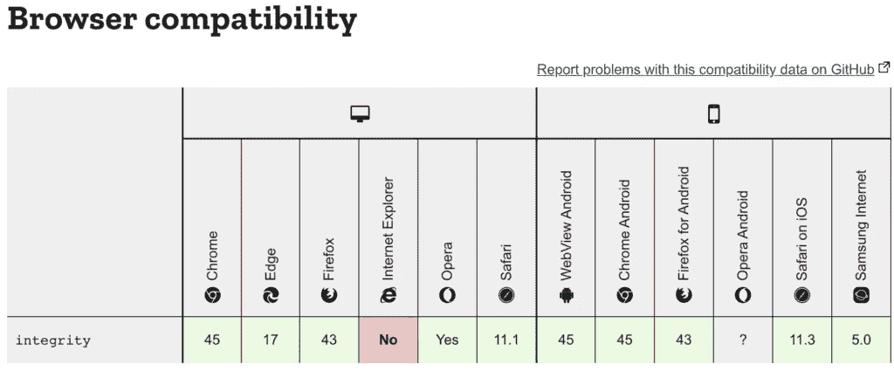

# 使用子资源完整性保护 Web 应用程序

> 原文：<https://javascript.plainenglish.io/secure-web-applications-using-sub-resource-integrity-2fb4b214036b?source=collection_archive---------23----------------------->

## 使用子资源完整性保护 web 应用程序指南。


子资源完整性(SRI)是一种安全特性，可用于验证浏览器获取的资源是否被操纵。

但是你为什么需要它呢？还记得你一直在代码中随意放置的脚本标签吗？如果有人访问了托管它的 CDN/第三方服务器并修改了所提供的 JavaScript，会怎么样？这将是一个严重的安全漏洞，会引发很多问题。

子资源完整性允许提供文件的散列，当浏览器获取文件时，该散列必须匹配。

# 如何使用子资源完整性

如前所述，需要在脚本标签中添加一个散列。然后，浏览器会比较下载的脚本文件是否具有相同的哈希。

```
<script src="https://example.com/example-framework.js" integrity="sha384-oqVuAfXRKap7fdgcCY5uykM6+R9GqQ8K/uxy9rx7HNQlGYl1kPzQho1wx4JwY8wC" crossorigin="anonymous"></script>
```

Integrity 是一种 base64 编码的加密哈希，可以生成(下面将详细介绍)。知道需要在供应商服务器上启用跨源也很重要。

如果脚本或样式表与关联的完整性值不匹配，浏览器将不会执行文件/呈现样式表。浏览器会抛出网络错误。

这避免了篡改文件和中间人攻击。但是开发人员有责任确保该文件没有其他漏洞。

# 生成 SRI

使用 OpenSSL 可以生成子资源完整性。文件的内容需要作为输入传递给 OpenSSL 命令，并且需要使用 sha384 创建一个摘要。然后，需要将摘要传递给另一个 OpenSSL 命令，对其进行 base64 编码。要在一个命令中完成:

```
cat example-framework.js | openssl dgst -sha384 -binary | openssl base64 -A
```

或者也有[在线工具](https://www.srihash.org/)可以做到这一点。

# SRI 和 Webpack

和所有的 Webpack 一样，有一个插件可以自动生成子资源完整性标签。因为我们避免在使用 Webpack 时手动添加标签，所以这个插件在处理散列生成过程时变得很有用。

安装插件:

```
npm install webpack-subresource-integrity — save-dev
or
yarn add --dev webpack-subresource-integrity
```

在 webpack.config.js 文件中，添加:

```
import SRIPlugin from 'webpack-subresource-integrity';
const compiler = webpack({
  output: { 
    crossOriginLoading: 'anonymous'
  },
  plugins: [
    new SRIPlugin({
      hashFuncNames: ['sha256', 'sha384'],
      enabled: process.env.NODE_ENV === 'production',
    }),
  ],
});
```

# 浏览器支持

所有主流浏览器(不，IE 不在那个列表中)都支持 SRI。但它不会破坏 IE，因此它是避免安全风险的必备工具。



这就是你需要知道的关于子资源完整性和如何使用它的全部内容！

*原载于 2021 年 7 月 8 日*[*【https://www.wisdomgeek.com】*](https://www.wisdomgeek.com/development/web-development/using-sub-resource-integrity-to-secure-web-applications/)*。*

*更多内容看* [*说白了. io*](http://plainenglish.io/) *。报名参加我们的* [*免费每周简讯*](http://newsletter.plainenglish.io/) *。在我们的* [*社区*](https://discord.gg/GtDtUAvyhW) *获得独家写作机会和建议。*