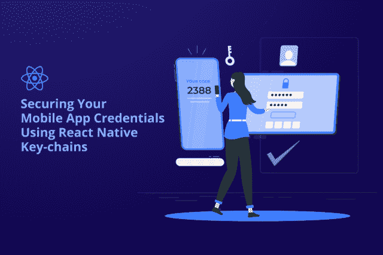
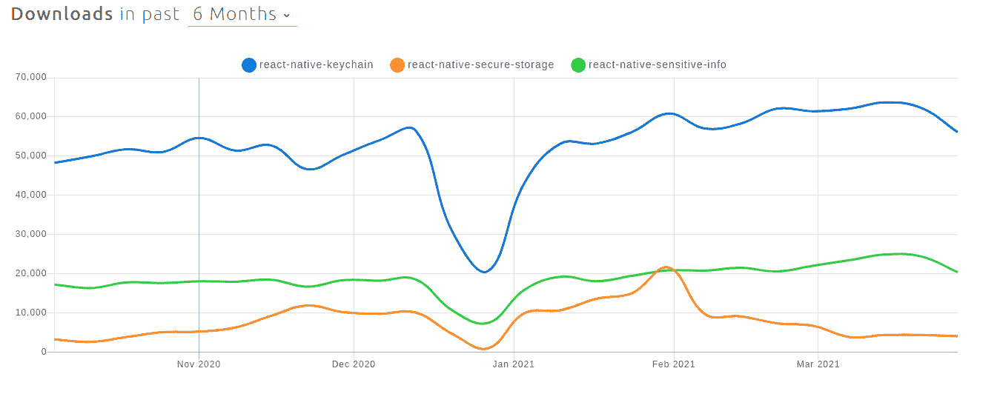
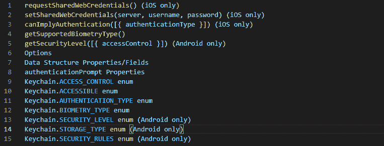
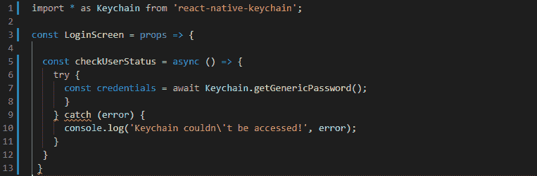
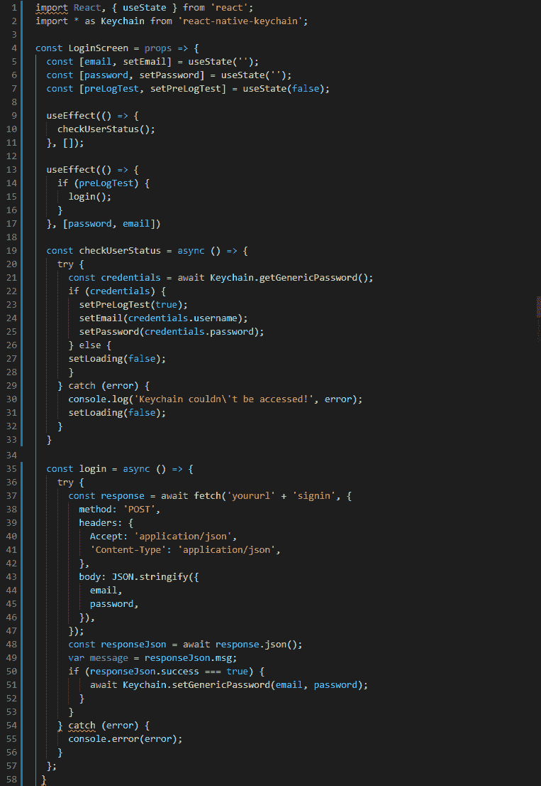
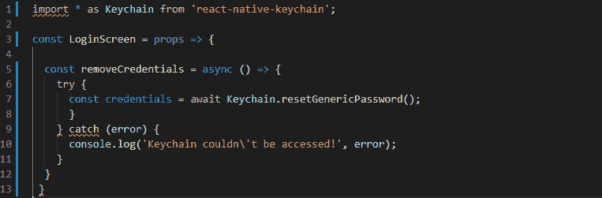

# 如何使用 React 原生钥匙串保护敏感的移动应用程序数据

> 原文：<https://javascript.plainenglish.io/securing-sensitive-mobile-app-data-by-using-react-native-keychain-dc0e23f7e331?source=collection_archive---------4----------------------->



随着 React Native 作为各种移动应用程序开发解决方案的跨平台应用程序开发框架的发展，企业的核心焦点是为两个独立的应用程序使用一个代码库，从而确保更快的开发和充分利用 JavaScript。

但是，你有没有想过在 React Native 中存储你的应用凭证有多安全？

因此，在这里，我们通过解释 React Native Keychain 如何帮助您保持应用程序凭证的安全，以及在计划使用 React Native 开发应用程序时需要解决的一些风险和威胁，来揭示 React Native 应用程序的安全性。

**以下是博客亮点一览:**

*   你应该信任 React 原生平台进行应用程序开发吗？
*   React Native Keychain:单点成功
*   如何在移动应用中使用钥匙链？
*   了解与 React 原生钥匙串相关的风险和好处。
*   结论:做好反应的准备！

为了更好地理解，让我们详细探讨每一点:

# **1。你应该信任 React 原生平台进行应用程序开发吗？**

在这个竞争激烈的市场中，已经有 550 万个应用程序充斥在 app store 中，创建移动应用程序不仅仅是选择最佳应用程序开发框架或为其添加令人惊叹的导航和功能特性的想法。

应用程序开发的核心问题围绕着应用程序数据的安全性。当数据非常敏感时，任何安全漏洞都可能导致不可挽回的损失。

*“根据调查，591 万人正在使用各种应用程序，并将 90%的移动时间花费在应用程序上。尽管是主要的创收资产，但许多组织经常忽视基本的安全措施。在疫情期间，90%的员工被迫远程在家工作，据观察，近*[*1100 万个文件对任何人*](https://info.varonis.com/hubfs/docs/research_reports/2021-Financial-Data-Risk-Report.pdf?utm_content=146358482&utm_medium=social&utm_source=twitter&hss_channel=tw-21672993) *开放访问。在这 1100 万份文件中，有 1000 多份是与财务相关的敏感文件。”*

## **融资走吧！**

当他们决定从头开始用 React Native 构建一个金融应用程序，包括一个支持它的 GraphQL 服务器时，问题实际上就暴露出来了。尽管这款应用拥有令人愉悦的 UX，但最大的挑战是确保应用及其条件的安全。

由此产生了一个问题，雇佣一个顶尖的 [**移动应用程序开发公司**](https://www.xicom.ae/services/mobile-app-development/) 对于应用程序开发来说是否真的是一个值得信赖的举措。

> **让我们明白！**

说实话，React Native 是脸书创建的一个开源应用开发框架。在为 iOS 和 Android 开发应用程序时，开发人员信任 iOS 和 Android 系统、它们的库和它们的硬件所提供的功能。使用 React Native 开发应用程序意味着开发人员也应该信任它的库和 API。

> 您知道吗，默认情况下，React Native 中的本地存储机制是不加密的。

**在 iOS** 上，React Native 的主存储库基于苹果文件系统，使用 [Filemanager](https://developer.apple.com/documentation/foundation/filemanager) 在设备上读取和存储未加密的文件。

**在 Android** 上， **AsyncStorage** 根据可用性使用键值存储 [RocksDB](https://rocksdb.org/) 或 [SQLite](https://developer.android.com/training/data-storage/sqlite) 。但是，那里的数据仍未加密。

那么，在 React 原生应用程序中保护敏感数据的潜在方法是什么呢？让我们来回答这个问题吧！

# **2。React Native Keychain:单点成功**

当我们谈论应用程序的安全性时，它也与用户身份验证直接相关。处理这些安全问题有多种策略，但最常用的方法有:

*   使用支持 OpenID 连接代码授权流的身份提供者。这有助于您的移动应用程序接收刷新令牌，以检索新的访问令牌来调用 API。
*   认证后使用钥匙串将敏感数据直接存储在应用程序中，以进行重新认证。

因此，在使用 React 原生应用程序时，您需要记住的第一件事是不要在您的应用程序代码库中存储敏感数据或任何密钥。因为代码库中包含的任何内容都可以通过检查 app bundle 以纯文本方式访问。这就是 Keychain 和 Keystore 存储安全数据的作用。两者都被抽象出来，并被强大的库 [React Native Keychain](https://github.com/oblador/react-native-keychain) 很好地封装起来。— **声明(一)**

先把这个说法(我)放一放，来说下一点！

React 原生平台是保护您的应用数据的唯一选择吗？这个问题的简单答案是否定的。

> 任何事情都有另一种选择。但是无论是 iOS 还是 Android，我们都推荐你使用:

*   iOS 钥匙串服务
*   Android 安全共享偏好设置

让我们深入了解这些！

***iOS 钥匙串服务:*** SecureStore 使用钥匙串来存储 iOS 中的数据。Keychain 是加密的系统储存装置，可在应用程序重新安装后保留更长时间。使用 keychain 最好的一点是，从 iPhone 5s 开始，它支持硬件支持的加密和 Secure Enclave。换句话说，你也可以理解为，运行两个最新 iOS 版本(iOS 13 和 14)的设备，支持硬件支持的加密机制。否则，当使用密码或只按下主屏幕按钮来解锁设备时，钥匙串会被解密。

***Android 安全共享首选项:*** 当涉及到在 Android 设备上保护应用程序的凭据时，事情就不一样了。SecureStore 将数据存储在 SharedPreferences 中，提供了一种使用 Android 密钥库加密数据的方法。因为 Android 设备有多个版本，你的应用可能运行在不支持硬件支持的密钥库的设备上。以这种方式存储的值会按需解密，因为 SharedPreferences 存储在应用程序重新安装过程中不是恒定的。

**简而言之**:要使用这两个服务，你可以自己写一个桥，或者更快，你可以使用库—***react-native-keychain***，****react-native-secure-storage***和***react-native-sensitive-info****是保护应用数据的最佳选择。**

****

**[Image Source](https://www.npmtrends.com/react-native-keychain-vs-react-native-secure-storage-vs-react-native-sensitive-info)**

**回到陈述(I ),该图的引用显示了过去 6 个月中三个包的下载的统计分析。我们可以看到，Keychain 是下载量最大的库，因为它包含了任何开发人员正在寻找的一切。**

# ****3。React Native Keychain:如何在移动应用中使用？****

**在你不知道如何在移动应用程序中实现之前，只知道最佳出路不会帮助你保护移动应用程序中的敏感数据。**

**所以让我们从 react-native 项目中 react-native-keychain 的安装过程开始学习。**

## ****第一步:安装软件包****

**安装 react-native-keychain 就像安装任何 NPM 软件包一样简单。但是你可以要求 [**手机 app 开发公司**](https://www.xicom.ae/services/mobile-app-development/) 同时使用 npm 或者 yarn 来安装包。**

```
**npm i react-native-keychainyarn add react-native-keychain**
```

**如果您使用的是 React-Native 0.59 或更低版本，建议您运行下面的命令将您的库与 React Native 链接起来。**

```
**react-native link react-native-keychain**
```

**但是，请记住，iOS 和 Android 设备之间的情况总是不同的。所以如果你已经 [**聘请了一个开发 iOS 的手机 app 开发者**](https://www.xicom.ae/services/mobile-app-developers/) ，那么在 iOS/目录下运行 pos install 安装 iOS 依赖项。最后，重新创建应用程序。**

**然后，通过使用库的默认 API，您现在可以进一步访问 iOS keychain 和 Android Secure SharedPreferences。**

> ****专业提示:**当你使用 react-native-keychain 时，需要注意的是，只有特定的方法才兼容 iOS 和 Android。但是，这里有一些你可以在 Android 和 iOS 中使用的具体方法:**

****

**此外，如果您有任何与身份验证相关的高级需求，也可以使用一些特定于平台的功能。**

## ****步骤 2:在实践中使用库****

**关于如何存储、检索和使用凭据以重新登录应用程序，在实践中使用该库。**

**让我们从保存凭据开始。**

*   ****保存凭证****

**在 Keychain 中，大多数开发人员更喜欢使用***setGenericPassword***在 Keychain 中存储用户凭证(用户名和密码)。另外，建议使用***JSON . stringify***，这样可以使用***setGenericPassword***函数来存储字符串。**

****

*   ****检索凭证****

**即使是检索凭证，也可以使用同一个函数***getGenericPassword***从 Keychain 中获取保存的用户凭证。默认情况下，这个函数返回字符串。检索对象只需要使用 ***JSON.parse*** 。**

**以下是阿联酋 的 [**移动应用程序开发公司在从应用程序中检索凭证时喜欢使用的命令。**](https://www.xicom.ae/services/mobile-app-development/)**

****

*   ****在现实应用中使用****

**在下面的代码片段中，首先在组件挂载时，在 ***useEffect*** 钩子中调用“***check user status()***”函数，并通过密钥库检索用户凭证来设置用户凭证。接着就谈到了“***【log in()】***”，这个函数将用来登录用户使用获得的凭证。**

****

*   ****删除凭证****

**无论你是自己做这个任务还是 [**雇佣应用开发者**](https://www.xicom.ae/solutions/hire-developers/) 做这个任务，通过使用 ***resetGenricPassword、*** 的功能，你可以在用户从应用注销的场景下移除所有的钥匙串凭证。**

****

**在应用程序中使用 react-native-keychain 库的所有这 4 个步骤都以非常简单和有序的方式进行了解释和起草，以便所有级别的程序员都可以轻松地理解它，而不会出现任何错误。现在的问题是，这个手术的好处和风险是什么。**

# ****了解 React 原生钥匙串的相关风险和优势****

**虽然一切都有它的缺陷和好处，但在谈论应用程序数据的安全性时，你必须格外注意你正在使用的库。**

*   ****在 Android 开发中使用 React 原生钥匙串的主要风险****

**所以如果你在 Android 开发中使用这个库，请记住 SharedPreferences 并不是 100%安全的。它对于存储数据是足够安全的，但是不建议用于存储键值对。**

**SharePreferences 存储在一个文件中，如果开发者找到手机并设法安装其文件系统，那么任何人都可以很容易地读取偏好。在这种情况下，留给他们的唯一解决方案是使用隐藏来密封首选项。此功能处理存储在根设备上的内容的加密和解密。但是尽管采取了所有这些措施，数据并不是 100%安全的，因为密钥就在本地。**

**其次，***SharedPrefsBackedKeyChain***用于数据加密，这种方法是在 SharedPreferences 中存储 256 位加密密钥。**

**因此，问题是加密密钥和加密数据存储在同一个地方，这使得加密在这里完全没有意义。尽管如此，你可以选择雇佣一个应用程序开发者来找到这个问题的完美解决方案。**

**但好消息是，在较新的设备上，所有的加密密钥都存储在硬件层面，而不是应用程序本身的内部，这最终增加了保护。**

*   ****在 iOS 和 Android 中使用 React 原生钥匙串的好处****

**使用 Keychain 的最大优势是，通过一个库，你可以访问 React 本地应用程序中的 iOS Keychain 和 Android Keystore。**

*****除此之外，还有许多其他原因使这个库在保护 iOS 和 Android 应用程序中的敏感数据方面受到欢迎:*****

*   **若要访问钥匙串，设备必须解锁。**
*   **将钥匙串恢复到另一个设备受到限制。**
*   **在较新的设备中，加密密钥已经存储在硬件层。**

# ****结论:准备好反应！****

**毫无疑问，React 原生应用开发解决方案已经成为初创公司和领先企业家的重中之重。但同时，你也不能忽视数据安全。**

**根据我在 React 原生应用程序开发方面的经验，使用 Keychain 这样的强大库是安全存储应用程序凭据的最佳选择。**

**如果你心中有任何疑问， [**雇佣一家移动应用开发公司**](https://www.xicom.ae/services/mobile-app-development/) 通常会确保你的 React 原生应用得到很好的保护。但是，将此安全钥匙串添加到您的应用程序会增加开发成本和时间。**

**但是，要使你的应用程序高度安全和受保护，你需要遵循应用程序开发生命周期的最佳实践。定义可能的风险，规划您的安全控制，并为补救策略做好准备。因此，在您花费时间构建安全性较差的应用程序之前，有必要浏览一下这篇博客，了解一下 Keychain 如何帮助您在 React 本机应用程序中安全地存储凭证。**

***更多内容请看*[*plain English . io*](http://plainenglish.io/)**