# 将您的批量数据植入 Node.js 中的 MongoDB

> 原文：<https://javascript.plainenglish.io/seed-your-bulk-data-to-mongodb-in-node-js-57e9046e923d?source=collection_archive---------2----------------------->

作为一名开发人员，我总是专注于让事情变得更简单的事情。以前我从事一个需要大量数据输入的项目。每次我都需要一个一个地输入数据。除了手动输入数据，没有什么让人头疼的了。我们可以用 Node.js seeder 轻松解决这个问题。

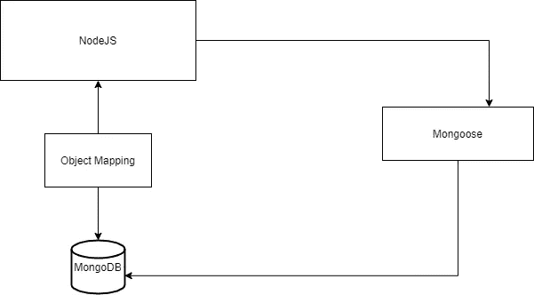

上图会让你大致了解发生了什么。在本文中，我将通过一个简单的场景向您展示如何将 json 文件(您的数据)直接植入数据库。

首先，您需要创建一个名为 seeder.js 的文件，我们将在这里编写一个函数，将数据从 json 文件导入数据库。然后导入以下内容。

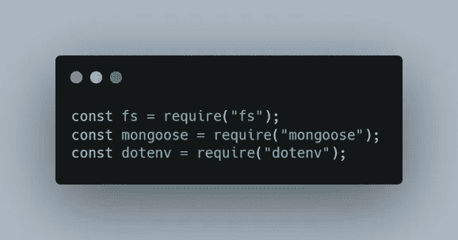

Imports

我已经导入了 Node 附带的`fs`模块。所以我们不需要单独安装。然后我们需要安装`mongoose`和`dotenv`包并导入到我们的 **seeder.js** 文件中。

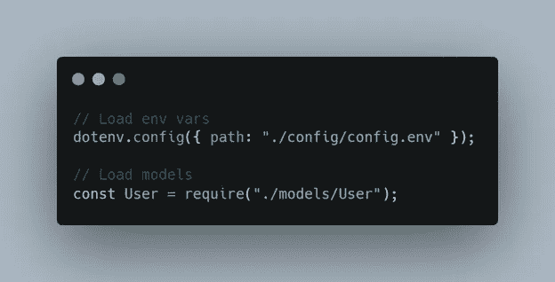

Load env and model

我已经导入了我在 config.env 中创建的 mongo uri，并加载了包含用户模式的用户模型。在我们继续之前，我将向您展示我的用户模型的样本。

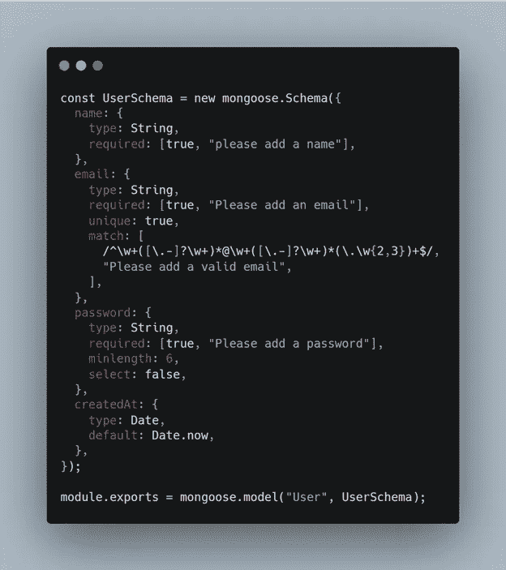

User Schema

从上面的模式中，你可以了解我们导出到数据库的数据是什么。我将把我的 json 文件放到我们的数据所在的地方。

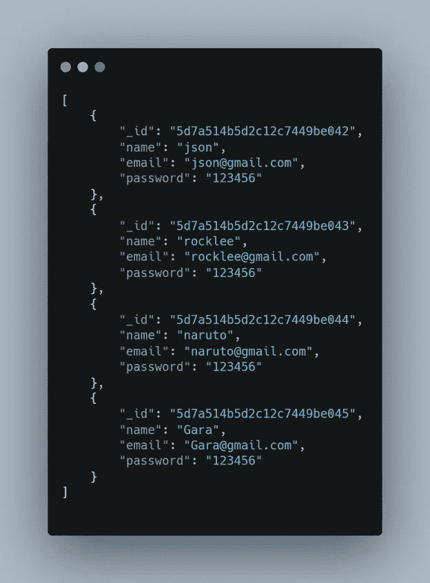

users.json

这是我们的 json 数据，我们将在 seeder 函数的帮助下批量上传。现在我们需要将文件连接到数据库。

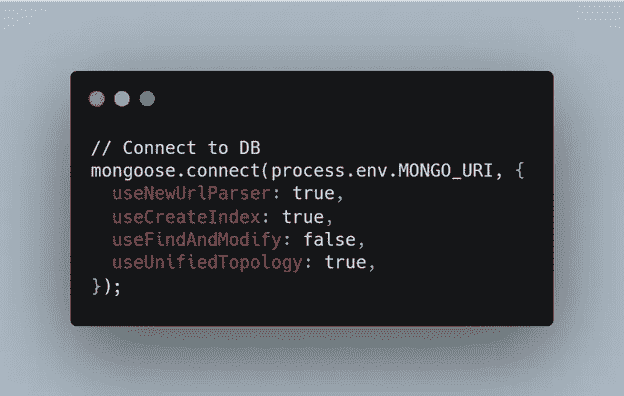

Connect to database

成功建立连接后，现在我们需要读取数据所在的 json 文件。

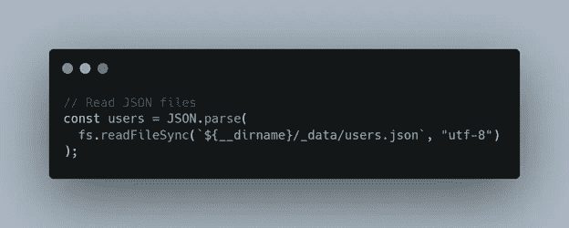

Read JSON file

我们需要在`JSON.parse`的帮助下解析数据，通过`fs.readFileSync`我们可以定位我们的数据文件。`${__dirname}`表示当前文件目录，我们的数据驻留在 folder _data 中，文件名是 users.json，然后我们将它赋给 users 变量。

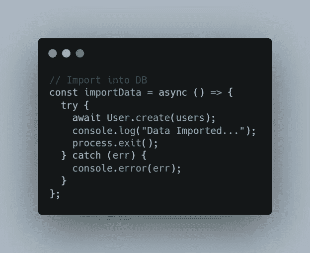

import function

使用`importData`异步函数，我们将数据导入数据库。这里的`User`是模型，我们使用 mongoose 中可用的 create 方法创建记录，并传递通过`fs`模块读取的用户。我们也可以为删除做类似的事情。

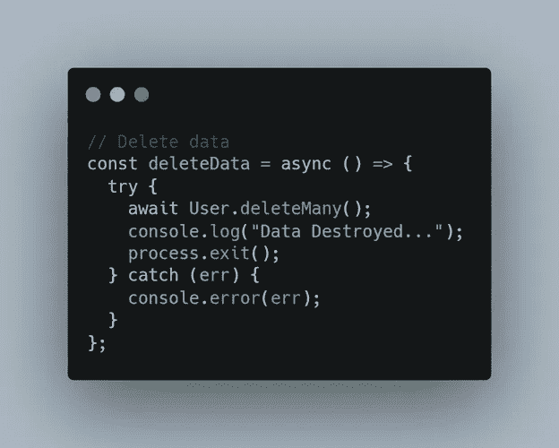

Delete Function

`deleteMany`是删除该模型中所有数据的功能。

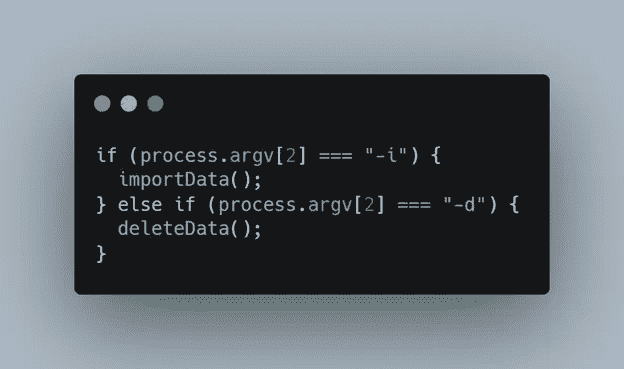

setting up args

当我们运行文件节点种子时，我们需要指定决定是导入数据还是删除数据的参数。

现在，Seeder 已经准备好导入和删除文件。在终端中键入以下代码，将数据导入数据库。

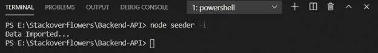

import data

您可以检查数据库中的数据是否正确导入。

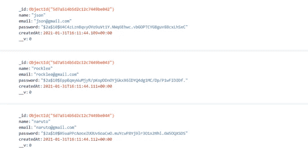

Database

如您所见，json 文件中的所有数据都已成功导入到我们的数据库中。

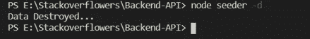

Delete Data

现在，使用上面的命令，您可以从数据库中完全删除数据。

seeder.js

## 结论

看看我们如何轻松地处理从数据库中导入和删除批量数据。希望你喜欢这篇文章。谢谢！