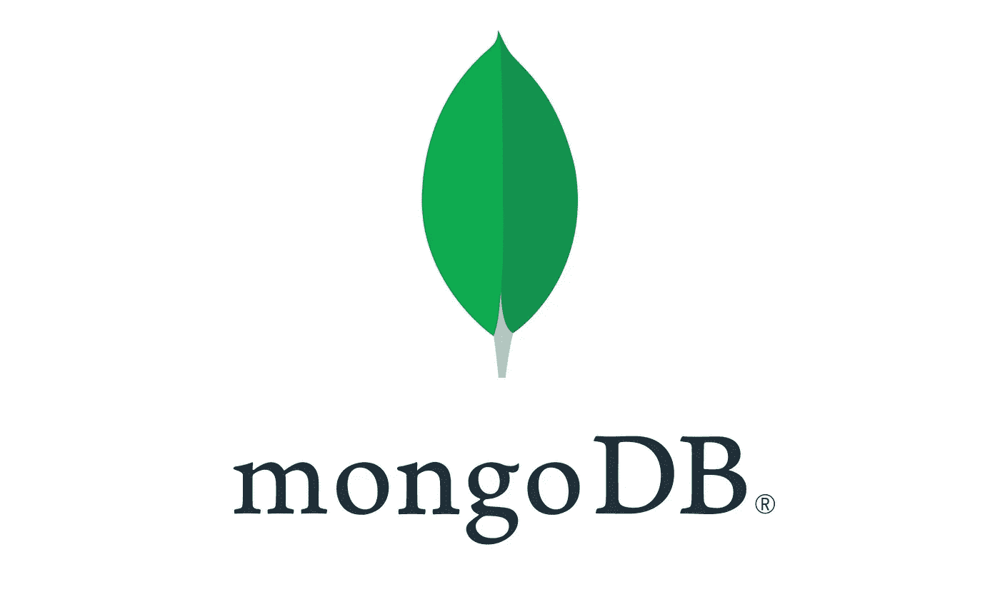
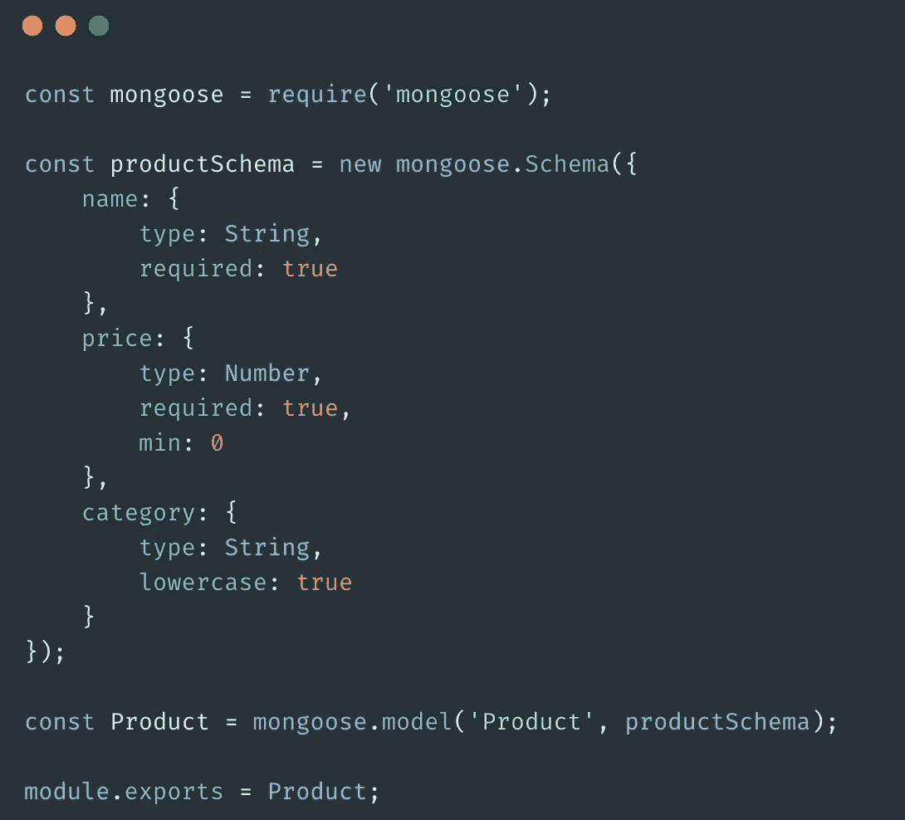
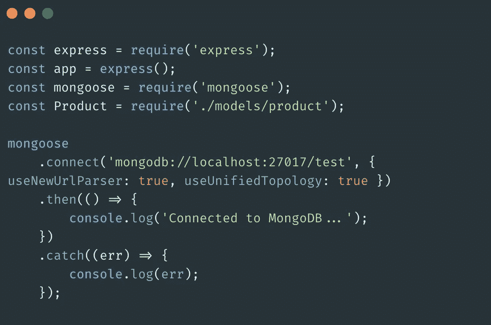
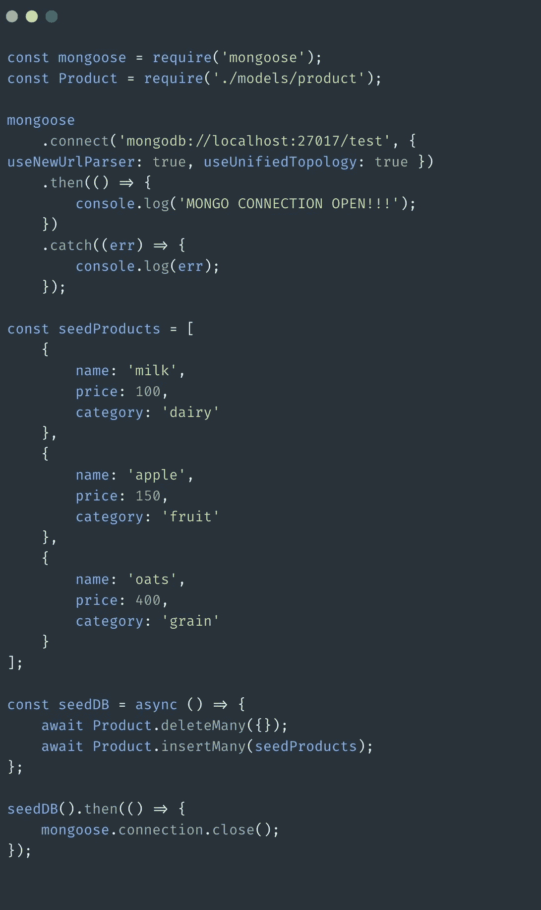

# 如何从节点播种 MongoDB 数据库:最简单的方法

> 原文：<https://javascript.plainenglish.io/seeding-mongodb-database-from-node-the-simplest-way-3d6a0c1c4668?source=collection_archive---------0----------------------->

假设你正在用 express 和 mongoose 构建一个 CRUD 应用，你需要测试你实现的 CRUD 功能。你需要数据库里的数据。播种您的 MongoDB 数据库可以帮助您在 Mongo 集合中获得一些数据，从而使您能够不受限制地测试您的查询。最简单的播种方式更像是将一些虚拟数据*最初*插入到数据库中，以便您可以对其进行处理。

最好的做法是创建一个*单独的、* *独立的*文件，远离你的其他 app 相关文件*就为了这个目的*。然后，您可以在任何想要将一些数据注入数据库的时候运行种子文件。

Mongoose 基本上是 Node js 和 Mongo DB 之间的通信器。Mongoose 可以帮助您通过 Node 创建到数据库的连接。一旦你创建了你的模型，定义了你想要的 Mongo 集合应该是什么样子，那么你应该从一个单独的文件中播种集合*而不是*。您可以从模型本身做到这一点，但是正如我提到的，将代码放在一个单独的文件中是一个很好的做法。

这是我对‘产品’的简单模型( *product.js* )。与 MongoDB 的连接建立在' *app.js'* 文件中，这样我就不必在每个模型文件中重复连接代码。

models/product.js

下面是我的' *app.js'* 文件中建立连接的部分。

app.js

现在，是时候创建' *seeds.js'* 文件了。如果你想要*或*你可以输入数据，你可以使用 [*faker.js*](https://github.com/marak/Faker.js/) 方便地生成一些假数据。创建' *seeds.js'* 文件，从要求 mongoose 开始。在我们创建的模型中，我们没有建立数据库连接。但是在我们的' *seeds.js'* 文件中，我们应该继续创建连接，因为该文件应该*袖手旁观它自己的脚*而不依赖于任何其他文件，以便它可以独立地用于播种数据库。

seeds.js

现在，您可以从您的终端运行'*node**seeds . js '*命令来运行该文件，它将删除 DB 中的所有现有记录(如果有)，并用您提供的记录来替换它们。如果不想删除已有记录，只需去掉 *Product.deteleMany({})即可。*

这是一个关于如何播种 MongoDB 的简短演示。希望你喜欢。下次见！

## 进一步阅读

 [## Next.js 应用程序应该使用什么数据库？

### 如果你在 2022 年要开发一个全栈应用，选择流行的 Next.js 会让你有 95%的机会…

简明英语. io](https://plainenglish.io/blog/which-database-should-you-use-for-your-next-js-app)  [## 如何将 API 组合和集成在一起，就像您正在使用 API 的 NPM 一样

### 将两个 API 整合到一个应用程序中，该应用程序显示了历史上最大的音乐会，按国家首都排列。与……

简明英语. io](https://plainenglish.io/blog/how-to-compose-and-integrate-apis-together-as-if-you-were-using-npm-for-apis) 

*更多内容请看*[***plain English . io***](https://plainenglish.io/)*。报名参加我们的* [***免费周报***](http://newsletter.plainenglish.io/) *。关注我们关于*[***Twitter***](https://twitter.com/inPlainEngHQ)[***LinkedIn***](https://www.linkedin.com/company/inplainenglish/)*[***YouTube***](https://www.youtube.com/channel/UCtipWUghju290NWcn8jhyAw)*[***不和***](https://discord.gg/GtDtUAvyhW) *。对增长黑客感兴趣？检查* [***电路***](https://circuit.ooo/) *。***