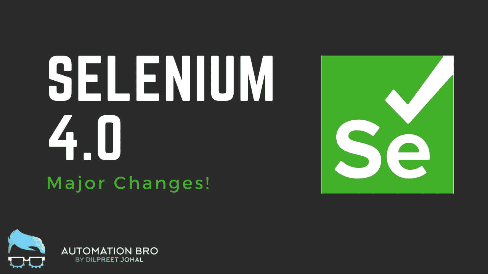
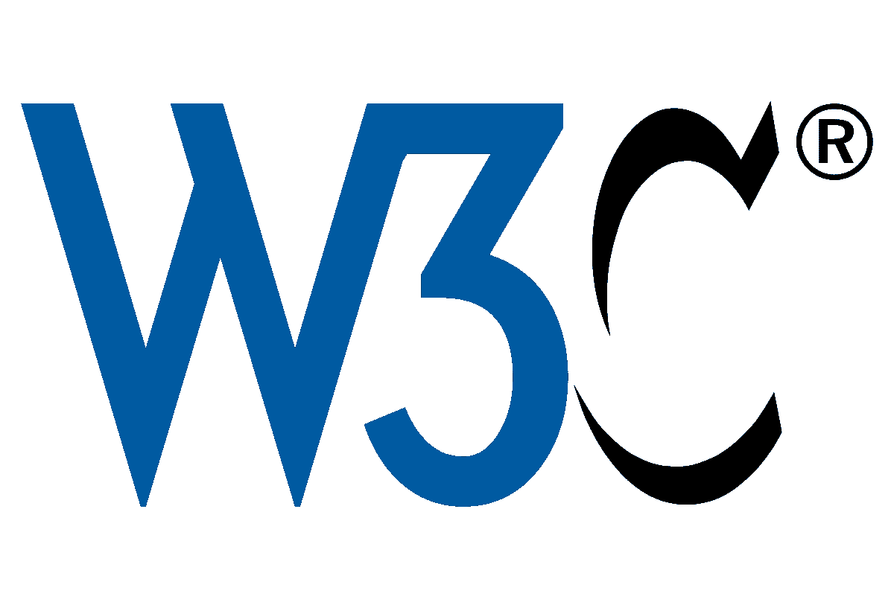
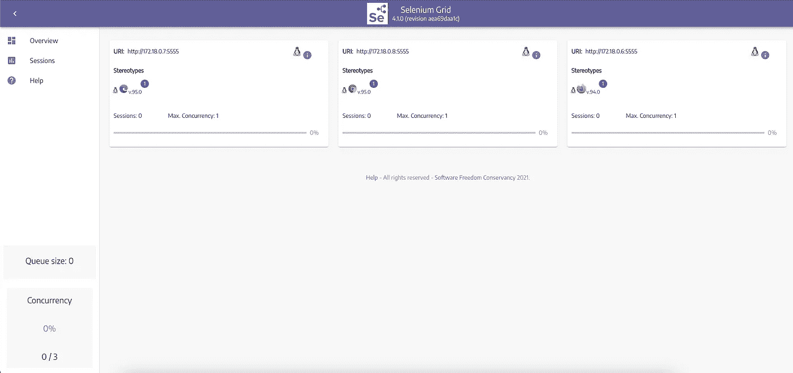
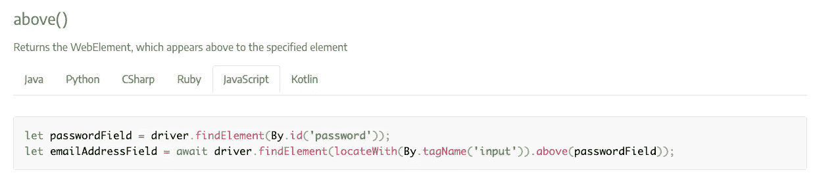
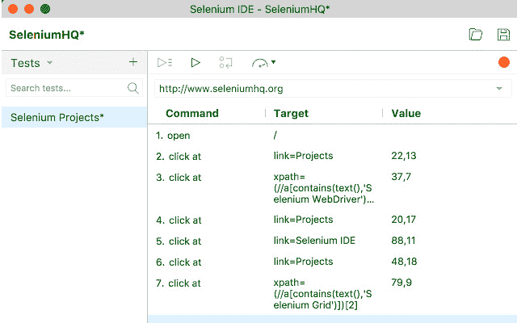

# Selenium 4.0:主要变化

> 原文：<https://javascript.plainenglish.io/selenium-4-0-major-changes-c2d0112756a2?source=collection_archive---------11----------------------->

Selenium 4.0 Major Changes

嘿，大家好。在本文中，我将介绍 Selenium 4.0 的一些主要变化。我们开始吧！

# 切换到 W3C 协议

W3C protocol

Selenium 项目迁移到了一个全新的协议——W3C 协议，他们将不再使用 JSON wire 协议。

## 为什么会这样？

因为最近所有的浏览器(例如 Chrome、Firefox、Safari 等。)，包括 Internet Explorer，都被认为是符合 W3C 的。这样做的原因是，所有的浏览器都以相似的方式开发，没有兼容性问题。现在，这种迁移将确保测试在所有这些浏览器上一致地运行。

## 稳定性

由于 Selenium WebDriver 和浏览器使用相同的协议，web 自动化中的缺陷可以大大减少，从而提高测试的稳定性。

## 动作 API 支持

与 JSON Wire 协议相比，W3C 协议也有更丰富的动作 API 支持。它让你表演—

*   多点触摸动作
*   放大，缩小
*   同时按下两个键
*   还有更多…

# 硒网格 4.0

Selenium Grid 4.0 Architecture

Selenium Grid 4.0 也发生了很多变化。

## 码头支持

有了 Grid 4.0，您现在可以轻松快速地启动 docker 容器，在不同的浏览器中运行测试，而不是设置虚拟机。所有的步骤都在 [GitHub 库](https://github.com/SeleniumHQ/docker-selenium)中有很好的记录。

## Kubernetes 支持

Grid 4.0 也经过了重新设计，可以在 Kubernetes 上部署网格，以获得更好的伸缩能力。你可以在这里看一个[的例子](https://github.com/kubernetes/examples/tree/master/staging/selenium)，用 Kubernetes 设置 Grid 4.0。

## 改进的用户界面

Grid 4.0 Improved UI

Selenium Grid 4.0 现在也有一个漂亮的 UI，可以让你很容易地看到所有正在运行的容器、会话数和最大并发数。它还插入了一个 VNC 播放器来观看容器内运行的测试视频！🤯

## IPV6 和 HTTPS 协议

Selenium grid 现在还支持 IPv6 地址和 IPv4 地址，您现在也可以使用 Grid 4 与 HTTPS 协议进行通信。

# 新定位器策略

Selenium 4.0 推出了一个新的[相对定位器策略](https://www.selenium.dev/documentation/webdriver/locating_elements/#relative-locators)，它更加友好，因为它基于 DOM 的可视化表示。可用的定位器有—

*   下方-位于指定元素下方的 web 元素
*   toLeftOf —位于指定元素左侧的 web 元素
*   to right of-位于指定元素右侧的 web 元素
*   上方-位于指定元素上方的 web 元素
*   near-位于附近(大约。50 像素)指定的元素

这里有一个例子—

Relative ‘above’ locator strategy

# **CDP 集成&BiDi API**

有了 Selenium 4，您还可以访问 Chrome 调试协议，该协议有一组 API，可以让您做以下事情

*   查看控制台日志
*   拦截网络请求
*   执行基本身份验证
*   抑制网络性能

但是因为这是 CDP，所以它只能在基于 Chromium 的浏览器上工作。

然而，Selenium 团队正在努力让 [Webdriver 双向协议](https://www.selenium.dev/documentation/webdriver/bidi_apis/)在所有浏览器上实现，这样你就不会受限于某个特定的浏览器或版本。

# 硒 IDE

Selenium IDE

*   除了 Selenium 4 的变化，我们还有一个全新的 Selenium IDE，它具有改进的 UI 和更好的用户体验。
*   它还带有自己的命令行运行程序，可以在任何浏览器中运行测试，无论是并行的还是网格的。
*   IDE 也有控制流结构，在 IDE 中有 if、while 和 times 等命令
*   Selenium IDE 还为与之交互的每个元素记录多个定位器。如果一个定位器在播放过程中失败，将尝试其他定位器，直到一个定位器成功。
*   您还可以为所有官方语言绑定(如 Java、.Net，Python，Ruby & JavaScript。
*   IDE 也可以通过使用[插件](https://www.selenium.dev/selenium-ide/docs/en/plugins/plugins-getting-started)来扩展

**如果你想看上面列出的一些功能的演示，你可以看看下面的视频—**

至此，Selenium 4 的所有主要新功能都已包含在内。希望你喜欢这篇文章！

*更多内容请看*[***plain English . io***](http://plainenglish.io/)