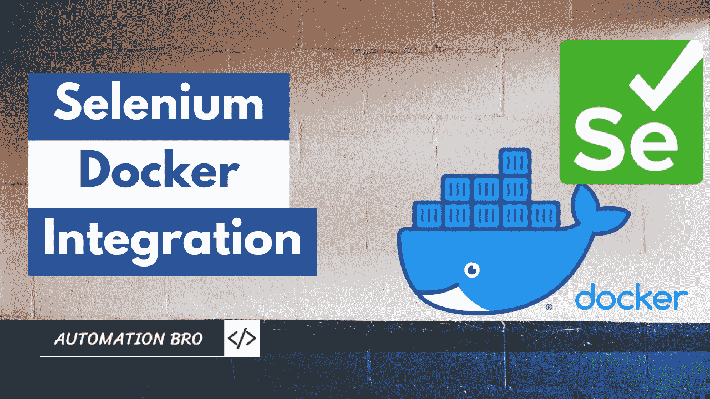
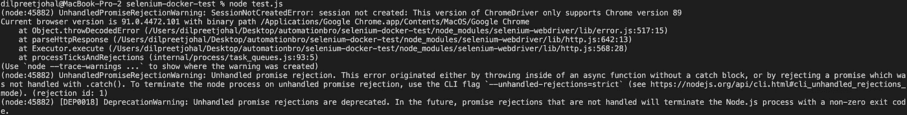
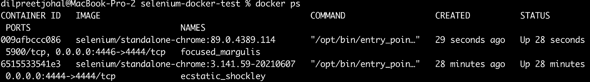
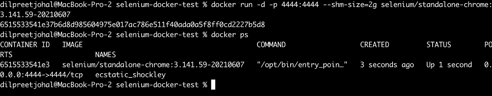
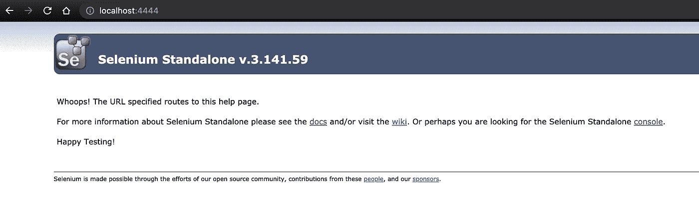
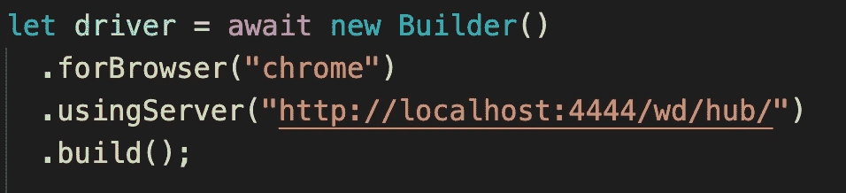
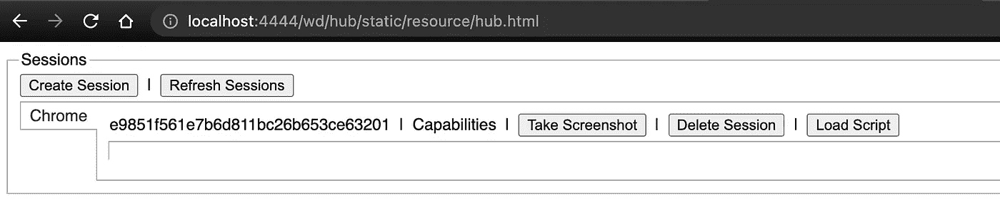
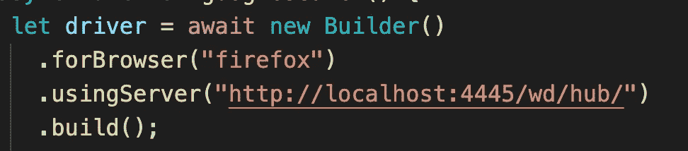

# 如何在 Docker 中运行硒测试

> 原文：<https://javascript.plainenglish.io/selenium-docker-tutorial-how-to-run-selenium-tests-in-do-8f86b999d318?source=collection_archive---------4----------------------->



[https://youtu.be/2PgvME7ltNI](https://youtu.be/2PgvME7ltNI)

在这篇文章中，我们将介绍如何在 Docker 中运行 Selenium 测试，并在 Chrome 和 Firefox 浏览器中执行它们。我们也会明白为什么要在 Docker 中运行 Selenium 测试？

# 先决条件

在我们开始之前，您需要了解一些先决条件-

*   **对 Docker** 的基本熟悉:你至少应该对 Docker 概念有一个高层次的理解
*   **Docker 已安装:【https://www.docker.com/products/docker-desktop】您还应该在您的本地机器上安装 Docker—[](https://www.docker.com/products/docker-desktop)**
*   **基本的 Selenium 脚本:**您还需要一个示例脚本，您可以执行它来运行您的测试。还可以使用我在 JavaScript—[https://github . com/automation bro/selenium-docker/tree/selenium-docker-basic](https://github.com/automationbro/selenium-docker/tree/selenium-docker-basic)中创建的示例脚本

# 为什么要在 Docker 中运行硒测试？

在我们在 Docker 中运行测试之前，理解 Docker 可以为我们解决的问题是很重要的。

## 会话创建问题

如果您一直在没有 Docker 的情况下运行您的测试，您可能以前就已经看到过这种错误— `session not created: This version of ChromeDriver only supports Chrome version 89`



当 ChromeDriver 的版本和本地浏览器的版本不匹配时，就会出现此错误。在我的情况下，我的浏览器版本是 v91，ChromeDriver 版本是 v89。现在，我有两个选择-

1.  如果我需要在最新版本中运行测试，那么我需要将 ChromeDriver 升级到 v91
2.  如果我需要在旧版本中运行测试，那么我需要将我的 Chrome 浏览器降级到 v89

每当出现版本不匹配时，这就成了一个很常见的问题。因此，要解决这个问题，我们可以使用特定 ChromeDriver 附带的 Docker 映像，以及安装的相互兼容的浏览器。不管您的本地机器上有什么版本，您仍然可以在 Docker 中执行您的测试。

## 多版本支持

Docker 的另一个优势是我们可以设置多个 Chrome 版本来执行我们的测试。例如，我可以让 Chrome v91 运行在端口 4444 上，让 Chrome v81 运行在端口 4446 上，并且可以在这两个端口上执行测试。



Docker 在选择不同的浏览器以及选择浏览器版本方面为您提供了更多的灵活性，而不必担心任何类型的基础设施设置。

# 在本地运行 Selenium 独立 Chrome Docker 映像

Selenium 团队为我们提供了一些图片，我们可以使用它们来运行我们的测试。我们将在本教程中使用的是[selenium/standalone-chrome](https://hub.docker.com/r/selenium/standalone-chrome)图像。在您的终端中执行以下命令来运行映像—

```
docker run -d -p 4444:4444 --shm-size=2g selenium/standalone-chrome:3.141.59-20210607
```

让我们仔细看看这个命令—

*   -d 标志用于在分离模式下运行 docker 容器
*   -p 标志用于传入端口，第一个端口 4444:是本地机器的端口，第二个端口:4444 是 docker 容器内部的端口
*   — shm-size=2g 是一个非常重要的标志，这样 docker 容器就可以共享主机的内存
*   selenium/standalone-chrome:3 . 141 . 59–2021 06 07 是我们正在使用的图像标签

一旦您执行这个命令，它将提取您提供的图像并启动容器。通过执行`docker ps`可以看到容器正在运行



现在，您应该看到 Selenium 独立运行在 [http://localhost:4444/](http://localhost:4444/) 上



# 在 Docker 上运行硒测试

既然我们已经弄清楚了 Docker 部分，是时候让我们的测试运行在端口 4444 上了。因此，这一部分将特定于您在 Selenium 脚本中使用的框架/语言。在我的例子中，我必须做下面的更新来将我的测试指向端口 4444。



让我们现在运行测试，我将通过执行`node test.js`来完成，然后前往[http://localhost:4444/wd/hub/static/resource/hub . html](http://localhost:4444/wd/hub/static/resource/hub.html)，您将看到一个正在 Docker 容器中运行的 Chrome 会话正在创建。



一旦你的测试执行完毕，chrome 会话将被自动删除。

# 在 Docker 容器中对 Firefox 运行 Selenium 测试

在 Firefox 上运行测试几乎和 Chrome 一样，你只需要运行一个新的镜像，你可以在本地指向一个不同的端口(可选)，这样它就不会和你现有的运行端口冲突。

```
docker run -d -p 4445:4444 --shm-size 2g selenium/standalone-firefox:3.141.59-20210607
```

**注意**:Docker 容器内的端口可以保持不变，因为它不与你的 Chrome Docker 镜像连接。

您还需要对代码进行修改，以将您的测试指向 Firefox 和新的端口。



# 结论

因此，我们使用 Selenium 独立 Docker 映像在 Docker 容器中执行测试，并在 Firefox 和 Chrome 上运行它们。我们还了解了为什么我们应该在 Docker 容器中运行我们的测试，以及我们从中获得的好处。

**查看下面的视频，了解更多关于如何在 Docker 中执行 Selenium 测试的信息–**

在下一篇教程中，我将向您展示如何使用 VNC 来查看 Docker 容器中运行的测试。

感谢阅读。

*更多内容看*[***plain English . io***](http://plainenglish.io/)