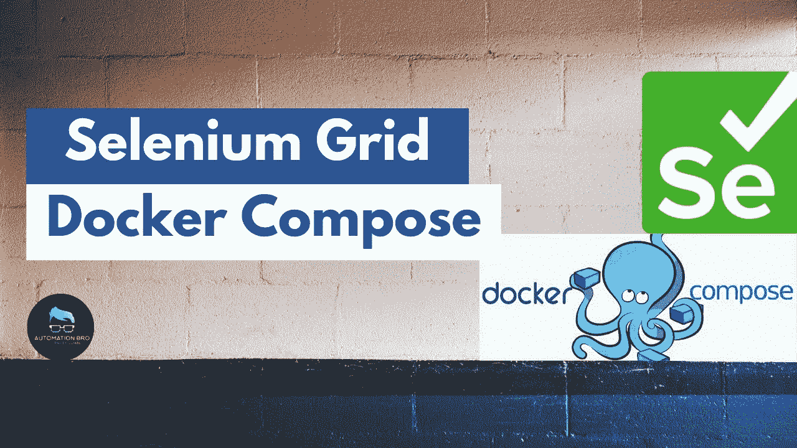
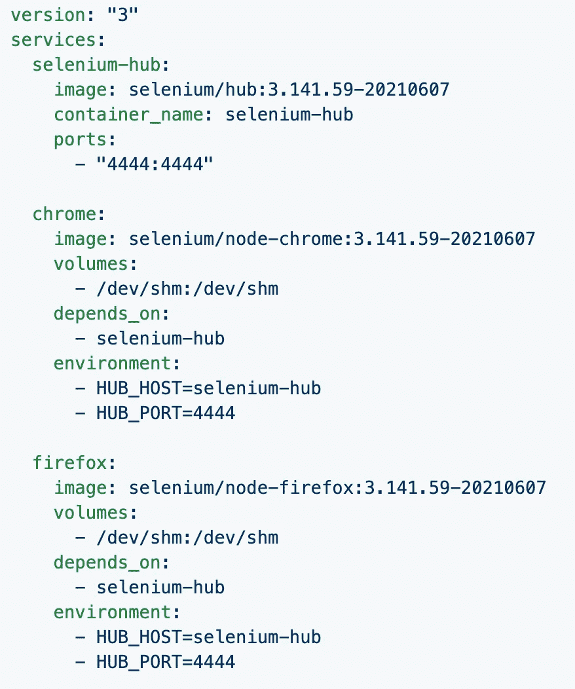
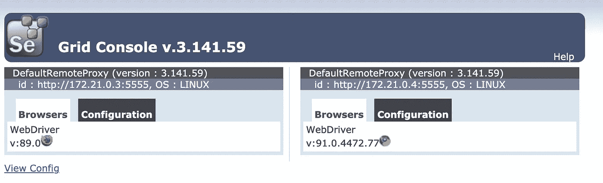
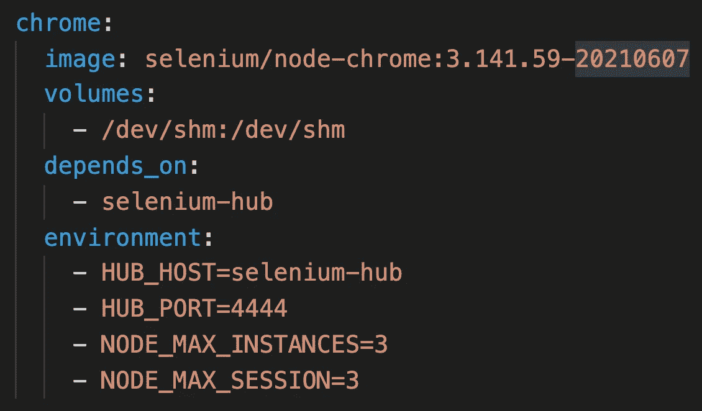
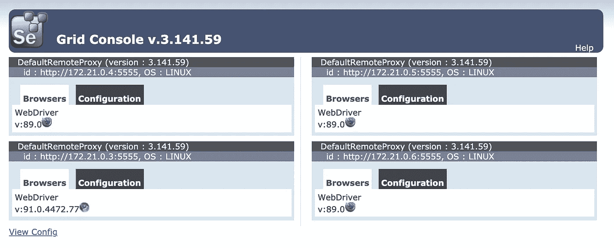

# 一种带有 Docker 组件硒栅

> 原文：<https://javascript.plainenglish.io/selenium-grid-with-docker-compose-b48b5ad8fee2?source=collection_archive---------3----------------------->

[https://youtu.be/BEaGIhmKypk](https://youtu.be/BEaGIhmKypk)

在本教程中，我们将介绍如何使用 Docker Compose 设置 Selenium 网格。我们将讨论为什么我们需要 Docker Compose，并研究如何实现 Docker Compose 文件。我们还将介绍如何用 Docker Compose 和 Selenium Grid 设置并行执行。

# 为什么使用 Docker Compose？

*   **不需要记住 Docker 命令:**使用 Docker compose，你不需要记住我们在[上一篇文章](/docker-selenium-grid-setup-7e66d60a926a)中提到的所有不同类型的 Docker 命令
*   **一起运行多个容器:** Docker compose 允许您将多个容器作为一个服务一起运行，而不是一个接一个地运行
*   **使用一个命令在多个浏览器上运行网格:**只使用一个命令`docker-compose up`就可以在集成了多个浏览器的情况下运行 Selenium Grid

Docker Compose 让任何人都很容易开始使用 Docker，即使他们不熟悉 Docker 的工作方式。

# 设置 Docker 合成文件

为了设置 Selenium Grid，我们将使用 [Selenium GitHub 仓库](https://github.com/SeleniumHQ/docker-selenium/tree/selenium-3#version-3)中提供的 Docker Compose 文件

Selenium Grid Docker Compose file

这个命令相当于我们在[上一篇](/docker-selenium-grid-setup-7e66d60a926a)中使用的 Docker network 命令。它将在端口 4444 上运行一个 Selenium Hub，并将设置 Chrome 和 Firefox 实例。

# 运行 Docker 合成文件

要运行 Docker 编写文件，只需在终端上运行以下命令— `docker-compose up`

Grid Console

这就对了，只需一个简单的命令，你就可以用 Chrome 和 Firefox 运行 Selenium Grid。这就是使用 Docker Compose 的神奇之处。

# 使用 Docker Compose 设置并行执行

使用 Docker Compose 为 Selenium Grid 设置并行执行有两种方式

*   **更新 Docker 编写文件:**添加`NODE_MAX_INSTANCES`和`NODE_MAX_SESSION`到 Docker 服务

NODE_MAX_INSTANCES & NODE_MAX_SESSION

*   **动态增加节点:**使用 Docker scale 命令，你也可以动态增加更多的节点— `docker-compose up --scale firefox=3`这将为 Firefox 增加 3 个节点

# 结论

Docker Compose 是一种在本地运行 Selenium Grid 的好方法。这将允许你团队中的任何人只需使用一个命令`docker-compose up`就可以旋转网格并在任何指定的浏览器上开始运行测试

**观看下面的视频，了解如何使用 Docker Compose 设置 Selenium Grid–**

感谢阅读。

*更多内容尽在*[***plain English . io***](http://plainenglish.io/)