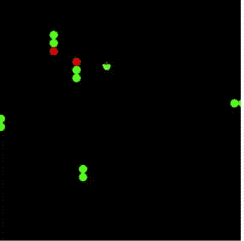

# 使用 TensorFlow 的自学游戏

> 原文：<https://javascript.plainenglish.io/self-learning-games-using-tensorflow-b675e718793a?source=collection_archive---------6----------------------->

用人工智能和 JavaScript 给你喜欢的复古游戏加个大脑。

Photo by [Rock'n Roll Monkey](https://unsplash.com/@rocknrollmonkey?utm_source=medium&utm_medium=referral) on [Unsplash](https://unsplash.com?utm_source=medium&utm_medium=referral)

我们生活在一个大多数事情都在走向自动化的世界，我最近发现，没有什么比看着人工智能帮助你在你最喜欢的游戏中打破记录更令人满意的了。

有了 TensorFlow.js，我们就拥有了 JavaScript 中同样强大的人工智能。TensorFlow 使您比以往任何时候都更容易执行机器学习的常规功能商标，并且支持低级和高级 API

在现实世界中，人工智能/机器学习有不同的应用，但我们今天将讨论的算法与您的正常应用略有不同。

我们将使用稍微调整过的**遗传算法。**在你正常的 AI 应用中，你为机器学习模型提供一定数量的训练输入和训练输出。之后，您有了一定数量的测试数据，您可以在这些数据上测试您的模型以预测准确性。

我们要做什么？

我们将与每个人都喜欢的复古蛇游戏合作，为我们的玩家附加一个大脑，并让它免费。

我们将如何让它变得更聪明？

在遗传算法中，你产生几个主题，选择和混合几个线程，但我们会让它更简单和容易。我们将根据我们赋予它的健康水平选择最好的产品。

在贪吃蛇游戏中，你的玩家应该预测它必须满足条件适应度的方向。在我们的例子中，就是不要死，尽可能多的吃水果，无论哪个随机的玩家能在这些矩阵中工作并且得分最高，我们都是首选，反之亦然。

## 入门指南

下面的类是我们应用程序的大脑。一个非常简单的模型，没有调整参数，它是一个序列模型，有两个模型，没有任何预先训练的数据。

我们使用的特征集是我们的蛇头的 x，y 坐标，以及与碰撞和苹果的距离，即我们的得分度量。

与我们的模型类型最快的融合是从许多玩家开始，因为他们有随机行为，你可以提取表现更好的候选人，并将他们添加到新一代中。

我们将使用画布作为我们的基本布局。

这是我们的 move 函数，它根据模型输出做出决策。

机器学习是其中的一部分。

这些是结果，只要几行代码，你就有了一个全功能的人工智能控制的贪吃蛇游戏。

这是做这件事的最佳方式吗？

不要这样想，这是不是最灵活的方法，最容易上手？很可能是的。唯一的缺点是我们需要大量的玩家，这可能比其他传统方法需要更长的时间。

它并没有把这个算法限制在这个游戏上，但是你可以调整它来玩任何游戏，只要你有一个机制来找到所有玩家的适应度，并且只选择表现最好的。

编码愉快，敬请关注更多有趣的文章。

*更多内容尽在*[*plain English . io*](http://plainenglish.io/)