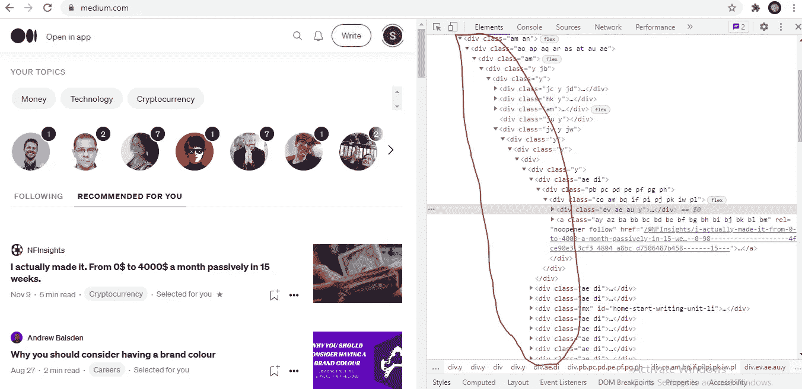

# HTML 中语义元素的重要性

> 原文：<https://javascript.plainenglish.io/semantic-elements-in-html-important-or-important-8fbca25c3bcb?source=collection_archive---------0----------------------->

Photo by [Valery Sysoev](https://unsplash.com/@valerysysoev?utm_source=medium&utm_medium=referral) on [Unsplash](https://unsplash.com?utm_source=medium&utm_medium=referral)

语义元素到底是什么？我们为什么需要它们？

好吧，大多数开发人员知道它的定义，但是他们不使用它，因为使用一个

标签非常容易，而不是记住那些语义元素。嗯，在这里我们将看到这个语义标记(T2)概念在 HTML(T4)的世界中有多重要。

术语**语义**本身代表了与意义相关的东西，所以，**语义标记**是特殊的 HTML 标签，描述它包含什么样的内容。**用非常简单的话来说:它为你提供非常简单易懂的干净代码——帮助所有 SEO 并增加可访问性的东西**

## **语义元素**

它有助于构建我们创建的代码，使其更具可读性，更易于维护。它们帮助我们思考动态数据的结构，并正确理解层次结构。

让我们来看看一些语义元素

*   

*   <main></main>

*   

通过查看这些标签，你可以猜测它们在网页上的用途。

## **例题**

为了更清楚，我们会看到一些网站-

如果你检查 medium.com，你会看到所有的标签都是

，没有语义元素。

如果你看看 stripe.com，你会发现他们是如何使用语义元素的。

有

、

<main>、、、、等..</main>

## **语义元素的优势**

**代码简洁，易于维护**

如果我们使用语义标签而不是

，这对新开发人员理解项目结构非常有帮助，代码也将更加易读和干净。

这些标签中的许多不会改变内容的分发方式或文本的显示方式，但这种做法使我们的代码更有意义，更接近人类可以理解的语言，其中每个元素都使用适当的单词。

**SEO 的改进**

识别——如前所述，语义元素对于识别关键页面组件非常有帮助。例如，谷歌的蜂鸟引擎专注于页面内容的对话方面，使用 HTML5 语义将有助于蜂鸟更好地理解整个页面。

保持访问者在网站上——html 5 可以帮助访问者在网站上停留更长的时间，访问者在特定页面上花费的时间越多，该页面的排名就越高。

语义元素鼓励跨渠道的网站内容联合，这有助于重新调整或联合页面内容。这意味着你的网站有更多可信的“外部”链接，这大大提高了页面排名。

更擅长处理丰富的内容——这对于内容丰富的页面(音频和视频)尤其有用。

**增加可访问性**

相当多的用户依靠屏幕阅读器软件来浏览互联网，并且仅使用键盘来上网。

因此，确保屏幕阅读器可以读取每个元素，并且可以通过键盘访问每个元素是非常重要的。我们必须为所有用户编写代码。

语义 HTML 不仅仅是使用新的语义标签；它还包括为每个元素使用正确的标签，以便所有用户都可以轻松导航。

最后，总结一下这个话题，学习语义标记会让你的生活更轻松，代码更好。

*更多内容尽在*[***plain English . io***](http://plainenglish.io/)