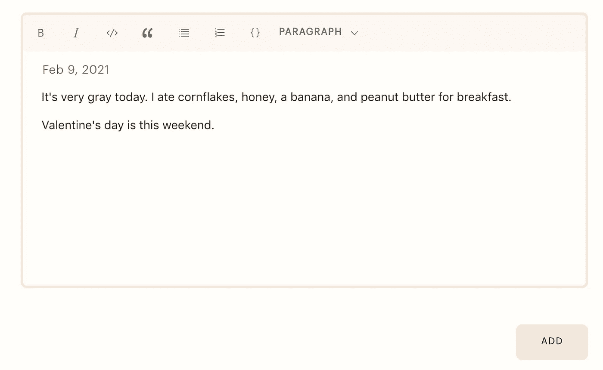

# 将 Draft.js 数据发送到服务器，并使用 React 钩子获取它

> 原文：<https://javascript.plainenglish.io/send-draft-js-data-to-a-server-and-fetch-it-with-react-hooks-735f20cc2b5c?source=collection_archive---------1----------------------->


本教程将介绍使用 POST 请求向服务器发送 Draft.js 数据的步骤，以及如何使用 GET 请求检索和显示该数据。

我使用的是 Express 后端、MongoDB 数据库和 React 前端。这需要对 Draft.js 有一些基本的了解——有很多很好的设置指南。

**依赖关系:**`react``axios``draft-js`

**结构:**

*   用 Draft.js 编辑器→ `useSubmit()` 钩子添加 Post 组件来处理 POST 请求。
*   显示帖子的 PostGallery 组件→ `usePosts()`钩子处理获取帖子。

## 设置获取和发布路线的先决条件

首先，确保您已经建立了可以接受 POST 请求的路由。我将从 Draft.js 发送笔记，因此我的路线被称为`/posts`。解释如何设置后端超出了本文的范围，但是模式、路由和控制器都在 repo 中。

> Express 用户:确保在发出 POST 请求之前已经设置了主体解析中间件:

```
app.use(express.json());app.use(express.urlencoded({extended: true}));
```

> 最上面一行允许您在请求体中发送 JSON 对象，最下面一行允许您发送字符串、数组和嵌套对象。

# 1.POST Draft.js 数据

## 使用 POST 请求将 Draft.js 数据发送到服务器

当我单击 React 界面上的保存按钮时，我想提交我的数据。我将为该按钮附加一个发送 POST 请求的函数。我将在提交时将它保存在父组件中。

```
import React from 'react';
import RichEditor from '../components/editor/RichEditor';
import Button from '../components/Button';
import useSubmit from '../hooks/useSubmit';
import useRichEditor from '../hooks/useRichEditor';const Add = () => {const {
  editorState,
  onNoteChange,
  clearEditor,
  mapKeyToEditorCommand,
  handleKeyCommand,
  toggleInlineStyle,
  toggleBlockType
 } = useRichEditor();const { submitPage } = useSubmit();const **handleSubmit** = async (e) => {
   e.preventDefault();
   **const data = editorState.getCurrentContent();**
   await submitPage(data);
};return (
   <form **handleSubmit={handleSubmit}**>
      <RichEditor 
          editorState={editorState}
          onNoteChange={onNoteChange}
          clearEditor={clearEditor}
          mapKeyToEditorCommand={mapKeyToEditorCommand}
          handleKeyCommand={handleKeyCommand}
          toggleInlineStyle={toggleInlineStyle}
          toggleBlockType={toggleBlockType}
         />
        <Button kind="primary" type="submit" label="add"/>
   </form>
  );
}export default Add;
```

在提交时，我们调用`e.preventDefault()`来防止页面刷新，然后用`editorState.getCurrentContent()`获取编辑器中的所有当前内容。然后我们调用自定义钩子中的 handleSubmit 函数。

现在让我们编写附加到保存按钮的函数， **handleSave()** 这是我们实际发送数据的部分。我所有的 API 调用都使用 Axios。Axios 是一个用于发出 HTTP 请求的库；[本](https://www.digitalocean.com/community/tutorials/react-axios-react)是使用 React 的良好入门。

```
import { useState } from 'react';
import axios from 'axios';
import { convertToRaw } from 'draft-js';export default function useSubmit() {const submitPage = async (data) => {
 **const content = JSON.stringify(convertToRaw(data));**     
     return axios.post('/posts', {
        content
     }).catch(err => console.log(err));
   } return {
    submitPage
  }
}
```

让我们将这个 POST 请求分成几个部分:

1.  我在 editorState 上调用内置的 Draft.js 方法`[getCurrentContent()](https://draftjs.org/docs/api-reference-editor-state/#getcurrentcontent)`。该方法返回`[currentState](https://draftjs.org/docs/api-reference-content-state)`对象，该对象包含文本及其所有样式。
2.  我使用内置的 Draft.js 方法`convertToRaw()`，它将内容状态转换为包含内容块的 js 对象。在此基础上，我使用了方法`JSON.stringify()`，它将 JS 对象转换成 JSON 字符串。作为一个字符串，它现在是可存储的。
3.  我设置了我的 axios 请求。这些可以用几种方式格式化；对于 POST 请求，我更喜欢使用这种类似对象的格式。我指定了`method`、`url`和端点、`data`和`headers`。请注意，我的数据对象是这样格式化的:

```
{ 
   **content** }
```

因为它反映了我的数据对象是如何在 Express 中的 createNote() API 调用中设置的:

```
res.status(201).json({
     status: 'success',
     data: {
        **content**: newNote
       }
    })
```

这些必须对应，以便数据可以正确路由！

让我们为 POST 请求获取一些数据。我将进入我的 Draft.js 编辑器，编写一些要发送的示例数据:



我将为该笔记添加一些格式，以便在我发布这些数据并在以后获取时确保保留我的格式。我将添加一些粗体文本和项目符号列表:


Inline style: bold, block style: unordered list

当通知发布后，它也会出现在我的数据库中，如下所示:

```
content: {"blocks":
[
{"key":"4rh99","text":"It's very gray today. I ate cornflakes ","type":"unstyled","depth":0,"inlineStyleRanges":[],"entityRanges":[],"data":{}},
{"key":"fdh6","text":"honey","type":"unordered-list-item","depth":0,"inlineStyleRanges":[],"entityRanges":[],"data":{}},{"key":"13aee","text":"a banana","type":"unordered-list-item","depth":0,"inlineStyleRanges":[],"entityRanges":[],"data":{}},{"key":"bb1p5","text":"and peanutbutter ","type":"unordered-list-item","depth":0,"inlineStyleRanges":[],"entityRanges":[],"data":{}},{"key":"8j2ad","text":"for breakfast. ","type":"unstyled","depth":0,"inlineStyleRanges":[],"entityRanges":[],"data":{}},{"key":"fjio6","text":"","type":"unstyled","depth":0,"inlineStyleRanges":[],"entityRanges":[],"data":{}},{"key":"eblll","text":"Valentine's day is this weekend. ","type":"unstyled","depth":0,"inlineStyleRanges":[{"offset":0,"length":16,"style":"BOLD"}],"entityRanges":[],"data":{}}],"entityMap":{}}
```

这是块图，它描绘了不同的内容块，就像段落一样。如果你通读了这篇文章，你会发现 Draft.js 是如何设计和存储数据的。

# 2.获取 Draft.js 数据

在前端显示 Draft.js 数据并不像获取数据并将其映射到组件那样简单。但并不难。

首先，我们使用 GET 请求和之前在 API 中创建的`/posts` 路由从数据库中检索 Draft.js 数据。

这是获取文章的自定义挂钩，将与 PostGallery 组件一起使用来显示文章。

**> usePosts.js**

```
import { useState } from 'react';
import axios from 'axios';
import { convertToRaw } from 'draft-js';export default function usePosts() {const [posts, setPosts] = useState(null);const getPosts = async (page, add) => {
   return axios.get(`/posts/`)
       .then(res => {
           const { docs } = res.data.data;
           setPosts(docs);
      }).catch(err => console.log(err));
  }return {
   posts,
   getPosts
  }
}
```

这个 GET 请求获取存储在`/posts`路径的数据，这些数据都是注释，并将这些文档设置为`posts`状态。但是记住，这些内容是存储在一个对象中的。在对象中，内容是包含注释内容块的 JSON 字符串。

在文章库中，内容必须经过适当的解析。我们将在 Draft.js 编辑器对象中显示文章——与用来写文章的对象相同，但是设置了属性`readOnly`,因此显示的注释不能被编辑。

使用编辑器显示注释，除了编写注释之外，还有几个优点:

*   更容易显示所有笔记的风格。
*   如果帖子显示后是可编辑的，那么`readOnly`属性可以切换到`false`。

**> PostGallery.js**

```
import React, { useEffect } from 'react';
import { Editor, EditorState, convertFromRaw } from 'draft-js';
import usePosts from '../hooks/usePosts';const PostGallery = () => {const { posts, getPosts } = usePosts();useEffect(() => { 
    getPosts(); 
}, []);return(
   <div className="posts">
   {pages && pages.map(el => {
   ** const contentState = convertFromRaw(JSON.parse(el.content));
    const editorState = EditorState.createWithContent(contentState);**
       return(
        <div style={{paddingTop:'3rem'}}>
          <Editor editorState={editorState} **readOnly={true}** />
       </div>
        )
     })}
  </div>
)
};export default PostGallery; 
```

该组件是:

*   在`useEffect`钩子的自定义钩子中调用发出 GET 请求的函数。
*   使用`el.content`从注释对象中获取注释内容，使用`JSON.parse`将其从字符串状态转换回对象。然后应用`convertFromRaw`，Draft.js 函数将带有内容块的对象转换回可读文本。
*   初始化 Draft.js 编辑器，并将解析后的内容设置为编辑器的初始编辑状态。
*   如前所述，将编辑器设置为`readOnly`，因此无法编辑。

它将作为文本块出现在前端(不可编辑)，并保留丰富的样式。如果您保存了其他属性，如文章作者、创建日期等。他们可以很容易地在这里出现。


这就是发布和获取 Draft.js 数据的全部内容。

## 摘要

**发布**

*   使用`editorState.getCurrentContent()`从编辑器状态获取当前内容，并将其保存到一个变量中。
*   用这些方法将当前状态转换成字符串:`JSON.stringify(convertToRaw(data));`

**获取**

*   在设置为`readOnly`的 Draft.js 编辑器中显示数据
*   从服务器获取文章，然后用。

```
 const contentState = convertFromRaw(JSON.parse(el.content));
    const editorState = EditorState.createWithContent(contentState);
```

*   在编辑器中显示它，如下所示:

```
<Editor editorState={editorState} **readOnly={true}**
```