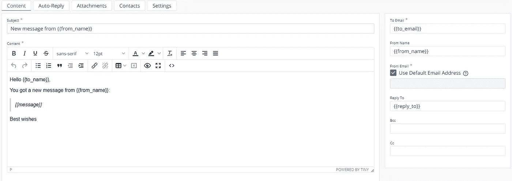

# 使用 React 轻松发送电子邮件

> 原文：<https://javascript.plainenglish.io/send-emails-easily-with-react-64240dd0f638?source=collection_archive---------6----------------------->


大家好。在本教程中，我将向您展示如何使用 React 高效地发送电子邮件。

在这篇文章中，我们将使用一个名为 **EmailJS** 的免费电子邮件服务。用下面的链接看看他们的网站。当你在他们的网站上时，不要忘记创建一个帐户。我已经通过我的 Gmail 创建了一个帐户。

[](https://www.emailjs.com/) [## 从 Javascript 发送电子邮件-无需服务器代码| EmailJS

### 直接从客户端 Javascript 代码发送电子邮件——不需要服务器端代码。添加静态或动态…

www.emailjs.com](https://www.emailjs.com/) 

好了，开始教程吧。

# 要求

1.  电子邮件帐户
2.  一个全新的反应项目

# 电子邮件配置

让我们从 EmailJS 配置开始。我相信你已经有一个电子邮件帐户。如果没有，请使用上面提到的链接在 EmailJS 中创建一个帐户。

拥有帐户后，导航至控制面板。这是我的仪表板的样子。请注意，我已经在我的 EmailJS 帐户中注册了一项服务。


Dashboard

点击仪表板中的“添加新服务”按钮，注册一个新的电子邮件服务，然后您将获得以下模式。


Select service modal

在这里，您可以选择您喜欢的电子邮件服务。我将选择 Gmail，因为我经常使用它。一旦您选择了一个服务，您将获得另一个模式来配置该服务。


Configuration modal

此服务 ID 在前端是必需的，以便与 EmailJS 连接。

在这里，您可以选择电子邮件服务的名称。然后我们需要连接一个 Gmail 帐户。如果您选择任何其他服务，那么您将必须连接到一个相关的帐户。编辑完名称后，单击“连接帐户”按钮。

您将看到一个谷歌登录弹出窗口来选择一个帐户。单击您想要的帐户。


在这里，您拥有名为“代表您发送电子邮件”的权限。要使用 EmailJS，你必须勾选那个选项。否则，您将无法发送电子邮件。默认情况下，它是未选中的。继续并勾选它。然后，单击继续。


Connection status

然后点击“创建服务”来创建电子邮件服务。然后 EmailJS 会发一封测试邮件到你的邮箱。


Test email

您将能够在仪表板中看到新的电子邮件服务


Email services are listed in the dashboard

让我们也创建一个模板。导航到“电子邮件模板”部分，然后单击“创建新模板”

在这些模板中，我们有两个选项。我们可以将模板中的所有内容硬编码，也可以将这些值作为参数传递。因为第二个选项更有用，所以让我们以一种模板可以接受参数的方式来创建模板。

为此，我们必须这样定义变量

```
{{variable_name}}
```

所以，我要创建如下的模板。我的模板名是“**邮件测试模板**



New email template

创建模板后，您可以导航到“设置”选项卡来更改模板属性，如名称、模板 Id 等。

编辑完成后，点击“保存”。您将能够在您的仪表板/电子邮件模板选项卡中看到新模板。


Email templates

这个“模板 ID”是一个惟一的属性，您需要将它放在 react 项目中。

太好了。我们已经完成了 EmailJS 帐户设置。现在，让我们转到 React 项目。

# 反应项目和配置

让我们用下面的命令创建一个新的 react 项目

```
npx create-react-app email-test
```

创建项目后，用您喜欢的代码编辑器打开它。我的是 VS 代码。

让我们安装 EmailJS 节点模块。

```
yarn install emailjs-com
```

或者

```
npm install emailjs-com
```

让我们首先创建一个电子邮件服务类。我在我的项目中创建了一个名为 **email-service.js** 的文件。


email-service.js

email-service.js

EmailJS 提供了两个功能。初始化并发送。Init 用于初始化与您的 EmailJS 帐户的连接。这个 **userID** 属性是您的 EmailJS 帐户的唯一字段。我们用它来启动连接。

然后使用发送功能发送电子邮件。你可以看到**我们必须传递服务 id 和模板 id 作为参数**。

此外，在上面的文件中，您可以看到我有一个名为**的对象要发送**，其中有一些属性**。**

**如果你把那些道具和我们放在邮件模板里的名字对比一下，你会发现它们是相等的。因此，在发送电子邮件之前，您必须使用您在模板中使用的确切名称创建一个对象。**

之后，在 **App.js** 中，让我们创建一个发送电子邮件的表单。这里我将使用 **AntDesign** 来简化这个过程。

App.js

现在我们已经走到了尽头。继续运行该项目。填写表格。您将能够在收件箱中看到该电子邮件。

Outcome

您可以从这里找到示例代码。

[](https://github.com/ayeshnipun/react-emailjs) [## GitHub-ayeshnipun/react-email js

### 这个项目是用 Create React App 引导的。在项目目录中，您可以运行:在…中运行应用程序

github.com](https://github.com/ayeshnipun/react-emailjs) 

**参考文献**

[](https://www.emailjs.com/) [## 从 Javascript 发送电子邮件-无需服务器代码| EmailJS

### 直接从客户端 Javascript 代码发送电子邮件——不需要服务器端代码。添加静态或动态…

www.emailjs.com](https://www.emailjs.com/) [](https://dashboard.emailjs.com/admin/integration) [## 从 Javascript 发送电子邮件-无需服务器代码| EmailJS

### 直接从客户端 Javascript 代码发送电子邮件——不需要服务器端代码。添加静态或动态…

dashboard.emailjs.com](https://dashboard.emailjs.com/admin/integration) [](https://www.emailjs.com/docs/sdk/installation/) [## SDK 安装|电子邮件

### 本指南介绍了用于安装 EmailJS SDK 的各种方法。如果您正在缝合一组…

www.emailjs.com](https://www.emailjs.com/docs/sdk/installation/) 

*更多内容请看*[***plain English . io***](http://plainenglish.io/)