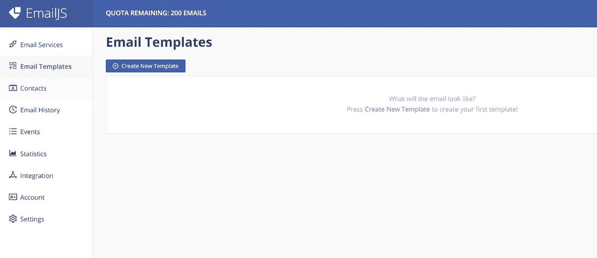
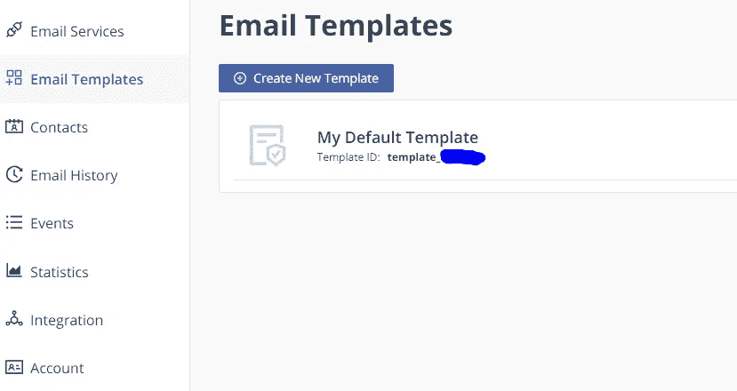

# 使用 EmailJS 从您的网站发送电子邮件

> 原文：<https://javascript.plainenglish.io/send-emails-from-your-website-with-emailjs-6b220eea86e4?source=collection_archive---------3----------------------->

## 你正在为你的网站联系方式的代码而烦恼吗，那么让这篇文章成为你的救命稻草吧。

Photo by [Solen Feyissa](https://unsplash.com/@solenfeyissa?utm_source=unsplash&utm_medium=referral&utm_content=creditCopyText) on [Unsplash](https://unsplash.com/s/photos/emails?utm_source=unsplash&utm_medium=referral&utm_content=creditCopyText)

作为一名开发人员，你肯定会在你的辅助项目、学术项目或你自己的文件夹上开发带有发送按钮的联系表单。

今天我将向你展示如何通过调用 [EmailJS](https://www.emailjs.com/) 来一步一步地使用 JavaScript 来完成，所以从现在开始你就不需要担心联系人表单的代码了。

EmailJS 是一个 JavaScript 库，它可以让你在不需要服务器端技术的情况下触发电子邮件，这使得它非常适合静态网站。

你只需要将 EmailJS 连接到一个支持的电子邮件服务，如 Gmail、Outlook、Yahoo…并创建一个电子邮件模板。

我们现在开始这些步骤，对于每个步骤，在每个描述行下面都有一个屏幕截图，以便于您理解。

# 第一步。创建您的电子邮件帐户

导航到[电子邮件网站](https://www.emailjs.com/)，点击右上角的按钮免费注册，它会带你到一个注册表格。

一旦你得到这个注册表格，确保填写你的名字，电子邮件，密码，并检查验证码“我不是机器人”

祝贺你创建了你的第一个帐户伴侣，现在让我们跳到第二步。

# 第二步。添加电子邮件服务

成功创建您的帐户后，您将被重定向到您的帐户控制面板。现在你需要创建你的电子邮件服务，点击“添加新服务”按钮。

您将看到一个弹出窗口，显示您需要的电子邮件服务，在本教程中，我们将根据最常用的事实选择“Gmail ”,但请记住，对于其他服务，该过程并无不同。

现在，您将看到一个弹出窗口来配置您的 Gmail 收件人地址。

不要触及服务 Id，我们将暂时把它放在一边，直到我们到达 JavaScript 代码。

点击“连接帐户”,确保填写您的 Gmail 凭据，以便开始接收来自该联系人表单的电子邮件。

成功连接您的 Gmail 帐户后，点击创建服务。

您的电子邮件服务已经设置完毕，下一步是创建和定制电子邮件模板，您将在该模板上接收您的联系表单输入。

# 第三步。创建和定制电子邮件模板。

在你的 EmailJS 账户的控制面板上，左侧有一个侧边栏，点击“电子邮件模板”,然后再次点击“创建新模板”

点击后，你会得到默认的电子邮件模板，你可以修改它。

模板上的这些变量表示来自联系人表单的输入，在右侧指定收件人的电子邮件，并指定是否要在抄送部分添加另一封电子邮件，否则将其留空。

如果修改这些变量名，请确保在下一步编写 JavaScript 代码时考虑到它们。

模板变量:

*   `{{from_name}}`:通过联系表单发送邮件的人的姓名。
*   `{{to_name}}`:收件人姓名，如果您是收件人 Gmail 帐户的所有者，则必须是您的姓名。
*   `{{message}}`:发件人的信息，HTML 代码中 textarea 标签的内容。
*   `{{reply_to}}`:如果您想添加该邮件的第二个收件人，可以使用该变量。

完成模板修改后，单击 save 按钮并复制 template_id，因为我们将在 JavaScript 调用中需要它。

# 第四步。您的 HTML 和 JavaScript 代码

在您的项目中，您应该首先加载 EmailJS SDK 并初始化您的 user_id，您可以通过[此链接](https://dashboard.emailjs.com/admin/integration/browser)或下面的截图找到它。

在左侧栏中，单击“集成，浏览器”选项卡。 ***复制并粘贴*** 带有两个脚本标签的 HTML 代码，并将其粘贴到 body 标签的末尾之前。

第一个脚本标记负责加载 EmailJS SDK，第二个标记负责用您的 user_id 初始化 EmailJS 库。

现在让我们看看我们的 HTML 代码:

在我的 HTML 代码中，我使用了 bootstrap 类，如果你不熟悉 bootstrap，可以忽略属性类。

您可以根据需要定制联系人表单，但是要确保每个输入和区域都有属性 ***id*** 。

在我们的例子中，我们有两个输入和一个文本区域。

现在让我们进入 JavaScript 代码(下面的截图):

确保在用您的 User_ID 初始化 emailJS 之后添加 JavaScript 代码，否则，您将得到 emailJS 未定义的异常。

第一个函数是我们在本步骤开始时粘贴的函数，用于用您的 user_ID 初始化 emailJS。

第二个函数调用 Sendmail 将由我们的 send 按钮调用，我们开始使用 HTML 代码中指定的输入 id 获取输入值。

在触发发送电子邮件事件之前，我们将这些输入存储到一个名为 contactParams 的变量中。contactParams 中的字段应该与定制模板中的属性具有相同的名称。

要触发电子邮件发送操作，您需要指定您的 Service_ID(创建电子邮件服务步骤)和 template_ID(创建模板步骤)。

现在试试你的联系方式，看看电子邮件是如何顺利到达你的 Gmail 帐户的。

结果是:

## 结论

就这样，你已经完成了教程！

你可以在这里找到[源代码](https://github.com/yourabi10/emailJS_Example.git)、**、T3【别忘了、把你的 user_ID、service_ID、template_Id 放到 javascript 文件(main.js)里。**

如果你是一个雄心勃勃的人，期待着发展你的职业生涯，并推动它超越极限，那么不要犹豫，看看我关于有效进步的 6 个经验的文章。

 [## 如果你想成为一名初级软件工程师，你需要学习的 6 课

### 如果你是一个雄心勃勃的初级软件工程师，期待提升你的职业生涯，那么让我与你分享我的…

javascript.plainenglish.io](/how-to-stand-out-as-a-junior-software-engineer-c048a4bc0ca1)