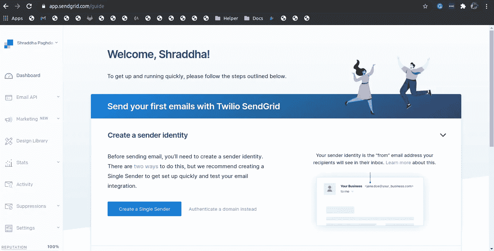
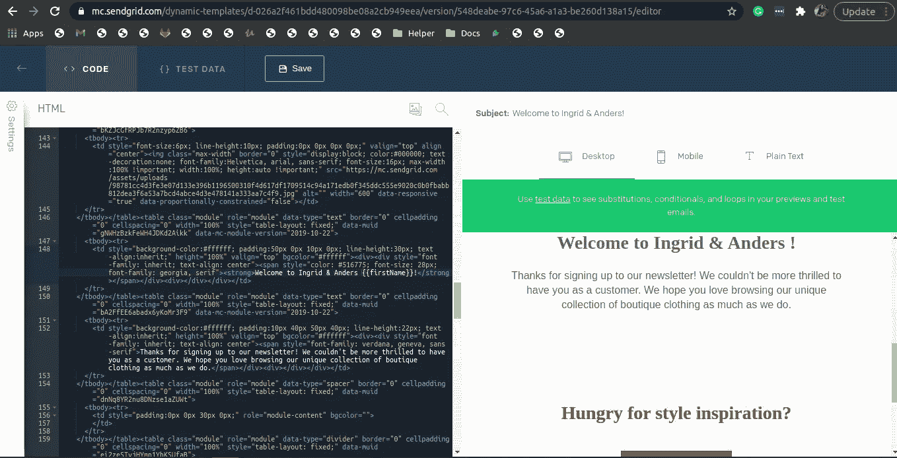
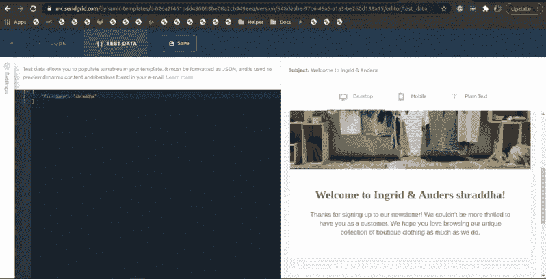
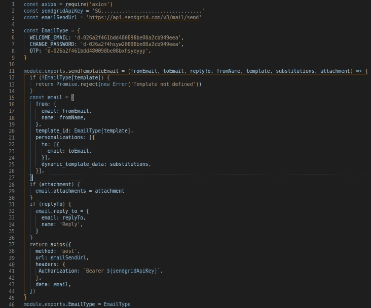
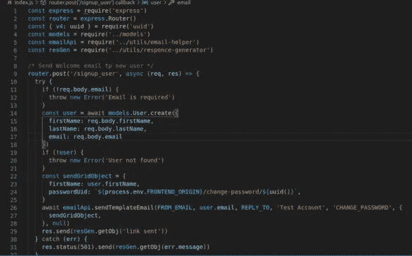

# 如何使用 Node.js 实现发送网格

> 原文：<https://javascript.plainenglish.io/sendgrid-implementation-using-node-js-bfe8a62bab7b?source=collection_archive---------4----------------------->


Sendgrid v3 send email using node.js

Sendgrid 是 IT 行业最流行的电子邮件服务之一，用于营销和交易电子邮件。您只需通过 SendGrid 发送欢迎电子邮件、密码重置电子邮件、通信更新等，甚至是新产品功能更新。因此，在今天的帖子中，我将向您展示如何在 SendGrid 上创建一个免费帐户&将它与您的 Node.js 代码集成，以自动化这个过程。让我们开始吧。

1.  前往[https://sendgrid.com/](https://sendgrid.com/)注册一个免费账户。



SendGrid dashboard

2.转到“设置”->“API 密钥”以生成将由节点代码用来发送电子邮件的 API 密钥(将 API 密钥存储在安全的地方)。

3.现在转到电子邮件应用编程接口->动态模板，创建发送电子邮件的模板。然后创建版本。您可以创建多个版本，并选择任何要激活的版本。您可以根据自己的喜好选择发送网格模板或创建自定义模板。

您可以根据自己的要求发送静态电子邮件或个性化电子邮件。为了个性化电子邮件，SendGrid 使用了手柄。您可以在这里阅读关于车把[。](https://sendgrid.com/docs/for-developers/sending-email/using-handlebars/)



SendGrid dynamic template

如上图所示，您可以在{{variableName}}中用变量名通过{{}}传递动态数据。例如:{ {名字}}。

您可以通过以 JSON 格式将测试数据放在测试数据选项卡上来测试您的电子邮件。例如:{"firstName": "Shraddha"}。



testing of SendGrid template

现在让我们跳到节点。

1.使用 npm 安装 Axios。

```
npm install --save axios
```

2.在您的节点项目中创建一个电子邮件助手文件。在电子邮件帮助器文件中，粘贴您的发送网格应用编程接口密钥&发送网格应用编程接口的端点。我创建了一个“EmailType”对象来存储多个动态模板 id。

```
const axios = require('axios')const sendgridApiKey = 'SG..................................'
const emailSendUrl = 'https://api.sendgrid.com/v3/mail/send'const EmailType = {
 WELCOME_EMAIL: 'd-026a2f461bdd480098be08a2cb949eea',
 CHANGE_PASSWORD: 'd-026a2f4hsyw20098be08a2cb949eea',
 OTP: 'd-026a2f461bdd480098be08bxhsyeyyy',
}
```

现在要发送数据，您可以创建一个函数，将其导出并在另一个文件中使用，以发送电子邮件数据。模板 Id、个性化&来自信息是发送到 SendGrid 的强制数据。您可以根据需要发送附件、密件抄送、抄送、回复等多种字段。下面是包含所有必要数据的电子邮件助手。

```
module.exports.sendTemplateEmail = (fromEmail, toEmail, replyTo, fromName, template, substitutions, attachment) => {
if (!EmailType[template]) {
  return Promise.reject(new Error('Template not defined'))
}
const email = {
 from: {
  email: fromEmail,
  name: fromName,
 },
template_id: EmailType[template],
personalizations: [{
  to: [{
   email: toEmail,
  }],
  dynamic_template_data: substitutions,
 }],
}
if (attachment) {
 email.attachments = attachment
}
if (replyTo) {
 email.reply_to = {
  email: replyTo,
  name: 'Reply',
 }
}return axios({
  method: 'post',
  url: emailSendUrl,
  headers: {
   Authorization: `Bearer ${sendgridApiKey}`,
  },
  data: email,
})}
```



Sample email-helper.js file to send data

3.现在，为了调用 sendTemplateEmail 函数，让我们创建一个 index.js 文件。导入电子邮件帮助器文件。让我们创建欢迎 API，然后将数据和必要的数据一起发送给 sendTemplateEmail 函数。给你。在成功注册后，用户将收到带有个性化名称和验证链接的欢迎电子邮件。



Index.js file to send data

要查看代码是否有效，请通过与邮递员一起发送示例数据来调用 API。

就这样。希望您认为本文有所帮助。谢谢你。

*更内容于* [*通俗易懂*](http://plainenglish.io/)