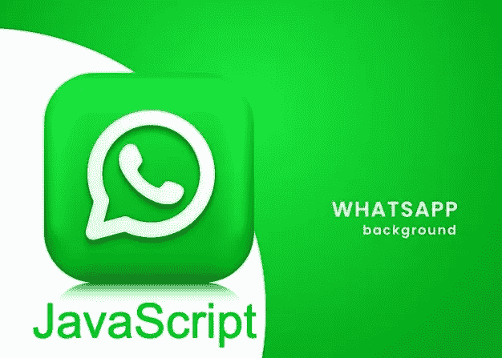
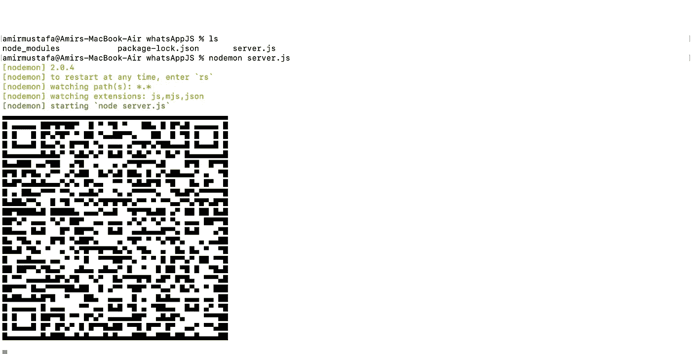
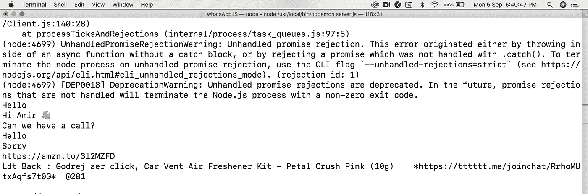

# 使用 JavaScript 自动发送 WhatsApp 信息

> 原文：<https://javascript.plainenglish.io/sending-automatic-whatsapp-messages-using-javascript-9860ba96d486?source=collection_archive---------0----------------------->



→ **WhatsApp** ，是脸书公司旗下的一款美国免费软件，跨平台集中式即时通讯和 IP 语音服务。

→它允许用户发送文本消息和语音消息，进行语音和视频通话，以及共享图像、文档、用户位置和其他内容。

→我们可以用 Node.js 发送 WhatsApp 消息，回复即时自动消息

# 安装:

1.  node . js https://nodejs.org/en/download/

2.Whatsapp-web.js:是连接 Whatsapp 的 Node.js 客户端库。

```
npm install whatsapp-web.js
```

3.QR 码生成器

```
npm i qrcode-terminal
```

→我们将在下面的数据变量中添加一个**自动回复列表**

# 代码:(server.js)

```
const { **Client** } = **require**('whatsapp-web.js');
const qrcode = **require**('qrcode-terminal');const client = new **Client**();*// Get QR code to scan WhatsAPP*client.**on**('qr', qr => { qrcode.**generate**(qr, {small: true});});client.**on**('ready', () => {
    console.**log**('Client is ready!');
});client.**on**('message', message => {
    console.**log**(message.body);
});*// List of data for automatic reply* var data = [{ id: 1, received: 'Hello', reply: 'Hi'},{ id: 2, received: 'Sorry', reply: 'No problem'},{ id: 3, received: 'Can we have a call?', reply: 'Please leave a voicemail. Let us connect in an hour. Kind Reards, Amir Mustafa'},{ default: 'Please leave a voicemail. Let us connect in an hour. Kind Reards, Amir Mustafa' }];client.**on**('message', message => {
  var selectedData = data.**find**((msg) => {
  if(msg.received === message.body) {
    return true
  }
});var sourceMsg, targetMsg;if(selectedData && **Object**.**keys**(selectedData).length !== 0 && selectedData.constructor === **Object**) { sourceMsg = selectedData.received;
  targetMsg = selectedData.reply;}*// test data
// const sourceMsg = 'Hello';
// const targetMsg = 'I am occupied at present. You can leave me SMS here, will call you shortly.';**// send message*if(message.body === sourceMsg) { message.**reply**(targetMsg);} else { message.**reply**(data.default);}});client.**initialize**();
```

→在代码中打开终端并运行。将生成二维码，如下图所示:

```
nodemon server.js
```



→我们需要从 WhatsApp mobile 应用程序获取来自 WhatsAPPWeb 的 QR。

→一旦 **node.js 服务器运行**并扫描**二维码**，所有的 WhatsApp 消息都可以在终端读取

****

**→在代码中，我们设置了自动回复数据。我们在下面设置了所有可能的自动回复，如果阅读了特定的邮件，就会触发自动回复😄**

```
var data = [{ id: 1, received: 'Hello', reply: 'Hi'},{ id: 2, received: 'Sorry', reply: 'No problem'},{ id: 3, received: 'Can we have a call?', reply: 'Please leave a voicemail. Let us connect in an hour. Kind Reards, Amir Mustafa'},{ default: 'Please leave a voicemail. Let us connect in an hour. Kind Reards, Amir Mustafa' }];
```

**→查看下面的详细视频，其中**将 WhatsApp 与终端**连接，**读取所有消息**并且**向用户发送自动回复**。**

# **结束语:**

**在本文中，我们已经成功地将 Node.js 应用程序与 [whatsapp-web.js](https://docs.wwebjs.dev/) 包连接起来。**

**我们已经向给我们发消息的用户发送了**自动回复**，**能够阅读来自终端的所有消息**。使用这个图书馆很有趣😄。**

**我希望你今天学到了一些有趣的东西。复制粘贴上面的代码，添加一些你的自动回复，并尝试一下。**

**[](https://twitter.com/amir__mustafa) [## 关注 Amir Mustafa 的 JavaScript、TypeScript 和 AWS 内容。

### twitter.com](https://twitter.com/amir__mustafa) 

*更多内容请看*[***plain English . io***](http://plainenglish.io/)**