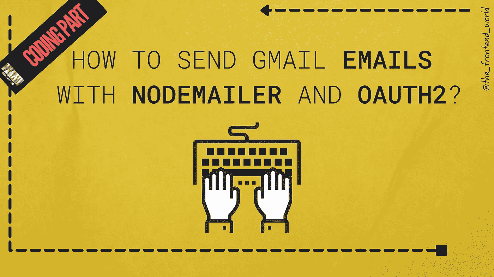

# 如何用 Nodemailer 和 OAuth2 发送 Gmail 邮件？

> 原文：<https://javascript.plainenglish.io/sending-emails-with-nodemailer-with-gmail-and-oauth2-e0b609587b7a?source=collection_archive---------3----------------------->

## 使用 Node.js、OAuth2 和 nodemailer 的编码部分

By FAM

## 要求

*   Nodemailer 用于 Node.js apps，所以你需要[**安装它**](https://nodejs.org/en/download/) 。
*   Nodemailer 帮你轻松的为你的 node app 发邮件，像做蛋糕一样。所以，我们当然需要[用 NPM 或纱线安装](https://www.npmjs.com/package/nodemailer)才能使用。
*   为 Gmail 安装[Google API](https://www.npmjs.com/package/googleapis)。

让我们一步一步地进入代码，了解它做什么。如果你想要完整的代码，你可以在文章的结尾找到。

*   **添加所需的包:**

*   **使用我们的应用程序中的凭证(我们随文章一起生成)环境常量:**

/!\-如果您尚未为您的应用程序生成凭据，以下是您需要的内容:

 [## 我如何获得 OAuth 证书？

### 获取 Google Oauth2 客户端 ID 的步骤？

medium.com](https://medium.com/geekculture/how-do-i-get-an-oauth-credential-35d6d0e5d617) 

***/！\ —注意，我使用的是环境常数。这是更干净的，因为文件是隐藏的(*** `***.env***` ***)，当你想改变一个常数时，你只需做一次，因此非常适合维护应用程序。***

我的`*.env*` *看起来像是(你需要填写你自己的证书和电子邮件):*

如果你感兴趣，也想这么做，下面是一些快速的步骤:

 [## 如何创建用于 React 应用程序的节点全局变量

### 修复返回未定义的 process.env.VARIABLE_NAME

levelup.gitconnected.com](https://levelup.gitconnected.com/how-to-create-node-global-variables-to-use-in-react-app-9df1514a4eb7) 

否则，您也可以首先对同意进行硬编码，当一切正常时，在您的代码中进行一些改进。

*   **在 Google APIs 和设置凭证时进行身份验证:**

*   **动态生成** `**accessToken**` **，用** `**nodemailer**` **:** 构建电子邮件

*   **整个代码:**

*   **使用路由器中的功能(这里我用的是 express 和 React)**

## 有用的资源:

*   [https://community.nodemailer.com/2-0-0-beta/using-oauth2/](https://community.nodemailer.com/2-0-0-beta/using-oauth2/)
*   [https://developer . Google . com/identity/protocol/oauth 2/JavaScript-implicit-flow](https://developers.google.com/identity/protocols/oauth2/javascript-implicit-flow)

**/*！\ —如果您想深入了解整个过程的全貌，下一篇文章将于本周末发表。***

***【更新】:如承诺*😉**

 [## 带有 Gmail 的节点邮件程序不工作？

### 了解它是如何工作的部分:我如何在 Gmail 中使用节点邮件？…

levelup.gitconnected.com](https://levelup.gitconnected.com/nodemailer-with-gmail-not-working-4ed254258ac) 

# 谢谢你宝贵的时间，希望这对你有用！

亲爱的读者，我希望这是明确和有用的。我希望你无论在哪里都是安全的，你的家人也是！坚持住。明天会更好！

**让我们在** [**中**](https://medium.com/@famzil/)**[**Linkedin**](https://www.linkedin.com/in/fatima-amzil-9031ba95/)**[**脸书**](https://www.facebook.com/The-Front-End-World)**[**insta gram**](https://www.instagram.com/the_frontend_world/)**、**[T37you tube](https://www.youtube.com/channel/UCaxr-f9r6P1u7Y7SKFHi12g)、**或[上取得联系](https://www.linkedin.com/in/fatima-amzil-9031ba95/)********

****[www.fam-front.com](http://www.fam-front.com/)****

*****更多内容参见*****