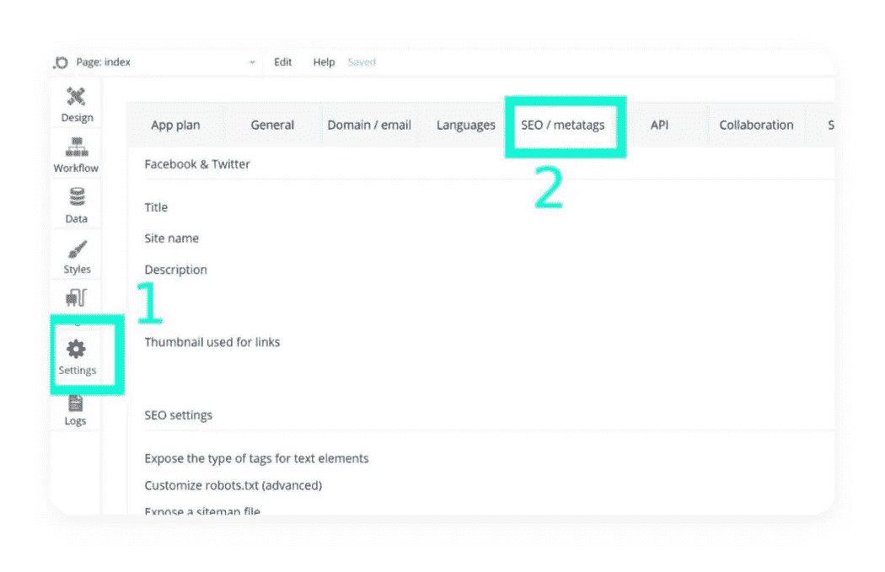
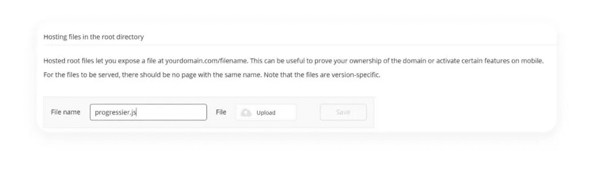

# 如何用 Bubble.io 发送推送通知

> 原文：<https://javascript.plainenglish.io/sending-push-notifications-with-bubble-io-b85e8919adf9?source=collection_archive---------6----------------------->

无代码正在席卷全球。几个月前，Bubble.io 宣布了他们 1 亿美元的 a 轮投资。尽管我真的不认为无代码构建者会让“技术联合创始人过时”( [TechCrunch 的话](https://techcrunch.com/2021/07/27/no-code-bubble-series-a/)，不是我的！)，它们确实让原本藏在抽屉里的创意很快变成了现实。

# 类固醇泡沫应用？

你可以用真实的数据构建真实的应用，用 Bubble 构建真实的用户——而无需编写任何代码。

用 Bubble 构建的网络应用非常棒，因为它们可以在任何带有浏览器的设备上访问(甚至从你的[冰箱](https://www.reddit.com/r/WhitePeopleTwitter/comments/9ikaew/locked_in_the_kitchen/)？).原生应用非常棒，它们与你每天花数小时查看的工具(你的智能手机)更无缝地集成在一起。

在这两者之间，有“[进步的网络应用](https://web.dev/progressive-web-apps/)”——它们本质上是服用了正确维生素的网络应用。它们仍然是用标准的 web 技术(HTML/CSS/JavaScript)构建的，但是它们看起来和感觉上更像本地应用。

[让一个应用*成为一个应用*](/i-solved-the-biggest-problem-with-pwas-2996d02c5728) 的两个重要方面是用户从他们的主屏幕访问它和接收推送通知的能力。因此，在本文中，我将向您展示如何在不编写一行代码的情况下从您的 Bubble 应用程序发送推送通知。*(好吧，技术上来说，一行代码复制粘贴+一个文件上传！).*

# 大约 3 分钟后开始

1.  创建一个 [Progressier](https://progressier.com/signup) 账户，然后在**网站构建器**下选择“泡泡”
2.  打开 Bubble.io 仪表盘，前往**设置> SEO/metatags** 。

3.滚动到**高级设置**，在标题中的**脚本/元标签旁边，粘贴 Progressier 仪表盘中提供的代码片段。**

这个脚本创建一个 web 应用程序清单，自动生成所有需要的闪屏和徽标，并为您管理推送通知。

4.你的 Bubble 应用还需要一个[服务人员](https://developers.google.com/web/fundamentals/primers/service-workers)。从你的 Progressier 仪表盘下载，回到 Bubble，向下滚动到根目录中的**托管文件，将文件命名为 **progressier.js** 并上传。最后但同样重要的是，记得点击**保存**。**

5.当用户访问你的应用程序时，系统会提示他们允许推送通知。您还可以[禁用自动提示](https://progressier.com/dashboard/preview?expanded=PushNotifications)或使用 Progressier 客户端 API 手动触发它——只需调用**Progressier . subscribe()**。

6.使用[Progressier Push Composer](https://progressier.com/dashboard/push-campaigns?composer=new)填写通知的详细信息。点击**立即发送**，您的通知将会发送给您的用户。(或者，您也可以使用 [API](https://progressier.com/dashboard/api-documentation?expanded=SendNotificationsProgrammatically) 以编程方式发送推送通知)。

就是这样！在短短几分钟内，您将一个完整的推送解决方案集成到了现有的 Bubble 应用程序中，并添加了一个提示，要求现有用户允许推送通知。现在，当你的应用中发生值得推送的事情时，你就可以发送通知了。很简单。

*更多内容请看*[***plain English . io***](http://plainenglish.io/)