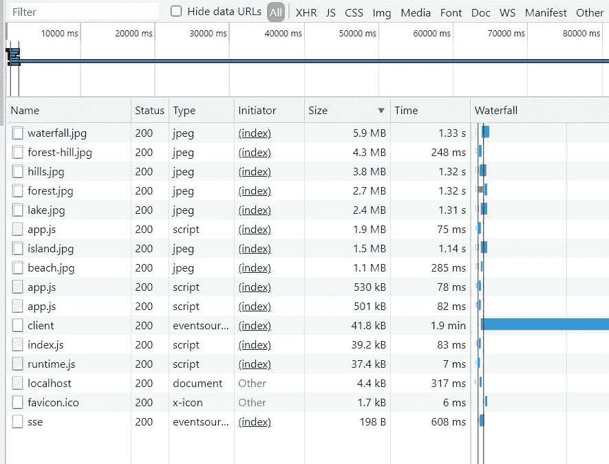
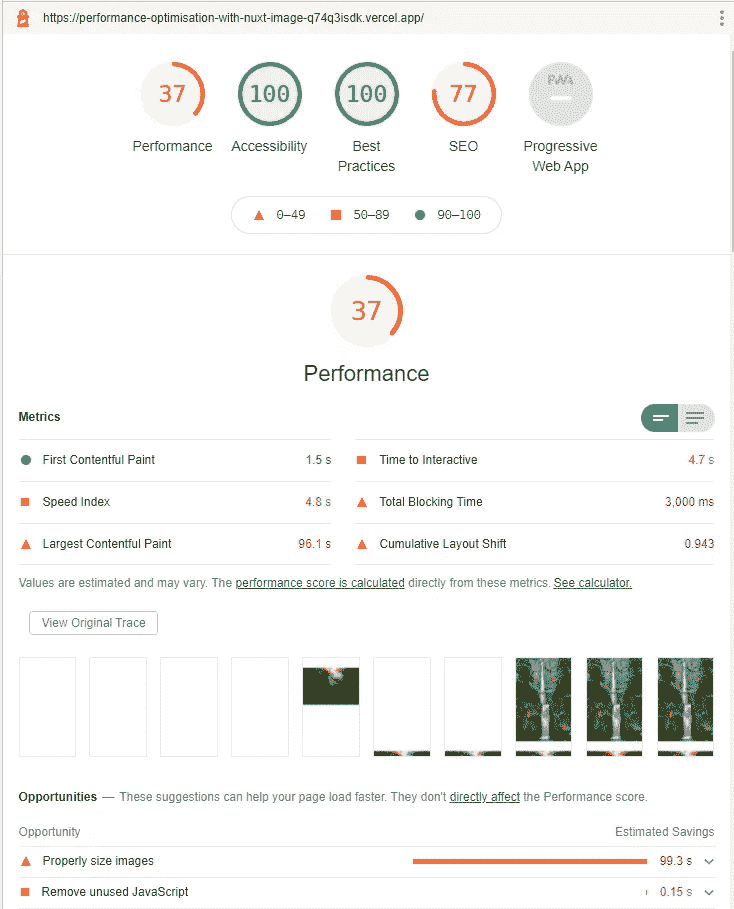
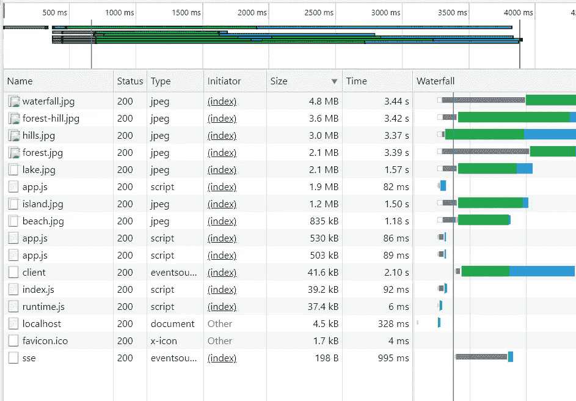
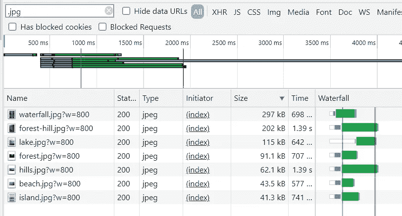
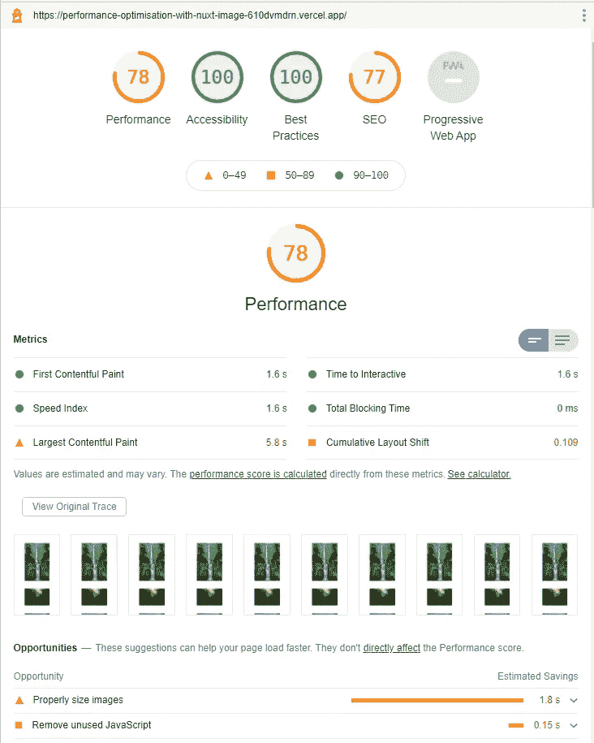
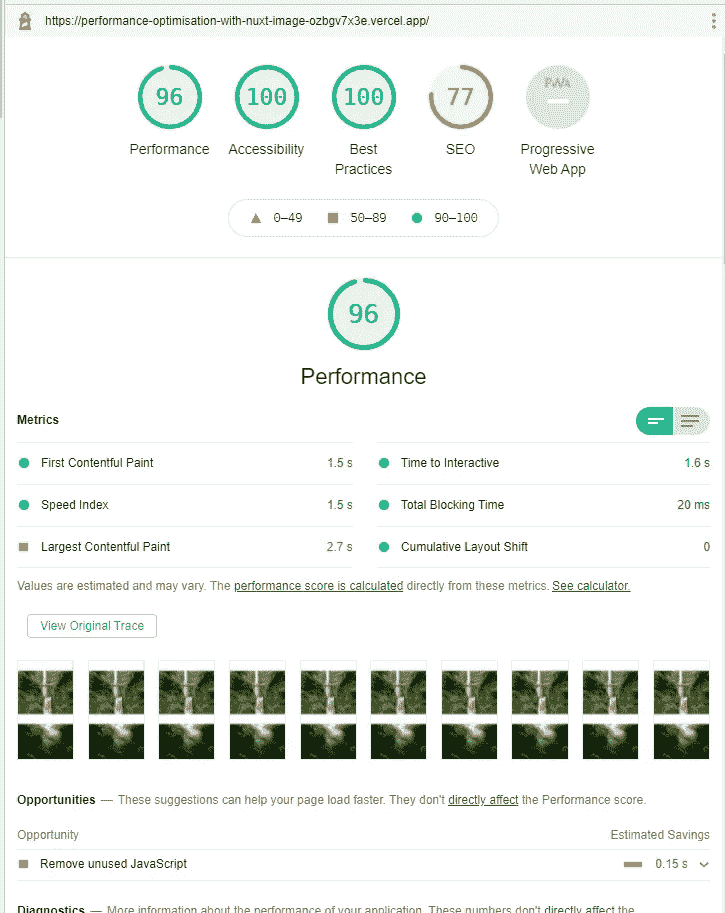
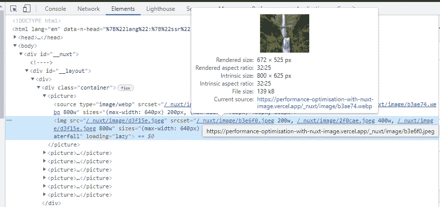
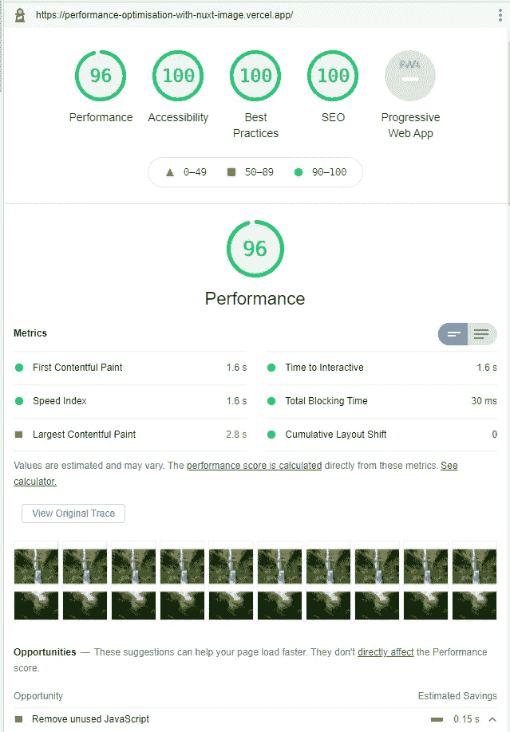

# 使用 Nuxt Image 进行 SEO 和性能优化

> 原文：<https://javascript.plainenglish.io/seo-and-performance-optimisation-with-nuxt-image-a7f1c8c10dc6?source=collection_archive---------14----------------------->


*本文原载于* [*企业之路*](https://theroadtoenterprise.com/blog/seo-and-performance-optimisation-with-nuxt-image) *博客。在那里阅读，获得最佳阅读体验。*

如今，网络应用程序被期望非常快，因为用户经常放弃那些需要很长时间才能准备好的网站。更有甚者，慢速网站经常被搜索引擎惩罚，比如谷歌。因此，网站加载速度越快越好。

然而，在我的职业生涯中，我见过很多网站加载了大量未经优化的图片，这些图片太大太重了。在这篇文章中，我想告诉你如何通过使用最近发布的 [Nuxt Image](https://image.nuxtjs.org/) 模块优化图像来提高 SEO 和你的 Nuxt 应用的性能。

# 项目设置

您可以通过运行以下命令之一来创建新项目:

```
// npm
npm init nuxt-app my-nuxt-image-app// yarn
yarn create nuxt-app my-nuxt-image-app// npx
npx create-nuxt-app my-nuxt-image-app
```

创建项目后，将 CD 放入目录并安装 Nuxt 映像包。

```
cd my-nuxt-image-app;
yarn add --dev @nuxt/image;
// or
npm install -D @nuxt/image;
```

安装完成后，打开 *nuxt.config.js* 文件，添加 *@nuxt/image* 模块。如果你的 Nuxt 项目的`target`是`static`，那么你需要将 *@nuxt/image* 模块添加到`buildModules`中。如果是`server`，那就加到`modules`上。我的项目针对的是前者，所以我把它加到了`buildModules`。

nuxt.config.js

```
{
  // ...other config
  buildModules: [
    // ...other modules
    '@nuxt/image',
  ]
}
```

现在，您可以在开发模式下运行您的项目。

```
npm run dev
// or
yarn dev
```

这就是设置。让我们添加一些图像。

# 添加大图像

让我们给应用程序添加一些图片。我从 Unsplash 网站下载了几张大图。如果你想用同样的图片，你可以在[这个 GitHub repo](https://github.com/ThomasFindlay/seo-and-performance-optimisation-with-nuxt-image/tree/main/static/images) 里找到。否则，只需使用您自己的图像，但要确保它们相当大。现在，让我们更新主页文件，如下所示。

**页数/index.vue**

```
<template>
  <div class="container">
    
    
    
    
    
    
    
  </div>
</template><script>
export default {}
</script><style>
.container {
  margin: 0 auto;
  min-height: 100vh;
  display: flex;
  justify-content: center;
  align-items: center;
  flex-direction: column;
  text-align: center;
  max-width: 1180px;
}.container img {
  display: block;
  height: auto;
  max-width: 100%;
  object-fit: contain;
  margin-top: 4rem;
}
</style>
```

如果你运行应用程序并检查网络选项卡，你会发现这些图像真的很大，需要相当长的时间来加载。



我们来看看灯塔说了什么。我通过运行`generate`命令生成了一个静态网站，并将其部署到 Vercel，在 Lighthouse 中进行测试。

以下是未优化版本的 URL—[https://performance-optimization-with-nuxt-image-q 74 Q3 isdk . vercel . app/](https://performance-optimisation-with-nuxt-image-q74q3isdk.vercel.app/)。



正如你在上面的图片中看到的，这是一个非常糟糕的性能分数——100 分中的 37 分。图像加载时间太长。让我们看看使用 Nuxt 图像插件可以做些什么来改进它们。

# Nuxt 图像

让我们改变图像元素来使用`nuxt-img`组件。

```
<nuxt-img src="/images/waterfall.jpg" alt="waterfall" />
<nuxt-img src="/images/forest.jpg" alt="forest" />
<nuxt-img src="/images/hills.jpg" alt="hills" />
<nuxt-img src="/images/forest-hill.jpg" alt="forest-hill" />
<nuxt-img src="/images/island.jpg" alt="island" />
<nuxt-img src="/images/beach.jpg" alt="beach" />
<nuxt-img src="/images/lake.jpg" alt="lake" />
```

从原生图像元素切换已经导致了尺寸的改进，因为图像现在变小了一点。之前，*waterfall.jpg*镜像重 5.6MB，使用`nuxt-img`组件后减少到 4.8MB



当然，这还是太大了，所以让我们看看我们还能做些什么。


您想学习开发 Vue 应用程序的高级模式、技术和最佳实践吗？查看 [Vue —企业之路](https://theroadtoenterprise.com/?utm_source=medium&utm_medium=article&utm_campaign=seo-and-performance-optimisation-with-nuxt-image)，这是最先进的 Vue 书籍。

# 图像尺寸和质量降低

`nuxt-img`组件接受一个名为*大小*的道具。我们可以定义 Nuxt 图像插件应该为图像生成多大的尺寸。目前，该应用程序正在加载全尺寸图像。例如，*waterfall.jpg*图像的大小为 4000x6000。让我们指定较小的尺寸。

```
<template>
  <div class="container">
    <nuxt-img
      sizes="sm:200px md:400px lg:800px"
      src="/images/waterfall.jpg"
      alt="waterfall"
    />
    <nuxt-img
      sizes="sm:200px md:400px lg:800px"
      src="/images/forest.jpg"
      alt="forest"
    />
    <nuxt-img
      sizes="sm:200px md:400px lg:800px"
      src="/images/hills.jpg"
      alt="hills"
    />
    <nuxt-img
      sizes="sm:200px md:400px lg:800px"
      src="/images/forest-hill.jpg"
      alt="forest-hill"
    />
    <nuxt-img
      sizes="sm:200px md:400px lg:800px"
      src="/images/island.jpg"
      alt="island"
    />
    <nuxt-img
      sizes="sm:200px md:400px lg:800px"
      src="/images/beach.jpg"
      alt="beach"
    />
    <nuxt-img
      sizes="sm:200px md:400px lg:800px"
      src="/images/lake.jpg"
      alt="lake"
    />
  </div>
</template>
```

下面，您可以看到这种变化如何影响网络负载。



例如，以前，瀑布图像的大小为 4.8MB，而现在只有 297kB。这是一个巨大的进步。灯塔看起来也更好，因为性能得分从 37 分提高到 78 分。



这仍然不是最好的，所以让我们降低图像的质量，增加延迟加载。

```
<template>
  <div class="container">
    <nuxt-img
      sizes="sm:200px md:400px lg:800px"
      src="/images/waterfall.jpg"
      alt="waterfall"
      loading="lazy"
      width="1024"
      height="800"
      quality="75"
    />
    <nuxt-img
      sizes="sm:200px md:400px lg:800px"
      src="/images/forest.jpg"
      alt="forest"
      loading="lazy"
      width="1024"
      height="800"
      quality="75"
    />
    <nuxt-img
      sizes="sm:200px md:400px lg:800px"
      src="/images/hills.jpg"
      alt="hills"
      loading="lazy"
      width="1024"
      height="800"
      quality="75"
    />
    <nuxt-img
      sizes="sm:200px md:400px lg:800px"
      src="/images/forest-hill.jpg"
      alt="forest-hill"
      loading="lazy"
      width="1024"
      height="800"
      quality="75"
    />
    <nuxt-img
      sizes="sm:200px md:400px lg:800px"
      src="/images/island.jpg"
      alt="island"
      loading="lazy"
      width="1024"
      height="800"
      quality="75"
    />
    <nuxt-img
      sizes="sm:200px md:400px lg:800px"
      src="/images/beach.jpg"
      alt="beach"
      loading="lazy"
      width="1024"
      height="800"
      quality="75"
    />
    <nuxt-img
      sizes="sm:200px md:400px lg:800px"
      src="/images/lake.jpg"
      alt="lake"
      loading="lazy"
      width="1024"
      height="800"
      quality="75"
    />
  </div>
</template>
```

降质加懒装后性能分跃升到 96！



# nuxt-图片和图像格式

`nuxt-img`组件提供原始图像格式的文件。然而，基于浏览器的支持，我们可以使用`nuxt-picture`组件来提供更好的格式。例如，如果我们切换到`nuxt-picture`组件并在 Chrome 中打开网站，我们将不会在。jpg 格式，而是. webp 格式。`nuxt-picture`组件的 API 和`nuxt-img`几乎相同，所以我们不需要添加任何额外的道具。



# 灯塔搜索引擎优化得分改进

Lighthouse 推荐的唯一需要优化的就是删除一些不用的 JavaScript。然而，我们可以就此打住，因为我想向您展示如何使用 Nuxt 图像模块。目前 SEO 得分为 77，因为我将该应用程序部署到 Vercel 的 staging 环境中，该环境不允许索引。我也没有包括 robots.txt 文件和描述元标记。在添加这些并部署到生产中后，SEO 得分跃升至 100 分。



这里可以看到最后的结果[。](https://performance-optimisation-with-nuxt-image.vercel.app/)

# 包裹

Nuxt 图像是一个伟大的模块，使图像优化更加容易和方便。它可以帮助提高网站加载性能，从而使 SEO 排名更好。它可以与多个影像服务提供商配合使用，如 Cloudinary、Fastly、ImageKit 等。你可以在[文档](https://image.nuxtjs.org/getting-started/providers)中看到完整的列表。

如果你想学习更多与 Vue 相关的技巧、高级模式、技术和最佳实践，你可能想看看[《Vue——企业之路》](https://theroadtoenterprise.com/?utm_source=theroadtoenterprise_blog&utm_medium=article_learn_more&utm_campaign=vue_the_road_to_enterprise)这本书，注册[时事通讯](https://theroadtoenterprise.com/blog/subscribe?utm_source=theroadtoenterprise_blog&utm_medium=article_learn_more&utm_campaign=vue_the_road_to_enterprise)，并在 [Twitter](https://twitter.com/@thomasfindlay94) 上关注我。

*更多内容请看*[*plain English . io*](http://plainenglish.io/)