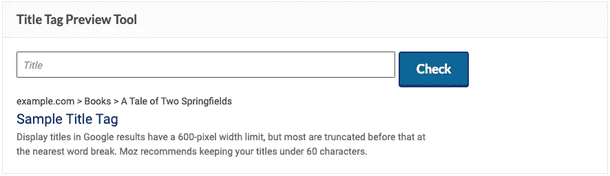
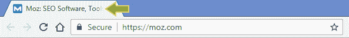
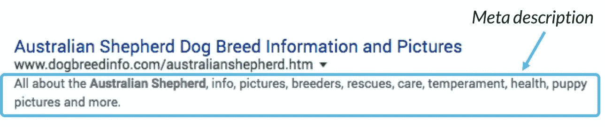
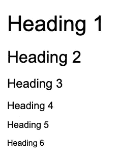

# Web 开发人员的 SEO 最佳实践

> 原文：<https://javascript.plainenglish.io/seo-best-practices-for-web-developers-2cd3424c5caf?source=collection_archive---------9----------------------->

## web 开发人员 SEOs 的重要指南。


Photo by [Luke Peters](https://unsplash.com/@lukepeters?utm_source=medium&utm_medium=referral) on [Unsplash](https://unsplash.com?utm_source=medium&utm_medium=referral)

自从谷歌开始主导搜索市场(这是很久以前的事了)，网络发展已经发生了巨大的变化。网页开发者不仅开始与网页设计师合作，也开始与搜索引擎优化专家合作。

如果你是一名 web 开发人员，你将不可避免地与 SEO 专家一起工作，他们会不断地要求你的帮助，根据他们的最佳实践来完成工作。下面列出了最常见的请求:

# 1.标题标签

title 标签是一个 HTML 元素，它指定了站点的标题。Title 标签允许特定的结果在搜索引擎结果页面(SERPs)上显示为可点击的标题。标题标签应该被定义为网页特定内容的简短描述。



Source: Moz.com

## 如何使用标题标签？

首先，不要让你的标题标签超过 60-70 个字符。在 SERP 中，长标题被缩短了大约 600-700 像素，所以你的长标题在 SERP 中开始消失。再一个就是关键词。你不会因为长时间输入任何单词而受到谷歌的惩罚，但你可能会间接遇到问题。

```
<head>
 <title>Your Title Tag Go Here</title>
</head>
```

避免使用只有一种关键字的标题，避免重复使用关键字。这样的标题既打扰了用户，也给搜索引擎带来了问题。

## 暗示

页面的标题不仅仅出现在 SERP 中。它在 web 浏览器中也显示为选项卡标题。一些 web 开发人员使用这个标题标签来吸引用户的注意力。title 标签变得更加容易，尤其是对于使用多个打开标签的人来说。



Source: Moz.com

# 2.元描述标签

meta description 标签决定了关于你的页面在 SERP 中将会写些什么。它是一个元标签，你可以在其中给出网页内容的简要描述，用户可以在搜索结果中看到它。



Source: Moz.com

## 如何使用元描述标签？

首先，在写元描述之前，有必要检查你的目标关键词的第一个 SERP。尝试用 140-160 个字符解释页面内容，并确保它是原创的。

```
<head> 
<meta name="description" 
content="Your meta description go here.">
</head>
```

# 3.标题标签(H 标题标签)

从 H1 到 H6 的标题标签是按等级排列的。标题标签应该包含用户可以搜索和总结内容的关键词。

H1 是主要的文本标题，它的任务是通过区分来创建最重要的标题。主题标题被印在带有 H1 标签的屏幕上，从而吸引了用户和搜索引擎的注意。



## 如何使用 header 标签？

谷歌会扫描你的帖子，寻找与搜索到的单词相关的内容，并查看标题来理解内容。这就是为什么标题标签的使用也很重要。title 标签告诉用户和搜索引擎这个页面是关于哪个主题的。

要为 SEO 创建一个理想的页面和内容，您必须为您在站点上输入的每个帖子创建一个自定义标题。标题标签向搜索引擎提供各种文本如何相互链接的信息。考虑到这种情况，将关键字包含在标题标签中是很重要的。

## 暗示

因为搜索引擎希望提供满足用户需求的页面，所以你可以通过正确优化的排名来提供与众不同的内容。

# 4.Meta Robots.txt 标签(Meta Robots.txt 标签)

Robots 元标签位于 Robots.txt 文件中，位于站点的主目录中。您不仅可以在文件中使用 robots 元标签，还可以在页面中作为代码使用。

```
<head>
**<meta name="robots" content="noindex" />**
</head>
```

怎么用？

*   noindex:防止爬网程序对页面进行索引。
*   Nofollow:防止爬虫跟踪页面上的链接。
*   nosnippet:阻止代码片段显示在搜索结果中。
*   noodp:禁止使用来自其他网站的替代描述。
*   noarchive:防止爬网程序显示页面的缓存内容。
*   noimageindex:让您指定不希望您的页面在 Google 搜索结果中显示为图像的引用页面。
*   none: noindex 相当于 nofollow。

## 暗示

robots.txt 文件可用于不同的目的。除了指定你的网站搜索引擎机器人将访问或不访问的部分，当你的网站正在建设中，设计变更工作，或一般维护时，也有可能使用它。

如果您刚刚建立了您的网站，设计工作正在进行中或正在更改您现有的设计，并希望阻止访问搜索引擎，您可以使用 robots.txt 文件。

# 5.Nofollow 属性

nofollow 标签是一个 HTML 特性，可以防止网页上的链接被搜索引擎跟踪。

```
Rel = "nofollow"
```

Nofollow 元素用于表示您希望 Google 将这个链接关联到您的网页上，并且您希望相应地传输您的链接授权。

## 如何使用 Nofollow 标签进行 SEO？

nofollow HTML 元素最明显的用途是阻止垃圾邮件和推广链接。你的网站给外部网站的链接并不总是可靠的。如果您不确定从您的站点链接到的页面的可靠性，有必要在链接中添加 Nofollow 标签。因此，您可以让垃圾邮件发送者远离您的网站，并防止您的网站无意中将 PageRank 传递给其他网站。

# 6.规范标签

它允许我们指定蜘蛛将基于哪个链接，因为相同的内容被具有 Rel 规范标签的两个不同链接结构的搜索引擎访问。

```
<link rel=“canonical” href=“https://example.com/sample-page/”/>
```

## SEO 如何使用规范标签？

规范标记位于页面 HTML 代码的顶部。放置标题标签、元描述和机器人标签的位置与放置规范标签的位置相同。

## 暗示

随着网站的发展，很难避免页面内容的重复，甚至几乎完全重复。“重复内容”可能会导致问题。如果你有几个相似的网页，并且用特定的关键词对所有网页进行排名，搜索引擎机器人将不知道将流量发送到哪个 URL。为了解决这个问题，我们需要以某种方式向 Google 报告我们的首选 URL。在这种情况下，规范的 URL 标记开始发挥作用。

# 7.结构化数据标记

结构化数据标记是使您的页面对搜索引擎更有意义的代码。搜索引擎读取代码，并使用它们以特定的方式显示搜索结果。它具有 SEO 价值。

## 您可以将数据标记用于:

*   组织
*   人
*   产品
*   面包屑
*   文章
*   录像
*   事件
*   秘诀

## 结构化数据标记

Schema.org，有着它最喜欢的名字，Schema 可以被认为是一个添加到 HTML 页面中的标签库(微数据)。通过这些标签，它旨在提高我们在谷歌搜索结果中的排名。

## SEO 如何使用数据标记？

尤其是随着技术的飞速发展，即使很多网站都是用现成的脚本建立的，但是有些网站有独特的代码，会在 SEO 中造成问题。搜索引擎、机器人对内容的理解可能很困难，甚至在某些情况下完全不可能。当涉及到这些和类似的情况时，结构化数据会让你的站点更容易理解。因此，我建议您使用这些标记。

# 8.图像替代文本描述

在 HTML 代码中定义图像时使用图像替代文本。替代文本不是标签。这是在标签中使用的属性。图像替代文本；也称为可选文本和子描述。有必要用大约 125 个字符来描述图像。

```

```

## 暗示

标题标签的主要用途是内容对人的影响。它可以作为行动的号召，所以它可以帮助访问者在读者没有看到的情况下了解图片。

作为一名开发人员，这些 SEO HTML 组件可能看起来很简单，但它们在我们的 SEO 同事的网站优化最佳实践中发挥了巨大的作用。

*更多内容看*[*plain English . io*](http://plainenglish.io/)