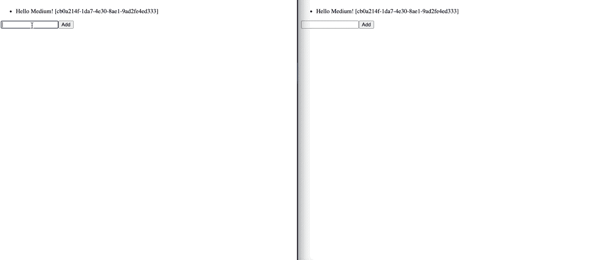

# React 中关注点的分离

> 原文：<https://javascript.plainenglish.io/separation-of-concerns-in-react-45a8cfcd3143?source=collection_archive---------8----------------------->

Photo by [Will Francis](https://unsplash.com/@willfrancis?utm_source=medium&utm_medium=referral) on [Unsplash](https://unsplash.com?utm_source=medium&utm_medium=referral)

在这篇博文中，我将演示如何构建一个 React 应用程序，该应用程序与我之前[构建的【WebSocket API 进行通信。如果你没有阅读之前的文章，不要担心，希望这篇文章仍然有意义。](https://aws.plainenglish.io/process-dynamodb-streams-with-lambda-5d870455f524)

在这个过程中，我将探索如何在 React 中正确地分离关注点，特别是如何使用服务定位器和依赖注入模式，以及如何分离表示组件和容器组件。我们开始吧！

# 建立 WebSocket 连接

我将使用没有任何花哨包装的 WebSocket API，尽管在现实生活中，我会认真考虑使用它来处理像重新连接这样的事情。

如果套接字不处于打开状态，向其发送消息将导致错误。为了防止它，我还引入了一个简单的包装器

返回的对象只公开了一个`send`方法，它是原始`send`的包装器。如果套接字没有打开，它将向队列中添加一条消息。在`open`事件中，队列中的所有消息都将按正确的顺序发送。如果连接是打开的，它只会转发消息。有可能一些边缘情况没有包含在这段代码中，这是考虑某种包装 WebSocket API 的库的另一个理由。

# 提出一个抽象概念

至此，我已经设置好了 WebSocket 连接。理论上，我可以只使用`getSocket`，直接从 React 组件或定制钩子开始与它交互。但是，我不打算这样做，原因有两个:

1.  引入 WebSocket API 依赖将使我的 React 代码难以测试。我只是不知道模仿 WebSocket API 的好方法。
2.  React 组件并不真正关心 WebSocket API surface 的大部分内容。直接从 React 组件使用 WebSocket 会破坏接口分离原则。
3.  依赖倒置原则告诉我们，我们应该依赖一个抽象，而不是一个具体的实现。

在我的例子中，我实现了一个实时待办事项列表。从 WebSocket 连接中，我将接收对我的 TODO 项的更新流。这就是为什么我决定用 Observables 抽象 WebSocket API。RxJS 是最流行的实现，但是我决定选择一个更简单、更轻便的[Zen-observable](https://github.com/zenparsing/zen-observable)库。

这是用 Observables 包装我的 WebSocket API 的一种非常简单的方法。我假设从 WebSocket 接收到 action 设置为`stream`和`payload`的消息，其中包含一组已更改的 TODOs。

# 连接它做出反应

到目前为止，我们还没有对 React 做任何事情。这很好，并不是所有事情都是关于反应的。然而，现在到了实际显示待办事项的时候了。

## 倾听变化

第一件事是订阅 observable，并将所有 TODOs 放入应用程序本地状态。我想让 API 变得非常简单。`useTodosSync()`将是完美的。但是，我其实对`socket`和`todoStream`有依赖。嗯，我可能会选`useTodosSync({socket, todoStream})`，但是我真的不喜欢它。原因如下:

1.  我只有一个`todoStream`，它是包装 WebSocket 连接的可观察对象。传来传去令人困惑。
2.  不想在道具上被迫过`socket`和`todoStream`。

这就是为什么我想出了一个我称之为*钩子工厂*的东西。`makeUseTodoSync`是一个返回钩子的函数。我猜这种模式在 React 社区中不是很流行，但是因为钩子只是函数，所以在我看来这很有意义。

让我们分析一下上面的代码。在`useEffect`我订阅了`todoStream`。对于发出的每一个 TODO，我都调度`UPSERT_TODO`动作，该动作在本地状态下创建或更新 TODO。如果你想知道如何建立这样一个商店，我在我的[上一篇文章](/replace-redux-with-usereducer-100406773332)中描述了它。

我还向 WebSocket API 发送`syncTodos`消息，这是为了告诉*嘿，我刚连接上，把所有现有的待办事项*发送给我。当然，我也可以用 REST API 调用来完成。

请不要说我引入了`Sandable`接口，因为我真的不在乎它是一个`WebSocket`接口，我不想依赖这个事实。

## 添加和切换

现在查询已经完成，让我们实现突变。出于与上述相同的原因，我将使用*钩子工厂*模式。

希望代码通俗易懂。我向 WS API 发送一条消息来通知这一变化，并乐观地更新本地存储。由于操作的异步性质，这里有一些竞争条件，但我决定不在本文中解决它们。

## 服务定位器

好了，我们有了*钩子工厂*。但是在 React 组件中，我们需要实际的钩子。我们如何到达那里？我最近读了马丁·福勒的一篇名为[重构模块依赖](https://martinfowler.com/articles/refactoring-dependencies.html)的优秀文章，这篇文章激励我创造了下面的解决方案。

想法很简单，我想为`useTodos`和`useTodosSync`钩子的用户提供一个简单的接口。我希望他们提供包括电池(在这种情况下，电池是`socket`和`todosStream`)。这是一个依赖注入模式，我注入电池，所以客户端不需要担心它们。

## 演示组件

我是分离表示组件和容器组件的爱好者，这个想法是我在这篇文章中第一次学到的。通过分离表示层，你可以使用像 storybook 这样的工具独立地开发 UI 组件，没有任何嘲笑，我认为这本身就很酷。

这是一个表示组件的例子

它没有依赖关系。很无聊，但我喜欢。如果你能提取一个无聊的部分，就去做，不要把复杂的部分和无聊的部分混在一起。理想情况下，表示组件只依赖于其他表示组件。

## 容器组件

当然我们也需要容器组件。容器组件调用定制挂钩并呈现表示性组件，但是它们不应该关心标记或 CSS。当然，React 并不强制这样做，但是根据我的经验，它使代码更容易推理。

这是一个容器组件的例子。

注意，`useTodo`钩子是从我前面介绍的服务定位器导入的。

## 缝隙模式

所以之前我说过*理想情况下，表示组件只依赖于其他表示组件。*这并不意味着容器组件不能在不违反这个规则的情况下呈现在表示性组件中。让我们看一个例子。

`Layout`组件是一个表示性组件，它接受两个容器组件作为插槽。我的实现很简单，只是为了演示一下思路。

使用插槽模式也可以带来一些性能上的好处。

# 摘要

我知道这篇文章代码很多，但是我希望它介绍了一些你不知道或者还没有在 React 中使用的模式。现在你可以试着告诉我你是否喜欢它！

In action

非常感谢 [Dorian](https://dorians.medium.com/) 提出了将可观察到的变化标准化并在 React 中使用可观察到的变化的想法。

*更多内容尽在*[***plain English . io***](http://plainenglish.io)