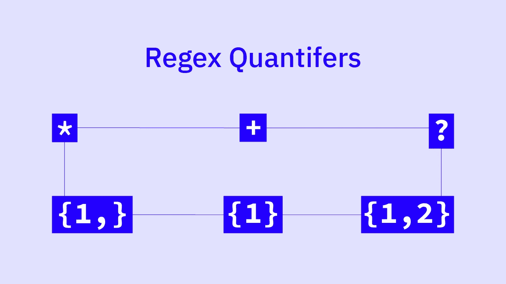

# 不到 10 分钟的 JavaScript Regex 量词？真的吗？

> 原文：<https://javascript.plainenglish.io/seriously-javascript-regex-quantifiers-in-under-10-mins-f281146bfea2?source=collection_archive---------20----------------------->

Six different quantifiers to explore in regex.

# 介绍

如果不使用被称为 ***量词*** 的特殊概念，正则表达式是相当单调和累人的。

量词用来将一个模式复制给定的次数。

如果你被要求在一个测试字符串中匹配连续出现 100 次的字符`'a'`,你会用 100 个 a 来构造一个表达式吗，或者更有效的方法？

在这一章中，我们将发现量词的细节，并看到大量的例子。所以，我们不要再浪费时间了，马上开始吧。

# 什么是量词？

顾名思义，**量词**是用来*量化*给定模式的特殊字符。通过*‘量化’*，我们的意思是模式被**复制了一定的次数**。

更具体地说，量词不仅仅量化某些给定的模式，而是量化紧接在它们前面的模式*。*

因此，当我们需要匹配连续出现 *n* 次的模式时，我们可以使用量词，而不是手动重新输入模式那么多次。

以量词+为例。它获取其先前的模式，并对其进行一次或多次量化。

这意味着表达式`/a+/`将匹配字符串`'a'`、`'aa'`、`'aaa'`等等，因为`+`之前的模式，即`a`，将在测试字符串中被查找一次或多次。

类似地，`/ca+t/`将匹配字符串`'cat'`、`'caat'`、`'caaat'`、`'caaaat'`，以此类推。该表达式将查找一次或多次`c`，然后是`a`，最后是`t`。

在这两个表达式中，我们说`a`已经被范围从 1 到无穷大的`**+**` ***量词*** 量化了*(我们稍后将看到范围是如何工作的)。*

*正则表达式配备了比仅仅`+`量词多得多的量词。下面给出了完整的列表。在接下来的例子中，我们将使用这里显示的每一个量词。*

# ** —零或更多*

*`*`量词零次或多次寻找其前面的模式**。***

***与`+`不同，它甚至匹配那些前面的表达式从未出现过的子字符串。其范围为 **0-∞** 。***

***比如`/ca*t/`匹配字符串`'ct'`、`'cat'`、`'caat'`、`'caaat'`等等。注意这里的第一个匹配，即`'ct'` —它有零个字符`a`出现的**和仅匹配表达式`/ca*t/`，而不是`/ca+t/`。*****

***这仅仅是因为`+`需要至少出现一次其前面的模式，而`*`至少不需要。***

# ******+ —一个或多个******

***`+`量词一次或多次寻找其前面的模式**。*****

*****其范围为 **1-∞** 。*****

*****例如`/se+/`匹配字符串`'se'`、`'see'`、`'seee'`、`'seeee'`等等。然而`/se+/`不会匹配字符串`'s'`，因为那里没有`e`。*****

# *****？—零或一*****

*****`+`量词为**零个或一个出现**寻找其前面的模式。这意味着它的范围是 0-1。*****

*****因此，表达式`/ca?t/`将只匹配字符串`'ct'`和`'cat'`，在测试字符串中分别出现 0 次和 1 次`'a'`。*****

# *****自定义范围*****

*****除了量词`+`、`*`和`?`的这些预定义范围，在正则表达式中，我们还有机会**创建自定义量词**。*****

*****它们由花括号`{}`和至少一个数字给出。*****

*****下面是自定义量词的工作原理:*****

*****如果我们在大括号中只指定了一个值，比如`{5}`，那么量词就会在测试字符串中查找**的前一个模式，其次数正好是**的次数。例如,`/c{2}t/`将只匹配子串`'caat'`和两次出现的`a`——没有别的。*****

*****另一方面，如果我们在大括号内用逗号分隔两个数字，如在`{1,2}`中，量词在给定的**量化范围**内寻找前面的模式。例如`/ca{1,3}t/`将匹配子字符串`'cat'`、`'caat'`和`'caaat'`——没有其他的。*****

*****省略逗号后的结束值，就像在`{0,}`中一样，使**成为一个开放范围的量词**，即它从给定的数字开始，然后一直到无穷大。例如，`/ca{3,}t/`将匹配至少出现 3 次`a`的子字符串`'caaat'`、`'caaaat'`和`'caaaaat'`——没有其他。*****

# *****这是它的乡亲们！*****

*****本质上，这都是关于 JavaScript 正则表达式中的量词。*****

*****正如您可能从本文中体会到的，正则表达式的优势在于量化的概念。没有它，我们无法控制复杂模式的匹配，因为*的东西可能会重复任意次*。*****

*****让我们以一个简单的任务来结束这篇文章。解决办法可以在[*https://www.codeguage.com/courses/regexp/quantifiers*](https://www.codeguage.com/courses/regexp/quantifiers)*找到。******

## *****编写一个表达式，在字符串中查找以下序列:*****

## *****`'1'`(出现一次或多次)，然后是`'0'`(出现三次或三次以上)，最后是`'2'`(正好出现三次)。*****

******原载于*[*https://www.codeguage.com/courses/regexp/quantifiers.*](https://www.codeguage.com/courses/regexp/quantifiers)*****

*****[*更多内容敬请关注*. io](http://plainenglish.io/)*****