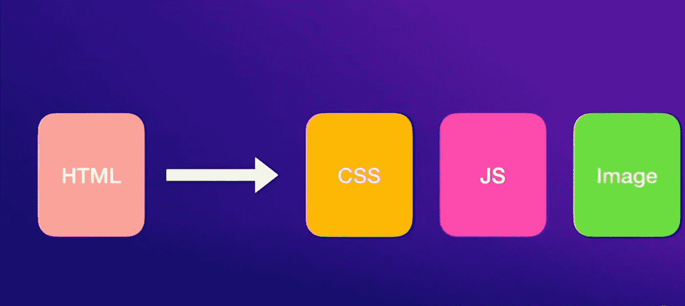

# 服务器端呈现的网站与客户端呈现的网站

> 原文：<https://javascript.plainenglish.io/server-side-rendered-and-client-side-rendered-websites-fed52a3aac66?source=collection_archive---------11----------------------->

Photo by [Firmbee.com](https://unsplash.com/@firmbee?utm_source=medium&utm_medium=referral) on [Unsplash](https://unsplash.com?utm_source=medium&utm_medium=referral)

如今，网络是我们生活的一部分。我们每天都会访问很多网站。但是如果我们更深入地观察，我们会发现所有呈现在我们屏幕上的内容都只是 HTML。只是那些华而不实的网站背后的 HTML 内容。

今天，我们将探讨开发人员将这些 HTML 内容从他们的服务器交付到客户端所使用的模式。我们将网站分为两类:

*   **客户端渲染网站**
*   **服务器端渲染网站**

## 客户端渲染的网站

客户端呈现，也称为 CSR，是在客户端呈现 HTML 内容的模式。

当您的浏览器向远程服务器请求网站时，远程服务器会用 HTML 文件进行响应。一般来说，这个 HTML 文件不包含很多要在屏幕上显示的信息。相反，它包含 JavaScript、CSS 和图像的 URL，这些都是呈现该页面所必需的。

在所有这些文件中，JavaScript 文件在 CSR 网站中起着最重要的作用。你可以假设 JavaScript 是幕后操纵者。

因此，当 JavaScript 文件到达浏览器时，浏览器将花费一些时间来解析和评估 JavaScript，之后，JavaScript 将控制整个流程。JavaScript 将控制如何获取数据，何时数据可用，如何进行数据绑定，如何处理点击，等等。

因此，在典型情况下，JavaScript 将获取数据，并在客户端执行数据处理和数据绑定操作。由于繁重的工作是在客户端完成的，这类网站被称为客户端渲染网站。

## 服务器端呈现的网站

服务器端渲染网站，别名 SSR，是在服务器端执行繁重任务的网站类型。因此，如果客户端请求网站，服务器将向客户端提供最终处理的 HTML 内容，这些内容将呈现在屏幕上。数据获取、数据绑定操作都在服务器端完成，客户端被提供 HTML 文件，该文件必须呈现在屏幕上。繁重的工作是在服务器端完成的，因此它们被称为服务器端渲染网站。

Server-side rendered websites

## SSR 和 CSR 的比较

**SSR 网站的特点有:**

*   有利于搜索引擎优化
*   客户端加载速度更快，因为服务器为他们提供了最终处理后的数据
*   对于在页面之间导航来说，它们不太具有交互性，下一页将从远程服务器获取

**CSR 网站的特点是:**

*   他们对 SEO 不太好。由于服务器提供的 HTML 内容几乎是空的，许多 SEO 机器人在索引它们时会遇到麻烦
*   它们需要一些时间加载到客户端，因为它们必须获取 JS 文件并处理它们，但是页面之间的后续转换通常非常平滑
*   与 SSR 相比，CSR 网站的互动性更强

你可以在这里得到同样的视频解释:

*更多内容看*[***plain English . io***](http://plainenglish.io/)