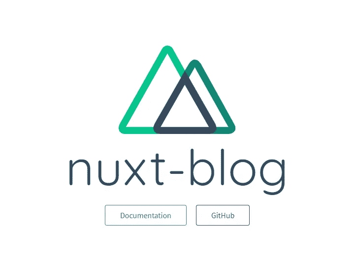

# 使用 Nuxt.js 在 Vue 中进行服务器端渲染

> 原文：<https://javascript.plainenglish.io/server-side-rendering-in-vue-with-nuxtjs-9c9f6328d69d?source=collection_archive---------18----------------------->

*最简单最好的方法！*


Photo by [Caspar Camille Rubin](https://unsplash.com/@casparrubin?utm_source=unsplash&utm_medium=referral&utm_content=creditCopyText) on [Unsplash](https://unsplash.com/s/photos/vue?utm_source=unsplash&utm_medium=referral&utm_content=creditCopyText)

[Jamstack](https://jamstack.org/) 中的服务器端渲染和编程变得越来越标准。速度、安全性和开发人员体验方面的优势在大多数项目中都是可行的。你可能也想亲自去看看。

Vue.js 是一个前端库，它使得创建可伸缩的 web 应用程序变得非常容易。这很容易学习和设置。它默认带有 [Nuxt.js](https://nuxtjs.org/) 。让我们开始吧。

# 如何开始

所有编程教程的第一步是通过安装包和初始化我们需要的不同组件来设置项目。在这种情况下，NPM 或纱。

打开你最喜欢的编辑器，打开终端，输入以下命令初始化 Yarn:

```
yarn create nuxt-app nuxt-blog
```

`nuxt-blog`参数是项目的名称。这可以是你喜欢的任何东西。你会看到很多选择。除了一个之外，我都选择了默认设置。

```
Deployment target: Static (Static/Jamstack hosting)
```

这确保了我们实际上可以使用 Nuxt 的静态站点呈现功能。

接下来，我们可以进入安装过程创建的文件夹，并运行以下命令来运行基本项目:

```
yarn dev
```

构建和运行项目需要一些时间。之后，您可以在您最喜欢的网络浏览器中的`localhost:3000`上找到它。



The basic web page after the first launch.

当然，下一步是根据我们的喜好改变主页。您可能在初始化过程中添加了一个前端库，如 Tailwind 或 Bootstrap。你可以在`/pages/index.vue`找到这个文件。享受构建下一个 web 应用程序的过程。

如果你愿意，你也可以使用你选择的包管理器自己安装 Nuxt.js。这样，您就有了更多的灵活性，并且您确切地知道您的项目中安装了什么。

打开一个新文件夹，初始化 NPM，这样我们就可以开始添加软件包。

```
npm init
```

用下面的脚本填充您的`package.json`文件，这样我们就可以在添加我们需要的库之后开始项目。

```
"scripts": {
   "dev": "nuxt",
   "build": "nuxt build",
   "generate": "nuxt generate",
   "start": "nuxt start"
}
```

使用`npm i nuxt`安装 Nuxt。这将安装 Nuxt 及其所有依赖项。在安装过程中，我们可以为页面创建一个新目录，为索引页面创建一个新文件。文件夹得叫`pages`，文件要叫`index.vue`。

通过运行`npm run build`构建项目，并等待项目构建完成。之后就可以运行`npm run dev`了。你的项目现在将在`localhost:3000`上线。


The output of our page

现在，您可以像往常一样继续开发您的 Vue 应用程序。你可以在这里阅读更多关于 Nuxt.js [的内容。](https://nuxtjs.org/)

# 结论

如果你是一个 Vue 开发者，你想进入 Jamstack 生态系统，这是你最好的选择。如果你是 React 开发者，可以去看看 Next.js 或者 Gatsby！

查看 Jamstack 的网站，了解更多关于服务器端渲染和静态网页的优点和缺点。

祝开发愉快，非常感谢您的阅读，祝您度过美好的一天。

*更多内容尽在*[*plain English . io*](http://plainenglish.io/)