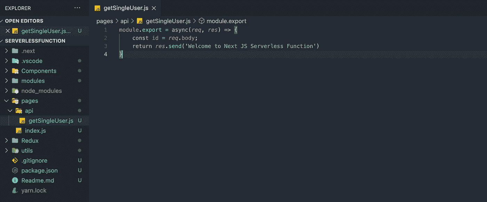
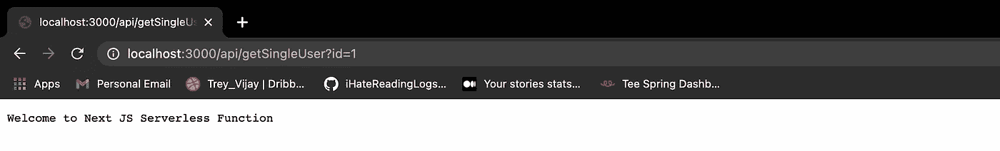
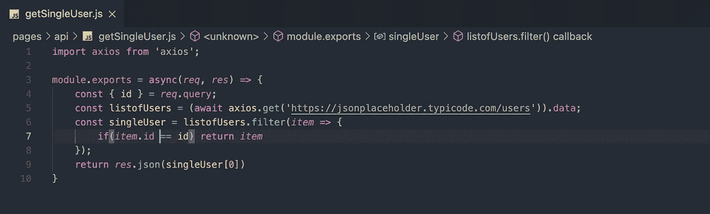
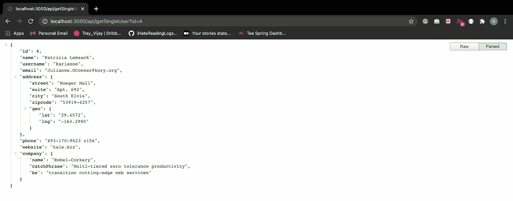
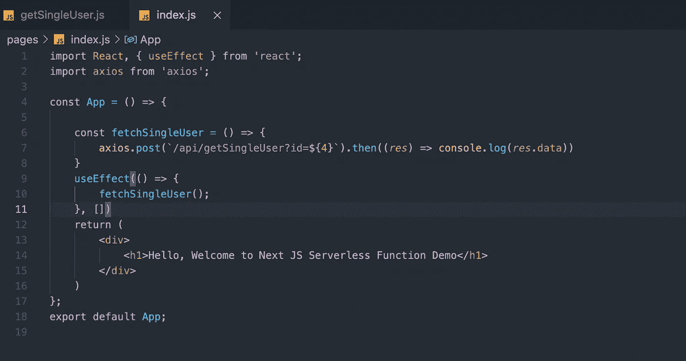
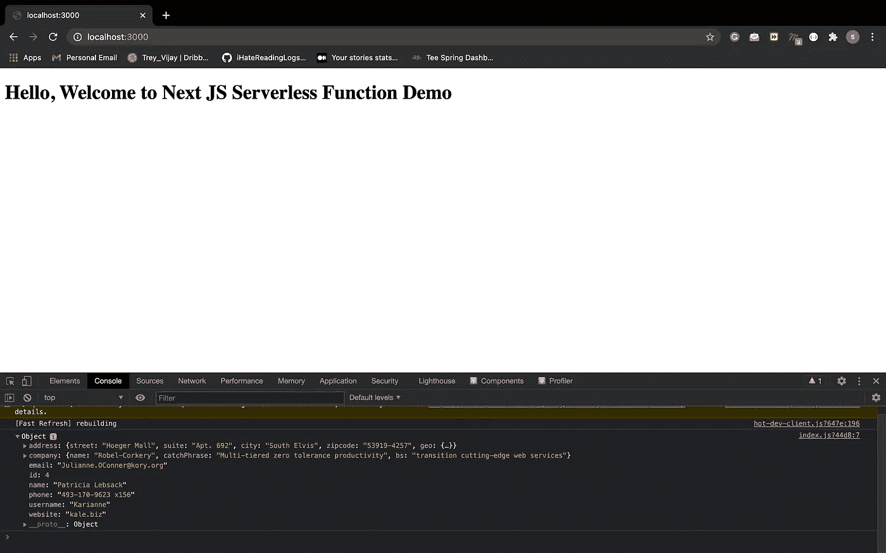
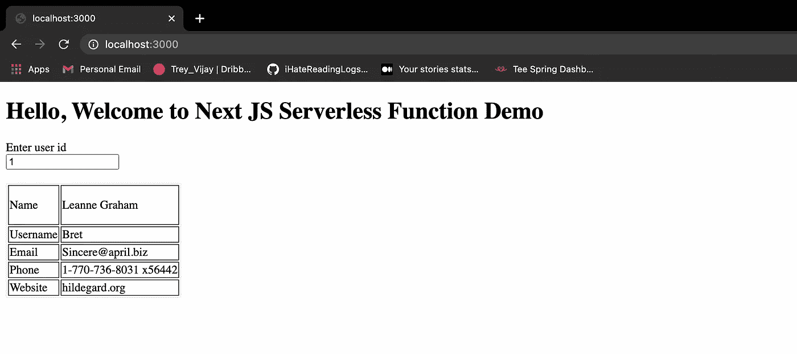

# Next.js 中的无服务器函数

> 原文：<https://javascript.plainenglish.io/serverless-function-in-next-js-3cd0d22ab983?source=collection_archive---------2----------------------->

## 详细了解 Next.js 的无服务器功能


Serverless Function banner image designed by me

js 是一个可靠的 react 框架，带有许多内置功能，如服务器端渲染、SEO 优化、动态路由等。我已经写过一篇关于构建可靠的 Next.js 架构的文章。此外，为了创建我们的无服务器功能，我使用了我在解释 Next.js 架构时已经创建的同一个存储库。

[](https://medium.com/nerd-for-tech/building-solid-next-js-architecture-a8c6702dc67d) [## 构建可靠的下一代 JS 架构

### 为 react 应用程序构建可靠的 Next JS 架构。

medium.com](https://medium.com/nerd-for-tech/building-solid-next-js-architecture-a8c6702dc67d) 

```
**Repository =>** [https://github.com/shreyvijayvargiya/iHateReadingLogs/tree/main/TechLogs/MaterialUIInstallationWithNextJS](https://github.com/shreyvijayvargiya/iHateReadingLogs/tree/main/TechLogs/NextJSArchitecture)
```

# **无服务器功能**

顾名思义，它们是 JavaScript 函数，帮助发出 HTTP 请求并发送响应。无服务器功能带来了用户认证、表单提交等好处。

# 执行

每个无服务器函数都是一个 JavaScript 函数，有两个参数，一个写为“req”的请求和一个写为“res”的响应。如果你熟悉 Node JS 的 Express 框架，那么你可以像在**控制器**中定义一个简单的 API 一样模仿它。接受请求并在服务器上返回响应，但不在任何服务器上托管的函数基本上是一个无服务器函数。

Next.js 为编写无服务器函数提供了内置支持。在 pages 目录中，您必须创建一个名为“api”的文件夹。该文件夹包含文件，每个文件名都是无服务器功能的端点。例如，我们的文件夹结构如下所示-

```
-pages
 -api
  -- getUsers.js 
```

这里的“***getUser****”*将成为我们的无服务器函数的端点，认为你的无服务器函数本身就是一个 API。它将接受一个请求对象并返回一个响应，所以在我们的无服务器功能中，我们可以连接我们的数据库，我们可以进行用户验证，表单提交等等。默认情况下，每个无服务器函数都需要导出，并且必须从每个无服务器函数返回一个响应，否则服务器将陷入未处理的承诺拒绝，这意味着没有来自服务器的响应，函数将无限期地继续执行。

## **编写我们的基本无服务器功能**

我正在使用一个来自 JSON 占位符的示例 GET API，并将尝试使用我们的无服务器函数获取这些数据。我将添加从这个示例 API 获取单个用户数据，如果基于一个“键”进行过滤，则该单个用户数据，该键将从无服务器函数的请求对象的查询参数中获取。

这听起来可能很难，但执行起来非常简单，以此为例。我们的 API 端点应该是这样的。

```
**API =>** [**https://www.localhost:3000/api/getSingleUser?id=1**](http://localhost:3000/api/getSingleUser?id=1) 
```

根据 API，我们的无服务器函数应该有一个文件名，这里的 API 名称是“ **getSingleUser** ”。接下来，我们有一个端点查询参数，即**“id”**。使用这两个理解值，我们将编写我们的第一个无服务器函数。



Our First Serverless Function

在附图中，左侧面板是文件夹结构，右侧面板由一个简单的函数组成，该函数将文本作为响应返回。

> 请不要将文件夹“api”的名称更改为其他名称。

为了在本地服务器上查看无服务器功能的响应，请在 google chrome 上访问以下端点。

```
**API =>** [**https://www.localhost:3000/api/getSingleUser?id=1**](http://localhost:3000/api/getSingleUser?id=1)
```



Serverless function on our localhost

使用示例 GET API 获取用户列表。我们将使用的 API 如下所示-

```
**Sample GET API =>** [https://jsonplaceholder.typicode.com/users](https://jsonplaceholder.typicode.com/users)
```

我们的议程是获取所有用户的列表，然后使用我们的**“id”**作为查询参数，然后从一组用户中过滤出一个用户，并返回该用户以响应我们的无服务器函数。



singleUser.js

我们使用 [Axios](https://medium.com/u/5e0bd5d0161a?source=post_page-----3cd0d22ab983--------------------------------) 从示例 GET API 中获取所有用户的列表。然后使用我们的**“id”**作为过滤参数过滤单个用户，从请求对象的查询中获取单个用户，并响应我们的无服务器函数发送该数据。



Response object from first Serverless Function

现在，您可以将此端点视为单个 API，我们可以在任何组件的前端使用此端点来获取单个用户的数据。
在任何组件中，我们只需要使用 axios 或 fetch 方法发出 API 请求，并传递单个“**id”**作为查询，axios 请求方法中的响应对象就是您在 localhost 上的上图中看到的数据。



Index.js

我们的根应用程序的 App 组件使用我们的无服务器函数获取单个用户数据。在这里，我们可以选择直接将 API 端点中的 id 给 axios，或者我们也可以有一个动态端点。

***注意*** *:我们只是使用“****/api/single user”****作为 API 端点，***next . js 内置自动检测这个无服务器函数已经托管的当前域名。**

**

*Localhost console in Chrome Inspect*

# *最终产品*

*我添加了一个输入，从客户端获取用户 id。*

**

*User data with user id as 1*

# *结论*

*在使用端点而不将它们部署在独立服务器上的情况下，无服务器功能非常有用。联系我们的形式，用户认证都可以使用这些功能。我已经使用了一个无服务器的功能来访问 Twitter 的 npm 包的前端使用 Twitter 的 API。
无服务器功能的其他好处是您不需要处理 CORS 策略，因为我们从一台服务器向另一台服务器发出 API 请求。*

*直到，下一次，有一个美好的一天，人们。*

```
***Code Sample =>** [https://github.com/shreyvijayvargiya/iHateReadingLogs/tree/main/TechLogs/ServerlessFunction](https://github.com/shreyvijayvargiya/iHateReadingLogs/tree/main/TechLogs/ServerlessFunction)*
```