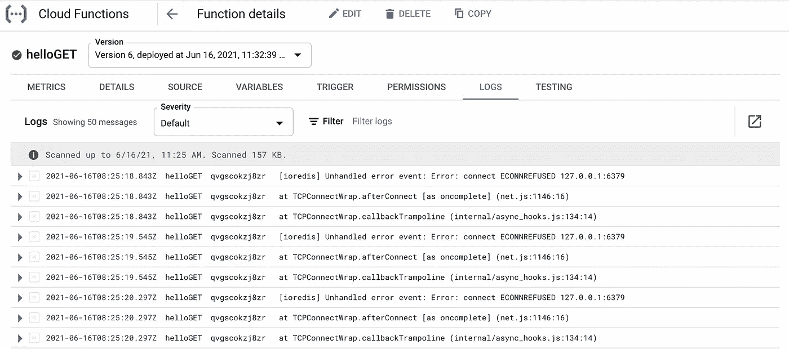

# 谷歌云功能上的无服务器 Redis

> 原文：<https://javascript.plainenglish.io/serverless-redis-on-google-cloud-functions-3a4160731c83?source=collection_archive---------10----------------------->


Google Cloud Functions 是第二受欢迎的无服务器执行平台。类似于 AWS Lambda，它是无状态的，即你需要访问外部资源来读取或写入你的应用程序状态。在这篇文章中，我们将介绍 Redis 作为谷歌云功能的数据库。

本教程展示了如何在 Google Cloud 函数上用 Redis 构建一个无服务器 API。API 将简单地统计页面浏览量，并以 JSON 格式显示出来。

看演示:[https://us-central 1-functions-317005 . cloud functions . net/hello get](https://us-central1-functions-317005.cloudfunctions.net/helloGET)

见代码:[https://github . com/upstash/examples/tree/master/using-Google-cloud-functions](https://github.com/upstash/examples/tree/master/using-google-cloud-functions)

*   无服务器计算:谷歌云功能(Node.js)
*   无服务器数据存储:通过 Upstash 的 Redis
*   部署工具:gcloud

## 先决条件

*   谷歌云功能的 GCP 账户。
*   安装[谷歌云 SDK](https://cloud.google.com/sdk/docs/install) 。
*   无服务器 Redis 的一个新帐户。

## 步骤 1:初始化项目

创建一个文件夹，然后在文件夹中运行`npm init`。

## 步骤 2:安装 Redis 客户端

我们唯一的依赖是 Redis 客户端。通过`npm install ioredis`安装 go-redis

## 步骤 3:创建 Redis 数据库

从后台控制台创建一个 Redis 数据库。**选择 GCP 美国中部-1 作为地区。**自由层应该足够了。这很简单，但如果你需要帮助，请查看[入门指南](https://docs.upstash.com/)。在“数据库详细信息”页面中，单击“连接”按钮。在下一步中，您将需要端点和密码。

## 第四步:功能代码

创建 **index.js** 如下:

```
var Redis = require("ioredis");if (typeof client === 'undefined') {
    var client = new Redis("REPLACE_YOUR_UPSTASH_REDIS_URL");
}exports.helloGET = async(req, res) => {
    let count = await client.incr("counter");
    res.send('Page view:' + count);
};
```

用数据库的 ioredis url 替换`“REPLACE_YOUR_UPSTASH_REDIS_URL”`。

这段代码只是增加 Redis 数据库中的一个计数器，并以 json 格式返回它的值。

## 第五步:部署

现在我们已经准备好部署我们的 API 了。通过以下方式部署:

```
gcloud functions deploy helloGET \
--runtime nodejs14 --trigger-http --allow-unauthenticated
```

您将看到您的云功能的 URL。单击 URL 以检查它是否正常工作。

```
httpsTrigger:
securityLevel: SECURE_OPTIONAL
url: [https://us-central1-functions-317005.cloudfunctions.net/helloGET](https://us-central1-functions-317005.cloudfunctions.net/helloGET)
```

如果出现问题，您可以在 GCP 控制台中查看您的云功能的日志，如下所示。



*原载于*[*https://docs.upstash.com*](https://docs.upstash.com/tutorials/using_google_cloud_functions)*。*

*更多内容看*[***plain English . io***](http://plainenglish.io)