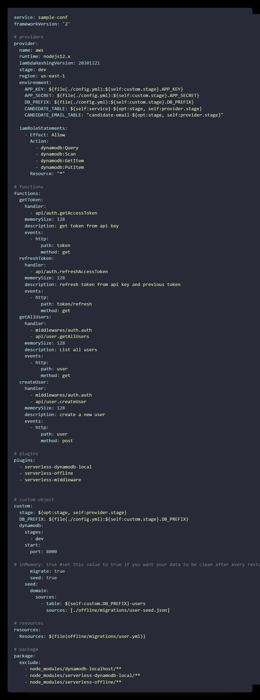
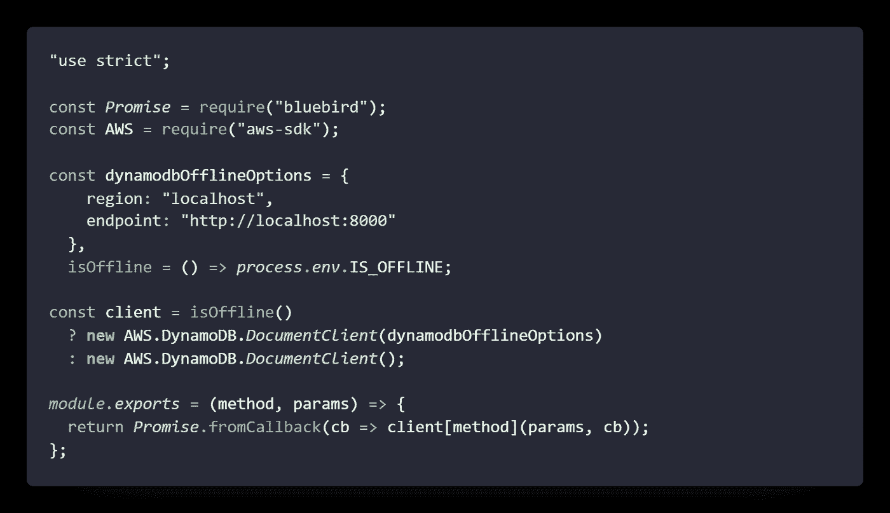
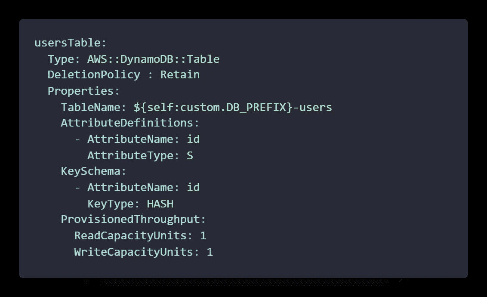
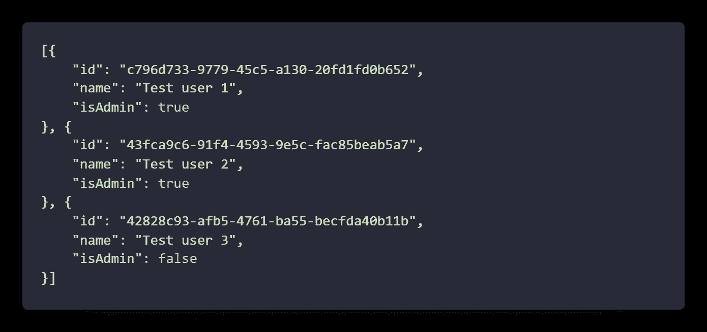
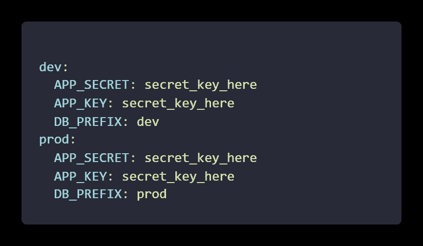
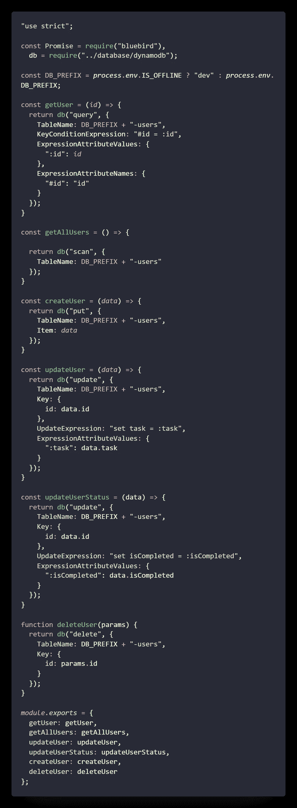
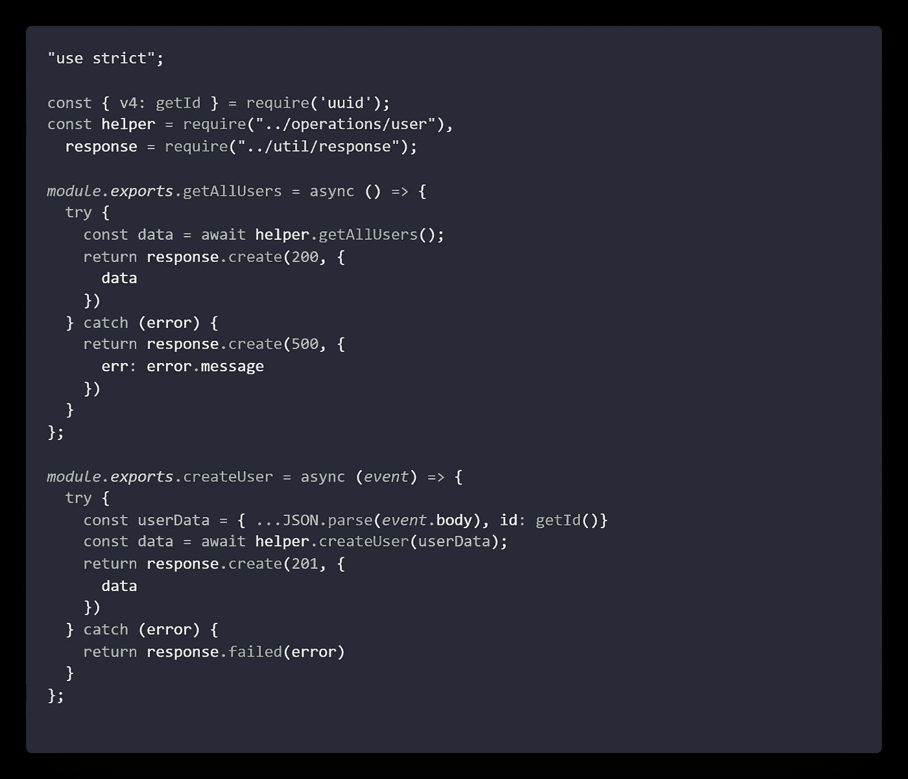
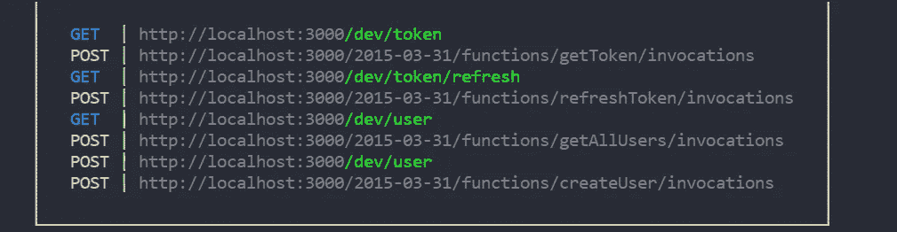

# 带本地 DynamoDB 的无服务器

> 原文：<https://javascript.plainenglish.io/serverless-with-local-dynamodb-afc90940798?source=collection_archive---------3----------------------->

Photo by [Ian Battaglia](https://unsplash.com/@ianjbattaglia?utm_source=medium&utm_medium=referral) on [Unsplash](https://unsplash.com?utm_source=medium&utm_medium=referral)

# **简介**

希望你们过得很好。本文是关于通过在本地安装 DynamoDB 并对其进行配置来构建您自己的无服务器应用程序。如果你不熟悉什么是无服务器或者什么是 DynamoDB，那么我建议你先了解一下这个系统的基本概念。对于本文，我假设您已经对 serverless 如何使用 DynamoDB 有了基本的了解。所以让我们来了解一下离线设置的必要性。Bdw，你可以在这里找到源代码

# 为什么需要它？

众所周知，无服务器比常规的服务器安装成本更高(如果你做的一切都是正确的)。因此，最重要的是将成本降到最低，通过进行本地设置和正确的迁移，您可以使用 ngrok 或类似工具为您和您的团队建立一个很酷的工作环境。现在让我们开始编码。

# 开始

要开始使用无服务器，您需要在本地安装无服务器软件包。你可以使用`npm i serverless -g`或`yarn global add serverless.`来完成。一旦你安装了应用程序，你可以使用命令来创建一个应用程序，但是对于本教程，我从头开始使用所有的东西。

Photo by [Gia Oris](https://unsplash.com/@giabyte?utm_source=medium&utm_medium=referral) on [Unsplash](https://unsplash.com?utm_source=medium&utm_medium=referral)

现在，我们完成了理论，让我们跳到一些代码上。首先，我们需要创建一个文件名`serverless.yml`，这将是我们在这里的入口点。以下是该文件的内容。

在这个文件中，你会看到让你困惑的代码，但是不要担心，我们会一部分一部分地介绍。

> 您可以根据需要在文件中添加或删除内容，比如删除中间件或添加. env 文件

*   服务—它是您的无服务器应用程序的名称
*   框架版本—框架版本，您可以从无服务器指南中指定
*   提供商—您的无服务器提供商。我的是 AWS。您还可以在应用程序级别向其添加其他字段
*   功能——这是您将花费大部分时间编写业务逻辑的地方。一个函数会有多种状态，比如句柄、内存大小、要触发的事件
*   插件——运行应用程序所需的附加库，如中间件、本地数据库、无服务器离线
*   自定义—插件的自定义对象
*   资源—您的数据库迁移(如果有)
*   包—构建时打包，以包含或排除模块

现在你对这个方法有了一个基本的概念，我们可以继续使用本地 DynamoDB 了

首先，我们需要安装几个包

*   蓝鸟——处理承诺
*   无服务器中间件——向您的处理程序添加中间件
*   UUID —为您的文档生成新的 ID
*   无服务器-dynamo db-local—[Dev]管理 DynamoDB local
*   无服务器-脱机[开发]

## 装置

要开始安装，您需要为您的机器准备好 Java。一旦你下载了 Java。你可以手动下载 DynamoDB local 或者运行`npm i db-setup`来获取副本。

> 如果您没有使用 npm 软件包，则需要先下载副本，然后在同一文件夹中运行以下命令
> 
> java -Djava.library.path*。/DynamoDBLocal _ lib-jar DynamoDBLocal . jar-shared db

现在，让我们在根项目中创建一个数据库文件夹，并在它下面创建一个`dynamodb.js`文件。以下是连接的内容

dynamodb.js

`process.env.IS_OFFLINE`是无服务器脱机软件包给定的值。我们已经据此配置了数据库。我们只需要给副本一个本地地址。

现在数据库已经连接好了。我们需要为它们创建处理程序和中间件。但在此之前，我们需要为该方法添加一些操作和实用程序。你可以从 repo [这里](https://github.com/Classy-Endevours/serverless-dynamodb-starter)复制这些文件。这些只是为了更好的编码方法，仅此而已。

现在让我们创建一个名为`offline/migrations`的文件夹来创建和存储项目的迁移和种子。创建一个名为`user.yml`的文件，它将为我们创建表格

这将为表提供 id。您可以根据自己的需要进行配置，并添加种子，您可以看到任何具有唯一 id 的原始数据作为必填字段。如果你回到`serverless.yml`，我们有一个定制的对象被配置为获取数据源

现在让我们创建一个`config.yml`文件来存储基于阶段的配置变量。你可以借助。env 文件也一样

这也类似于获取 env 变量的`serverless.yml`文件。

现在让我们创建一个文件`operations/user.js`来处理数据库操作

在这里，您可以创建对数据库的小查询，为我们执行 CRUD 操作。

现在让我们在根项目中创建一个名为`api`的文件夹，并添加一个文件`user.js`。如果你不想要中间件，你可以清理掉 serverless.yml

以下是`user.js,`中的内容

## 运行应用程序

要运行应用程序，您只需键入命令`npm run dev`来启动服务器，如果您离线，还可以运行您刚刚创建的迁移

server starts

如果一切顺利，你会看到类似的情况。你可以试着按照你的要求来处理代码。

希望这篇文章能帮助你用本地 DynamoDB 配置无服务器。谢了。

*更多内容看*[***plain English . io***](http://plainenglish.io)