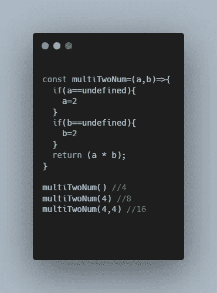
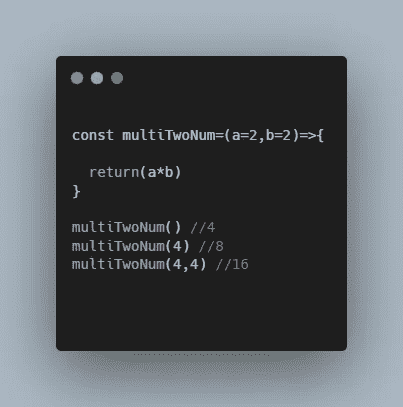

# 用 JavaScript 轻松设置默认参数

> 原文：<https://javascript.plainenglish.io/set-default-parameters-the-easy-way-in-javascript-62b28b981d15?source=collection_archive---------19----------------------->

如何正确设置默认参数

Photo by [Arnold Francisca](https://unsplash.com/@clark_fransa?utm_source=medium&utm_medium=referral) on [Unsplash](https://unsplash.com?utm_source=medium&utm_medium=referral)

如果您曾经在 JavaScript 中使用过函数，那么您肯定会遇到参数。

参数是我们将值(也称为自变量)导入函数的方式。理解参数是提高 JavaScript 技能的关键

在今天的文章中，我将教你如何正确地设置参数的默认值。

# 设置默认值

为了展示如何设置默认参数值，我将创建一个简单的函数。这个函数将两个数相乘。

如果*没有*值传入函数，它将返回 2 乘以 2。

如果只有*一个*值被传入该函数，则该函数将返回两倍于其他传入值的值。

但是在我向你展示设置默认值的*正确*方式之前，我将首先向你展示设置默认值的*错误*方式

# **设置默认值的错误方式**

为了展示如何设置默认参数值，我将创建一个简单的函数。这个函数将两个数相乘。

如果*没有*值传入函数，它将返回 2 乘以 2。

如果只有*一个*值被传入该函数，则该函数将返回 2 次任何其他传入的值。

但是在我向您展示设置默认值的正确方式之前，我将首先向您展示设置默认值的错误方式

# 设置默认值的错误方式

好吧，我将要展示的方法不一定是*错误的，*它仍然可以很好地工作，但是它将包含更多不必要的代码。

这种方式包括使用 if 语句(或任何其他类型的条件语句)来设置参数值，如果所述参数值未定义的话。

这方面的代码如下所示:

Code for Setting default parameters the “WRONG” way

如前所述，这段代码运行良好，但它比我们需要的要长。现在，我将向您展示一种更短的方法来获得同样精确的结果

# **设置默认值的正确方法**

如果你看下面的代码，你会看到设置默认参数的*正确的*方式，就像在参数后面加上等号和期望值一样简单。

The easy way to set default values In javascript

# 结论

感谢您阅读完我的文章**‘在 JavaScript 中轻松设置默认参数’**。我希望你有美好的一天。以下是我的一些进一步的文章供你阅读:

 [## 你绝对需要了解的 8 个 React 原生库

### 当谈到使用 React Native 创建应用程序时，找到正确的库可以使开发过程变得更加…

javascript.plainenglish.io](/8-react-native-libraries-you-absolutely-need-to-know-about-28f6038d0b76)  [## 如何在 React 和 React Native 中以正确的方式实现条件呈现

### 在 Web 和移动应用中使用动态用户界面

javascript.plainenglish.io](/how-to-implement-conditional-rendering-in-react-and-react-native-the-right-way-f00e2fa7a730)  [## 如何在 GSAP 使用滚动触发插件

### 如何使用 GSAP 创建基于滚动的动画

javascript.plainenglish.io](/how-to-use-the-scroll-trigger-plugin-in-gsap-36ecbef854a) 

*更多内容看*[***plain English . io***](http://plainenglish.io/)