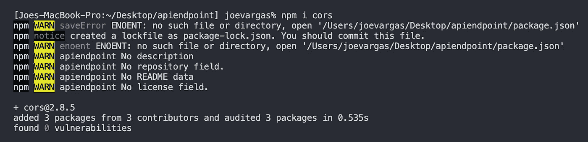
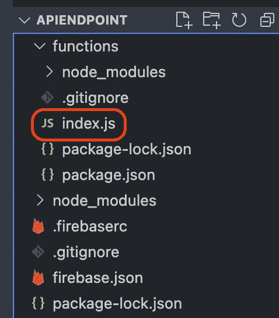

# 如何将 Google Firestore 数据库设置为 API 端点

> 原文：<https://javascript.plainenglish.io/set-up-a-google-firestore-database-as-an-api-endpoint-a946f8d824d?source=collection_archive---------6----------------------->

## 这个过程比预期的要容易

Source: [ThisIsEngineering](https://www.pexels.com/@thisisengineering)

作为一名有抱负的全栈 iOS 开发者，我对实现这一梦想所需的学习过程和耐心抱有雄心。无论您使用哪种堆栈，使用和全面连接 API 端点对于成为一名开发人员来说都是非常重要的。

最近，我开始深入到将应用程序连接到 API 端点的更实际的场景中。最近， [OpenWeatherMap 使用用户的 GPS 坐标](https://medium.com/codex/fetch-data-from-api-using-urlsessiontask-and-users-gps-coordinates-b8f56234f28d?sk=f66acb1bf44666e973dee69d4baf6f74)获取数据。此外，我还学到了一些用 URLComponents 添加查询项和使用字典向 URL 添加查询项的知识。当查询像 iTunes Search 这样的 API 来查找某个艺术家的歌曲或某个演员主演的电影时，这很有帮助。

虽然连接到现有的 API 端点很有趣，但我想挑战自己，创建自己的 API 端点，并能够从客户端运行 CRUD 操作。这样做会让我脱离使用 Xcode 和 Swift 的舒适区，但我喜欢挑战。如果你想跟着做，确保你已经安装了 [VSCode](https://code.visualstudio.com/) 、 [Node.js](https://nodejs.org/en/download/) 和 [Postman](https://www.postman.com/downloads/) 。此外，你需要有一个谷歌账户才能使用 Firestore。

前往 [Google Firebase 控制台](https://www.postman.com/downloads/)并登录。登录后，**创建一个新项目**。

创建新项目有几个步骤:

**1。**为您的项目命名。我将我的命名为 *apiendpoint* 。

**2。**我选择不安装谷歌分析，所以我禁用了切换。

**3。**点击*创建项目*

创建您的项目需要几秒钟的时间。完成后，你将进入项目的*概述*。需要注意的是，为了创建一个 API 端点，您需要将您的帐户升级到一个 Blaze 层，该层允许您使用我们将用来部署 CRUD 操作的云功能。你可以通过点击*星火计划*切换到*火焰*来改变等级。当切换到 Blaze 时，您需要注册一个支付选项。

接下来，在左侧面板中选择 Firestore 数据库。然后选择*创建数据库*。将出现一个弹出窗口，询问您是要将数据库设置为生产模式还是测试模式。在本演练中，我们将选择测试模式，但在生产环境(即公共网站、web/移动应用程序等)中使用数据库时，保护数据库的安全非常重要。

选择测试模式后，单击下一步。下一个窗口将询问您希望数据库存储在什么位置。最好根据你的地理位置，在下拉菜单中选择一个选项。在我的情况下，它是 *nam5(美国中部)*，因为我住在美国。一旦你选择了最适合你的位置的选项，点击启用。

之后，您的数据库将开始创建，您选择的安全规则将被应用。如果一切顺利，当您的数据库成功创建后，您应该会看到下面的屏幕:

如果你得到了上面的结果，恭喜你！您已经创建了您的云 Firestore 数据库🙌🏻。

现在我们已经在 Firestore 中设置了数据库，让我们设置项目的本地目录。我将在我的桌面上创建一个名为 *apiendpoint* 的文件夹，这样它就与我的数据库名相匹配了。接下来，我将打开 VSCode，通过在 VSCode 中拖动文件夹，将我的项目文件夹添加到 VSCode 中。

接下来，我们将在项目中安装 Firebase。您可以通过使用嵌入在 VSCode 中的来实现这一点。点击终端>新终端，下面会打开一个终端窗口。确保路径设置在项目文件夹内。比如我的设置为*Joes-MacBook-Pro:~/Desktop/API endpoint*。

一旦终端运行，输入 *firebase init* ，这是将 firebase 安装到您的项目中的命令。按 Enter 键，您应该会看到以下结果:

从上面的问题开始，接下来会有一系列的问题。下面是我们设置 API 端点所需的答案/功能:

1.  您想为此目录设置哪些 Firebase 功能？*功能:配置云功能目录及其文件*
2.  *使用现有项目*并选择您的项目名称。
3.  语言将会是 JavaScript。
4.  键入 *n* 然后按回车键退出安装 ESLint。我发现 ESLint 会产生[问题](https://github.com/eslint/eslint/issues/10127)阻止功能部署，所以我拒绝安装它。
5.  键入 *y* ,然后按 Enter 键安装 npn 的依赖项。

将开始安装 Firebase 依赖项。根据您的互联网连接，应该需要大约一分钟。在我们继续之前，还需要安装几个依赖项。键入 *npm i cors* 并按 enter 安装。要了解更多关于 cors 的信息，点击[这里](https://developer.mozilla.org/en-US/docs/Web/HTTP/CORS)。安装好 cors 之后，输入 *npm i express* 并输入 Enter。你可以在这里阅读关于快递[。](https://www.npmjs.com/package/express)

开始编码吧！

在 Firebase 依赖项的安装过程中，一系列文件夹和文件被添加到您的项目中。

👈🏼我们将使用的文件是 functions 文件夹中的 index.js 文件。

如果还没有打开 index.js 文件，请打开它。我们需要首先在顶部建立一些常量。以下是所述常数。注意 databaseURL 键值是一个空字符串。当我们稍后将这些功能部署到 Firebase 时，我们将填写 URL。

让我们开始研究构建数据库时需要的基本功能。首先，我们将从 **POST** 函数开始。该功能允许我们向数据库中添加数据。在常量下面，编写以下代码行:

在 POST 函数下面，我们将开始编写 **GET** 函数，但是这个函数将根据 ID 获取数据库中的特定文档:

接下来，我们将使用 **GET** 函数，该函数从数据库中获取**所有**数据，包括嵌套数据。在按 ID 获取数据的 GET 函数下面，编写以下代码:

我们要放在一起的下一个函数是 **PUT** 函数，它只是一个更新函数。这个特殊的函数根据它的 ID 更新数据。在 GET(所有数据)函数下，编写以下内容:

我们要添加的最后一个函数和 CREATE 一样必要。如果不能删除数据，就不能拥有功能端点。在 PUT 函数下面，我们将添加 **DELETE** 函数:

现在我们的函数已经写好了，我们需要在文件的底部再写一行代码。这一行将在我们每次部署时将我们的 API 导出到 Firebase 云函数。因为可以在这个文件中编写无数的函数来管理数据库中的数据，所以每次更新时都必须部署这个文件。以下代码行帮助您将项目导出到 Firebase:

在将代码部署到 Firestore 之前，我们还有一件小事要做。我们需要确保通过 Firestore 验证我们的代码。为此，请打开项目的 Firebase 控制台。点击项目概述旁边的齿轮图标，并选择*用户和权限*。

接下来，在项目设置中选择服务帐户。确保选择 Node.js，然后单击 Generate new private key:

**将此文件另存为 *permissions.json* 到您项目的*函数*文件夹路径**。这一点至关重要，因为我们的 index.js 文件被配置为位于以下路径:

一旦将 *permissions.json* 保存到项目的 function 文件夹中，就该将代码部署到 Firestore 了。返回到 VSCode 终端，键入 *firebase deploy* ，并点击 Enter:

这个过程检查您的代码，以确保没有错误。如果一切顺利，您应该会看到消息*部署完成！*如果它返回错误，确保你的 index.js 与我提供的代码相同。

**注意结果中的函数 URL**。这是您将用来配置您的 Postman 客户机的 API 端点。请突出显示并复制 URL。

Open Postman，我们将通过它连接到端点并执行 CRUD 操作。单击最左侧窗格上的收藏。然后点击“+”号。这将允许我们创建一个请求集合，并保持我们的项目有组织。你可以随意命名你的收藏。我将我的项目命名为与我的 Firestore 项目相同的名称， *APIENDPOINT* 。

👈🏼创建收藏后，点击方便提供的*添加请求*链接。

# 发布请求

我们要构建的第一个请求是 POST，即在数据库中创建数据的操作。命名您的请求帖子，然后从下拉菜单中选择帖子:

接下来，我们将通过一系列步骤开始构建我们的 POST 请求:

在第一步中，粘贴好你的网址后，在最后添加 ***/API/create*** 。这就是所谓的 POST 函数。

在第 5 步中，您必须按照 index.js 文件中 POST 函数的写法构造 JSON 主体。当您试图将数据发送到端点时，将会收到一个错误。

点击发送按钮将我们的数据发送到我们的数据库。几秒钟后，如果一切顺利，您将获得 200 OK 状态代码。如果您得到任何其他东西，请确保 URL 和 JSON 主体结构是正确的。

在浏览器中打开 Firestore 数据库，您应该会看到我们刚刚发布的数据:

我想发出的下一个请求是 GET，但在此之前，让我们向数据库添加更多数据。在 Postman 中，编辑 JSON 主体结构，将 id 改为 ***2*** ，将名称改为 ***产品 B，*** 并将描述改为 ***这是产品 B 的描述*** ，我们可以将价格值保留为 ***100*** 。然后点击发送。一旦得到状态码 200 OK，再次编辑 JSON 体；id 为 ***3*** ，名称为 ***产品 C，*** 和描述为 ***这是产品 C 的描述*** 。单击发送。一旦你得到 200 OK，回到你的 Firestore 数据库，你应该会看到所有 3 个条目。

# 获取请求

既然我们已经能够将数据发送到数据库中，那么让我们创建 GET 请求来查看数据库中的数据。点击您收藏的省略号图标，并选择*添加请求:*

设置 GET 请求如下:

1.  将请求命名为 GET
2.  从请求类型下拉菜单中选择获取。
3.  粘贴你的网址，最后加上 ***读作*** 。这个函数查询并返回数据库中的所有文档。
4.  单击发送。
5.  通过从下拉列表中选择 *Pretty* 和 *JSON* 来配置响应部分。这将把我们查询的数据组织成一种 JSON 格式，更易于阅读。
6.  最后，您应该能够查看我们数据库中当前的数据。

# 按 id 获取

下一个调用不像我们之前放在一起的 GET 请求那样常见，但是很方便。这个调用根据传入的 id 从我们的数据库中获取一个文档。

因为这个请求类似于前面的 GET 请求，所以我们可以复制它，这样可以节省一些时间:

下面我们设置了一个 URL 来查询 id 值设置为 1 的文档，即产品 a。如果有一个文档具有您设置的 id 值，它将随该文档一起返回。因为我们目前只有 3 个文档，所以它将只查询其中的一个。

# 按 id 请求删除

我们要处理的下一个基本请求是删除请求。该请求将请求删除 id，类似于之前的读取请求。虽然您可以创建一个删除所有数据的请求，但您真的不想拥有这种权力，所以最好按 id 删除。继续复制 GET by id 请求，并将其重命名为 DELETE by id。在您的 URL 中，将*改为*并删除。

目前，我的数据库中有 3 个文档，这意味着我可以删除 */1* 、 */2、*或 */3* 。选择要删除的 id，然后单击发送。一旦请求成功，返回到读取整个数据库的 GET 请求，单击 send，您应该会注意到您删除的文档不再可用。

# 按 id 请求放置

最后但同样重要的是，我们可以配置我们的 PUT 请求，也就是更新请求。复制您的删除请求，将请求重命名为 PUT by id，在 request-type 下拉菜单中选择 PUT，并通过用 *update* 替换 *delete* 来更新 URL。

我决定更新 id 为 3 的文档，但是您可以更改任何现有的文档。对于名称，我已将其更改为*产品 X* ，对于描述，我已将其更改为*这是产品 X 的描述*。完成后，点击发送。

如果您打开了 Firestore 数据库，您会注意到您正在更新的文档会发出橙色光，这表示它已被更新:

关于使用 Google Firestore、Express、Node.js、VSCode 和 Postman 构建 API 端点的指南到此结束。

# 从这里你能去哪里？

你有一个功能数据库，你可以连接到一个网络或移动应用程序，并用 Postman 更新它。作为一名有抱负的 iOS 开发人员，这帮助我获得了如何为我心目中的未来 iOS 项目构建数据库的知识。一旦我建立了 Firestore 数据库，我只需要[将 Firestore 依赖项](https://firebase.google.com/docs/firestore/quickstart)安装到我的 iOS 项目中，这样它就可以与我的数据库通信。只要 Firestore 支持这种语言，您也可以对您的项目做同样的事情。

编码快乐！

*更多内容请看*[***plain English . io***](http://plainenglish.io/)