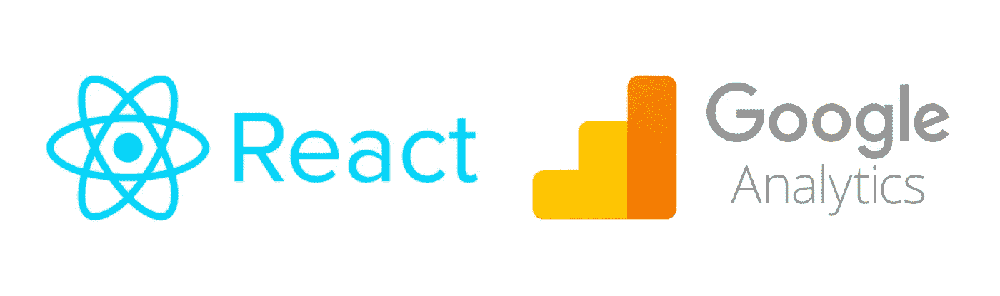
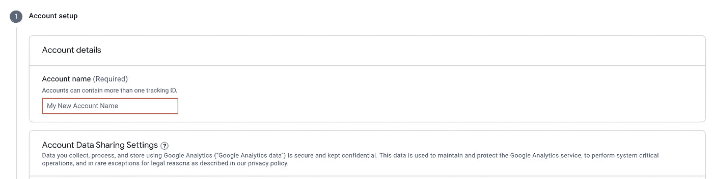
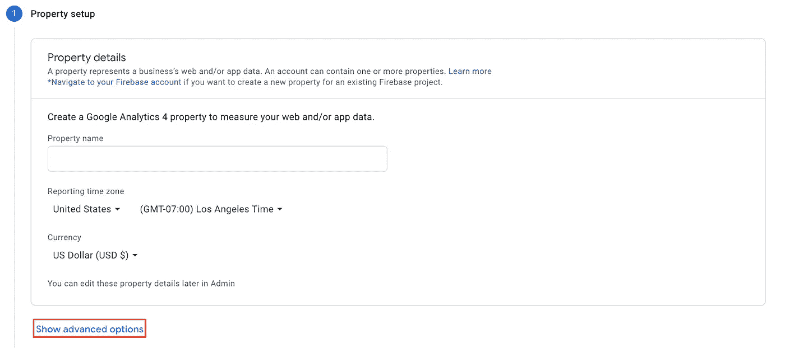
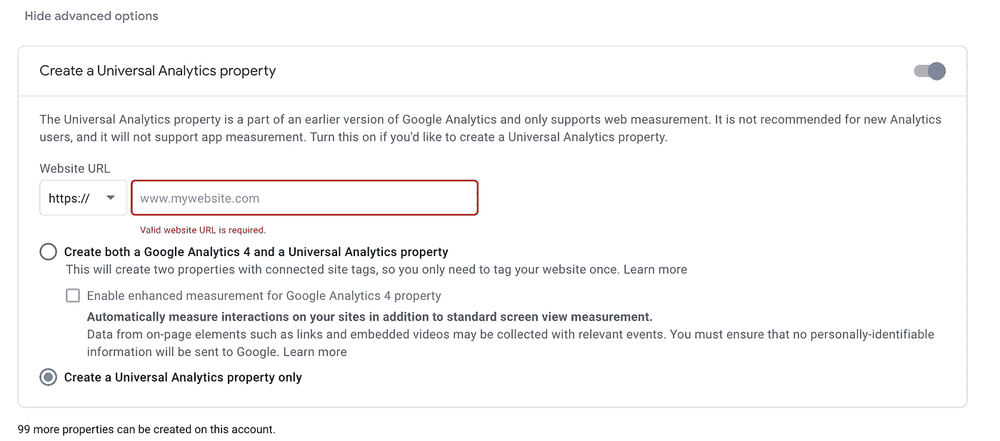
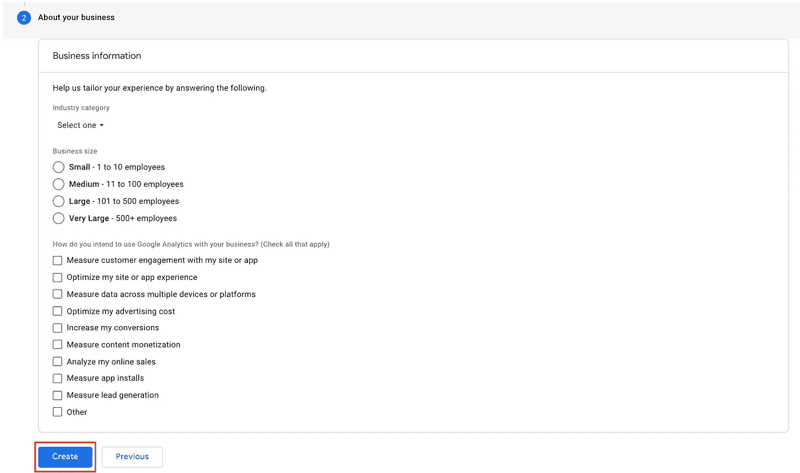
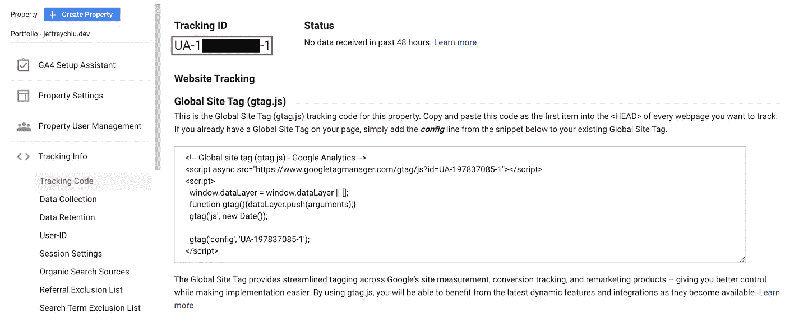
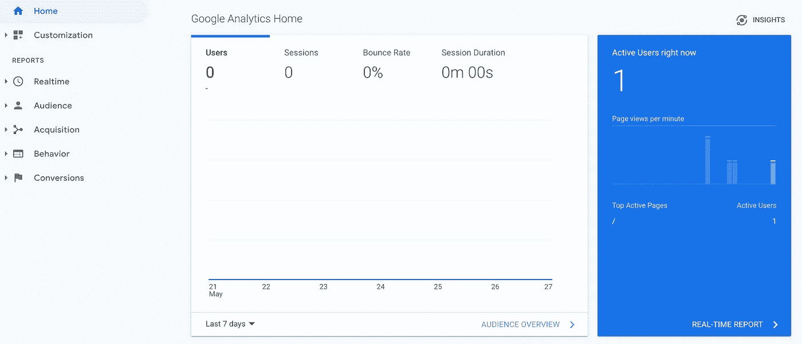
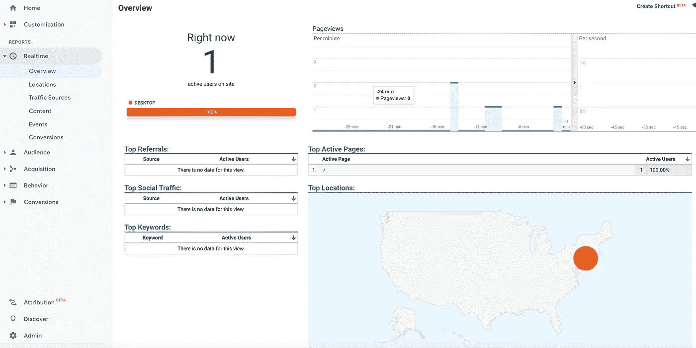
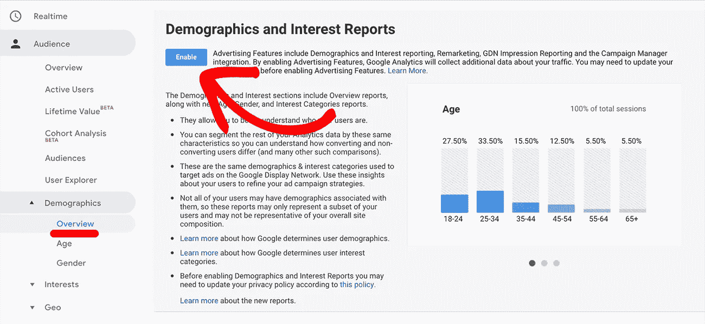

# 通过 3 个简单的步骤为 React 应用程序设置 Google Analytics

> 原文：<https://javascript.plainenglish.io/set-up-google-analytics-for-your-react-app-in-three-easy-steps-69d8f671a1f3?source=collection_archive---------4----------------------->

*开始跟踪用户交互的指令*



谷歌分析从 2005 年就开始了，它提供了大量关于网页和应用程序中用户交互的见解和报告。这些数据对于开发人员跟踪人口统计、用户位置、转化率以及监控增长和性能非常有用。最棒的是，谷歌分析有一个稳健的“免费增值”计划；这意味着小企业和独立开发者可以不用支付月费就可以使用这项服务。但是，如果您想要更多的高级功能，则需要重复付费。

这是最好的网站分析工具之一，可以通过三个步骤在 React 应用程序中实现。

## 步骤 1:设置要跟踪的属性

如果你还没有注册谷歌分析，你可以点击[这里](https://analytics.google.com/)注册。注册后，您需要导航到管理部分创建一个帐户。



您可以随意命名该帐户。我把我的命名为“杰弗里分析”。创建帐户后，您需要在该帐户下创建一个属性。属性是您想要跟踪的实际网站或应用程序。



按照提示输入属性名，选择正确的时区和货币。然后点击**显示高级选项**。

打开高级选项后，您需要创建一个通用分析属性，并输入要跟踪的网站的 URL 地址。你可以同时创建一个 Google Analytics 4 属性，这是 Google 在你的网站上自己的跟踪系统，但对于个人项目，这是没有必要的。



输入网站 URL 后，将会出现下一个提示，要求您填写网站上的更多信息。选择任何适用的选项并创建属性。



一旦您创建了该属性，您将自动进入其跟踪代码。您也可以通过跟踪信息下的侧边菜单来访问它。



在 React 应用中实现 Google Analytics 时，您将需要跟踪 ID。

## 步骤 2:安装 React 谷歌分析模块

在您的应用程序中，您需要安装 [react-ga](https://www.npmjs.com/package/react-ga) 。此模块用于将您的 React 应用程序同步到 Google Analytics，其中包含上一步生成的跟踪 ID。

只需运行:

```
npm install react-ga --save
```

安装后，它可以在您的应用程序中使用。

## 步骤 3:在应用程序中启动谷歌分析

当在 React 项目中设置`ReactGA`时，一定要在`App.js`或`index.js`中完成。根据文件:

> 在任何其他跟踪功能记录任何数据之前，必须使用此功能初始化 GA。

为此，您需要将 ReactGA 导入您的应用程序。

```
import ReactGA from "react-ga";
```

然后在组件的代码中，您将需要用您之前唯一的跟踪 ID 初始化`ReactGA`。跟踪标识应为字符串。

```
ReactGA.initialize("YOUR UNIQUE PROPERTY TRACKING ID")
```

要实际记录分析，您还需要知道用户正在访问哪些页面。为此，从`ReactGa`触发`pageview()`方法。

```
ReactGA.pageview("PATH")
```

完成后，您就可以开始跟踪用户信息了！下面是一个单页的 React 应用程序示例，在`App.js`实现了`ReactGA`。因为它是一个单页应用程序，所以`pageview()`方法中的路径参数只是`"/"`。请随意使用下面的代码摘录作为您的反应项目的起点。

```
import ReactGA from "react-ga";function App() { *// Google Analytics Set Up* const gaTrackingId = "UA-123456789-1"; // enter your Tracking ID
    ReactGA.initialize(gaTrackingId);
    ReactGA.pageview("/"); return (
        <div *className*="app">
            <AppContent />
        </div>
    );
}export default App
```

## 查看分析

一旦您的反应应用程序中设置了谷歌分析，您就可以访问谷歌分析仪表板来查看实时和传统数据。



还可以选择启用人口统计和兴趣报告来真正了解您的用户。



## 最后

这里显示的方法是 Google Analytics 和`ReactGA`的最基本用法——特别是对于单页应用程序。然而,`ReactGA`提供了很多额外的功能，比如自定义事件的用法(例如:根据用户访问了某个页面来转换跟踪按钮点击量)。对于多页面应用程序，您可以使用[reactor-router-DOM](https://www.npmjs.com/package/react-router-dom)和`history`包绑定页面更改事件。

然而，在你下一次构建一个反应项目时，考虑实施谷歌分析。只需按照这里分享的步骤，开始收集用户交互的数据。

*更多信息请访问以下资源:*

*   [为网站设置分析](https://support.google.com/analytics/answer/10269537?ref_topic=1009620)
*   [反应-镓包](https://www.npmjs.com/package/react-ga)
*   [反应-GA GitHub](https://github.com/react-ga/react-ga)
*   [React-Router-Dom 包](https://www.npmjs.com/package/react-router-dom)
*   [历史包](https://www.npmjs.com/package/history)

*更内容见于* [*中*](http://plainenglish.io/)