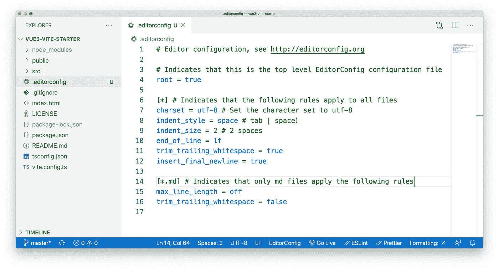
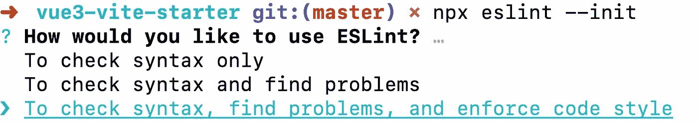
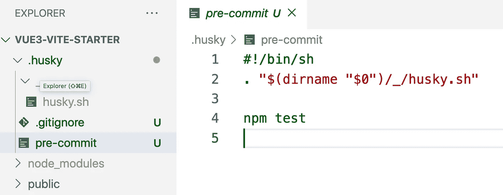
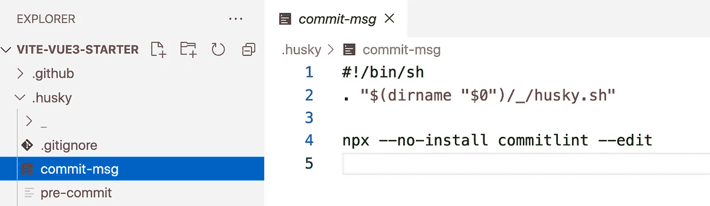

# 使用 Vite 设置 Vue3 企业级开发环境:分步指南

> 原文：<https://javascript.plainenglish.io/set-up-vue3-enterprise-level-development-environments-with-vite-step-by-step-guide-32964d1df60e?source=collection_archive---------1----------------------->

## 使用 Vue3、TypeScript、Element Plus、Axios、Husky、Commitizen、Jest、Vite 和 GitHub 操作创建企业级开发环境。


Vue3 和 Vite 已经发布很久了，作者在很多项目中都使用了这个技术栈。我的感觉是，这种技术可以更好地帮助我们完成任务。Vue3 和 Vite 的生态系统现在正在蓬勃发展，这非常适合企业级开发项目。

本文将帮助您从零开始，一步一步地构建一个标准的 Vite + Vue3 + TypeScript 企业级开发环境。

首先，我将与您一起完成一个 Vue.js 项目的核心框架，使用 Vue.js、VueRouter 和 Vuex 等技术。然后，我们将为这个项目添加代码风格、提交风格和单元测试。最后，我们将使用 GitHub 操作设置自动部署。

## 最终方案

这是我们最后的项目:

[](https://github.com/BytefishMedium/vite-vue3-starter) [## BytefishMedium/vite-vue 3-starter

### 在 GitHub 上创建一个帐户，为 BytefishMedium/vite-vue 3-starter 开发做贡献。

github.com](https://github.com/BytefishMedium/vite-vue3-starter) 

这是在线演示:

 [## Vite 应用

### 编辑描述

bytefishmedium.github.io](https://bytefishmedium.github.io/vite-vue3-starter/#/) 

## 目录

1.  [核心骨架](#0260)
2.  [代码样式](#ac1c)
3.  [Git 提交消息约定](#0f27)
4.  [单元测试](#5920)
5.  [自动化部署](#a990)

## 技术堆栈

*   编程语言:TypeScript + JavaScript
*   构建工具: [Vite 2.x](https://vitejs.dev/guide/#overview)
*   核心框架: [Vue 3.x](https://v3.vuejs.org/)
*   路由器:Vue Router 4.x
*   状态管理:Vuex 4.x
*   UI 框架:[元素加](https://element-plus.org/#/zh-CN)
*   CSS 预编译器:[Stylus](https://stylus-lang.com/)/[Sass](https://sass.bootcss.com/documentation)/[Less](http://lesscss.cn/)
*   HTTP 客户端: [Axios](https://axios-http.com/)
*   Git 挂钩:[哈士奇](https://typicode.github.io/husky/#/) + [皮棉阶段](https://github.com/okonet/lint-staged)
*   代码风格:[editor config](http://editorconfig.org/)+[beauty](https://prettier.io/)+[ESLint](https://eslint.org/)+Airbnb JavaScript 风格指南
*   提交样式:[commit izen](http://commitizen.github.io/cz-cli/)+[commit list](https://commitlint.js.org/#/)
*   单元测试:[vue-Test-utils](https://next.vue-test-utils.vuejs.org/)+[jest](https://jestjs.io/)+[vue-jest](https://github.com/vuejs/vue-jest)+[ts-jest](https://kulshekhar.github.io/ts-jest/)
*   自动部署:GitHub 动作

## 注意:

*   文章很长，但都是有用的东西。请耐心等待。
*   这篇文章关注的是如何在不使用 Vue.js、Vuex 和 Axios 的情况下建立一个开发环境**。在阅读这篇文章之前，你需要对它们有一些基本的了解。**
*   当你在读这篇文章的时候，你可以打开电脑和我一起工作。
*   如果你对文章中的一些步骤有疑问或者有 bug，欢迎你留下评论，我会尽力解答。

我们走吧！

# 型芯骨架

首先，确保您的计算机上成功安装了 Node.js。该项目使用的 Vite 要求 Node.js 版本高于`12.0.0`。

```
$ node -v
v12.16.1
```

如果您运行的是低版本的 Node，可以使用 NVM 将 Node 升级到最新的稳定版本:

```
$ nvm install stable
```

## 使用 Vite 初始化项目

我们可以使用以下命令通过 Vite 初始化 Vue.js 项目:

```
$ npm init @vitejs/app
```

如果您的计算机上尚未安装 Vite，运行此命令将自动安装它。所以不需要执行`npm install vite -g`这样的命令。

或者您可以使用 Yarn 来初始化项目:

```
$ yarn create @vitejs/app
```

之后，我们将进入一个命令行交互界面。

首先，当我们初始化项目时，我们需要输入项目的名称:


然后 Vite 让我们选择一个前端框架。虽然它是由 Vue 的开发团队发明的，但 Vite 是一个通用的构建工具，可以构建各种项目，包括 React。


这里我们选择选项`vue`。

然后它会问我们是想使用 JavaScript 还是 TypeScript，这里我们选择 TS:


好了，我们的基本项目模板创建完毕:


然后，按照提示，我们转到项目的根目录并安装依赖包。

```
$ cd vite-vue3-starter$ npm install
```


然后，您可以在您喜欢的编辑器中打开该项目:


这是之前生成的项目的目录结构和`package.json`的具体内容。

我将继续分享我的编辑器的截图，以便我们可以更好地保持一致性。

安装完成后，我们可以开始项目:

```
$ npm run dev
```

运行上述命令时，您可能会收到类似以下内容的错误:

```
Error: esbuild: Failed to install correctlyMake sure you don't have "ignore-scripts" set to true. You can check this with "npm config get ignore-scripts". If that returns true you can reset it back to false using "npm config set ignore-scripts false" and then reinstall esbuild.If you're using npm v7, make sure your package-lock.json file contains either "lockfileVersion": 1 or the code "hasInstallScript": true. If it doesn't have either of those, then it is likely the case that a known bug in npm v7 has corrupted your package-lock.json file. Regenerating your package-lock.json file should fix this issue.
```


解决方案:在使用`npm run dev`之前运行以下命令

```
$ node node_modules/esbuild/install.js
```

参考:

[](https://github.com/evanw/esbuild/issues/462#issuecomment-771328459) [## macOS 上的安装二进制文件损坏问题#462 evanw/esbuild

### 我猜这是一个新的 bug，因为这个项目支持 macOS(没有用旧版本测试)。运行纱线添加…

github.com](https://github.com/evanw/esbuild/issues/462#issuecomment-771328459) 

结果:


如上图，我们项目的骨架就完成了。虽然流程有点长，但是操作很简单。

## 设置 Vite 配置文件

Vite 配置文件`vite.config.ts`位于根目录下，通过它我们可以配置和调整 Vite 的默认行为。

这里我们先做一些简单的配置，比如设置`@`指向`src`目录，修改服务端口和打包路径等。


```
import { defineConfig } from "vite";
import vue from "[@vitejs/plugin-vue](http://twitter.com/vitejs/plugin-vue)";
import { resolve } from "path";// [https://vitejs.dev/config/](https://vitejs.dev/config/)
export default defineConfig({
  plugins: [vue()],
  resolve: {
    alias: {
      "@": resolve(__dirname, "src"), // Set '@' to point to the 'src' directory
    },
  },
  base: "./", // Set the packing path
  server: {
    port: 4000,
    open: true, // The browser opens automatically when the service starts
    cors: true, // Allow cross-origin resource sharing// Configure the proxy service according to your needs
    // proxy: {
    //   '/api': {
    //     target: '[http://xxx.xxx.xxx.xxx:8000'](http://xxx.xxx.xxx.xxx:8000'),
    //     changeOrigin: true,
    //     secure: false,
    //     rewrite: (path) => path.replace('/api/', '/')
    //   }
    // }
  },
});
```

这时我们可以关闭之前启动的 Vite 程序，重新执行`npm run dev`。

此时，您应该能够看到新的服务器程序监听端口 4000，并自动在浏览器中打开网页，这表明我们之前的配置是成功的。


我不会在这里深入介绍更高级的 Vite 配置技术。你可以在官网上查看一下:

 [## 配置 Vite | Vite

### 从命令行运行 vite 时，Vite 会自动尝试解析一个名为 vite.config.js 的配置文件…

vitejs.dev](https://vitejs.dev/config/) 

## 标准化目录结构

那么 Vite 默认生成的源代码的目录结构就比较简单，无法满足大型项目的需求。这里我们可以添加一些新的目录。

因为我们的项目将包含各种组件、视图、样式等。，我在`src`目录中创建了以下目录结构:

```
├── public/
└── src/
    ├── assets/                    // store static resources
    ├── common/                    // general library 
    ├── components/                // general components
    ├── router/                    // routers for Vue Router
    ├── store/                     // state for Vuex
    ├── style/                     // general CSS file
    ├── utils/                     // utils function
    ├── views/                     // pages
    ├── App.vue
    ├── main.ts
    ├── shims-vue.d.ts
├── tests/                         // unit test
├── index.html
├── tsconfig.json                  // TypeScript config file
├── vite.config.ts                 // Vite config file
└── package.json
```


## 集成 Vue 路由器

首先，我们需要安装路由工具 Vue Router。因为我们这里用的是 Vue3，所以 Vue 路由器的版本必须在`4.0`以上。

```
$ npm i vue-router@4
```


第二步，我们需要编写一个路由配置文件。在`src`下创建一个`router`目录，然后在该目录下创建一个`index.ts`文件:

```
└── src/
     ├── router/
         ├── index.ts
```

`index.ts`的内容:

```
**import** {
  createRouter,
  createWebHashHistory,
  RouteRecordRaw,
} **from** "vue-router";
**import** Home **from** "@/views/home.vue";
**import** Vuex **from** "@/views/vuex.vue";**const** routes: Array<RouteRecordRaw> = [
  {
    path: "/",
    name: "Home",
    component: Home,
  },
  {
    path: "/vuex",
    name: "Vuex",
    component: Vuex,
  },
  {
    path: "/axios",
    name: "Axios",
    component: () => **import**("@/views/Axios.vue"), *// lazy-load*
  },
];**const** router = createRouter({
  history: createWebHashHistory(),
  routes,
});**export** **default** router;
```


在上面的文件中，我们配置了三台路由器。

```
/      ==> @/views/Home.vue
/vuex  ==> @/views/Vuex.vue
/axios ==> @/views/Axios.vue
```

但是，目前没有对应于路由的组件。

为了使项目能够运行，让我们在`views`目录下创建`Home.vue`、`Vuex.vue`和`Axios.vue`。

因为现阶段我们还在测试 Vue 路由器的功能，所以不会写什么有意义的组件。我们只需在组件中编写以下内容:

```
<template>
  <div>
    Home.vue
  </div>
</template><script lang="ts">
import { defineComponent } from 'vue'export default defineComponent({
  setup() {

  },
})
</script>
```


稍后，我们将为这些组件添加更有意义的内容。

然后我们需要在`main.ts`安装这个路由器:


我们已经在前面的步骤中配置了路由，但是我们并没有在页面上实际使用这些路由器。我们可以修改我们的`App.vue`文件来实际使用这个路由器:

```
<template>
  <ul>
    <li><router-link to="/">Home</router-link></li>
    <li><router-link to="/vuex">Vuex</router-link></li>
    <li><router-link to="/axios">Axios</router-link></li>
  </ul>
  <router-view/>
</template><script lang="ts">
import { defineComponent } from 'vue'export default defineComponent({
  name: 'App'
})
</script>
```


好了，这时候我们终于完成了路由器的配置。

让我们来看看这个项目的结果:


在配置 Vue 路由器时，我们大致遵循以下流程:

*   安装软件包
*   编写配置文件
*   将其安装在`main.ts`

配置 Vuex 的过程完全一样。

## 集成 Vuex

1.  安装 Vuex:

```
$ npm i vuex@next
```

2.创建配置文件:

```
└── src/
    ├── store/
        ├── index.ts
```


```
import { createStore } from "vuex";const defaultState = {
  count: 0,
};// Create a new store instance.
export default createStore({
  state() {
    return defaultState;
  },
  mutations: {
    increment(state: typeof defaultState) {
      state.count++;
    },
  },
  actions: {
    increment(context) {
      context.commit("increment");
    },
  },
  getters: {
    double(state: typeof defaultState) {
      return 2 * state.count;
    },
  },
});
```

3.将其安装在`main.ts`中


## 集成元素增强版

Element Plus 是一个支持 Vue3 的 UI 框架，这里我们先安装一下:

```
$ npm i element-plus
```


然后在`main.ts`文件中挂载 Element Plus:

```
import { createApp } from 'vue'
import App from './App.vue'import ElementPlus from 'element-plus'
import 'element-plus/lib/theme-chalk/index.css'createApp(App).use(ElementPlus).mount('#app')
```

需要注意的是，对于 UI 框架，我们不仅要导入它的 JavaScript 模块，还要导入一个 CSS 样式文件。

我用的是 Element Plus 框架，你可以选择一个你喜欢的 UI 框架。不考虑 UI 框架，使用流程如下:

*   安装软件包
*   在`main.ts`中导入 JavaScript 模块
*   导入 CSS 样式

## 为 HTTP 请求集成 Axios

Axios 和 Vue 之间没有耦合关系，我们可以直接安装最新版本的 Axios:

```
$ npm i axios
```


Axios 是一个进行 HTTP 请求的工具。因此，我们在`utils`目录中创建`axios.ts`作为 Axios 配置文件:

```
└── src/
    ├── utils/
        ├── axios.ts
```

`axios.ts`的内容:

以下是 Axios 工作原理的一个示例:

## 集成 CSS 预编译器手写笔/Sass/Less

本项目使用 CSS 预编译器手写笔，可以直接作为开发依赖安装。Vite 已经在内部为我们集成了相关的加载器，所以不需要额外的配置。当然，你也可以用同样的方法使用 Sass 和 Less。

安装:

```
$ npm i stylus -D# or
$ npm i sass -D
$ npm i less -D
```

用法:

```
<style lang="stylus">
  ...
</style>
```

# 真实项目

恭喜你，我们项目的核心框架已经完成了。

之前解释 Vuex、Element Plus、Axios 的时候，并没有提供具体的代码示例。因此，我准备了一个完整的项目，完全使用了前面提到的技术:

[https://github.com/BytefishMedium/vite-vue3-starter-core](https://github.com/BytefishMedium/vite-vue3-starter-core)

与我们之前展示的最终项目相比，这个 repo 只包含核心工作代码，没有其他复杂的配置，非常适合个人项目。

由于文章篇幅原因，我就不分析这个项目的具体内容了。可以自己看源代码，有问题可以留言评论。当然，如果你想让我再写一篇关于这个项目的文章，请告诉我。

如果你只是想开发一个个人项目，那么上面的 tech stack 就足够你用了。但是如果你想开发一个企业级的项目，代码风格检查，单元测试，自动部署是必须的。下面我们将依次介绍这些。

来吧，我的朋友。

# 代码风格

随着前端应用逐渐变得更大更复杂，当多人参与同一个项目时，每个人的习惯都不一样。他们经常使用不同的编码风格在项目中编写代码。如果继续下去，项目的健壮性会越来越差。

要解决这些问题，理论上来说，口头约定和代码审查都可以，但是这些方法不能提供实时反馈，沟通成本高，不够灵活。更重要的是，它无法控制。我们必须在项目中使用一些工具来约束代码风格。

本节解释了如何使用 editor config+appearlier+ESLint 来实现代码格式标准化。

这样做有好处:

*   解决跨团队代码不规范导致的可读性差、可维护性差的问题。
*   解决团队成员使用不同编辑器导致的编码风格不一致的问题。
*   提前发现代码风格问题，给出相应的提示，及时修复
*   通过减少代码审查过程的来回次数来节省时间。
*   自动格式化，统一编码风格。

## 编辑器配置

不同的编辑器有不同的默认行为:

*   一些编辑器默认使用 UTF8 字符集；其他人没有。
*   有些编辑器默认缩进 2 个空格，有些是 4 个。
*   …

要为项目的不同成员统一编辑器的默认行为，我们可以使用 EditorConfig。EditorConfig 有助于为在不同编辑器和 ide 中处理同一项目的多个开发人员保持一致的编码风格。

现在打开我们之前的项目，在项目的根目录下添加一个`.editorconfig`文件:



```
# Editor configuration, see [http://editorconfig.org](http://editorconfig.org)# Indicates that this is the top level EditorConfig configuration file
root = true[*] # Indicates that the following rules apply to all files
charset = utf-8 # Set the character set to utf-8
indent_style = space # tab | space）
indent_size = 2 # 2 spaces
end_of_line = lf
trim_trailing_whitespace = true
insert_final_newline = true[*.md] # Indicates that only md files apply the following rules
max_line_length = off
trim_trailing_whitespace = false
```

请注意，这个特性还没有内置到 VSCode 中，您需要安装一个插件:


像 WebStorm 这样的编辑器已经内置了这个功能，你可以直接使用。

## 较美丽

漂亮是一个强大的代码格式化工具，支持诸如 JavaScript、TypeScript、CSS、SCSS、LESS、JSX、Angular、Vue、GraphQl、JSON、Markdown 等语言。它可以处理几乎任何前端可用的文件格式，是目前最流行的代码格式化工具。

安装:

```
$ npm i prettier -D
```

漂亮的支持多种格式的配置文件，如`.json`、`.yml`、`.yaml`、`.js`等。这里我们在这个项目的根目录下创建一个`.prettierrc`文件。


```
{
  "useTabs": false,
  "tabWidth": 2,
  "printWidth": 100,
  "singleQuote": true,
  "trailingComma": "none",
  "bracketSpacing": true,
  "semi": false
}
```

一旦安装并配置了更漂亮的，您可以使用以下命令来格式化您的文件。

```
*#* Format all files
$ npx prettier --write .
```

注意，这个功能还没有内置到 VSCode 中，您需要安装一个插件:


像 WebStorm 这样的 ide 已经内置了这个功能，所以您可以直接使用它。

在配置了更漂亮的配置文件后，当使用诸如 VSCode 或 WebStorm 之类的编辑器的格式化功能时，编辑器将根据在更漂亮的配置文件中指定的规则格式化文件。

示例:


这样，每个团队成员在格式化代码后都会得到相同的结果。

## ESLint

只有 EditorConfig 和漂亮是不够的，如果我们想对代码风格进行更深入的检查，那么 ESLint 是必不可少的。

安装:

```
$ npm i eslint -D
```

当使用 eslit 时，我们还需要编写一个 eslit 配置文件来说明代码风格的规则。但是手动编写配置文件太麻烦，而且容易出错，所以我们可以使用下面的命令自动生成配置文件。

```
$ npx eslint --init
```

之后，我们将进入命令行交互界面，然后它将让我们做出一些选择:



首先，它将让我们选择严格的代码检查级别。在这里，我们希望 ESLint 能够强制执行代码样式检查，所以我们选择了第三个选项。


然后我们选择 JavaScript 模块。


我们选择 Vue.js。


是的，我们使用打字稿。


我们的项目在浏览器中运行，构建工具和稍后的测试框架在 Node.js 中运行，所以检查浏览器和 Node.js。


接下来是最重要的一步:配置代码样式规则。虽然我们可以定制规则，但我们没有必要。我们可以从社区获得一个成熟的解决方案。

所以我们选择了“使用流行的风格指南”。


ESLint 给我们列出了三个在社区中流行的 JavaScript 风格指南:Airbnb、Standard 和 Google。

这三个风格指南是由许多有多年开发经验的人编写的，足以被世界各地的许多大小公司使用。

在这里，我们选择了 Airbnb，它是 GitHub 上最著名的，以节省配置 ESLint 规则的繁琐时间，然后让团队成员学习 Airbnb 的 JavaScript 风格指南。

[https://github.com/airbnb/javascript](https://github.com/airbnb/javascript)


继续。


这里我们选择 JavaScript。


是的，我们想现在安装 npm。

**注意:**如果自动安装依赖失败，可以手动安装:

```
$ npm i [@typescript](http://twitter.com/typescript)-eslint/eslint-plugin [@typescript](http://twitter.com/typescript)-eslint/parser eslint-config-airbnb-base eslint-plugin-import eslint-plugin-vue -D
```

完成这些选项后，我们可以在项目的根目录中看到配置文件。


现在我们可以使用 ESLint，但是如果你使用 VS 代码，你需要安装一个插件:


ESLint 会提示我们是否有不符合规则的代码:


## 编辑器配置、更漂亮和 ESLint 之间的关系

在这里，您可能想知道为什么我们需要这么多与风格相关的工具，只使用一个可以吗？

事实上，这三种工具的功能完全不同。EditorConfig 用于控制编辑器的默认行为，并且仅在您通过编辑器输入代码时才起作用。

如果您正在复制和粘贴其他人的代码，那么 EditorConfig 不会帮助您更正代码样式。更漂亮的是，它重新格式化了代码，广泛适用，但无法在更深的层次解析 JavaScript 代码。另一方面，ESLint 旨在检查 JavaScript 和 TypeScript 代码，以便更深入地了解语法细节。

当然，“更漂亮”和“ESLint”在某些方面有重叠，所以它们会发生冲突。让我们解决这个问题。

## 解决“漂亮”和“聪明”之间的冲突

Airbnb JavaScript Style Guide 验证用于本项目的 ESLint 配置中。其中一个规则是在代码结束后添加一个分号，但是我们在代码结束后添加了一个规则，非分号项，到了更漂亮的配置文件中，所以有一个冲突。

为了解决这些冲突，我们需要使用`eslint-plugin-prettier`和`eslint-config-prettier`。

*   `eslint-plugin-prettier`:将“更漂亮”的规则设置为 ESLint 的规则。
*   `eslint-config-prettier`:关闭 ESLint 中与“更漂亮”冲突的规则。

最后，形成优先级:更漂亮的规则> ESLint 规则。

现在让我们安装这两个插件:

```
$ npm i eslint-plugin-prettier eslint-config-prettier -D
```

并将更漂亮的插件添加到`.eslintrc.js`:

```
module.exports = {
  ...
  extends: [
    'plugin:vue/essential',
    'airbnb-base',
    'plugin:prettier/recommended'
  ],
  ...
}
```


## 强壮的

虽然我们以前通过漂亮点和 ESLint 写了很多规则，但是对于一个大项目来说，总会有人不遵守规则，或者不小心违反了规则。为了使这些规则可以执行，我们可以使用一种叫做哈斯基的工具。

当用户试图提交时，哈士奇可以拦截`git comit`、通过哈士奇执行 eslit 命令，如果发现代码不符合 eslit 的规则，则不允许`git commit`。

安装 Husky 并初始化配置:

```
$ npx husky-init && npm install
```

该命令执行以下操作:

1.  安装哈士奇


2.在项目根目录下创建`.husky`目录



3.在`.husky`目录下创建一个`pre-commit`钩子，并将`precommit`命令初始化为`npm test`。

4.修改`package.json`的`scripts`，增加`“prepare”: “husky install”`


上面生成的内容是默认配置。现在我们将对以上内容做一些简单的修改。

修改`.husky/pre-commit`文件:


我们将`npm test`改为`eslint — fix ./src — ext .vue,.js,.ts`

上面的`pre-commit`钩子文件做的是:当我们做`git commit-m “XXX”`时，它首先对`src`目录中的所有`.vue`、`.js`和`.ts`文件执行`eslint — fix`命令。如果 ESLint 没有报告错误，那么提交过程是正常的；如果 ESLint 报告了一个错误，那么这个提交被终止。

然而，一个新的问题出现了:有时我们只改变一个或两个文件，但我们对所有文件执行`eslint --fix`。如果这是一个历史项目，并且我们在过程中间配置了 ESLint 规则，那么当提交代码时，所有其他未修改的“历史”文件也将被检查，这可能会导致大量文件带有 ESLint 错误，这显然不是我们想要的。

我们需要确保只使用 ESLint 修复这次写的代码，不影响其他代码。是一个很棒的工具，我们可以用它来代替。

## 皮棉阶段

`lint-staged`常用与哈士奇配合使用。它允许 Husky 的钩子仅对 Git 暂存区中的文件(由`git add`创建的文件)发出命令，而不对任何其他文件发出命令。

1.  安装:

```
$ npm i lint-staged -D
```

2.在`package.json`上添加配置


```
"lint-staged": {
  "*.{vue,js,ts}": "eslint --fix"
},
```

该命令意味着只对 git 暂存区中的`.vue`、`.js`和`.ts`文件执行`eslint --fix`。

3.将`.husky/pre-commit`挂钩触发命令修改为:`npx lint-staged`


# Git 提交消息约定

我们之前已经统一了代码风格，并对提交进行了严格的限制，以确保项目的质量。在多人项目中，也有提交代码的情况:不能保证每个人都能准确描述提交消息。

为了使提交消息标准化，我们可以采用社区中最流行的风格: **AngularJS Git 提交消息约定**

看看 Angular 项目的提交历史:


从上面的图像中可以看出，这些提交消息是格式化的。

关于*Git Commit Message conventi on*的详细信息，您可以到下面的链接查看官方文件:

[https://docs . Google . com/document/d/1qr dfciipjsldn 3el 15 ijygynpihorgul 1 _ OOAqWjiDU5Y/edit #](https://docs.google.com/document/d/1QrDFcIiPjSLDn3EL15IJygNPiHORgU1_OOAqWjiDU5Y/edit#)

在这里，我们集中讨论如何在项目中使用它。

## 委托

Commititizen 是一个帮助您编写格式良好的提交消息的工具。

1.  装置

```
$ npm install commitizen -D
```

2.初始化

成功安装调试后，我们使用`cz-conventional-changelog`适配器初始化项目:

```
$ npx commitizen init cz-conventional-changelog --save-dev --save-exact
```

这个命令做了一些事情:

*   安装`cz-conventional-changelog`到开发依赖项
*   将`config.commitizen`添加到`package.json`

```
"config": {
  "commitizen": {
    "path": "./node_modules/cz-conventional-changelog"
  }
}
```


## 使用佣金

过去，我们使用`git commit -m ‘xxx'`提交代码，但是现在我们可以更改为`git cz`或`npx cz`。


执行该命令后，我们将进入一个命令行交互界面，在那里我们将被提示写一个标准的提交消息。

**示例:**

*   功绩

```
feat(browser): onUrlChange event (popstate/hashchange/polling)Added new event to browser:
- forward popstate event if available
- forward hashchange event if popstate not available
- do polling when neither popstate nor hashchange availableBreaks $browser.onHashChange, which was removed (use onUrlChange instead)
```

*   固定

```
fix(compile): couple of unit tests for IE9Older IEs serialize html uppercased, but IE9 does not...
Would be better to expect case insensitive, unfortunately jasmine does
not allow to user regexps for throw expectations.Closes #392
Breaks foo.bar api, foo.baz should be used instead
```

*   风格

```
style(location): add couple of missing semi colons
```

## 佣金

为了确保每个提交消息都满足我们的要求，我们可以使用 husky+commit lit 来实施验证。这与我们之前在代码样式部分使用它的方式相同。

1.  装置

```
$ npm i @commitlint/config-conventional @commitlint/cli -D
```

2.配置

创建`commitlint.config.js`并填写以下内容:

```
module.exports = { extends: ['[@commitlint/config-conventional](http://twitter.com/commitlint/config-conventional)'] }
```


加哈士奇`commit-msg`钩:

```
$ npx husky add .husky/commit-msg "npx --no-install commitlint --edit $1"
```



现在，如果我们试图提交一个不符合规则的信息，它将被彻底拒绝。


# 单元测试

单元测试是项目开发中的一个重要步骤。完整的测试可以为代码提供质量保证，减少错误的发生。

在这里，我们使用以下工具:

*   [**Vue-Test util**](https://github.com/vuejs/vue-test-utils-next):Vue Test util 的下一次迭代。它的目标是 Vue 3。
*   [**玩笑**](https://github.com/facebook/jest) :令人愉悦的 JavaScript 测试。
*   [**Vue-Jest**](https://github.com/vuejs/vue-jest)**:**Jest Vue 变压器
*   [**ts-jest**](https://github.com/kulshekhar/ts-jest)**:**一个带有源映射支持的 Jest 转换器，可以让你使用 Jest 来测试用 TypeScript 编写的项目。

## 安装:

```
$ npm i [@vue/test-utils](http://twitter.com/vue/test-utils)@next jest vue-jest@next ts-jest -D# or use yarn$ yarn add @vue/test-utils@next jest vue-jest@next ts-jest --dev
```

## 配置:

在根目录下创建`jest.config.js`。

```
module.exports = {
  moduleFileExtensions: ['vue', 'js', 'ts'],
  preset: 'ts-jest',
  testEnvironment: 'jsdom',
  transform: {
    '^.+\\.vue$': 'vue-jest',
    '^.+\\.ts$': 'ts-jest'
  },
  testRegex: '(/__tests__/.*|(\\.|/)(test|spec))\\.(ts)$'
}
```


## 测试文件:

创建要测试的 Vue 组件:

*   `./src/views/Test.vue`


```
<template>
  <div class="test-container page-container">
    <div class="page-title">Unit Test Page</div>
    <p>count is: {{ count }}</p>
    <button [@click](http://twitter.com/click)="increment">increment</button>
  </div>
</template><script lang="ts">
 import { defineComponent, ref } from 'vue'export default defineComponent({
    name: 'Vuex',
    setup() {
      const count = ref<number>(0)
      const increment = () => {
        count.value += 1
      }
      return { count, increment }
    }
  })
</script>
```

在`tests`目录下创建一个测试文件:

```
├── src/
└── tests/                      
    ├── Test.spec.ts
```


```
import { mount } from '[@vue/test-utils](http://twitter.com/vue/test-utils)'
import Test from '../src/views/Test.vue'test('Test.vue', async () => {
  const wrapper = mount(Test)
  expect(wrapper.html()).toContain('Unit Test Page')
  expect(wrapper.html()).toContain('count is: 0')
  await wrapper.find('button').trigger('click')
  expect(wrapper.html()).toContain('count is: 1')
})
```

## 整合`@type/jest`

如果您发现此错误:


您可以通过安装此软件包来解决此问题:

```
$ npm i [@types/jest](http://twitter.com/types/jest) -D
```

## 集成 eslint-插件-jest

您可能会发现以下错误:


这是因为我们在项目中使用了 ESLint，而测试文件不符合 ESLint 的规则。因此，我们还需要给 ESLint 添加`eslint-plugin-jest`插件，让它去验证 jest 文件。

您可以通过安装此软件包来解决此问题:

```
$ npm i eslint-plugin-jest -D
```

然后配置`.eslintrc.js`:


```
module.exports = {
  ...
  extends: [
    ...
    'plugin:jest/recommended'
  ],
  ...
}
```

## 执行单元测试

在`package.json`中添加新脚本:

```
{
  "script": {
    "test": "jest"
  }
}
```


然后我们可以用`npm run test`开始单元测试:


当单元测试没有全部通过时，我们需要根据错误信息优化相应组件的代码，以进一步提高项目的健壮性。

然而，编写单元测试是一件痛苦的事情。我个人认为没有必要为所有组件编写单元测试。根据项目的实际情况来写就好了。

## 推送测试

和以前一样，每当开发人员试图将提交推送到远程存储库时，我们可以使用 git 挂钩来强制进行单元测试。

哈士奇打造`pre-push`勾手:

```
$ npx husky add .husky/pre-push "npm run test $1"
```

该命令将在`.husky`目录下创建一个`pre-push`文件。


`npm run test`现在，每当开发人员试图将代码提交到远程存储库时，就会强制执行。

# 自动化部署

这个项目是建立一个标准的前端开发环境，为此我们使用 CI(持续集成)来完成项目的最终部署。

常见的 CI 工具有 GitHub Actions、GitLab CI、Travis CI、Circle CI 等。

这里，我们使用 GitHub 动作。

## 什么是 GitHub 动作？

GitHub Actions 是 GitHub 的持续集成服务。持续集成由捕获代码、运行测试、登录到远程服务器、发布到第三方服务等行为组成。

## 创建 GitHub 存储库

因为 GitHub 操作只对 GitHub 存储库可用，所以我们创建了 GitHub 存储库来托管项目代码。


## 生成令牌

当使用 GitHub 动作时，我们需要生成一个具有足够权限的令牌。

首先，打开我们的 GitHub 帐户，进入:个人资料→开发者设置→个人访问令牌:


然后，我们单击`Generate new token`并获取令牌作为我们的访问凭证。

生成令牌时，有一些权限控制选项。对于本文，我们将选择回购和工作流:


现在我们有了自己的令牌。

## 将令牌设置到存储库

将令牌添加到您的项目中:

`settings`->-`Secrets`->-`New repository secret`


## 为操作创建配置文件

在`.github/workflows`中创建`deploy.yml`，内容如下:

```
name: deployon:
  push:
    branches: [master]jobs:
  deploy:
    runs-on: ubuntu-latest
    steps:
      - uses: actions/checkout@v2- name: Setup Node.js v14.x
        uses: actions/setup-node@v1
        with:
          node-version: "14.x"- name: Install
        run: npm install- name: Build
        run: npm run build- name: Deploy
        uses: peaceiris/actions-gh-pages@v3
        with:
          publish_dir: ./dist
          github_token: ${{ secrets.GH_PAGES_DEPLOY }}
          user_name: ${{ secrets.MY_USER_NAME }}
          user_email: ${{ secrets.MY_USER_EMAIL }}
          commit_message: Update Vite2.x + Vue3.x + TypeScript Starter
```


## 这是如何工作的？

当新提交的代码被推送到 GitHub 仓库时，GitHub 动作被触发，在 GitHub 服务器上执行动作命令，比如:安装依赖项，打包项目等等，然后将打包的静态文件部署到 GitHub 页面，最后，我们就可以在线访问了。

使用自动化部署，我们只需关注项目的开发阶段，将任何重复和枯燥的活动留给程序来完成。

> 懒惰是程序员的首要生产力。

其实 GitHub Action 可以完成很多，但这只是一个简单的练习。

## GitHub 页面

经过上面的配置，每当我们向资源库推送代码时，GitHub 服务器都会自动为我们打包代码，并将打包后的代码放在`gh-pages`分支中。


这个分支`gh-pages`是由 GitHub Action 创建的。

然后让我们设置 GitHub 页面:


至此，我们的项目上线了:

 [## Vite 应用

### 编辑描述

bytefishmedium.github.io](https://bytefishmedium.github.io/vite-vue3-starter/) 

如果您后来对项目进行了更改并将其推送到 GitHub，GitHub Actions 会自动重新打包项目并为您更新 GitHub 页面。自动化部署可以为您节省大量时间。

# 结论

这是一篇长文。很高兴你看了。这既是对我的认可，也是对你的提升。

让我们总结一下我们以前所做的。

首先，我们使用 Vite 初始化一个基本的项目模板。然后，我们手动安装了 Vue 路由器、Axios 和其他库。在使用这些库的时候，基本上有三个步骤:安装相应的包，写配置文件，挂载到主程序中。

然后，我们使用 EditorConfig、appeller 和 ESLint 来标准化我们的代码格式，我们还设置了 git 提交规则，然后我们为项目添加了单元测试。为了确保遵守这些规则，我们使用 Husky 来设置 git 挂钩，并在提交和推送期间强制执行一些检查。

最后，我们使用 GitHub Action 来自动化部署。

如果您对这些步骤有任何疑问，请随时发表评论。

[*更多内容看 plainenglish.io*](http://plainenglish.io/)