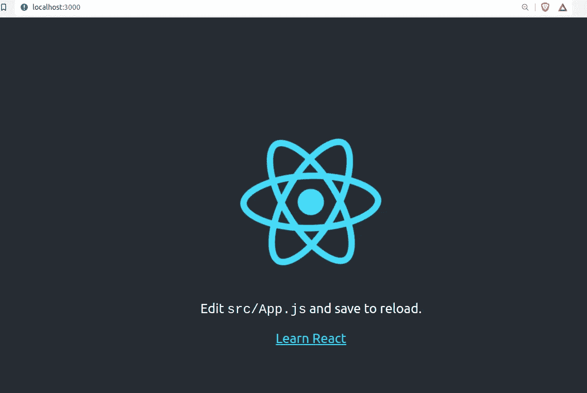
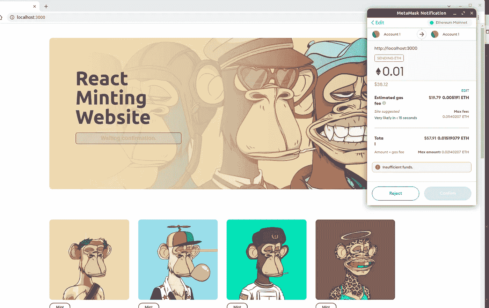

# 在 React 应用程序中设置 Web3

> 原文：<https://javascript.plainenglish.io/set-up-web3-in-your-react-app-dec6d6f45b4d?source=collection_archive---------0----------------------->

## 这是在 React 应用程序中设置 web3 的快速指南。


## 在本指南中，您将能够:

I .检查**用户是否连接了**他们的钱包。
二世。**连接用户钱包**，获取账户详情。
三。允许用户授权并从他们的钱包中发送交易。
四。断开/注销用户。

## 你为什么要将 web3 添加到 React 应用程序中？

1.  赚取直接收入。你可以直接接受客户的付款。
2.  认证和授权。
    您将能够使用用户的钱包来验证用户，从而**根据他们的钱包状态来授权访问**。
3.  分散身份。
    您将能够在您的应用中利用基于钱包地址的分散身份，例如 [**。ETH 域名**](https://ens.domains/) 以及后来关于 NFT 的简介图片。

# 开始使用。

我们将创建一个简单的 react 应用程序。对于这个例子，我们将创建一个铸造网站，验证用户的钱包，并允许他们铸造一个 NFT。

## 要[创建一个 react 应用，](https://reactjs.org/docs/create-a-new-react-app.html)运行:

```
npx create-react-app react-minting-website
```

现在运行下面的代码，在 http://localhost:3000 为应用程序提供本地服务

```
npm start
```



view app at http://localhost:3000

## 更新用户界面

我们将为铸币网站创建如下所示的用户界面:
[演示链接](https://geoffmahugu.github.io/react-minting-template/)


将下面的代码复制并粘贴到 **App.css** 中以获得样式。

App.css

将下面的代码复制粘贴到 **App.js** 中，得到 jsx 布局。

App.css

## 正在安装依赖项。

1.  [安装 web3.js](https://web3js.readthedocs.io/en/v1.5.2/getting-started.html)

```
npm i web3
```

2.Install @web3-react
这个库将使我们能够轻松地将 react 应用程序与 web3 集成，并且还可以利用我们可以监听的钩子。

```
npm i @web3-react/core @web3-react/injected-connector
```

## 配置 Web3 连接器。

现在我们已经准备好了所有的包，我们可以开始配置 web3 连接器了。
在根文件夹 ***(。/src)*** ，创建钱包文件夹 ***(。/src/wallet)*** 它将包含连接到 web3 的配置。

在 ***内创建 **Connect.js** 文件。/src/wallet*** 文件夹，粘贴下面的内容。

Connector.js

**设置 Web3 提供商**

为了访问全局 web3 对象和钩子，我们需要在**中设置 web3 提供者。/src/index.js** 文件通过用**<web 3 react provider>**包装**App>**组件

更新**。/src/index.js** 如下图。

index.js

# 连接到钱包

为了连接到钱包，我们需要更新 **App.js** 文件，因为它包含了我们的铸造按钮。

1.  **导入依赖关系**

```
import { useWeb3React } from "@web3-react/core";import { injected } from "./wallet/Connector";import web3 from "web3";
```

**2。添加 web3React 钩子**

```
const { active, account, library, activate,deactivate } = useWeb3React()
```

—**活动**属性返回一个布尔值，允许我们检查用户是否连接了他们的钱包。
—**帐户**属性返回用户帐户(或。eth 名称)。
—**库**属性为我们提供了 web3React 函数，我们可以调用这些函数来与区块链/智能合约进行交互。
—**激活**属性是我们为了验证用户钱包而调用的函数。
—**停用**属性是我们将调用来注销用户的函数。

**3。添加钱包连接功能。**

为了连接到钱包，我们将在 App 组件中创建一个**连接函数**，如下所示。

为了绑定连接功能，让我们更新**薄荷按钮**，如下所示:

```
<button className="main-mint-btn" onClick={connect} >Mint</button>
```

点击**薄荷按钮**，用户将能够使用他们的钱包进行身份验证。(在这个例子中，我使用的是[元掩码](https://metamask.io/)，但是你可以使用任何浏览器钱包)


接下来，我们将创建一些模板逻辑，仅当用户通过身份验证时按钮才可用，并提示未通过身份验证的用户使用他们的钱包进行连接，如下所示。


Prompt user to connect

## 铸币/借记账户功能。

为了向账户收费，我们需要创建一个 M **打印函数**，提示用户允许购买资产。

要绑定薄荷功能，请更新薄荷按钮，如下所示:

要对其进行全面测试，请单击 mint 来启用 metamask 进行事务处理。



**Click Reject to cancel the transaction.**

**注销用户**
要注销用户，只需**停用**帐户实例。您可以创建一个断开功能，如下所示:

随着我们看到越来越多的人采用区块链技术，我认为我们作为软件开发人员有必要装备自己必要的工具来帮助企业过渡到 web3。

希望你学到了一些新东西，全部代码都在这个 [GitHub 链接](https://github.com/GeoffMahugu/react-minting-template)上。

对于所有区块链的解决方案，请通过 geoffreymahugu@gmail.com**联系我**

*更多内容看* [***说白了就是***](http://plainenglish.io/) ***。*** *报名参加我们的**[***免费每周简讯这里***](http://newsletter.plainenglish.io/) ***。****