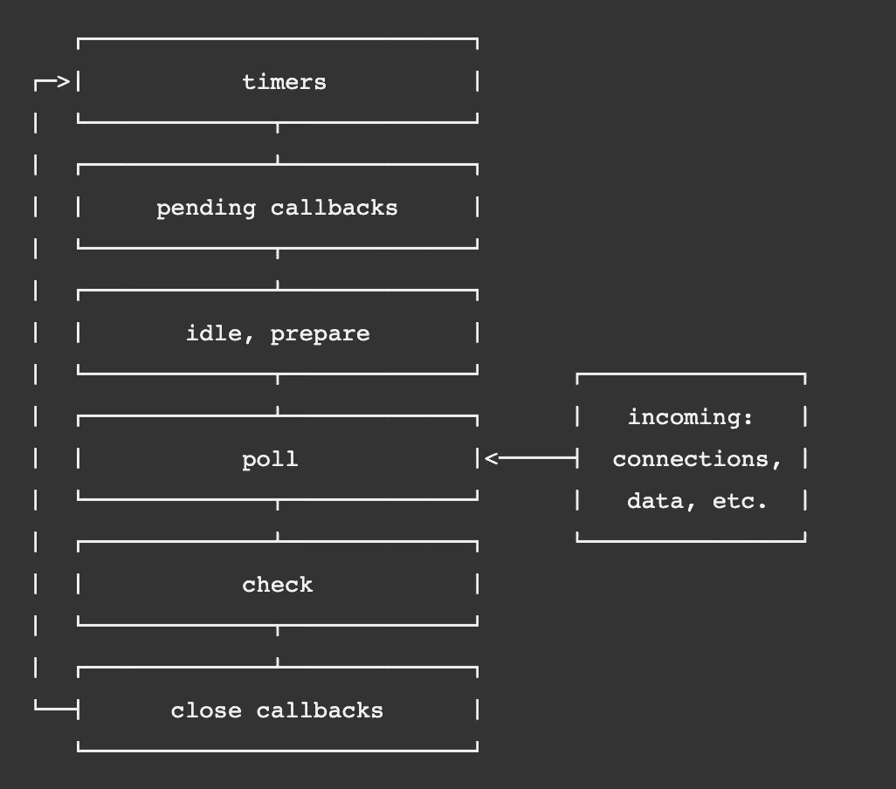
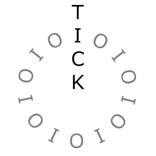

# Node.js 中的 setTimeout 与 setImmediate 计时器函数

> 原文：<https://javascript.plainenglish.io/settimeout-vs-setimmediate-timer-functions-in-nodejs-fbd29ed43db?source=collection_archive---------5----------------------->

Node.js 是一个异步的、非阻塞的、事件驱动的架构。它深受 Nginx web 服务器的高并发模型设计的启发。

[与 Nginx 中的主进程和许多工作进程概念](https://www.nginx.com/blog/inside-nginx-how-we-designed-for-performance-scale/)一样，Node.js 使用单线程事件循环和线程池。 [LibUV](https://libuv.org/) 库帮助 Node.js 实现事件循环。

如下图所示，这是事件循环中不同阶段的样子:

Source: [https://nodejs.org/en/docs/guides/event-loop-timers-and-nexttick/](https://nodejs.org/en/docs/guides/event-loop-timers-and-nexttick/)

## 介绍

现在进入事件循环的执行阶段，计时器是最重要的功能之一，它有助于根据超时和立即执行来调度脚本。因此，这里有一篇帖子主要介绍两个重要的定时器函数的执行，这两个函数是 **setTimeout()** 和 **setImmediate() —** ，它们的设计是在事件循环的不同阶段运行。

**“当我这么说”执行:** setTimeout()

事件循环中的**定时器阶段**调度**funcexecaftemilisec**回调函数的执行，指定阈值，在该阈值之后可以执行所提供的回调。根据 Node.js 文档，

> 从技术上讲， [**轮询**阶段](https://nodejs.org/en/docs/guides/event-loop-timers-and-nexttick/#poll)控制定时器何时执行。

**【右后本】执行~** *setImmediate()*

**轮询和检查阶段**负责该即时定时器事件的调度和执行。当事件循环进入轮询阶段时，它的首要任务是耗尽轮询队列。如果轮询队列**为空，**将通过 **setImmediate()查找预定脚本。如果存在，它结束轮询阶段并进入检查阶段来执行那些脚本。根据 Node.js 文档，**

> `setImmediate()`实际上是一个特殊的计时器，运行在事件循环的一个单独阶段。它使用一个 libuv API 来调度回调在**轮询**阶段完成后执行。

现在，问题是—我们不能像这样用 setTimeout()实现同样的行为吗？

如上所述，两个定时器事件在事件循环的不同阶段执行。由于 setImmediate()被设计为在当前**轮询阶段**完成后执行脚本，这意味着它在轮询队列为空并且**事件循环**空闲后执行；而 setTimeout()的执行是由**定时器阶段**调度的，它指定了一个阈值，在该阈值之后，所提供的回调可以被执行，这取决于轮询阶段。

但是这里有一个问题:让我们试着在一个不在 I/O 周期内的脚本中运行这两个定时器函数，这仅仅意味着事件循环在任何回调的执行中都不忙。

在上面的脚本中，猜测两个定时器的执行顺序是不确定的，因为它们受进程性能的限制。

此脚本保证您在"*之后首先执行 setImmediate()定时器函数，而* *事件循环是通过执行 I/O 事件队列中的文件读取事件完成的，并且事件队列为空。*”因此，事件循环将在**轮询阶段**中了解预定的立即回调脚本，并移动到**检查阶段**以执行相同的脚本。

## 结论

尽管在不涉及 I/O 周期的情况下(因此是非确定性的)，在立即队列和超时队列中执行脚本不会显示出主要的区别，但是当我们在特定的 I/O 周期中运行这些定时器函数时，我们会看到它们不同实现的真正意义。

这一个就到此为止。我将很快写下与 process.nextTick()的比较，它有一个特殊的目的。我希望你喜欢阅读这篇文章。谢谢！

*更多内容请看*[*plain English . io*](http://plainenglish.io/)