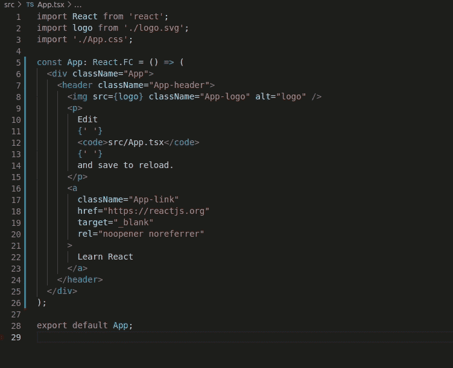
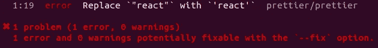
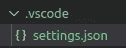
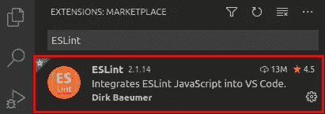
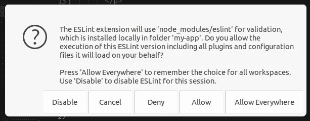
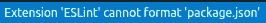

# 如何向 React TypeScript 项目添加 ESLint 和 appearlier(2022)

> 原文：<https://javascript.plainenglish.io/setting-eslint-and-prettier-on-a-react-typescript-project-2021-22993565edf9?source=collection_archive---------0----------------------->

# 介绍

本教程旨在成为设置 ESLint 和 Prettier 在 React Typescript 项目上协同工作的权威指南。

在阅读了大量教程，并努力投入其中后，我决定创建这个权威指南，让任何需要的人生活更轻松。

# 为什么要用 ESLint 和 beauty？

ESLint 是最流行的代码质量规则检查和代码格式化工具之一。

漂亮是一个代码格式化工具。

那么，如果我也可以只用 ESLint 来格式化我的代码，为什么还要用更漂亮的呢？简而言之，因为 because 比 ESLint 在代码格式化方面做得更好。

因此，正如[beautiful 文档](https://prettier.io/docs/en/comparison.html)所说，*使用 beautiful 进行格式化，使用 linters 捕捉 bug！*

# 开始吧！

本文将分为四个部分:

*   设置 ESLint
*   布置得更漂亮
*   检查文件内容
*   让 ESLint 和 Prettier 一起工作

# 设置 ESLint

如果您没有在 React Typescript 项目中设置 ESLint，请在继续之前通读下面的这篇文章说明。

[](https://andrebnassis.medium.com/setting-eslint-on-a-react-typescript-project-2021-1190a43ffba) [## 在 React Typescript 项目上设置 ESLint(2021)

### 在 React Typescript 项目上设置 ESLint 的权威指南

andrebnassis.medium.com](https://andrebnassis.medium.com/setting-eslint-on-a-react-typescript-project-2021-1190a43ffba) 

# 布置得更漂亮

同样，如果您的 React Typescript 项目中没有更漂亮的设置，请在继续之前通读下面的这篇文章说明。

[](https://andrebnassis.medium.com/setting-prettier-on-a-react-typescript-project-2021-f9f0d5a1d6b0) [## 在 React Typescript 项目中设置更漂亮的效果(2021)

### 在 React Typescript 项目中设置更漂亮元素的权威指南

andrebnassis.medium.com](https://andrebnassis.medium.com/setting-prettier-on-a-react-typescript-project-2021-f9f0d5a1d6b0) 

# 检查文件内容

为了确保 ESLint 和 Prettier 设置正确，让我们快速检查一下您的项目文件。

## package.json

它应该包含“ *devDependencies* ”上的以下包:

```
"devDependencies": {
"@typescript-eslint/eslint-plugin": "^4.15.1",
"@typescript-eslint/parser": "^4.15.1",
"eslint": "^7.20.0",
"eslint-config-airbnb": "^18.2.1",
"eslint-import-resolver-typescript": "^2.4.0",
"eslint-plugin-import": "^2.22.1",
"eslint-plugin-jsx-a11y": "^6.4.1",
"eslint-plugin-react": "^7.22.0",
"eslint-plugin-react-hooks": "^4.2.0",
"prettier": "2.2.1"
}
```

*PS:如果在上面的例子中不匹配，你可以忽略版本号。*

## . prettierrc.json

它应该包含更漂亮的格式规则配置。

```
{
"trailingComma": "es5",
"tabWidth": 4,
"semi": false,
"singleQuote": true
}
```

*PS:你可以随意修改规则。*

## . eslintrc.json

它应该包含 ESLint 规则配置。

```
{
   "env":{
      "browser":true,
      "es2021":true
   },
   "extends":[
      "plugin:react/recommended",
      "airbnb",
      "plugin:[@typescript](http://twitter.com/typescript)-eslint/recommended"
   ],
   "parser":"[@typescript](http://twitter.com/typescript)-eslint/parser",
   "parserOptions":{
      "ecmaFeatures":{
         "jsx":true
      },
      "ecmaVersion":12,
      "sourceType":"module"
   },
   "plugins":[
      "react",
      "[@typescript](http://twitter.com/typescript)-eslint",
      "react-hooks"
   ],
   "rules":{
      "no-use-before-define":"off",
      "[@typescript](http://twitter.com/typescript)-eslint/no-use-before-define":[
         "error"
      ],
      "react/jsx-filename-extension":[
         "warn",
         {
            "extensions":[
               ".tsx"
            ]
         }
      ],
      "import/extensions":[
         "error",
         "ignorePackages",
         {
            "ts":"never",
            "tsx":"never"
         }
      ],
      "no-shadow":"off",
      "[@typescript](http://twitter.com/typescript)-eslint/no-shadow":[
         "error"
      ],
      "[@typescript](http://twitter.com/typescript)-eslint/explicit-function-return-type":[
         "error",
         {
            "allowExpressions":true
         }
      ],
      "max-len":[
         "warn",
         {
            "code":80
         }
      ],
      "react-hooks/rules-of-hooks":"error",
      "react-hooks/exhaustive-deps":"warn",
      "import/prefer-default-export":"off",
      "react/prop-types":"off"
   },
   "settings":{
      "import/resolver":{
         "typescript":{

         }
      }
   }
}
```

*PS:你可以随意修改规则。*

## 。埃斯林提尼奥勒

它应该包含 ESLint 在执行时将忽略的文件。

```
*.css
*.svg
```

*PS:你可以随意修改这个文件。*

## 。忽略不计

它应该包含执行时 Prettier 将忽略的文件。

```
node_modules# Ignore artifacts:
build
coverage
```

*PS:你可以随意修改这个文件。*

一切都安排好了吗？酷！让我们继续前进！

# 让 ESLint 和 Prettier 一起工作

在设置了 Prettier 和 ESLint 之后，您将会看到，如果您同时执行这两个命令，它们将会在格式规则方面发生冲突。

在终端上，执行漂亮和 ESLint 命令来自动修复我们的' *App.tsx* '文件上的代码:

```
npx eslint src/App.tsx --quiet --fix
npx prettier --write src/App.tsx
```

ESLint 和更漂亮地覆盖应用的格式规则:



Prettier and ESLint outputs for App.tsx file

为了解决这个问题，我们可以将 ESLint 设置为只使用更漂亮的格式规则，并避免那些相互冲突的规则。所以，我们开始吧！

## 第一步。禁用 ESLint 格式规则

首先要做的是禁用所有 ESLint 格式规则。

*   安装软件包

```
*npm install --save-dev eslint-config-prettier*
```

*   *在' *.eslintrc.json* '文件上配置*eslint-config-prettle**

*在“ *.eslintrc.json* ”文件中，在“*扩展*”上添加以下内容:*

```
*"extends":[
...
"prettier",
"prettier/prettier",
"prettier/react",
"prettier/@typescript-eslint"
]*
```

*因此，再次运行 ESLint 和更漂亮的命令:*

```
*npx eslint src/App.tsx --quiet --fix
npx prettier --write src/App.tsx*
```

*看到了吗？！ESLint 停止使用格式化规则。*

## *第二步。让 ESLint 使用更漂亮的规则*

*现在，让我们让 ESLint 使用更漂亮的规则作为格式化规则。*

*   *安装包*eslint-plugin-beauty**

```
*npm install --save-dev eslint-plugin-prettier*
```

*   *在' *.eslintrc.json* '文件上配置*eslint-plugin-beauty**

*在' *.eslintrc.json* '文件中，添加以下内容:*

*—在*“延伸”*段上，**增加最后一个延伸**:*

```
*"extends":[
...
"plugin:prettier/recommended"
]*
```

**注 1:这打开了由*eslint-plugin-beauty*插件提供的规则，它在 ESLint 中运行得更漂亮。**

**注 2:你也可以从*扩展*中去掉*更漂亮*，既然“*插件:更漂亮/推荐*”已经做到了* [*幕后*](https://github.com/prettier/eslint-plugin-prettier#recommended-configuration) *。**

*现在只运行 ESLint 命令:*

```
*npx eslint src/App.tsx --quiet --fix*
```

*看到了吗？！ESLint 使用了更漂亮的配置作为格式化规则！耶！*

# *结论*

*埃斯林特和漂亮停止战斗，成为最好的朋友，和谐运行！*

*还要注意，如果你的代码没有遵循一些更漂亮的格式规则，ESLint 也会指出这是一个“更漂亮/更漂亮”的规则错误。*

*例如，如果我们将导入“react”更改为“react ”,并运行 ESLint 命令来检查是否应用了规则(没有自动修复):*

```
*npx eslint src/App.tsx --quiet*
```

*我们将得到以下错误:*

**

*很酷，对吧？希望你喜欢！*

# *VS 代码:执行 ESLint +漂亮的自动修复文件时保存*

*另外，我将向您展示如何在 VS 代码上配置 auto-fix，但这是一个可选步骤，如果您想在每次保存代码时使用 auto-fix 运行 ESLint+beautiful。*

*   *创建一个'*。项目根目录上的 vscode'* 文件夹*
*   *在*里面创建一个“ *settings.json* 文件。vscode/* 文件夹，并在其中插入以下代码:*

**

*.vscode/settings.json*

```
*{
"editor.defaultFormatter": "dbaeumer.vscode-eslint",
"editor.formatOnSave": true,
"eslint.alwaysShowStatus": true,
"editor.codeActionsOnSave": {
"source.fixAll.eslint": true
}
}*
```

*   *安装 VS 代码 ESLint 扩展*

*您可以转到 VS 代码“扩展”部分并手动安装它:*

**

*ESLint Extension for VSCode*

*或者启动 VS 代码快速打开(Ctrl+P)并运行以下命令:*

```
*ext install dbaeumer.vscode-eslint*
```

*   *允许在 VS 代码上使用 ESLint 扩展:*

*第一次使用时，ESLint 扩展将被阻止。然后，您应该通过以下方式允许它:*

*1.单击状态栏图标。*

**

*ESLint status bar icon on VSCode*

*2.将出现一个弹出窗口。选择'*允许*选项。*

**

*ESLint extension popup content on first use.*

*搞定了。现在，每个保存的文件都将修复代码，并使用 ESLint+prettle 规则进行格式化，这些规则可以自动修复。*

## *错误:保存时没有格式化 JSON 文件*

*如果 ESLint 扩展在尝试格式化 JSON 文件时可能有 bug。*

**

*VSCode ESLint extension bug message*

*幸运的是，我们可以通过在'【T2]上设置另一个扩展名来解决这个问题。vscode/settings.json' 仅用于*。json 的文件。**

*扩展选项:*

*   *更漂亮的扩展(需要安装):*

```
*"esbenp.prettier-vscode"*
```

*   *VSCode JSON 内置扩展(无需安装):*

```
*"vscode.json-language-features"*
```

*使用更漂亮扩展的示例:*

```
*{
"editor.defaultFormatter": "dbaeumer.vscode-eslint",
"editor.formatOnSave": true,
"eslint.alwaysShowStatus": true,
"editor.codeActionsOnSave": {
  "source.fixAll.eslint": true
},
"[json]": {
  "editor.defaultFormatter": "esbenp.prettier-vscode",
  "editor.formatOnSave": true
 }
}*
```

*PS:我强烈推荐使用 prettle 扩展，因为如果你为 JSON 格式设置了一个自定义的 prettle 设置，那么当通过命令行运行时，它将具有与保存文件相同的格式化行为。*

## *参考*

*[](https://prettier.io/docs/en/index.html) [## 什么更漂亮？较美丽

### 漂亮是一个固执己见的代码格式化程序，支持:它删除所有原始样式，并确保所有…

更漂亮. io](https://prettier.io/docs/en/index.html) [](https://github.com/prettier/eslint-config-prettier) [## 更漂亮/eslint-config-更漂亮

### 关闭所有不必要的或可能与“更漂亮”相冲突的规则。这让你可以使用你最喜欢的共享…

github.com](https://github.com/prettier/eslint-config-prettier) [](https://github.com/prettier/eslint-plugin-prettier) [## 更漂亮/eslint-plugin-更漂亮

### 作为 ESLint 规则运行起来更漂亮，并将差异报告为单个 ESLint 问题。如果你想要的格式…

github.com](https://github.com/prettier/eslint-plugin-prettier) [](https://glebbahmutov.com/blog/configure-prettier-in-vscode/) [## 如何配置更漂亮和 VSCode

### 如何为每个项目设置更漂亮的，ESLint 和 VSCode，并让你的 JavaScript 自动格式化，而不用拉你的…

glebbahmutov.com](https://glebbahmutov.com/blog/configure-prettier-in-vscode/) 

## 进一步阅读

[](https://bit.cloud/blog/sharing-types-between-your-frontend-and-backend-applications-l5qih48g) [## 在前端和后端应用程序之间共享类型

### 您的后端 API 已经更新，可以返回新类型的数据。必须通知前端团队进行更新…

比特云](https://bit.cloud/blog/sharing-types-between-your-frontend-and-backend-applications-l5qih48g) 

*更多内容请看*[***plain English . io***](https://plainenglish.io/)*。报名参加我们的* [***免费周报***](http://newsletter.plainenglish.io/) *。关注我们关于*[***Twitter***](https://twitter.com/inPlainEngHQ)[***LinkedIn***](https://www.linkedin.com/company/inplainenglish/)*[***YouTube***](https://www.youtube.com/channel/UCtipWUghju290NWcn8jhyAw)*[***不和***](https://discord.gg/GtDtUAvyhW) *。对增长黑客感兴趣？检查* [***电路***](https://circuit.ooo/) *。****