# 为本地 Express 服务器和 Angular Dev 服务器设置可信 HTTPS 连接

> 原文：<https://javascript.plainenglish.io/setting-up-a-free-trusted-https-connection-for-your-local-express-server-d6716ad2cf69?source=collection_archive---------6----------------------->

我最近试图使用脸书作为授权和资源服务器来实现 OAuth2。解决浏览器不信任证书的问题有很多挑战。最后，为了克服这些错误，我想分享一下当客户端(我在前端使用 Angular framework)连接到服务器时，如何做到没有任何“不安全连接”错误或证书问题。

# **1。为 Express 服务器设置可信 https 连接**

## **第一步。**安装 OPENSSL 以创建私钥和证书

我安装了来自 http://slproweb.com/products/Win32OpenSSL.html[的 Windows 操作系统的 OPENSSL MSI。安装起来非常简单快捷。](http://slproweb.com/products/Win32OpenSSL.html)

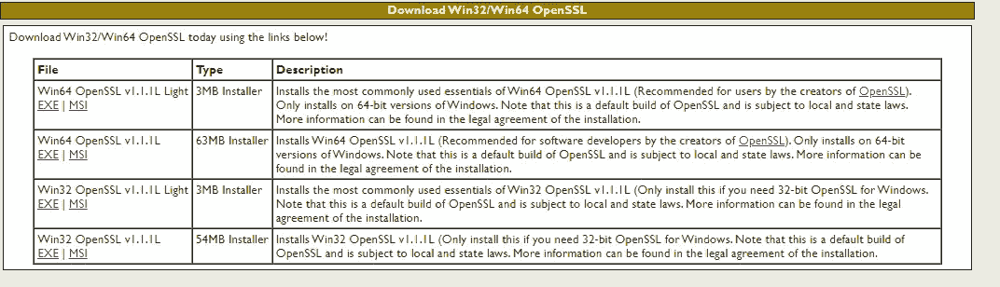

Openssl installation

安装完成后，不要忘记将 OPENSSL 路径添加到系统环境变量中。因为我把它安装在这个路径:**C:\ Program Files \ OpenSSL-win 64，**变量的路径将是**C:\ Program Files \ OpenSSL-win 64 \ bin**

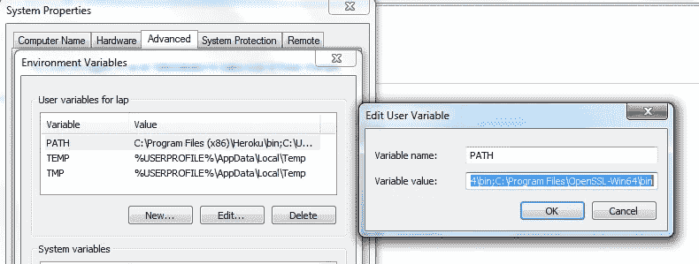

Setting the environmental variable for openssl

现在，您可以在任何命令行上使用 openssl 命令了。

## **第二步。**配置快递节点项目

这是我的 Express 项目的样子:

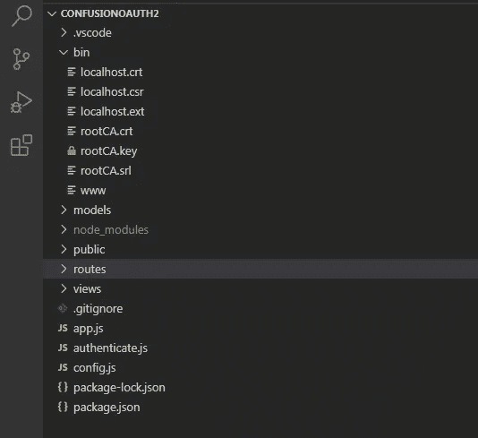

Express project

在这里，我们所担心的是包含多个本地主机的 bin 目录。*文件和一个 www 文件。

**在我们开始之前，一个重要的注意事项是，每当命令行要求下面的任何 openssl 命令的公共名称时，千万不要让它为空。将域名作为通用名称，即 localhost。**

**这将防止以后出现无效的常用名错误。**

**记下您在创建私钥时输入的密码。我们将在设置 https 服务器时需要它。**

我们开始吧！

= >确保您在项目的 bin 目录中，并点击下面的命令。这将创建一个 RSA 1024 位私钥(rootCA.key)和一个自签名的根 CA 证书(rootCA.crt)

```
**openssl req -x509 -sha256 -days 1825 -newkey rsa:1024 -keyout rootCA.key -out rootCA.crt**
```

= >接下来，我们用以下内容创建一个配置文件(localhost.ext ):

```
authorityKeyIdentifier=keyid,issuer
basicConstraints=CA:FALSE
subjectAltName = @alt_names
[alt_names]
DNS.1 = **localhost**
```

这里非常重要的是 DNS.1 的值。确保它是域名，即 localhost。

= >如果我们想要我们的证书被签名，我们需要一个证书签名请求(CSR ),即 localhost.csr

```
**openssl req -new -key rootCA.key -out localhost.csr**
```

= >使用根 CA 证书(rootCA.crt)及其私钥(rootCA.key)对 CSR (localhost.csr)进行签名:

```
**openssl x509 -req -CA rootCA.crt -CAkey rootCA.key -in localhost.csr -out localhost.crt -days 365 -CAcreateserial -extfile localhost.ext**
```

我们现在终于生成了 CA 签名的证书:localhost.crt

= >在浏览器中安装 rootCA.crt 作为可信证书。

单击 rootCA.crt 文件，打开如下所示的窗口。点击安装证书。

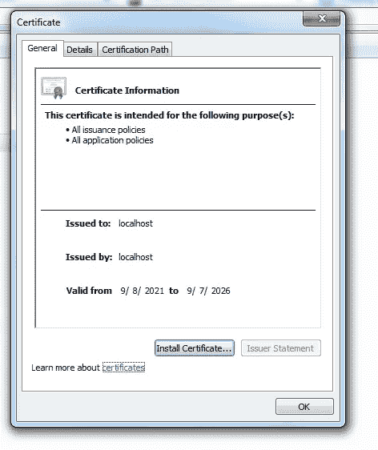

install certificate

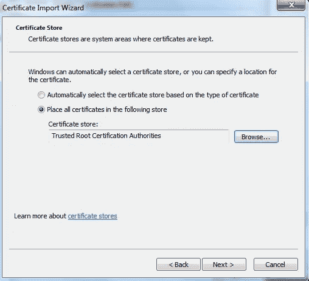

Certificate Import Wizard

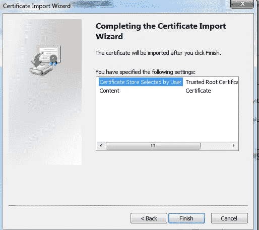

Certificate import completed

这就完成了证书和密钥的创建。

接下来，让我们为 express 项目配置一个 http 和 https 服务器。

**express-generator** npm 模块通过错误处理、视图和路线为您生成一个基本的 express 项目。你所需要做的就是修改它以适应你的需求。bin 文件夹中的 www 文件已经有了创建 http 服务器的代码。

在下面的代码中，我突出显示了为创建 HTTPS 服务器而在 www 文件中添加的行。

```
var port = normalizePort(process.env.PORT || ‘3000’);
app.set(‘port’, port); //http server runs on port 3000
**app.set(‘securePort’,port+443); //https server will run on 3443**/**
* Create HTTP server.
*/
var server = http.createServer(app);
/**
* Listen on provided port, on all network interfaces.
*/**//configure options for the https server****let options={
key:fs.readFileSync(__dirname+’/rootCA.key’),
cert:fs.readFileSync(__dirname+’/localhost.crt’),
passphrase:"enter the passphrase that you gave while creating private key"
}****//create https server
let httpsServer=https.createServer(options,app);
httpsServer.listen(app.get(‘securePort’),()=>{
console.log(`Server running on port ${app.get(‘securePort’)}`)
});****httpsServer.on(‘error’, onError);
httpsServer.on(‘listening’, onListening);**server.listen(port);
server.on(‘error’, onError);
server.on(‘listening’, onListening);
```

https 服务器将在**端口 3443** 上运行。以下选项非常重要。我们已经传递了私钥的路径和使用的证书，以及密码短语。

```
**let options={
key:fs.readFileSync(__dirname+’/rootCA.key’),
cert:fs.readFileSync(__dirname+’/localhost.crt’),
passphrase:"enter the passphrase that you gave while creating private key"
}**
```

在浏览器中点击 [https://localhost:3443](https://localhost:3443) 。

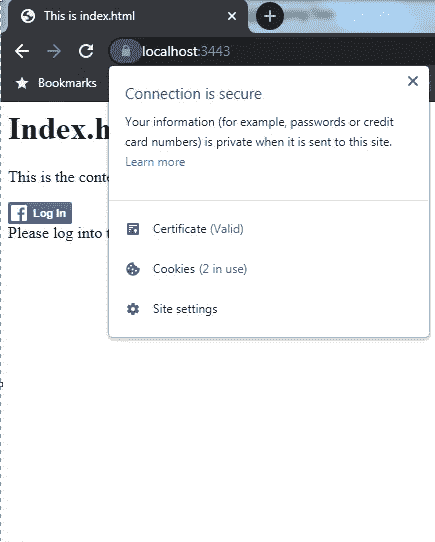

Secure local server

# **2。为 Angular Dev 服务器设置可信 https 连接**

## 第一步。下载并安装 XAMPP

转到[https://www.apachefriends.org/download.html](https://www.apachefriends.org/download.html)安装 XAMPP。几乎不需要几分钟。

它应该创建一个文件夹结构如下安装后。

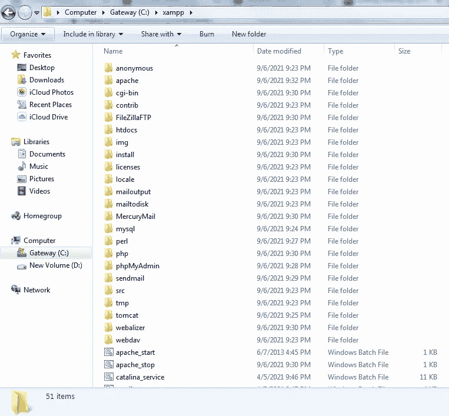

XAMPP

## 第二步。创建私钥和证书。

导航到 apache 文件夹并创建一个名为 **cert** 的文件夹。在 cert 文件夹中，创建两个文件: **cert.conf 和 make-cert.bat**

您可以从下面的链接中复制这两个文件的内容:

用 **localhost 替换下面文件中出现的所有{{DOMAIN}}。**

cert.conf

make-cert.bat

更新完这两个文件后，双击 make-cert.bat 打开如下窗口:

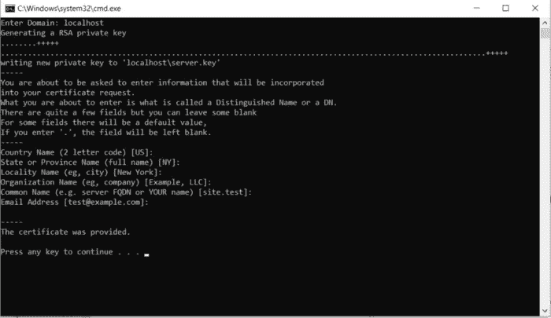

这将在 apache/cert 中的一个新的自动生成的文件夹 localhost 中创建私钥(server.key)和证书(server.crt)。

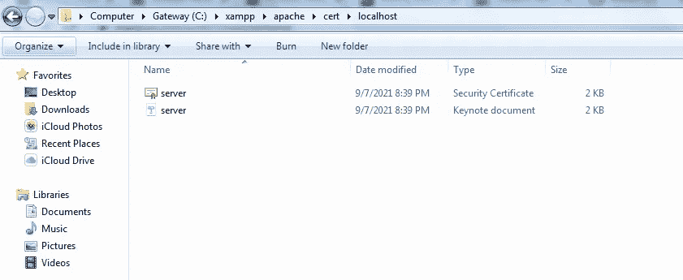

## **第三步。**在浏览器中安装 server.crt 证书，并配置 Angular 应用程序以使用它。

双击 server.crt 进行安装。您可以按照我们为 Express server 安装证书的相同步骤进行操作。

安装后，将 server.key 和 server.crt 复制到 angular 项目的根目录。您的项目应该看起来有点像这样。

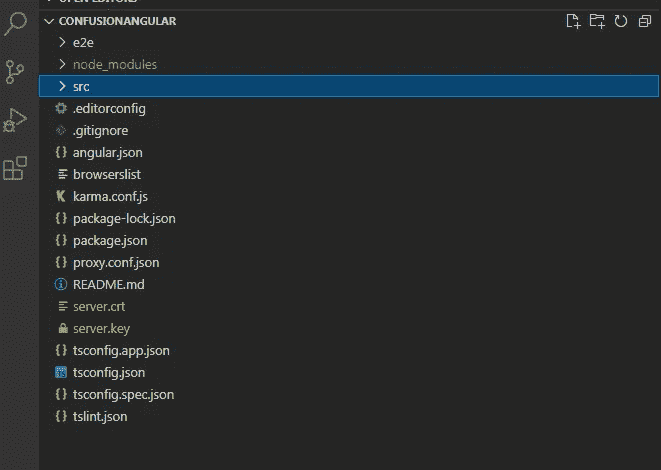

Angular Project

转到应用程序中的 angular.json 文件，并更新 serve 部分，如下所示:

```
“serve”: {
“builder”: “@angular-devkit/build-angular:dev-server”,
**“options”: {
“browserTarget”: “conFusionAngular:build”,
“sslKey”:”./server.key”,
“sslCert”:”./server.crt”
},**
“configurations”: {
“production”: {
“browserTarget”: “conFusionAngular:build:production”
}}},
```

按如下方式更新 package.json:

```
“scripts”: {
“ng”: “ng”,
**“start”: “ng serve — proxy-config proxy.conf.json — ssl”**,
“build”: “ng build”,
“test”: “ng test”,
“lint”: “ng lint”,
“e2e”: “ng e2e”
},
```

现在使用 **npm run start 运行应用程序。**

在浏览器窗口中点击 [https://localhost:4200](https://localhost:4200) 。

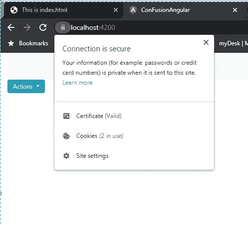

Secure Angular Dev Server

现在你知道了。都设置好了！

*更多内容请看*[***plain English . io***](http://plainenglish.io)