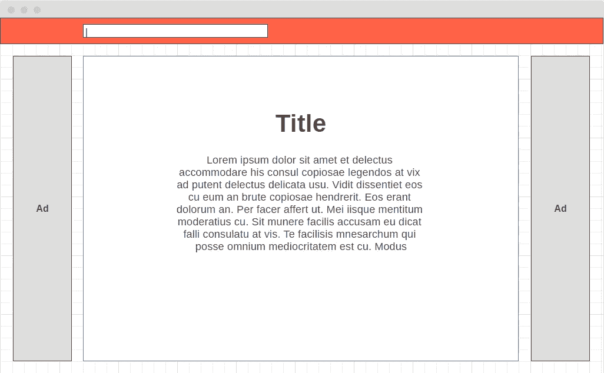
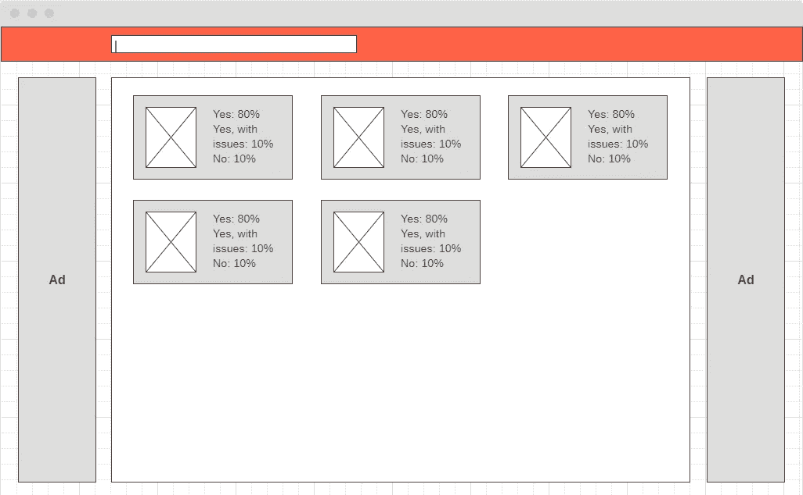
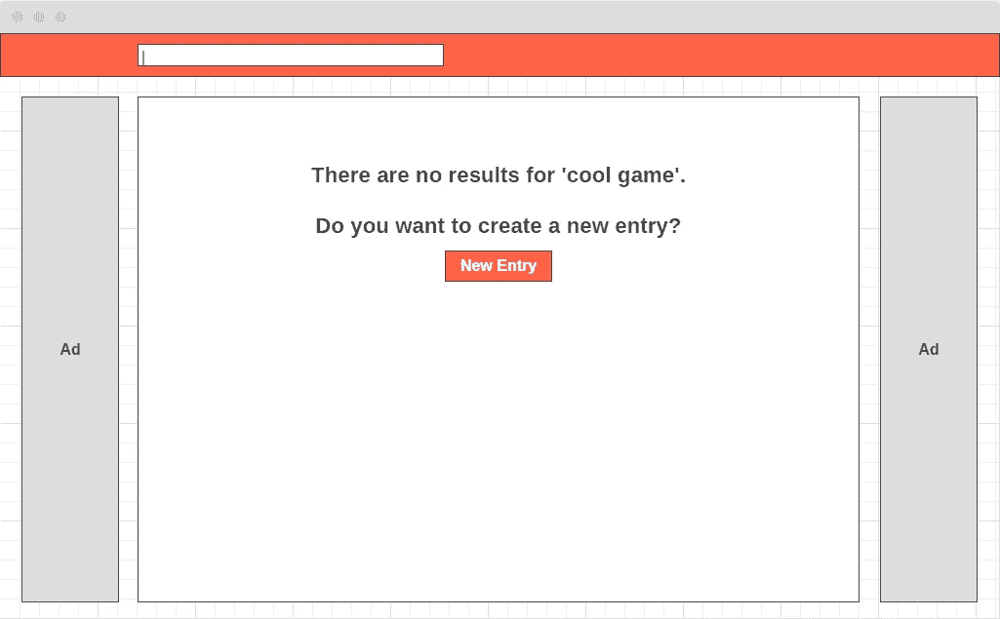
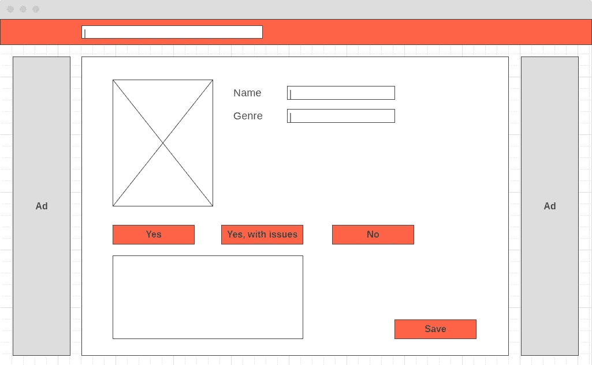

# 从零到 WebHero [0] —建立一个完整的 Sapper 项目

> 原文：<https://javascript.plainenglish.io/setting-up-a-full-svelte-sapper-project-7e3109c7b530?source=collection_archive---------13----------------------->

## 这个系列将展示一个工兵连项目从构思到制作的全过程。该简介解释了如何设置项目。


Photo by [Esteban Lopez](https://unsplash.com/@exxteban?utm_source=medium&utm_medium=referral) on [Unsplash](https://unsplash.com?utm_source=medium&utm_medium=referral)

周六早上。你醒了。你想到了一个好主意。一个会让所有人惊讶的网站。现在到了困难的部分，从想法到生活。在这个系列中，我将遵循从构思到开发到网站上线的所有步骤。

如果你想直接跳到代码，这里是包含本章开发的代码的[分支](https://github.com/omirobarcelo/retro-ps5/tree/part0)。

# 这个想法

几个月前，PlayStation 5 发布了。随着每一款新主机的发布，关于其复古兼容性的讨论——能够从以前的主机上玩游戏——开始被听到。因此，这个想法来了，一个社区驱动的网站，可以很容易地检查游戏是否在新发布的 PS5 上运行。

开始任何一个新项目都应该有一个前进的方向。所以我做的第一件事是设计一些线框。

登陆页面总是一个好的开始。



Landing page wireframe

当用户搜索一个术语时，我想显示一个可能匹配的列表。



Results wireframe

或者指示没有任何匹配的消息，以及创建新条目的可能性。



No results wireframe

最后是一个详细页面，用户可以在这里投票、评论或写新条目。



Details wireframe

# 技术

有了我们的概念，是时候决定如何实现它了。特别是使用哪些技术。在这种情况下，技术先于概念。我想用[工兵](https://sapper.svelte.dev/)开发一些东西，这就是我带来的概念。Sapper 负责前端，使用 Svelte，后端，Node.js。后端默认为[波尔卡](https://github.com/lukeed/polka)，但我将其切换到 [Express](https://expressjs.com/) ，因为我对它更熟悉，它有很多支持。

对于样式化， [Tailwind CSS](https://tailwindcss.com/) 给了我们一些基本的工具和很大的灵活性。它易于使用和构建。它不是一个组件库，所以我们可以真正适应我们网站的外观和感觉。

对于持久化数据，因为我们正在获取信息，可以说是文档，并且它们之间没有很多——实际上没有——引用，所以 NoSQL 数据库是最合适的。而 [MongoDB](https://www.mongodb.com/) 就是其中最受欢迎的一款。另外，使用[mongose](https://mongoosejs.com/)可以很好地记录和支持 Mongo 和 Express 之间的交互。

对于测试，我认为 E2E 测试对于这种情况是足够的，因为组件背后的逻辑并不复杂到需要单元测试。柏树图书馆是一个著名的图书馆。但是在这个系列中，我们不打算谈论测试。

我确实需要写一个关于 Sapper 的小说明。在我开始开发这个项目的时候，Sapper 是 0.28 版本，每个人都在等待它的 1.0 版本。一段时间后，Svelte 背后的主要人物 Rich Harris 说 Sapper 1.0 永远不会发生，他支持 SvelteKit。你可以在这里阅读[。](https://svelte.dev/blog/whats-the-deal-with-sveltekit)

# 安装

第一步，搭建我们的项目。Sapper 附带了一个我们可以使用的漂亮的[模板](https://github.com/sveltejs/sapper-template)。

```
npx degit "sveltejs/sapper-template#rollup" retro-ps5
cd retro-ps5
node scripts/setupTypeScript.js
```

最后一个脚本准备项目使用 TypeScript，并添加了负责传输它的`sveltePreprocess`。如果我们选择使用它，它也照顾到了 SCSS。

我们可以用`lang`属性来指明我们使用的是什么语言。

```
<div>
    <h1>Hello, {world}!</h1>
</div><script lang="ts">
  let name = "world";
</script><style lang="scss">
    div {
        h1 {
            color: red;
        }
    }
</style>
```

我还将添加更漂亮的[来格式化我的代码。我们可以安装一个](https://prettier.io/)[插件](https://github.com/sveltejs/prettier-plugin-svelte)来处理纤细的特定格式，例如，代码的顺序、样式和模板块。

在我们的`package.json`中，我们添加了以下脚本。

```
"format:check": "prettier --check .",
"format:write": "prettier --write ."
```

正如我之前提到的，Sapper 默认带有波尔卡，但我更喜欢使用 Express。

```
yarn add express
yarn add --dev [@types/express](http://twitter.com/types/express)
```

而在`server.ts`我们切换到 Express。

```
const app = express();
app.use(express.urlencoded({ extended: true }));
app.use(express.json());
```

如果我们使用 TypeScript，编译器可能会抱怨错误回调具有隐式的`any`类型。通过遵循[这个答案](https://stackoverflow.com/questions/56291321/)，我们可以像这样修复它。

```
app  
  .listen(PORT)
  .on('error', err => {
    if (err) console.error('error', err);
  })
```

我们可以像这样开始使用柏树。

```
yarn add --dev cypress
yarn run cypress open
```

最后一个命令为我们的测试创建了一个`cypress`文件夹，并填充了示例。为了更容易地访问它，我们可以将下面的脚本添加到`package.json`中。

```
"e2e": "cypress open"
```

为了安装和配置 Tailwind CSS，我遵循了本教程的，特别是提交历史。我们从安装我们需要的所有软件包开始。

```
yarn add --dev "autoprefixer" "cssnano" "postcss" "postcss-import" "postcss-load-config" "postcss-nesting" "postcss-preset-env" "tailwindcss"
npx tailwindcss init -p
```

最后一个命令产生了`tailwind.config.js`和`postcss.config.js`，我们填充如下。

然后在`rollup.config.js`我们加上

```
const preprocess = sveltePreprocess({ postcss: true,});// and in the svelte plugin
svelte({
  dev,
  hydratable: true,
  emitCss: true,
  preprocess: [preprocess]
}),
```

我们移除了模板自带的`global.css`和`template.html`中的链接。然后我们创建`src/global.pcss`和`src/components/GlobalStyle.svelte`。

最后，我们将`GlobalStyle`添加到`src/routes/_layout.svelte`中，这是所有路线遵循的基础——页面加载到`<slot />`中——并将`src/routes/index.svelte`中的样式更改为使用 PostCSS 和 Tailwind CSS。

```
// _layout.svelte
<main>
  <GlobalStyle />
  <slot />
</main>// index.svelte
<style lang="postcss">
  h1,
  figure,
  p {
    [@apply](http://twitter.com/apply) text-center my-0 mx-auto;
  }
  h1 {
    [@apply](http://twitter.com/apply) text-3xl uppercase font-bold m-0 mb-4 text-orange-500 font-sans;
  }
  figure {
    [@apply](http://twitter.com/apply) m-0 mb-4;
  }
  img {
    [@apply](http://twitter.com/apply) w-full max-w-5xl m-0 mb-4;
  }
  p {
    [@apply](http://twitter.com/apply) my-0 mx-auto;
  }
  [@screen](http://twitter.com/screen) md {
    h1 {
      [@apply](http://twitter.com/apply) text-5xl;
    }
  }
</style>
```

当运行我们的应用程序时，有时我们可能会看到一个`Server is not listening on port 3000`错误。这停止了我们代码的实时重新加载。最可能的原因是服务器在试图用 PostCSS 处理所有 CSS 时超时。其他原因/解决方案可能是[https://github.com/sveltejs/sapper/issues/730](https://github.com/sveltejs/sapper/issues/730)和[https://github.com/sveltejs/sapper/issues/431](https://github.com/sveltejs/sapper/issues/431)。

对于开发，最简单的方法是用 MongoDB 运行 Docker 映像。为了方便地检查开发数据库的状态，我们可以使用 [mongo-express](https://hub.docker.com/_/mongo-express) 图像来拥有一个 GUI。

对于这个设置，我们公开所有默认端口，创建一个卷来保存数据，创建一个网络来从应用程序和管理器访问数据库，并配置一个子网来避免与我们可能正在运行的其他 Docker 网络冲突。

随着数据库的建立，我们通过 Mongoose 连接到它。

```
yarn add mongoose
yarn add [@types/mongoose](http://twitter.com/types/mongoose) --dev
```

我们在`src/models`中创建游戏模型，并在`src/models/index.ts`中用`connectDb`函数将其导出。

我们添加`useNewUrlParser`和`useUnifiedTopology`是为了避免下面的错误。

```
 (node:17808) DeprecationWarning: current URL string parser is deprecated, and will be removed in a future version. To use the new parser, pass option { useNewUrlParser: true } to MongoClient.connect.
  (node:17808) DeprecationWarning: current Server Discovery and Monitoring engine is deprecated, and will be removed in a future version. To use the new Server Discover and Monitoring engine, pass option { useUnifiedTopology: true } to the MongoClient constructor.
```

理想情况下，我们希望通过环境文件指示数据库链接以及其他信息。Sapper 不会自动读取`.env`，所以我们用`dotenv`来读取。

我们用我们想要的任何信息创建一个`.env`文件，将它添加到`.gitignore`，因为我们不想将秘密提交给存储库，并在`server.ts`中使用它们来连接数据库。

这是一个漫长的设置！我希望我没有让你太厌烦。在下一部分，我们将跳转到更有趣的编码。

你可以在[https://github.com/omirobarcelo/retro-ps5/tree/part0](https://github.com/omirobarcelo/retro-ps5/tree/part0)中看到目前为止的所有代码。

感谢一路读到最后！[下集](/lets-build-a-website-search-bar-with-svelte-and-rxjs-d5aab934c6a7)再见！

**参考文献**

[](https://sapper.svelte.dev/) [## sapper * web 开发中的下一件小事

### 主页 web 开发中的下一个小东西 Sapper 是一个用于构建各种规模的 web 应用程序的框架，它带有一个…

sapper.svelte.dev](https://sapper.svelte.dev/) [](https://expressjs.com/) [## Express - Node.js web 应用程序框架

### Express 是一个最小且灵活的 Node.js web 应用程序框架，它为 web 和…

expressjs.com](https://expressjs.com/) [](https://www.mongodb.com/) [## 现代应用程序最流行的数据库

### MongoDB 是一个通用的、基于文档的分布式数据库，为现代应用程序开发人员和

www.mongodb.com](https://www.mongodb.com/) [](https://mongoosejs.com/) [## 猫鼬

### 让我们面对现实吧，编写 MongoDB 验证、造型和业务逻辑样板文件是一件很麻烦的事情。这就是为什么我们写了…

mongoosejs.com](https://mongoosejs.com/) [](https://www.cypress.io/) [## JavaScript 端到端测试框架

### npm 安装 cypress 安装 Cypress for Mac、Linux 或 Windows，然后开始。完整的端到端测试…

www.cypress.io](https://www.cypress.io/) [](https://github.com/sveltejs/sapper-template) [## sveltejs/sapper-模板

### Sapper 应用程序的入门模板。在 GitHub 上创建一个帐户，为 sveltejs/sapper 模板开发做贡献。

github.com](https://github.com/sveltejs/sapper-template) [](https://prettier.io/) [## 更漂亮的固执己见的代码格式化程序

### 固执己见的代码格式化程序

固执己见的代码格式](https://prettier.io/) [](https://github.com/sveltejs/prettier-plugin-svelte) [## 苗条/漂亮-插件-苗条

### 使用更漂亮的格式来格式化你的苗条的组件。用更漂亮的格式来格式化你的 HTML，CSS 和 JavaScript

github.com](https://github.com/sveltejs/prettier-plugin-svelte) [](https://tailwindcss.com/) [## 无需离开你的 HTML 就能快速建立现代网站。

### 顺风 CSS 框架的文档。

tailwindcss.com](https://tailwindcss.com/) [](https://dev.to/csaltos/tailwindcss-with-sapper-and-svelte-50ll) [## 带 Sapper 和 Svelte 的尾翼

### 包含 Sapper 0.28.0、Svelte 3.17.3 和 Tailwind CSS 1.8.6 的初始模板更新至 2020 年 9 月 25 日为什么…

开发到](https://dev.to/csaltos/tailwindcss-with-sapper-and-svelte-50ll)  [## mongo-express - Docker 中心

### 基于 Web 的 MongoDB 管理界面，用 Node.js 和 express 写的

hub.docker.com](https://hub.docker.com/_/mongo-express)