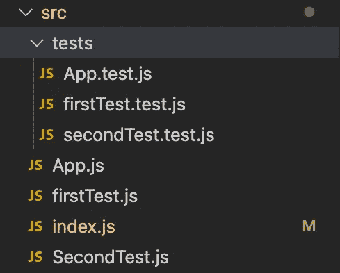
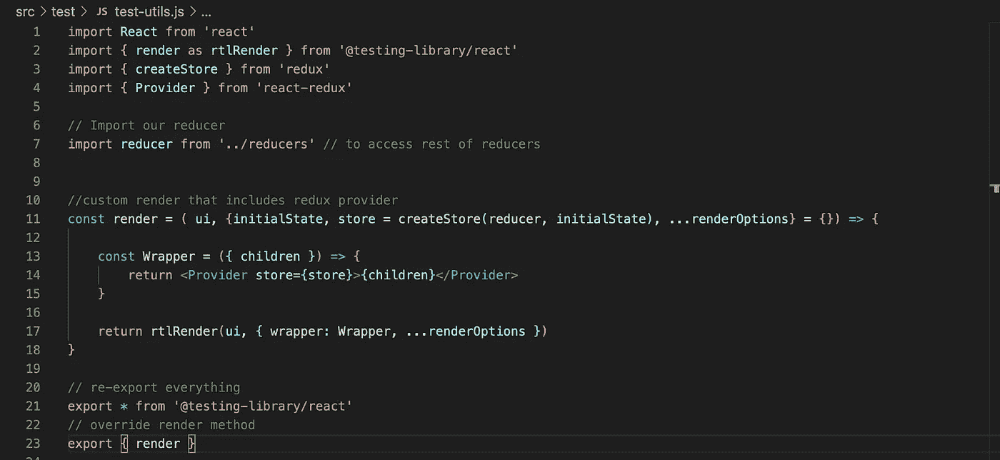
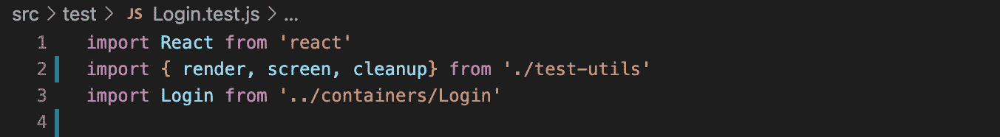
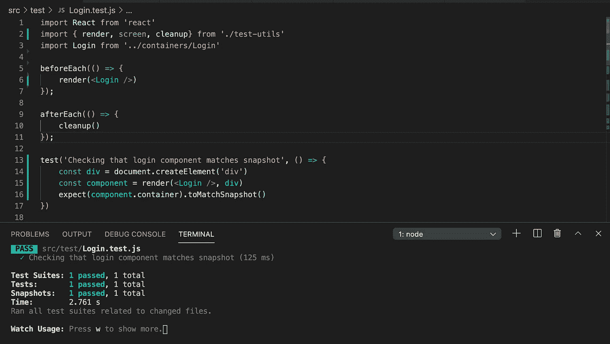

# 使用 React 测试库设置 Jest 以使用 Redux 组件

> 原文：<https://javascript.plainenglish.io/setting-up-jest-with-react-testing-library-to-work-with-redux-components-ee672ec12050?source=collection_archive---------1----------------------->

作为一个最近一直在学习 react 单元测试的人，我发现目前在 react 17 中使用“酶”有许多复杂之处。这让我尝试寻找另一种解决方案。我决定尝试使用 react 测试库和 jest 来测试组件。

在本文中，我将向您介绍一些步骤，这些步骤允许我在状态保存在 Redux Store 中时对组件进行 jest 测试。

## **第一步**

您需要为您的环境设置正确的依赖项。运行以下命令安装依赖项:

1.  `$ npx create-react-app app-name`
2.  `$ cd app-name`
3.  `$ npm install @testing-library/react react-test-renderer jest-dom --save-dev`
4.  `$ yarn add --dev jest-css-modules`

## **第二步**

您将需要设置一些组件和一些测试文件。正如你在下面的例子中看到的，我已经创建了一个包含 3 个组件和 3 个测试的应用程序。三个橙色的 js 文件是测试文件，黄色的是我将要测试的组件。



需要注意的是，测试文件的命名约定是`<testFileName>.test.js`。如果您正在为`component_A.js`编写测试，那么测试文件名应该是`component_A.test.js`。jest 就是这样识别你的测试文件的。我还建议像我在例子中做的那样创建一个文件夹，这样所有的测试都可以放在一起。

## **第三步**

这只有在使用 Redux 时才有必要，否则可以直接跳到第 4 步。React 测试库的 render 函数不能识别组件中的 Redux provider，这就是为什么我们需要为 render 函数打补丁，以便它能够识别存储在 Redux 中的状态。

首先，我们需要确保我们已经设置了根 reducer 并从 reducers 文件夹中导出。(注意:这不是一个 redux 教程，所以如果你不知道如何设置你的 actions & reducers，那么先学习一下，然后回到本文来设置测试)。

接下来，在我们的测试文件夹中再创建一个名为 **test-utils.js** 的文件。在这个文件中，我们将更新 react 测试库中的“render”函数，以便它可以识别 Redux 存储中的状态。我们需要添加到这个文件的第一件事是我们的导入-

```
import React from 'react'import { render as rtlRender } from '@testing-library/react'import { createStore } from 'redux'import { Provider } from 'react-redux'// Import our reducerimport reducer from '../reducers' // to access rest of reducers
```

如你所见，我们需要从 react 测试库导入 render，接下来从 redux 导入 createStore，然后从 react-redux 导入 Provider，最后从 Redux reducers 文件夹导入我们的根 reducer。

接下来，我们将在 imports 下的同一个 **test-utils.js** 文件中创建一个自定义渲染函数:

```
//custom render that includes redux providerconst render = ( ui, {initialState, store = createStore(reducer, initialState), ...renderOptions} = {}) => {const Wrapper = ({ children }) => {return <Provider store={store}>{children}</Provider>}return rtlRender(ui, { wrapper: Wrapper, ...renderOptions })}
```

最后，在自定义渲染函数下，我们需要导出新的渲染函数以及 React 测试库提供的所有其他函数:

```
// re-export everythingexport * from '@testing-library/react'// override render methodexport { render }
```

test-utils.js 文件应该如下所示



## **第四步**

现在是开始测试组件的时候了。从 test-utils.js 开始导入您将要使用的内容



如你所见，我从我的 test-utils 导入了渲染、屏幕和清理，而不是从' @testing-library/react '(注意:如果你没有使用 redux，你将从' @testing-library/react '导入)。我还导入了一个将要测试的登录组件。如果您正在使用 Redux，请确保您正在测试的组件在 redux reducer 中至少有一个状态。通过这种方式，您可以验证现在一切都按预期工作，而不是在实现一系列测试后才发现问题。

现在让我们来设置我们的第一个测试。对于我的登录测试，我想在每次测试之前呈现组件&在每次测试之后使用 react 测试库清理功能。



如果一切都设置正确，你将已经设置并通过了你的第一次测试，祝贺你！


Photo by [Japheth Mast](https://unsplash.com/@japhethmast?utm_source=medium&utm_medium=referral) on [Unsplash](https://unsplash.com?utm_source=medium&utm_medium=referral)