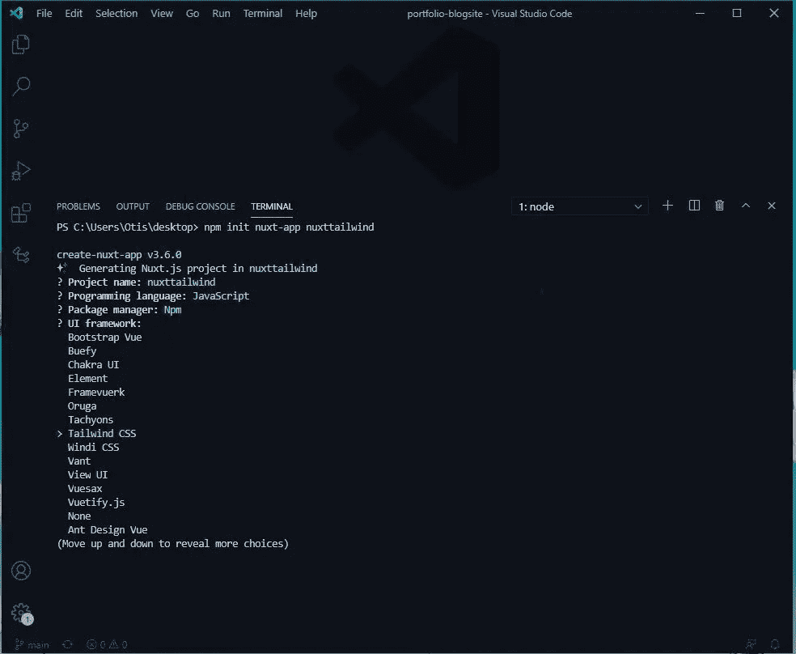
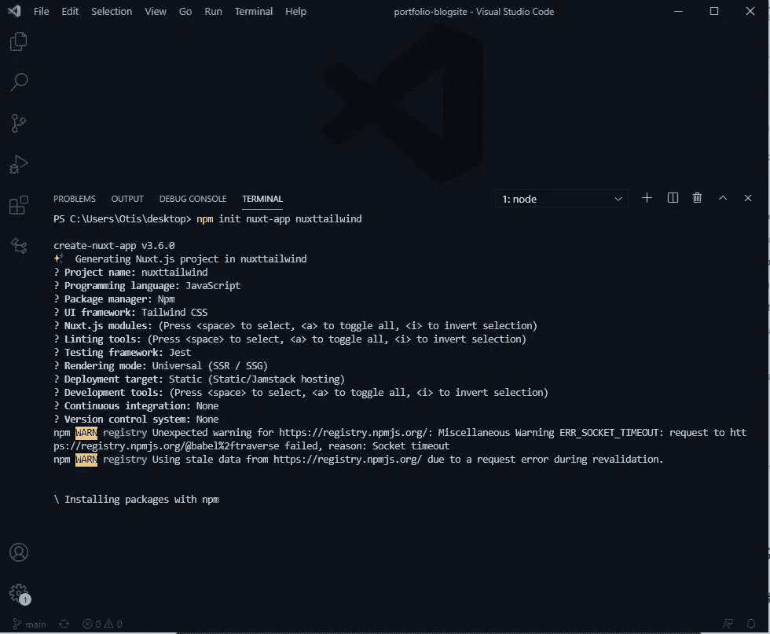

# 正确设置 Nuxt.js 和 Tailwind CSS

> 原文：<https://javascript.plainenglish.io/setting-up-nuxt-js-and-tailwind-css-the-right-way-40247f56064f?source=collection_archive---------4----------------------->

## 了解如何无缝设置 Nuxt.js 和 Tailwind。


Photo by Suzunatsu

使用 Nuxt.js 和 Tailwind CSS 可以让一切看起来很棒，并提供有史以来最好的开发人员体验。

如果设置不当，我们肯定会打破东西，并花费大量时间来设置所有的东西。

对于那些不熟悉 Nuxt.js 的人来说，这是一个完全建立在 Vue 之上的框架，捆绑了许多令人惊叹的功能，如 SSR、自动路由等等。

在这篇文章中，我们将看看我们可以使用的各种方法来适当地设置 Tailwind CSS 和 Nuxt.js。

## Nuxt.js 和 Tailwind CSS

**先决条件**

*   安装 Node.js
*   安装 npm

这个方法包括同时设置 TailwindCSS 和 Nuxt。

要将 Nuxt.js 与 Tailwind CSS 一起设置，首先，打开您的开发人员终端，根据您首选的包管理器输入以下命令。

## **使用纱线**

```
yarn create nuxt-app nuxttailwind
```

## 使用 Npx

```
npx create-nuxt-app nuxttailwind
```

## **使用 Npm**

```
npm init nuxt-app nuxttailwind
```

运行该命令后，它会提示您确认项目并选择您喜欢的选项。

然后它会把你带到 UI 框架，在那里你会选择 TailwindCSS。如上图所示进行检查。



Tailwind Css UI Select

在选择了最适合您的开发之后，您可以按 enter 键并允许应用程序将 Nuxt 与 Tailwind 一起安装。

如果您不熟悉 up，您可以查看我最常用的配置。



My default Nuxt + Tailwind configuration

## **在已经存在的项目中设置顺风**

假设我们有一个已经启动并运行的 Nuxt.js 项目，我们想安装一个像 Tailwind CSS 这样的 UI 框架。

首先，导航到项目目录的根目录，并在开发人员终端中运行命令:

```
npm install -D @nuxtjs/tailwindcss tailwindcss@latest postcss@latest autoprefixer@latest
```

这个命令将安装 tailwind 以及其他需要的依赖项。

安装完成后，导航到名为 nuxt.config.js 的文件，并将 Tailwind 添加到 buildModules，如代码片段所示。

```
buildModules: [‘@nuxtjs/tailwindcss’]
```

转到项目的根目录，创建一个名为 tailwind.config.js 的顺风配置文件

创建文件后，将上面的内容粘贴到文件中并保存。

```
// tailwind.config.jsmodule.exports = {theme: {extend: {},},variants: {extend: {},},plugins: [],}
```

## **吹扫**

当我们在应用程序中使用 UI 框架时，我们包括了与框架捆绑在一起的所有类和组件。

我们当时往往不记得的是，当我们部署应用程序时，我们只使用了一小部分应用程序类和组件。

清除确保了当我们开发我们的应用程序时，它去掉了我们不使用的类和组件，从而使我们的应用程序更小更快。

要实现清除，您需要在顺风配置文件中包含以下内容:

```
 purge: [‘./components/**/*.{vue,js}’,‘./layouts/**/*.vue’,‘./pages/**/*.vue’,‘./plugins/**/*.{js,ts}’,‘./nuxt.config.{js,ts}’,], 
```

这些是我们可以用来在一个项目中一起实现 Tailwind CSS 和 Nuxt.js 的各种方法。

## **出发前**

感谢你阅读这篇文章，如果你觉得有帮助，请不要犹豫，在评论区告诉我，并分享。

## **更多阅读:**

[](/5-blog-portfolios-to-inspire-your-next-website-1a4129324262) [## 启发你下一个网站的 5 个博客组合

### 你正在努力建立你的网站组合吗？使用这些网站来激发你的下一个网站组合。

javascript.plainenglish.io](/5-blog-portfolios-to-inspire-your-next-website-1a4129324262) 

*更多内容尽在*[*plain English . io*](http://plainenglish.io/)