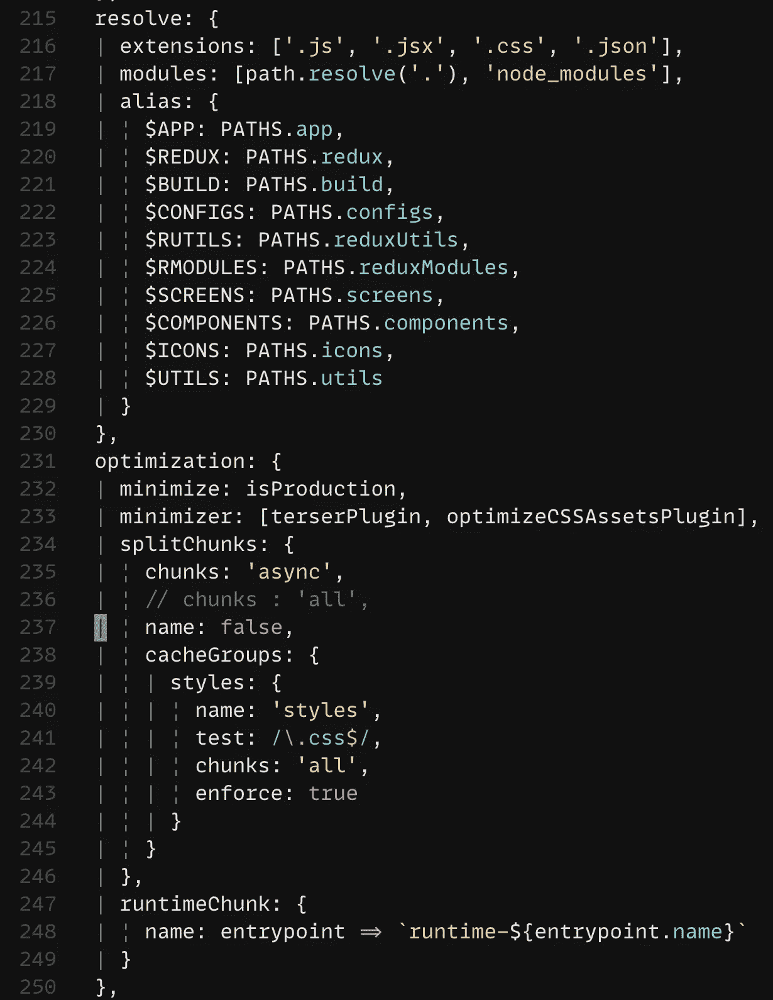

# 为开发和生产设置 Webpack

> 原文：<https://javascript.plainenglish.io/setting-up-webpack-for-the-production-and-development-3ca0b0b12ff5?source=collection_archive---------1----------------------->

## 为实际的 web 应用程序设置 Webpack 的深奥艺术。

## 为现实生活中的 web 应用程序设置 Webpack 的实用指南。

Photo by [Ant Rozetsky](https://unsplash.com/@rozetsky?utm_source=medium&utm_medium=referral) on [Unsplash](https://unsplash.com?utm_source=medium&utm_medium=referral)

我们都同意 Webpack 是市场上最好的模块捆扎机之一。然而，自己设置 Webpack 可能有点棘手，尤其是如果这是你第一次。可供选择的插件太多了。大多数情况下，文档对于高级开发人员来说似乎是不错的。对于开发新手来说可能有点复杂。在这篇文章中，我们将探索 Webpack 配置的不同部分。在这篇文章的最后，你将有一个生产就绪的 Webpack 配置。

> 对细节不感兴趣？在文章末尾找到 repo 和 config 文件的工作版本。

因为这篇文章不是对 Webpack 文档的深入研究，所以它将只涉及对实际应用有益的部分(以我的拙见)。记住这一点，让我们首先看看配置的不同部分:

*   **初始设置**
*   **入口点**
*   **输出**
*   **不同的装载机**
*   **插件**
*   **附加基本配置**
*   **开发服务器设置**

这些是任何 Webpack 配置的要点。这些可以在一个配置文件中，也可以分成多个文件。为了简单起见，我会将所有内容保存在一个文件中。如果你不这么认为，欢迎你即兴发挥。

# **初始设置**

我通常将我的 Webpack 配置文件分成三个不同的部分:

*   基本配置
*   开发配置
*   生产配置

基本配置将包含配置的所有共享和基本组件。开发和生产配置可能会覆盖基本配置的一些部分。我们还将制作一个标记来检查是使用开发配置还是生产配置。该标志将根据 NPM 命令被指定为真或假。下面是基本配置的屏幕截图:

Webpack Config Initial Setup

乍一看，这里似乎发生了很多事情。让我把它分成几部分:

**LAUNCH_COMMAND:** 这里，我们在变量中捕获 NPM 命令。

这是我们之前讨论过的旗帜。我的 package.json 中的生产命令是`prod`。所以，我在比较`LAUNCH_COMMAND`和字符串`prod`。

**prodEntry，devEntry:** 这是条件 Webpack 入口点。如果我们在开发环境中，我们将在生产环境中使用`devEntry`和`prodEntry`。我们将在文章的后面详细讨论入口点。虽然`prodEntry`和`devEntry`是空对象，但是现在，我们将在后面的文章中添加代码。

**baseConfig、devConfig 和 prod config:**`baseConfig`是基础部分。`devConfig`或`prodConfig`将覆盖`baseConfigs`的一些组件。这样，我们将创建一个新的配置对象— `mainConfig`。然后`mainConfig`就会导出。

# **入口点(entry)**

顾名思义，Webpack 将`entry`视为应用的入口点。Webpack 从入口点创建一个依赖图。`entry`的默认值为`src/index.js`。入口点通常是一个字符串、一个对象或多个入口点的数组。如果现在还不清楚，入口点的值(可以是字符串、对象或数组)是相对于 Webpack 配置文件的文件路径。多个入口点用于创建不同的块。这是一种流行的技术，用于根据环境、构建目标和运行时来分离关注点。

在上面的截图中，`prodEntry`是多个入口点的数组。第零个索引是 JS 入口点。下一个入口点是 CSS(我使用 CSS 模块，所以我以这种方式加载我的基本样式)。在`devEntry`中，我们将向列表中添加一个项目。它通过 Webpack-Dev-Server 启用 HMR(热模块重载)(使用 WebSockets 触发 HMR)。

# **输出(output)**

`output`是 Webpack 配置的另一个重要且基本的组件。属性告诉 Webpack 将捆绑的工件和其他重要细节放在哪里。输出通常作为对象传递。而`filename` 是其中的必填字段。下面是我的配置文件的输出截图:

the output part of the Webpack config

以下是每家酒店的详细信息:

**文件名:** `filename`是设置输出工件的文件名。它可以是简单的字符串。或者动态名称(如果您正在创建多个包)。在上面的例子中，我们为不同的包使用了一个动态名称。在这里，`**[name]**` 表示每个包的名称。如果您有多个入口点，并且您将它作为数组传递，那么 Webpack 将动态地决定名称。如果您将不同的条目作为一个对象传递，那么相应的键将被用作包名。下一步是向包中添加哈希值:`**[hash:8]**`。它会破坏浏览器缓存来加载更新的内容。有些人更喜欢`**contenthash**`。它根据内容变化添加哈希。但是，到目前为止，`**[hash:8]**` 对我来说还不错。

**组块文件名:**该选项用于设置组块文件名。如果你要把你的包分成块，那么这个选项和`filename` 对包名做的一样。

**路径:**`path`告诉 Webpack 把输出文件放在哪里。在截图中，我将`PATHS.build` 作为输出路径。我使用一个对象来声明应用程序中使用的所有路径。这样，我可以确定真理只有一个来源。

**publicPath:** `publicPath`告诉 Webpack 如何以及从哪里提供图像或其他文件等外部资产。在上面的截图中，我正在有条件地改变它的值。如果 Webpack 将文件打包用于生产，那么我将使用 DevOps 建议的公共路径。如果是开发环境，那么我使用`/`作为公共路径。

# 不同的装载机(模块)

不同的加载器告诉 Webpack 如何处理特定的文件，以及对文件应用什么样的转换。Webpack 本身不知道如何处理这个文件。它是一个引导 Webpack 的加载器，通过这种方式，我们可以控制在源代码上应用转换的内容、方式和时间。您还可以选择在特定类型文件的转换之前或之后应用加载程序(“何时”部分)。一旦文件成为一个模块，Webpack 就可以把它作为项目中的一个依赖项。下面是我如何在配置中使用加载器的截图:

loader component of the config.

虽然在一个段落中涵盖所有的加载器可能有点棘手，但我会尽我所能抓住本质。您可能已经在截图中观察到一些不同颜色的矩形。这些是为了突出不同的装载机。在此配置中，我们有四个加载器:

*   验证 JS 源代码上的 eslint 规则的预加载器(绿色矩形)。
*   一个用于转换和构建 JS 源代码的加载器(橙色矩形)。
*   一个识别图像和非源代码文件的加载器(蓝色矩形)。
*   捆绑 CSS 文件的加载器(紫色矩形)。

**装载机语法:**装载机有四个主要部分。`**test**` 决定了你要测试什么样的文件。如果未设置该值，则该规则适用于所有文件。`**include**` 告诉 Webpack 要包含什么目录或文件。`**exclude**`(你猜对了)告诉 Webpack 不要对特定的目录或文件应用规则。一个`**loader**` 是帮助 Webpack 进行文件转换的第三方扩展。大多数情况下，您会从加载程序的创建者那里找到使用指南。

**预加载器:**预加载器在应用实际转换之前执行“任务”。在这种情况下，我们用 eslint 验证 JS 代码。您也可以添加一些其他类型的任务，但是除了代码验证之外，我从未遇到过必须使用预加载器的情况。要使加载程序成为预加载程序或后加载程序，您将在加载程序对象中使用 **enforce** 属性。该属性可以是“前”或“后”,具体取决于您要执行的任务类型。

在屏幕截图中，第一个加载程序是验证 eslint 规则。为此我使用了[*eslint-loader*](https://github.com/webpack-contrib/eslint-loader)**。不过 Webpack 现在推荐的是[*eslint-web pack-plugin*](https://webpack.js.org/plugins/eslint-webpack-plugin/)**而不是 eslint-loader。下一个加载器是将最新的 JS 语法转换成浏览器兼容的代码。为此我使用了***。请注意，您需要设置 Babel 配置来使用它。下一个是 [*文件加载器*](https://webpack.js.org/loaders/file-loader/) ，它将文件上的`import/require()` 解析成一个 URL，并将文件发送到输出目录。最后一个加载器是用于 CSS 的。我使用三种不同的加载器来处理 CSS:[*mini-CSS-extract-plugin*](https://webpack.js.org/plugins/mini-css-extract-plugin/)、 [*css-loader*](https://webpack.js.org/loaders/css-loader/) 和[*post CSS-loader*](https://webpack.js.org/loaders/postcss-loader/)。如果您观察到，我正在根据环境(开发或生产)有条件地更改加载程序配置。这是我的开发 CSS 加载器配置的截图:*******

**********

*****css loader dev config.*****

*****我正在从配置[0]中删除 hmr 值。生产配置情况下的选项。我之前在配置中还有一些不同，但是现在 hmr 是唯一的不同。*****

# *****插件(插件)*****

*****插件是 Webpack 的支柱。插件可以改变 Webpack 的工作方式。例如，我使用 Terser 插件来缩减我的 JS 代码。然而，版本 5 提供了现成的 Terser，但在较旧的 Webpack 版本中，您必须手动安装它。这里，我使用 Treser 插件来压缩 JS 代码，而不是 Webpack 提供的默认压缩程序。以下是我觉得有用的插件列表:*****

## *****[**区分大小写-路径-网页包-插件**](https://www.npmjs.com/package/case-sensitive-paths-webpack-plugin) **:*******

*****来自他们的 wiki:“这个 Webpack 插件强制所有必需模块的完整路径与磁盘上的实际路径完全匹配。”当你的队友在不同的操作系统上工作时，这个插件很有用。通过使用这个插件，您可以放心使用的路径是区分大小写的，并且它不会在不同的操作系统上导致错误。下面是插件配置的截图:*****

**********

*****case-sensitive-path-plugin config.*****

## *****[**terser-web pack-plugin**](https://webpack.js.org/plugins/terser-webpack-plugin/)**:*******

*****像我前面提到的，Terser 插件缩减了 es6+代码。它在幕后使用[精简器](https://github.com/terser/terser)来压缩代码。以下是我对此插件的首选配置:*****

**********

*****terser-webpack-plugin config.*****

## *****[优化-CSS-资产-web pack-插件](https://www.npmjs.com/package/optimize-css-assets-webpack-plugin):*****

*****来自他们的 wiki:“它将在 Webpack 构建期间搜索 CSS 资产，并将优化\最小化 CSS。”这是插件配置的截图:*****

**********

*****optimize-css-assets-webpack-plugin config.*****

## *****[html-webpack-plugin](https://webpack.js.org/plugins/html-webpack-plugin/) :*****

*****这个插件将最新的构建文件注入到一个指定的 HTML 文件中。它会在每次构建时更新哈希值。这样，您就不必手动执行此操作。插件会在每次构建时处理它。以下是它的配置:*****

**********

*****html-webpack-plugin configs.*****

*****这一次，配置分为两部分。`defaultHtmlPlugConfig` 是基本配置部分。`additionalHtmlPlugConfig` 是生产环境的附加配置。如果我们是为了生产而建造，我们就在缩小一切。*****

## *****[定义插件](https://webpack.js.org/plugins/define-plugin/):*****

*****define-plugin 允许您添加自定义的全局值，您可以在应用程序的任何地方使用这些值。您可以在构建过程中动态更改这些值。以下是我的自定义值的屏幕截图:*****

**********

*****define-plugin configs*****

*****我在这里定义了四个自定义全局变量:1) `**isProduction**` **:** 这个布尔值决定了我是否在生产环境中。如果`isProdctuion`是`true`，我会禁用我应用程序中的一些日志。2) `**testAPI**` **:** 这个有意思。我使用这个值来选择应该点击哪个测试 API 服务器来获取应用程序数据。我在我的`npm start`命令中传递一个额外的标志，就像这样`npm start — api=vbox512`。然后我的请求处理程序中有一个映射，它将`vbox512`解析为一个实际的 URL。这样，我就不必对实际代码做任何修改。只是 npm 命令的一个标志就能帮我搞定一切。3) `**command**` **:** 是检查我用哪个 npm 命令运行服务器。我没有在应用程序中的任何地方使用它，但是我在某个时候使用它来确定测试 API 服务器。然后我们有多个测试服务器，所以从命令中传递 API 标志更有意义。4) `**isDevelopment**` **:** 类似于 isProduction，但告知我们是否处于开发模式。*****

## *****附加插件:*****

**********

*****additional plugins*****

*****在上面的截图中，我提到了三个与 dev 相关的插件。`[**webpack-bundle-analyzer**](https://www.npmjs.com/package/webpack-bundle-analyzer)`很好地可视化了你所有的应用依赖。您可以看到完整的包大小，每个依赖项的大小。这样，您可以确定是什么包裹让您的整个包裹变得如此沉重。`**HotModuleReplacementPlugin**` 是为 CSS 进行热模块更换。`**IgnorePlugin**` 防止为`import`或`require`调用生成与正则表达式或过滤函数匹配的模块。这里我们忽略了与 Moment.js 库捆绑在一起的语言环境。*****

*****以上是我在 Webpack 中使用的所有附加插件。我把我的插件分成三个部分:a) `**devPlugins**`:这些插件只在开发环境中使用。b) `**commonPlugins**`:这些都是常见的插件。并在开发和生产环境中使用。c) `**prodPlugins**`:这些插件只在生产环境中使用。我是这样使用它的:*****

********************

# *******附加基本配置:*******

*****有了上面的基本配置，还有一些额外的配置可以让开发人员的工作更轻松，或者以更好的方式捆绑资产。以下是附加配置的屏幕截图:*****

**********

*****additional configs.*****

*****在我们深入每个键之前，让我告诉你这是我的`baseConfigs`对象的一部分。现在，让我们看看每个属性的含义是什么:*****

## *****`**resolve**`T14:*****

*****`resolve`告诉 Webpack 如何解析文件或模块。module 对象中的第一个属性是`**extensions**` **:** 该选项告诉 Webpack 在解析文件时查找文件扩展名的顺序。将首先解析数组中的第一个值。如果有两个文件名相同但扩展名不同的文件，Webpack 将使用数组中首先列出的扩展名来解析文件。剩下的就跳过了。列表中的下一个是`**modules**` **:** 它告诉 Webpack 在解析模块时应该搜索什么目录。我在这里添加了`node_modules`和我当前的目录。然后是`**alias**` **:** 当你使用相对路径导入文件时，别名非常有用。不要计算你必须从多少个目录中出来，要到达一个文件，定义别名，让 Webpack 来处理这种混乱。这是我如何从`icons`目录导入一个文件:`import Logo from ‘$ICONS/logo’`。我已经为应用程序中的所有主目录定义了别名。这就是决心。*****

## *****优化:*****

*****然而，如果您将**模式**作为产品传递，Webpack(从版本 4 开始)会负责优化。如果您愿意，您仍然可以覆盖一些内容。这个对象中的大多数属性都是不言自明的，但是让我简单介绍一下这些属性:`**minimize**` **:** 是一个布尔值，它告诉 Webpack 是否最小化代码。`**minimizer**` **:** 现在，这就是我要覆盖的值。我使用 Terser(用于 JS)和 optimizeCSSAssets(用于 CSS)作为我的自定义最小化器。`**splitChunks**` **:** 如果你使用的是最新的 Webpack，就可以避免这种情况。该选项有助于消除代码重复，并使公共部分成为一个单独的块。点击了解更多关于 [splitChunk 属性的信息。](https://webpack.js.org/plugins/split-chunks-plugin/)*****

# *******开发服务器设置*******

*****这里有一些与开发相关的设置，可以简化您的开发和调试。这是我的开发设置的截图:*****

**********

*****dev settings*****

## *******开发工具:*******

*****此选项允许您选择要为开发构建哪种类型的源地图。我更喜欢`eval-cheap-source-map`。它在浏览器中显示所有文件。这个选项有一个很长的选项列表。[以下是此选项所有可能值的链接](https://webpack.js.org/configuration/devtool/#devtool)，找到最符合您需求的。*****

## *****开发服务器:*****

*****我使用 webpack-dev-server 作为我的开发服务器。这个选项用于配置 webpack-dev-server。`**hot**` **:** 告知 Webpack 启用 HMR。还有另外一个属性:`hotOnly`、**、**它使 HMR 不需要刷新页面。我没有在我的配置中使用它，但是在开发过程中它是一个很好的选择。`**open**` **:** 如果 open 设置为`true`，当您启动 dev-server 时，它会打开一个新的浏览器标签。我发现它非常有用。但是，如果你多次关闭和打开 dev-server，这可能有点令人不知所措。`**compress**` 选项将`gZip`dev-server 提供的文件。`**contentBase**` **:** 这个选项告诉开发服务器从哪里提供静态文件。`**watchContentBase**` **:** 如果设置为`true`，如果`contentBase`目录中有变化，它会要求 Webpack 重新加载页面。通过将`**clientLogLevel**` 设置为不同的值，可以设置想要查看的各种日志。我更喜欢这个选项的`info`。`**historyApiFallback**` 是一个很好的设置 true 的选项。假设你在 web 应用 URL 的深处(例如`/users/abc/profile`)，你点击了刷新。默认情况下，开发服务器将返回一个 404 页面。但是如果你设置`historyApiFallback` 为真，它会显示你当前的页面。`**watchOptions**` 选项可让您设置开发过程中要监视的目录。这里有一个[链接，指向该属性的所有选项](https://webpack.js.org/configuration/watch/)。如果您设置了此选项，在出现错误或警告的情况下，开发服务器将向您显示一个`**overlay**`。我更喜欢在开发过程中只看到错误。*****

## *****说够了，给我看看代码*****

*****正如帖子前面所承诺的，这里是 Webpack 配置文件:*****

*****以下是工作回购的链接:*****

***** [## iii son/温度

### Permalink 无法加载最新的提交信息。没有提供描述、网站或主题。你不能表演那个…

github.com](https://github.com/iiison/temp)***** 

# *****关于作者*****

*****Bharat 自 2011 年以来一直是前端开发人员。他对“前端开发经验”情有独钟。他喜欢学习和教授技术。他和最可爱的女人以及珍贵的双胞胎孩子一起享受生活。*****

*****总的来说是个好人。在 [Twitter](https://twitter.com/iiisoni) 、 [Github](https://github.com/iiison) 、 [Linkedin](https://www.linkedin.com/in/iiison/) 上找到他。*****