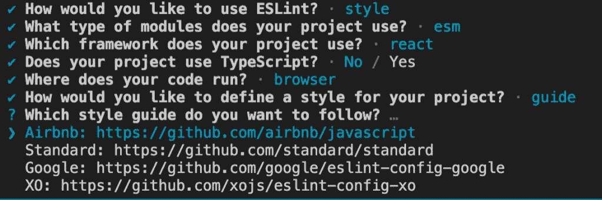
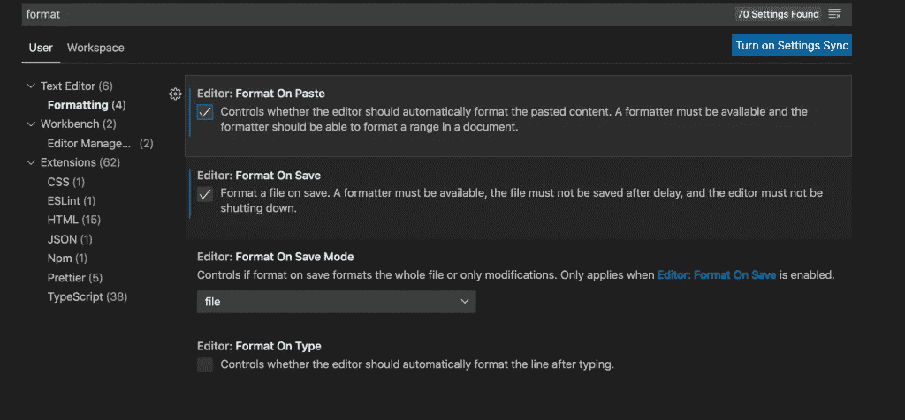

# 在 React 项目中设置 ESLint 和更漂亮

> 原文：<https://javascript.plainenglish.io/setup-eslint-and-prettier-in-your-react-project-44d1ec04a800?source=collection_archive---------2----------------------->


我喜欢 ESLint 和 Prettier，我相信如果你使用它们，你也会喜欢。如果你还没有使用它们，请继续阅读，在接下来的五分钟内学习如何设置它们。

# 什么是 ESLint？

ESLint 是一个 JavaScript linter，它可以识别并纠正你代码中的常见错误。这对所有 JavaScript 程序员来说是一个巨大的时间节省和必备的。当涉及到编码标准时，它会为您做所有繁重的工作，所以您不必这样做。当我开始一个 JavaScript 项目时，我做的第一件事就是检查 ESLint 是否已经安装，如果没有，我就配置它。

# ESLint 的优势

*   减少人为错误并消除开发人员回忆编码标准的需要。
*   关于编码标准，所有的开发人员都在同一个页面上，可以阅读彼此的代码。
*   开发人员不需要进行代码审查或提出违反编码标准的情况。
*   它节省了大量的时间，提高了团队的速度。

# 安装 ESLint

第一步是使用 npm 安装 *eslint* 包。

```
npm install eslint --save-dev
```

或者

```
yarn add eslint --dev
```

一旦完成，您应该会看到依赖项被添加到您的 *package.json* 文件中。

# 配置文件

然后必须创建配置文件 eslintrc.json。运行下面的命令会自动为我们做到这一点。在运行该命令之前，请仔细检查您的项目是否已经有了 package.json 文件。

```
npx eslint --init
```

运行此命令时，系统会提示您回答一系列问题。这有助于为您的项目创建最合适的 lint 规则。根据您项目的需求回答这些问题。您也可以选择样式指南。Airbnb 和 Google 是最受欢迎的两个。我更喜欢使用软件包自带的默认样式。

ESLint 也可以与 TypeScript 项目一起使用，init 命令将在配置文件时询问项目是否使用 TypeScript。



初始化完成后，将在根目录下创建一个 eslintrc.json 文件。该文件的内容如下所示。请记住，它会根据您在 ESLint 设置期间选择的参数而变化。

```
{
    "env": {
        "browser": true,
        "es2021": true
    },
    "extends": [
        "plugin:react/recommended",
        "standard"
    ],
    "parserOptions": {
        "ecmaFeatures": {
            "jsx": true
        },
        "ecmaVersion": 12,
        "sourceType": "module"
    },
    "plugins": [
        "react"
    ],
    "rules": {
    }
}
```

ESLint 将根据您在创建配置文件时选择的样式指南实施特定的林挺规则。根据 linter 的用途，有很多定制的配置选项。查看官方手册了解定制配置的所有细节:[ESLint 配置的细节](https://eslint.org/docs/2.13.1/user-guide/configuring)

# ESLint 规则

自定义规则也可以在配置文件中指定。ESLint 会立即发现大量错误。此外，您可以随时添加自己的规则。在您决定规则之后，您可以选择将哪些规则作为错误处理，哪些规则作为警告处理。

错误会导致构建失败，您必须修复它们，而警告可以忽略，不会导致构建失败。这是一件非常主观的事情，整个团队必须就规则是否属于错误和警告的范畴达成一致。

基本的 [react/recommended](https://www.npmjs.com/package/eslint-plugin-react#recommended) 插件附带了一套规则，你可以马上使用。这是我经常使用的东西，它预装了所有的 React 最佳实践指南。

# 语法分析选项

parserOptions 参数控制 linter 如何解析您的代码。您可以在这里声明您的项目使用哪个版本的 ECMAScript，比如 ES6 等。在我们的示例配置文件中，ECMAVersion 键被设置为 12。通过将 sourceType 设置为模块，我们可以额外定义是否使用模块。

# 什么更漂亮？

在你为林挺设置了 ESLint 之后，Prettier 是你想使用的下一个工具。漂亮是一个代码格式化程序，也节省了很多时间。有了 Prettier，你只需点击 save，代码就会被格式化。这也保证了团队中的每个人都遵循相同的代码格式指南。它可以与各种语言和代码编辑器一起工作。

如果你使用的是 VS 代码，安装更漂亮的插件并选择“保存时格式化”选项来自动格式化你的代码，如下所示:



# 结论

我希望你喜欢这篇文章。更多文章再见。如果你喜欢这篇文章，别忘了分享给你的网络。

*更多内容尽在*[***plain English . io***](http://plainenglish.io)